Hello everyone, welcome to the Django tutorial series. 
In this tutorial step, we are going to connect Django with our 
Postgres RDS instance in PyCharm.


# DataGrip 

DataGrip is a database management environment for developers. 
It is designed to query, create and manage databases. Databases
can work locally, on a server, or in the cloud. DataGrip MySQL, 
PostgreSQL, Microsoft SQL Server, Oracle, and more. If you have
a JDBC driver, add it to DataGrip, connect to your DBMS, and start
working.

All of DataGrip’s features are also available in many other IDEs from JetBrains like IntelliJ IDEA, 
PhpStorm, PyCharm, RubyMine, Rider and GoLand.


I will goto the **database** section. Click on the **plus (+)** button then hover to **Data Source** and **PostgreSQL**.

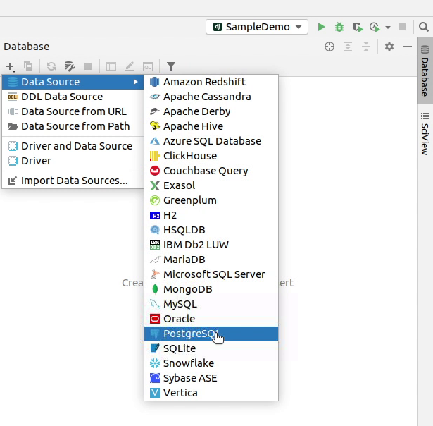

If you receive any message like **“Download missing driver files”** then make sure to download it.

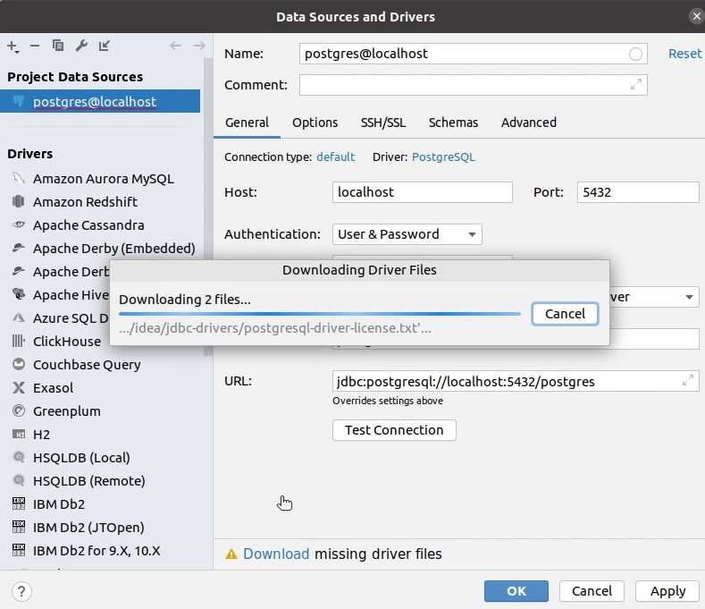

I will provide a name in the data source which will 
act as an identifier. Make sure to fill in all the 
necessary information like the host, username, password
and the database name.

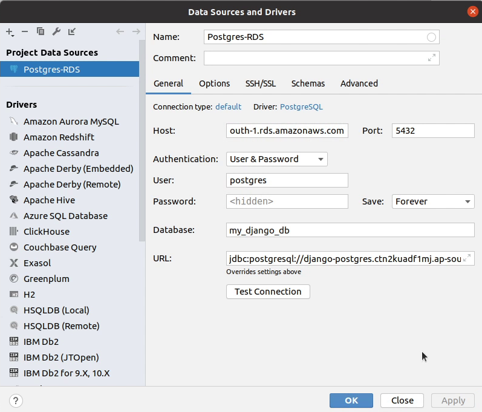

After filling in all the necessary information, 
click on **Test Connection**. 

As you can see in the following image, we received a success response: 
the connection has been successfully established.


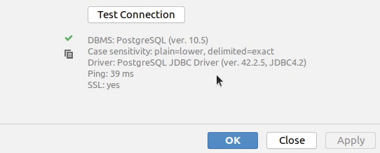

This is optional, as we are currently connecting to our Postgres RDS instance *directly*
inside an Ubuntu server because we have allowed ec2 security group
to connect with the database. If we want to connect through our
local development machine, then we need to perform SSH tunneling to securely
connect with the database.

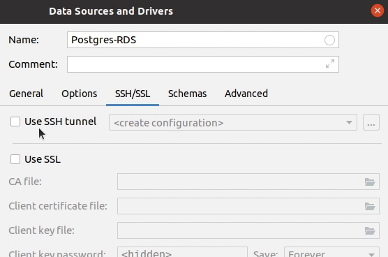

After the configuration has been setup, I will click on **Apply** and then **OK**.

As of now, there are no tables. I will connect the PostgreSQL database with our application, then perform migration.

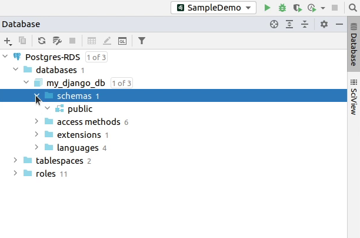

I will remove the **db.sqlite3** file, as we don’t require it now.

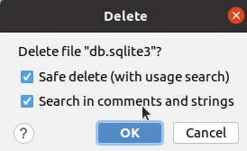


Next, I will move to the **settings.py** file where I will change 
the **DATABASES** settings and provide the required information. 

We will be passing our information through environment variables: much 
better than plain text. From a security standpoint, I would recommend to 
use [AWS Secrets Manager](https://aws.amazon.com/secrets-manager/) or 
[SSM Parameter Store](https://docs.aws.amazon.com/systems-manager/latest/userguide/systems-manager-parameter-store.html).


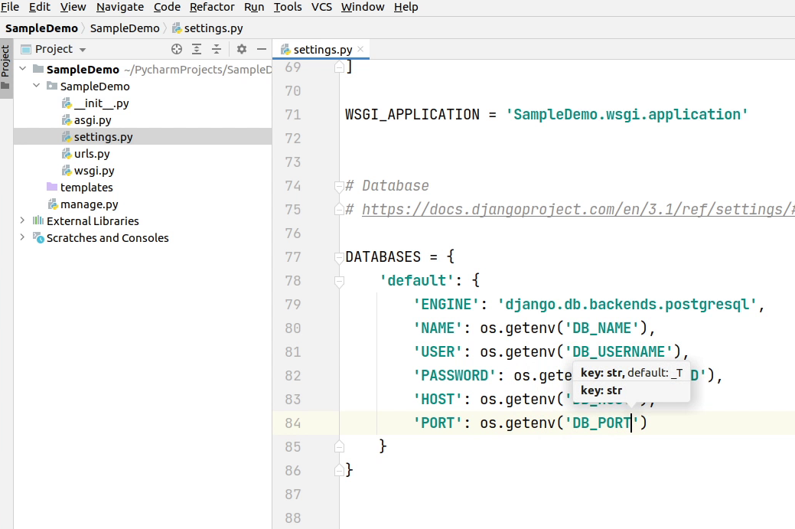


I will also pass the **DEBUG** and **SECRET_KEY** information from the 
environment variable. Make sure to set **DEBUG** to **False** when you
are running a Django application in a production server. I have seen many
people make these common mistakes, and they don’t even rotate their
Django secret keys.

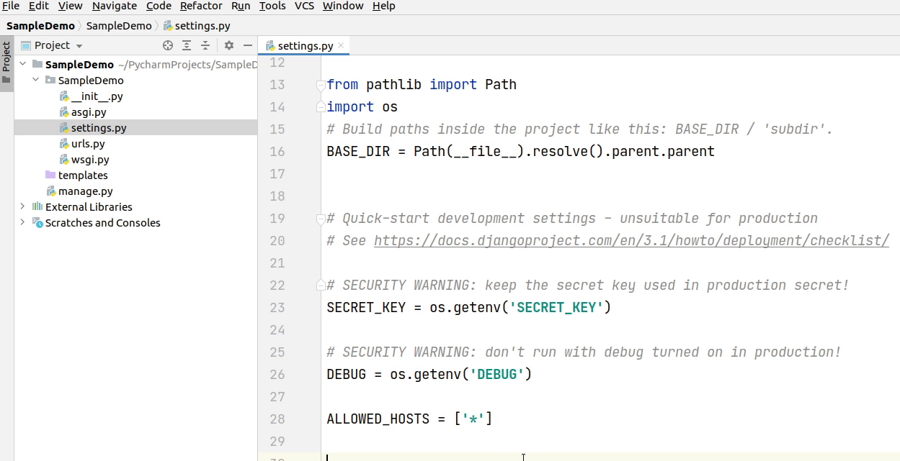


I can even pass **ALLOWED_HOSTS** in the environment variable. It's fine to
use it directly. You can see I am passing an **asterisk(*)** which means
my application can be accessed from anywhere. It’s completely fine during
development but definitely not a good practice when you are running an 
application in a production server. Make sure to provide permitted
domains which can access your backend apps.


Before deploying your application on the production server, make sure you
follow the deployment checklist as provided in the Django documentation.

Reference:
- [Deployment checklist](https://docs.djangoproject.com/en/3.1/howto/deployment/checklist/)
- [Security in Django](https://docs.djangoproject.com/en/3.1/topics/security/)


I have successfully modified the changes in **settings.py** file. I will
replicate the same changes by adding the environment variables in my PyCharm IDE.


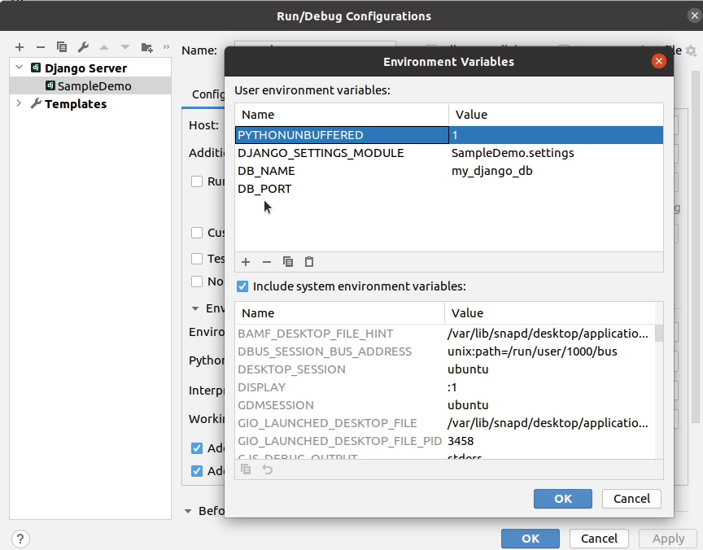

Don't forget to install PostgreSQL the database adapter by running the command ```pip install psycopg2```

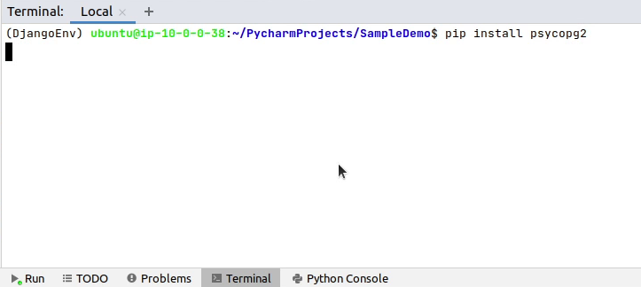


Okay, we are now successfully connected with our Postgres database.

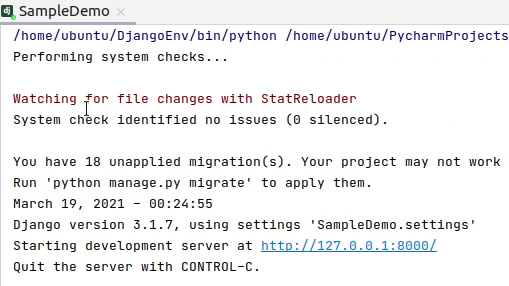


Now, I will copy the environment variables and will paste in 
different places of our IDE.

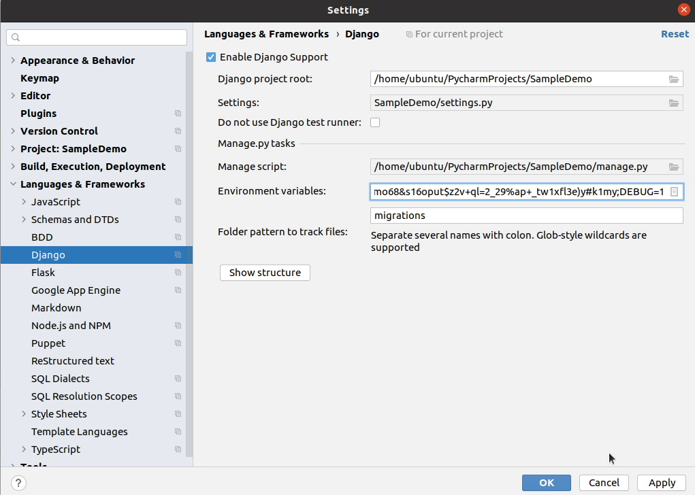

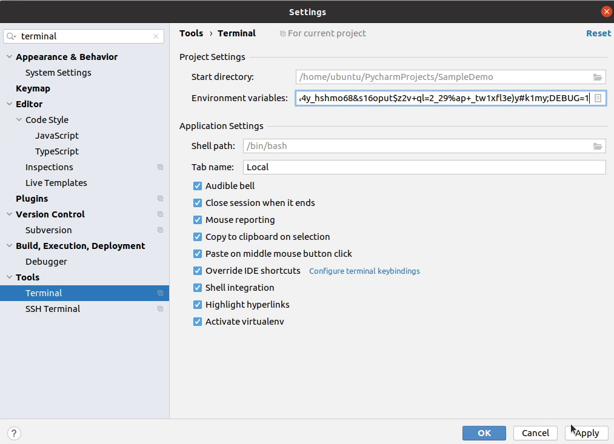

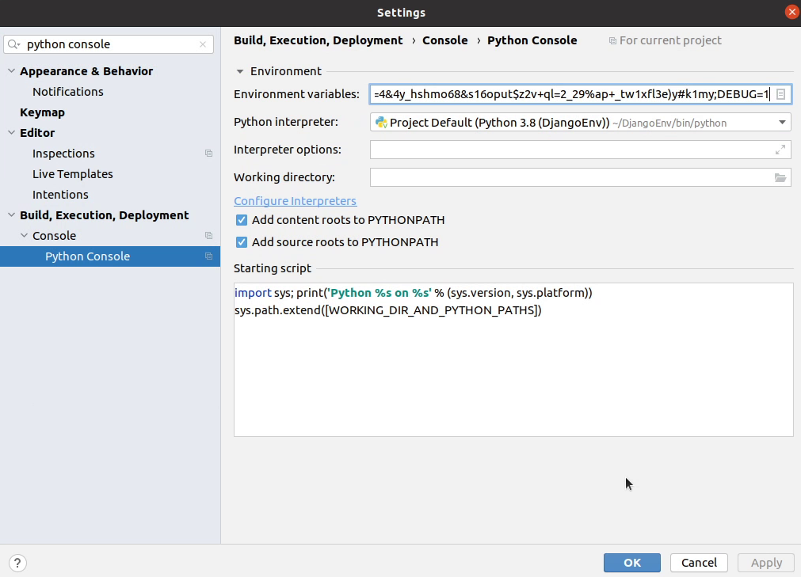

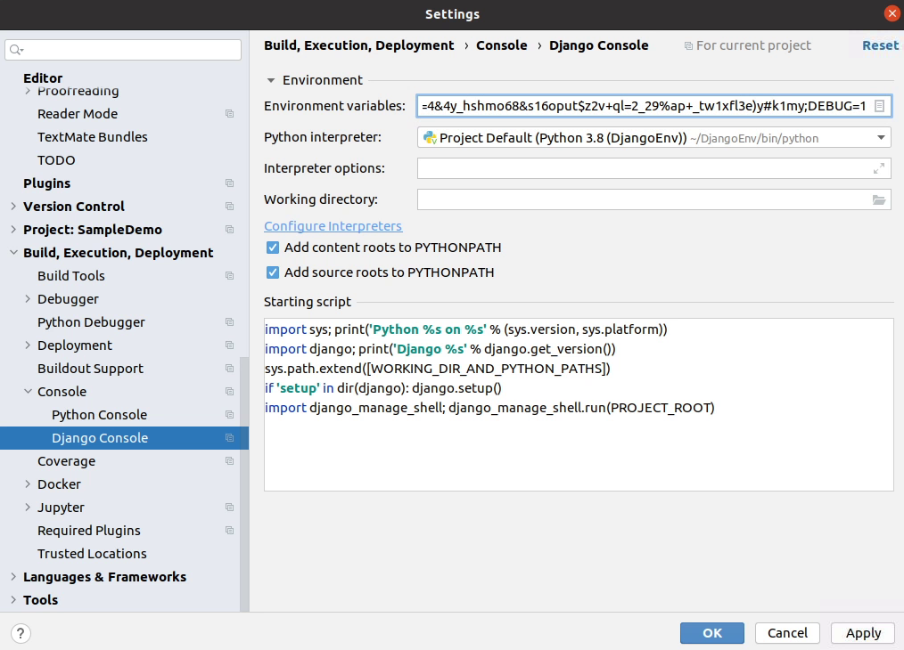
 

We are done with setting up the environment variables. 
Next, I will be migrating the database changes.

I will click on **Tools** and then **Run manage.py Task**

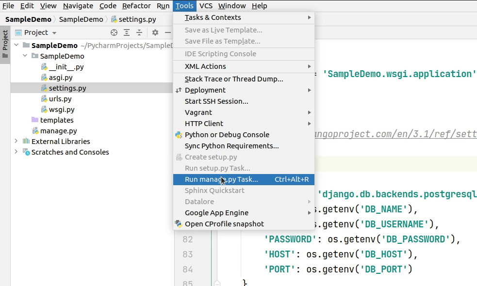

I will type **migrate** command and press enter 
and all the new tables will be successfully created
in our database.

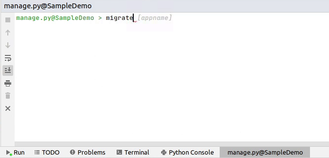

The miigration is successful: let me verify it in our database.

Yes, the tables are successfully getting reflected in our database. 

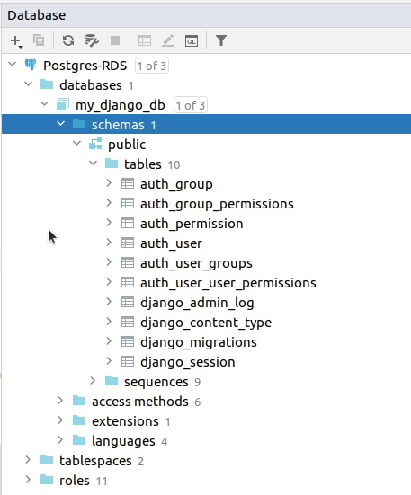

In the upcoming tutorial step, I will be setting up a new app in our project.