Hello everyone, welcome to the Django tutorial series. In this tutorial
we are going to set up a Ubuntu Desktop 20.04 LTS in Amazon Elastic 
Compute Cloud, also known as EC2.

# Security Groups

Let’s first move to Security Groups under the VPC Management Console, where
I will be creating a new security group for our EC2 instance.

I am going to name it **UbuntuDesktop-SG**.

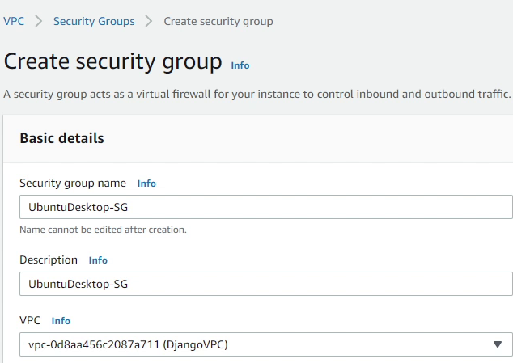

Under **inbound rules** make sure you are able to connect to the instance
through SSH. It’s a secure shell protocol to connect securely to our remote
servers. I have made sure that it accepts connections from my IP address. 


I will be adding one more rule accepting connection from my IP address in port 8443.

After adding the information, I will click on **Create security group**.

There are many ways to securely connect to your instances, 
for example a bastion host, which is a special-purpose computer
on a network specifically designed and configured to withstand attacks.


Security is a big topic, and it's an endless debate. I would recommend follow
the principle of least privilege.


If you are interested to know more about AWS Security & Compliance, please follow the below reference.

Reference:
 - [Best Practices for Security, Identity, & Compliance](https://aws.amazon.com/architecture/security-identity-compliance)


Our security group has been successfully created. Now, I will move forward to edit the 
inbound rules for **"Postgres-Django-SG"** security group.

I will make sure to add **UbuntuDesktop-SG** in the inbound rules to accept requests in the port **5432**, and
finally click on **Save rules**.

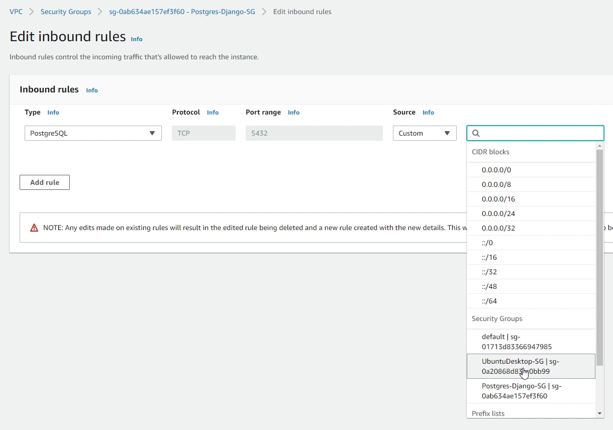

As you can see the below image, the security group has two rules attached: One accepting connections 
from the EC2 Instance, and second from an IP Address which is actually my public IP address, But as you know 
the db instance is running in a private subnet, So you can’t connect directly from the public internet. 
If you want you can remove the IP address because it’s not going to work.

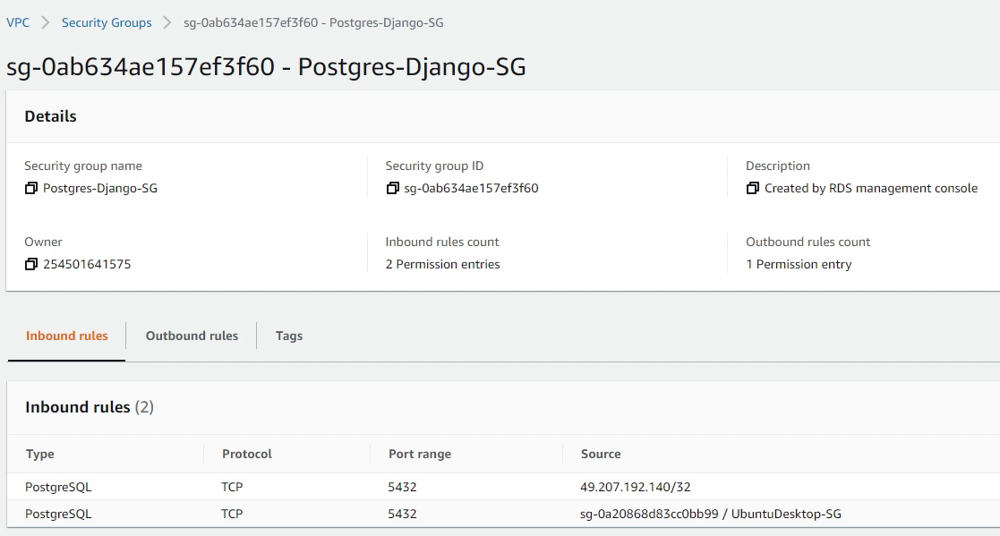

We are now done with the security groups. Now, I will navigate towards the EC2 console where I am going to spin up our new server.

I will click on the **Launch instance**.


# NICE DCV 

According to Amazon - NICE  Desktop Cloud Visualization (DCV) is a high-performance remote display protocol that provides
customers with a secure way to deliver remote desktops and application streaming from any cloud or 
data center to any device, over varying network conditions. With NICE DCV and Amazon EC2, customers
can run graphics-intensive applications remotely on EC2 instances, and stream their user interface to
simpler client machines, eliminating the need for expensive dedicated workstations.

I will search for Ubuntu Desktop in AWS Marketplace. For this tutorial I will be using
**Ubuntu Desktop 20.04 LTS Desktop with NICE DCV (Gaming Drivers)**.

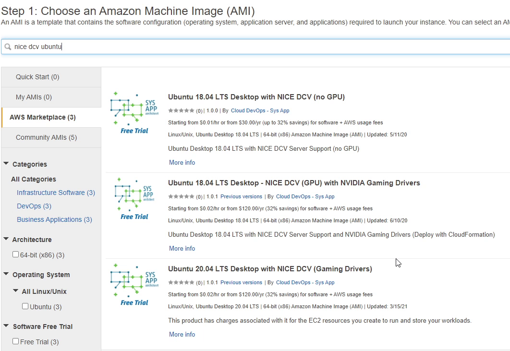

NICE DCV supports both Windows and Linux remote environments. Native clients can support up to four monitors at 4K resolution each.

There is no additional charge to use NICE DCV on Amazon EC2. You pay only for the EC2 resources.

To know more about NICE DCV, please follow the link : [aws.amazon.com/hpc/dcv](https://aws.amazon.com/hpc/dcv/)


The software provides a free trial for 5 days but still you will pay for the underlying instance. 
As we are going to use gaming drivers, so we need to use the GPU instance provided by AWS, GPU instances are not provided to every user,
you might need to create a support request to AWS for provisioning a GPU instance.

For this tutorial, I will be using a **g4dn.xlarge** instance which provides 4vCPUs and 16GB of RAM.

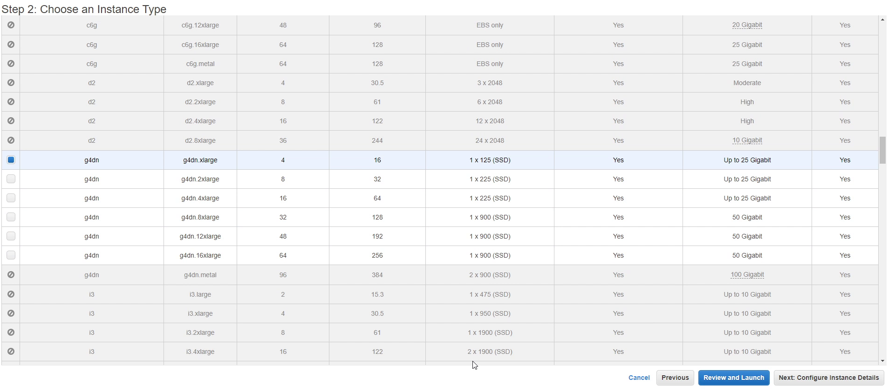


I will click on **Configure Instance Details**.

Make sure to choose **DjangoVPC** in network dropdown. I will choose the public subnet **ap-south-1a** where our server
will be launched. 

Make sure to enable **Auto-assign Public IP**.

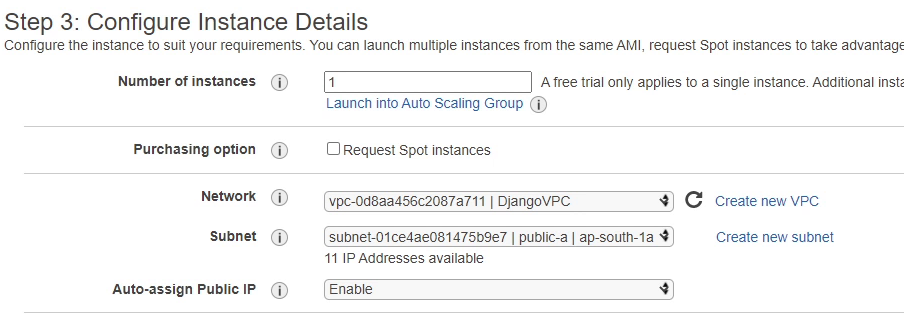


Next, I will click on **Add Storage**. I will provide 150GB for my instance store volume as an arbitrary disk space.
I would recommend creating a separate block storage where you can store your critical data and perform backups. 
Instance storage is also called **“ephemeral drives”** which provide temporary block-level storage and there is higher
risk of losing data.

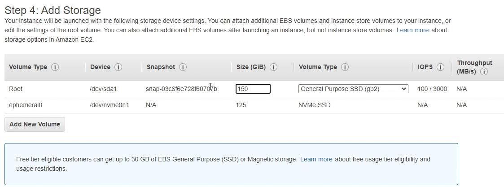


Next , I will click on **Add Tags**. Tags enable you to categorize your AWS resources, you can skip it if you don’t require it.

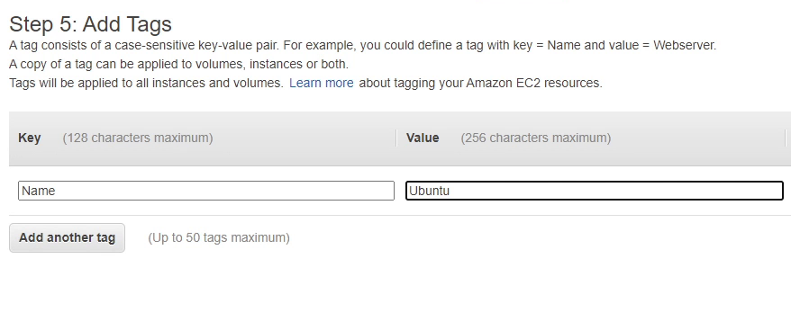

Next, I will click on Configure Security Group and will choose an existing 
security group **UbuntuDesktop-SG** which I have already created. You can see the port 8443 will be used to 
connect to our desktop through NICE DCV Client.


Next, I will click on **Launch**, select an existing or create a new private key 
and finally click on **Launch Instances**. It will take a few minutes to create our new instance.


I will go to [nice-dcv.com](https://www.nice-dcv.com/) from where I will be downloading & installing 
NICE DCV Client for Windows. They also have clients for Linux and MacOS.

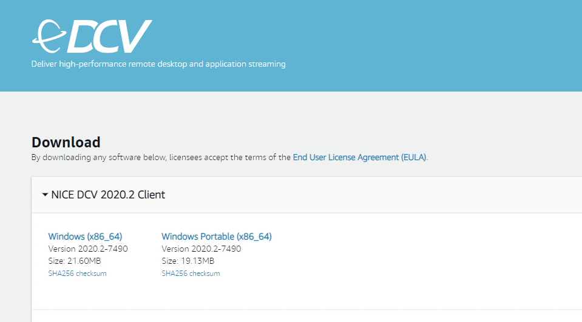


After successfully installing the NICE DCV Client in your machine,
I will connect to my ec2 instance and set the password which is required
to connect to the instance through the NICE DCV Client.


As you can see I have connected to my ec2 instance through Putty. 
There are multiple ways to connect to your ec2 instance, which you might
already be aware of. If not, please refer below the reference link.

Reference:
 - [Connect to your Linux instance in AWS](https://docs.aws.amazon.com/AWSEC2/latest/UserGuide/AccessingInstances.html)


The username of my ec2 instance is **ubuntu**, I will move forward 
setting up my new password by writing the command ```sudo passwd ubuntu```

After you have set the password successfully, I will copy the public ipv4 address of my instance
and paste it in the NICE DCV Client. The port number is optional but make sure the port 8443 is
open to accept connection, as you have already seen before in our security group.


I will click on **Trust** for agreeing to the security exceptions. 
I would recommend following the NICE DCV documentation for hardening the server.


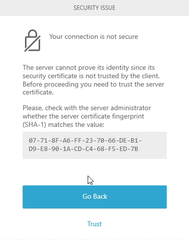

Now, I am going to provide the username and password and will click on Login.

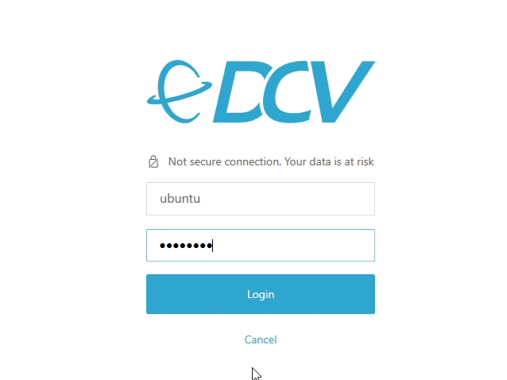

Okay, we have successfully connected to our Ubuntu Desktop and this looks amazing. 

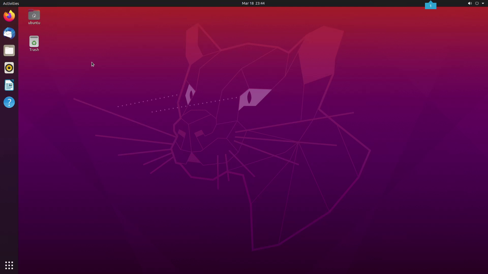


I would recommend checking 
out the video uploaded by [AWS re:Invent 2019 - Remote desktop and application streaming with NICE DCV.](https://www.youtube.com/watch?v=id0kOnY6wLw)

In the upcoming tutorial, I will show how to set up Django and Create our new PyCharm Project inside our Ubuntu Desktop.

