Hello everyone, welcome to the Django tutorial series. 
In this tutorial step, we are going to set up a VPC in AWS and 
securely launch an RDS instance in a private subnet.

# Background

Before stepping forward let me give you brief background on 
what is AWS VPC and RDS. 

**Amazon Virtual Private Cloud (Amazon VPC)** is a service that lets
you launch AWS resources in a logically-isolated virtual network
that you define. You have complete control over your virtual 
networking environment, including selection of your own IP address range,
creation of subnets, and configuration of route tables and network gateways. 

To work with AWS VPC you need to have basic networking knowledge. For 
reference, you can watch this video : [AWS Networking fundamentals](https://www.youtube.com/watch?v=hiKPPy584Mg)

**Amazon RDS** also known as **Relational Database Service** is a 
distributed relational database service provided by Amazon Web Services.
It is a web service running "in the cloud" designed to simplify the setup,
operation, and scaling of a relational database for use in applications.
It provides cost-efficient and resizable capacity while automating 
time -consuming administration tasks such as: hardware provisioning, 
database setup, patching and backups. As of today the currently
supported database engines are : 
MySQL, Oracle, Postgres, SQLServer, MariaDB and Amazon Aurora.

For reference, follow this link : [aws.amazon.com/rds](https://aws.amazon.com/rds/)

# Setup VPC, Subnets, Route Tables & Internet Gateway

Let’s get our hands dirty, as you can see on my screen I am already logged in 
into my **AWS Management Console**. 

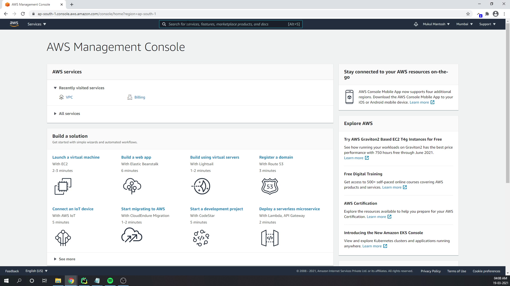

I am going to search for **VPC** and navigate towards the **VPC Management Console** where
I will be creating a new VPC and naming it as **DjangoVPC**, and the CIDR block will be **10.0.0.0/26**.
This will create 64 IP addresses.

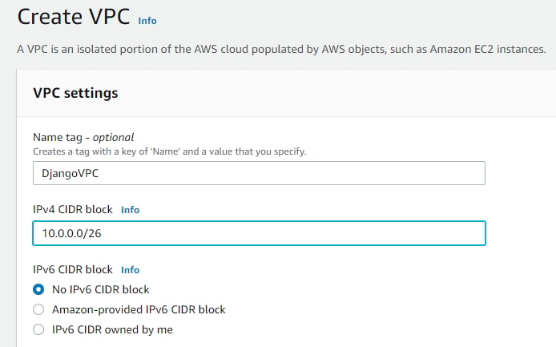

To know how we got 64 IP addresses, I would suggest to research about **CIDR (
Classless inter-domain routing)**.

Reference:
  -  [CIDR - The Internet Address Assignment and Aggregation Plan](https://tools.ietf.org/html/rfc4632)
  -  [CIDR Range Visualizer](https://cidr.xyz/)

After the VPC has been successfully created, next we need to create **Subnets**.

According to Wikipedia: <em>A subnetwork or subnet is a logical subdivision
of an IP network. The practice of dividing a network into two or more networks
is called subnetting.</em>

Under DjangoVPC, I am going to create 4 subnets with 
two private and two public subnets. I will divide the subnet into 
4 blocks with 16 IP addresses each. Make sure to create two private subnets
in different availability zones. I will follow the same approach for the public subnets.

We have successfully created the subnets. As you can see in the image below,
the available IPv4 addresses is only 11, but what about the remaining 5? 
The remaining 5 are reserved by AWS. Amazon reserves the first 
four (4) IP addresses and the last one (1) IP address of every subnet 
for IP networking purposes. 

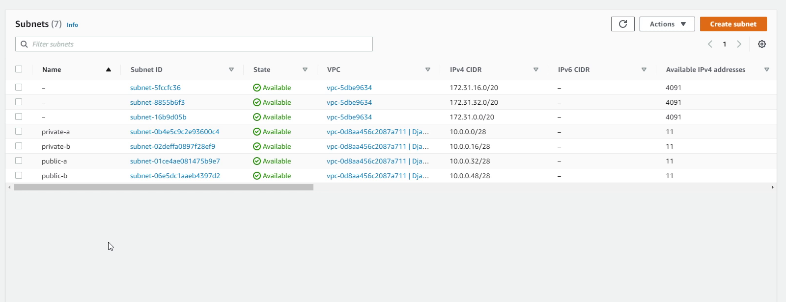

To know more about subnets, please visit [VPCs and subnets - Amazon Virtual Private Cloud](https://docs.aws.amazon.com/vpc/latest/userguide/VPC_Subnets.html).

Next, we are going to create a **route table**. A route table contains a set
of rules, called routes, that are used to determine where network traffic
from your subnet or gateway is directed.

There will be two route tables -- one private and one public -- under our 
DjangoVPC, and we will be associating our subnets into the route tables.

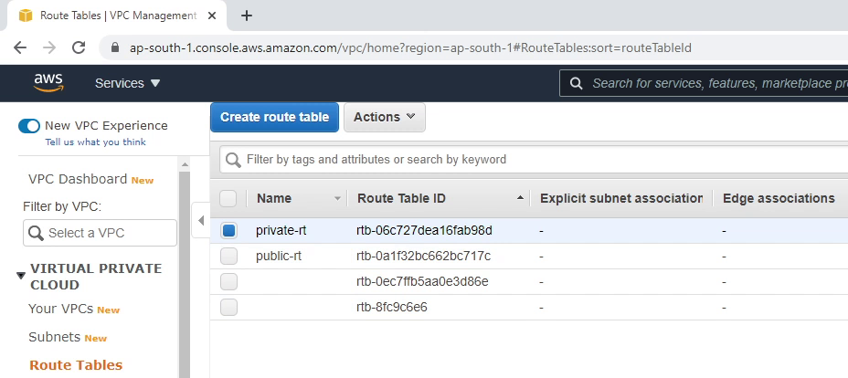

As you can see the image below, I am associating two private subnets in 
our **private-rt** route table. I will be performing the same with public subnets.

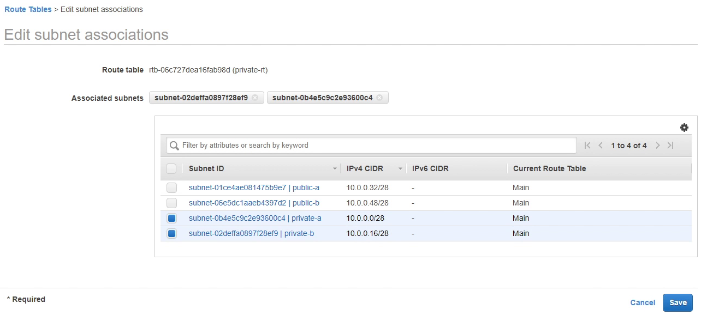

Next, we are going to route internet-bound traffic to our public subnet, for that we need 
to create an **Internet Gateway**. I am going to create an Internet Gateway
and name it as **DjangoIGW**.

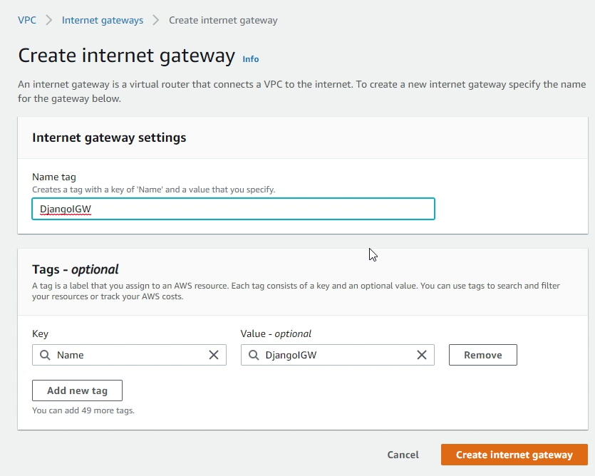

Next, I will attach the Internet Gateway to our DjangoVPC.

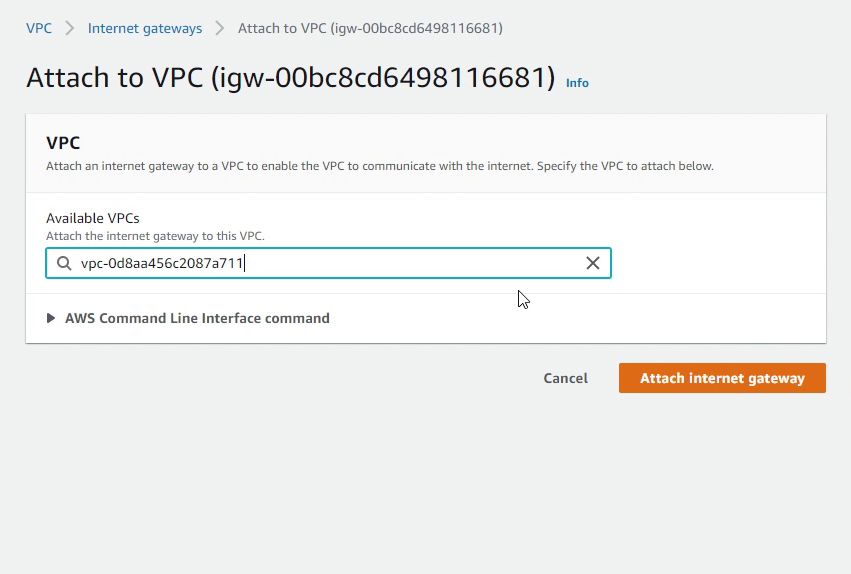

I will now add a route in our public route table (**public-rt**) 
which directs internet-bound traffic to the internet gateway.

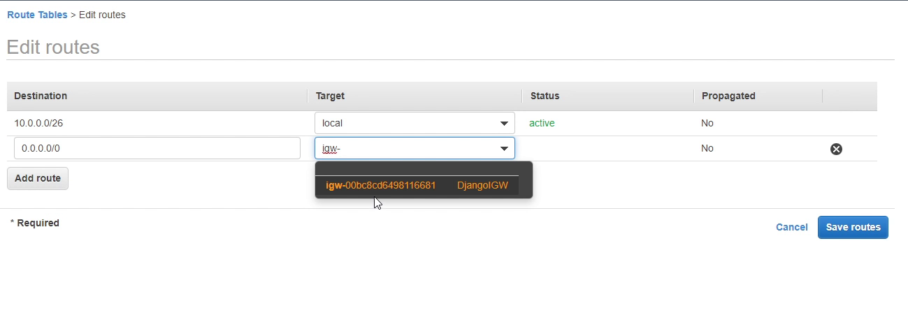

Maybe your application is running under a private subnet,
and you want to update or patch your application. You might 
need the internet, but you don't want your application to be 
exposed to the outside. For this you can create a **NAT Gateway**. NAT 
gateways let instances in a private subnet connect to the internet
or other AWS services, but prevent the internet from initiating a connection
with those instances.

# Amazon Relational Database Service (RDS)

Let’s now move to **RDS Management Console** and spin up our first RDS instance.

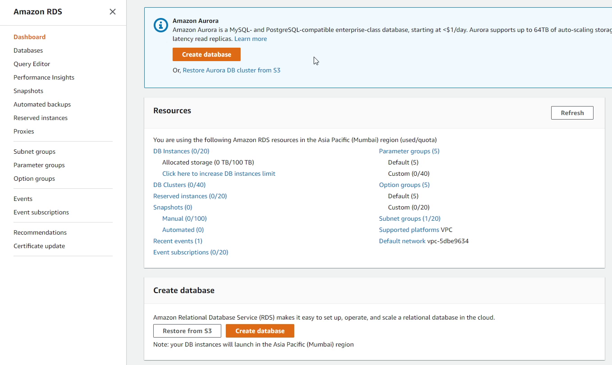

Before creating a DB instance, first we need to create a **DB Subnet Group**.

An RDS Subnet Group is a collection of subnets that you can use to designate
for your RDS database instance in a VPC. Your VPC must have at 
least two subnets. These subnets must be in two different Availability
Zones in the AWS Region where you want to deploy your DB instance. 

I click on **Create DB Subnet Group**, and provide the name
**Postgres-Django-Private-Subnet-Group**.

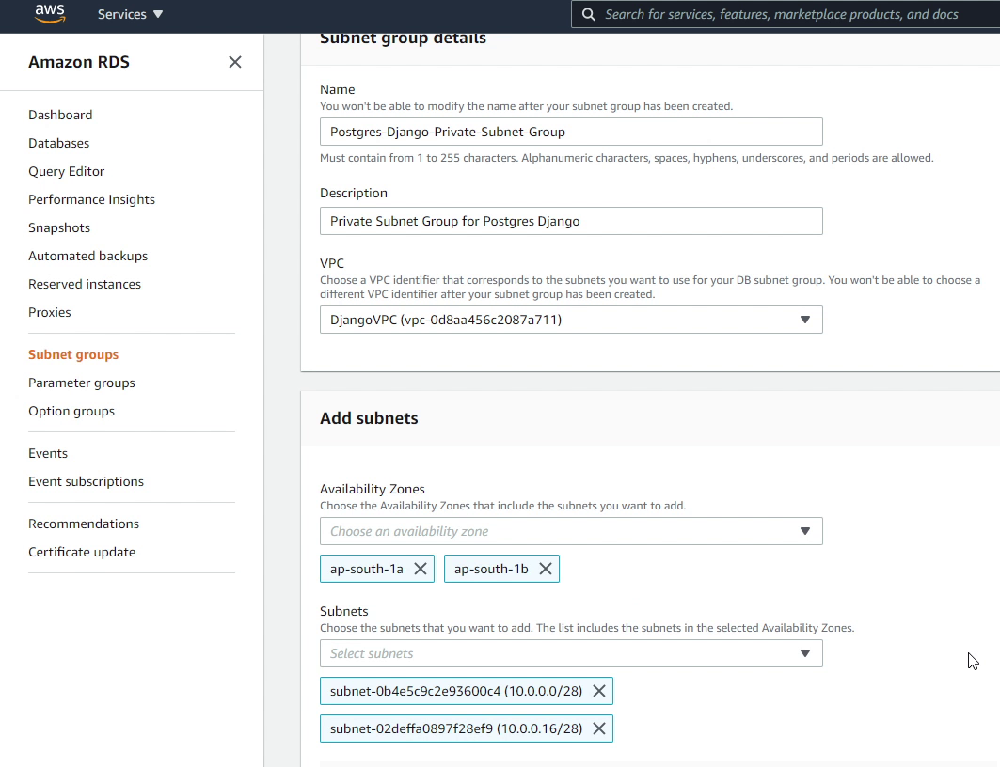

I will be choosing DjangoVPC as my VPC identifier, along with two different
availability zones under which I will be selecting my private subnets.

Finally, I will click on **Create**.

Now, I will move forward creating our new database instance. I will choose
the database creation method as **Standard create**.

AWS provides a lot of DB engines. For this tutorial I will be using PostgreSQL. 

You can also use Amazon Aurora which has been 
developed in-house by Amazon. Aurora is a MySQL and PostgreSQL-compatible
relational database which provides high performance throughput 5x faster
to standard MySQL and 3x faster to standard PostgreSQL.

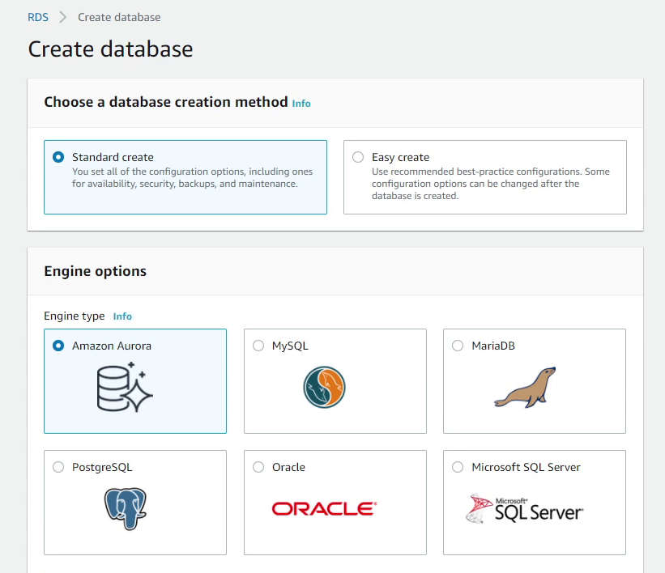

I will choose PostgreSQL 10.5. I would recommend choosing a version which 
is compatible with your application.

Under **Templates** make sure you choose **Free Tier**, 
if you are interested in saving some money while experimenting with RDS.

I will be providing generic settings like db identifier, username 
and password.

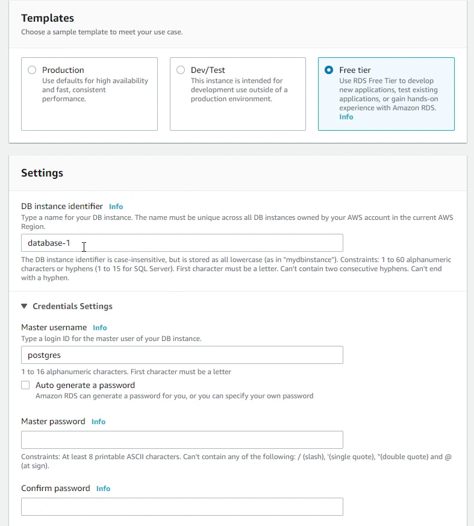

I will be choosing **t2.micro** instance class. This provides 1 giga-byte RAM
which is quite okay for our application. I will also disable 
storage autoscaling as we don’t require it. Based on your needs you can
use it for your production workloads.

Make sure to choose DjangoVPC in the **Connectivity** section. 
You can see it automatically populated the db subnet group which
we created earlier. The **Public access** should be disabled because we don’t
want to assign any public IP to our db instance, only the EC2 instance
can connect with the RDS.

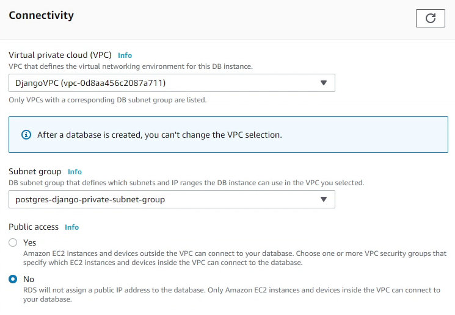

I am going to create a security group called **Postgres-Django-SG**. 

Security group is a virtual firewall which works at an instance level. 
We also have **"network acl"** which stands for **network access control list (ACL)**
is an optional layer of security for your VPC that acts as a firewall at
subnet level.

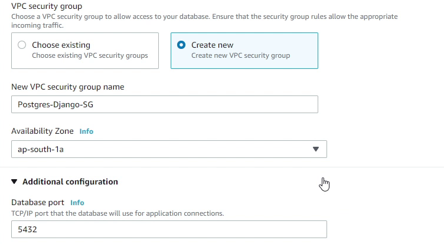

The Security Group will be created in the **ap-south-1a** availability zone. 
We will be also creating our EC2 instance in the same availability zone.

The database port **5432** will be the default, and we are not going to change
that. Make sure under database authentication you select Password authentication. 
For more stringent security you can also use IAM authentication or Kerberos. 

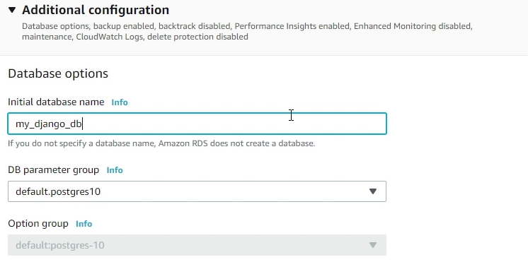

Under **Additional Configuration**, I will provide the database name as **my_django_db**.

We will be using the default DB parameter group, there are no changes in that. 
A DB parameter group stores db engine configuration values that are applied to 
one or more DB instances.

Finally, I will click on **create database**. It will take a few minutes to
launch the db instance.

I would like to highlight a few things which I did not cover in 
**Additional Configuration** like **Backups**, **Monitoring** and **Maintenance Window**.
It depends upon the use case of what you are trying to build. These tools
are essential when you are working with a production database. But if
you are using RDS for the first time, just like trying it out, then it’s not
necessary to use these features.

After a few minutes you will observe in the RDS console that our db instance 
is up and running. As you can see in the below image, the status showing as **Available**. 

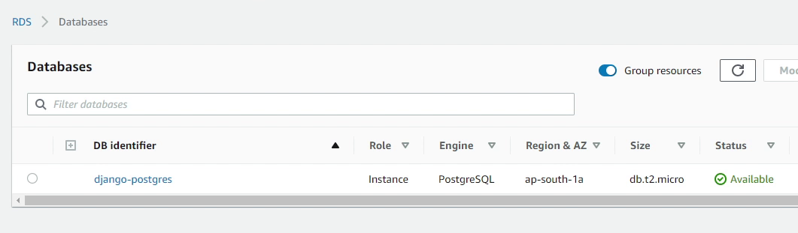

Let’s move to the next tutorial where I will be setting up an Ubuntu Desktop in Amazon EC2.

