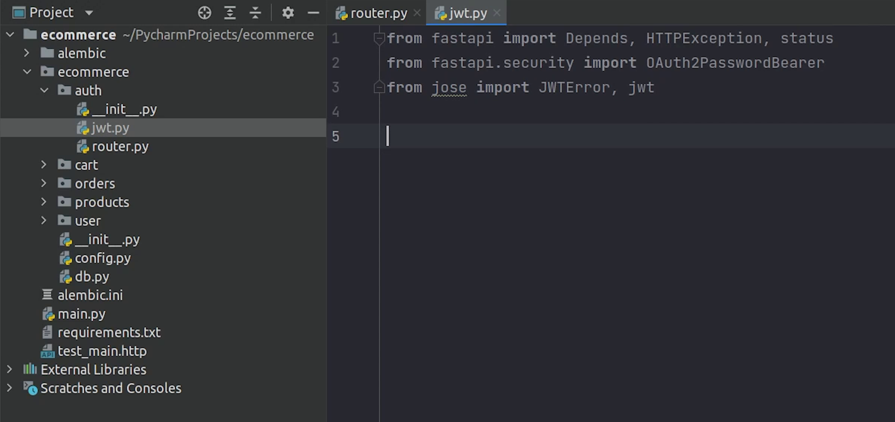

Hello everyone ! Welcome to PyCharm FastAPI Tutorial Series.

In this tutorial we are going to set up the authentication process by protecting our apis using JWT.

We will cover the security part. You can also follow the FastAPI documentation, it has a clear and detailed explanation. 


# Installing Dependencies

We will be using the **OAuth2PasswordBearer**. Make sure to install the **python-multipart** dependency.


```
pip install python-multipart
```


You can also clearly see the documentation covers the entire password flow. I strongly recommend checking 
the FastAPI official documentation for reference.

Reference:
- https://fastapi.tiangolo.com/tutorial/security/


Next, we will try to get the current logged-in user.


There are some additional dependencies required for this setup, like the **python-jose** which will be used to 
generate and verify JWT tokens.


**Passlib** which we have already used for password encryption.


Just for speeding up the installation process, clone **requirements.txt** from the source [code](https://github.com/mukulmantosh/FastAPI_EKS_Kubernetes).


# JSON Web Tokens (JWT)

To know about JWT, visit this [link](https://jwt.io/).

Before beginning, I expect that you have already installed the python dependencies.

I will go to the **auth** folder and create the **router.py** file. 


Let me do the necessary imports.


As you can see we have imported ```OAuth2PasswordRequestForm```, which is basically a dependent class which 
takes parameters:  ```grant_type```, ```username```, ```password```, ```client id``` and ```client secret```.


For your information, The **OAuth2** spec actually requires a field ```grant_type``` with a fixed value 
of password, but ```OAuth2PasswordRequestForm``` doesn't enforce it.

If you need to enforce it, use ```OAuth2PasswordRequestFormStrict``` instead of ```OAuth2PasswordRequestForm```.


I will initialize the **APIRouter** and set the tag name to **auth**.


Next, I will create an endpoint for login. I will pause the implementation for some time,
before that I need to create a jwt file where I will be creating and verifying tokens.


I am going to do the necessary imports.



For creating a jwt token we need to have a secure secret key and 
algorithm which I will set to **HS256**. There are even more algorithms supported, do check
the official documentation of [python-jose](https://python-jose.readthedocs.io/en/latest/).


I will make sure that the token expires after 30 minutes.

For the secret key, I will provide a long random string. 


I will create a function called ```create_access_token``` where I will write the implementation to 
encode the data and generate the JWT token, this is something which I have directly taken from 
the FastAPI documentation.


**jwt.py**

```python
from datetime import datetime, timedelta

from fastapi import Depends, HTTPException, status
from fastapi.security import OAuth2PasswordBearer
from jose import JWTError, jwt

from ecommerce.auth import schema

SECRET_KEY = "09d25e094faa6ca2556c818166b7a9563b93f7099f6f0f4caa6cf63b88e8d3e7"
ALGORITHM = "HS256"
ACCESS_TOKEN_EXPIRE_MINUTES = 30


def create_access_token(data: dict):
    to_encode = data.copy()
    expire = datetime.utcnow() + timedelta(minutes=ACCESS_TOKEN_EXPIRE_MINUTES)
    to_encode.update({"exp": expire})
    encoded_jwt = jwt.encode(to_encode, SECRET_KEY, algorithm=ALGORITHM)
    return encoded_jwt
```

Next, I will be creating a few pydantic classes.

I will be creating three different classes : ```Login```, ```Token``` and ```TokenData```.

Login will be used for accepting parameters like username and password.

Token class will accept ```token``` and ```token_type``` here we are basically referring to ```Bearer```.

```TokenData``` which accepts email that too it's optional.


**schema.py**

```python
from typing import Optional

from pydantic import BaseModel


class Login(BaseModel):
    username: str
    password: str


class Token(BaseModel):
    access_token: str
    token_type: str


class TokenData(BaseModel):
    email: Optional[str] = None
```

I will come back to jwt and create a new ```verify_token```. This function will be used to check whether
the token which we are using is a valid token or not.


**jwt.py**

```python
from datetime import datetime, timedelta

from fastapi import Depends, HTTPException, status
from fastapi.security import OAuth2PasswordBearer
from jose import JWTError, jwt

from ecommerce.auth import schema

SECRET_KEY = "09d25e094faa6ca2556c818166b7a9563b93f7099f6f0f4caa6cf63b88e8d3e7"
ALGORITHM = "HS256"
ACCESS_TOKEN_EXPIRE_MINUTES = 30


def create_access_token(data: dict):
    to_encode = data.copy()
    expire = datetime.utcnow() + timedelta(minutes=ACCESS_TOKEN_EXPIRE_MINUTES)
    to_encode.update({"exp": expire})
    encoded_jwt = jwt.encode(to_encode, SECRET_KEY, algorithm=ALGORITHM)
    return encoded_jwt


def verify_token(token: str, credentials_exception):
    try:
        payload = jwt.decode(token, SECRET_KEY, algorithms=[ALGORITHM])
        email: str = payload.get("sub")
        if email is None:
            raise credentials_exception
        token_data = schema.TokenData(email=email)
        return token_data
    except JWTError:
        raise credentials_exception


oauth2_scheme = OAuth2PasswordBearer(tokenUrl="login")
```

If email is not present in the token then we will raise a credential exception
which is actually going to be a ```HTTPException``` else we will be returning the ```TokenData```.

Next, we will create a variable ```oauth2_scheme``` in which we will initialize the ```OAuth2PasswordBearer```.

```Oauth2_scheme``` will be used as a dependency when trying to get the current logged-in user.


I will create the ```get_current_user``` function where I will verify the token.


If the token is verified successfully then email will be returned else exception will be raised with 401 status code.

**jwt.py**

```python
from datetime import datetime, timedelta

from fastapi import Depends, HTTPException, status
from fastapi.security import OAuth2PasswordBearer
from jose import JWTError, jwt

from ecommerce.auth import schema

SECRET_KEY = "09d25e094faa6ca2556c818166b7a9563b93f7099f6f0f4caa6cf63b88e8d3e7"
ALGORITHM = "HS256"
ACCESS_TOKEN_EXPIRE_MINUTES = 30


def create_access_token(data: dict):
    to_encode = data.copy()
    expire = datetime.utcnow() + timedelta(minutes=ACCESS_TOKEN_EXPIRE_MINUTES)
    to_encode.update({"exp": expire})
    encoded_jwt = jwt.encode(to_encode, SECRET_KEY, algorithm=ALGORITHM)
    return encoded_jwt


def verify_token(token: str, credentials_exception):
    try:
        payload = jwt.decode(token, SECRET_KEY, algorithms=[ALGORITHM])
        email: str = payload.get("sub")
        if email is None:
            raise credentials_exception
        token_data = schema.TokenData(email=email)
        return token_data
    except JWTError:
        raise credentials_exception


oauth2_scheme = OAuth2PasswordBearer(tokenUrl="login")


def get_current_user(data: str = Depends(oauth2_scheme)):
    credentials_exception = HTTPException(
        status_code=status.HTTP_401_UNAUTHORIZED,
        detail="Could not validate credentials",
        headers={"WWW-Authenticate": "Bearer"},
    )
    return verify_token(data, credentials_exception)
```

# Defining Routes

I will come back to the router and resume working on the login endpoint.

This is a standard API, not async. It is completely fine you can choose whatever is suitable
for you. It’s not necessary that you need to define all of your APIs to async, even your apis
can be also sync. Choice is yours.


In request we are going to make ```OAuth2PasswordRequestForm``` as a dependency, so it will prompt us 
to provide username and password.

I will check whether the user is present in the database or not, if it is not present I will raise an HTTP Exception.

I will also validate the password and raise an exception accordingly if it does not match.

If everything is good, then I will go ahead and create a new token and return it back to the user.

**router.py**

```python
from datetime import timedelta

from fastapi import APIRouter, Depends, HTTPException, status
from fastapi.security import OAuth2PasswordRequestForm
from sqlalchemy.orm import Session


from ecommerce import db
from ecommerce.user import hashing
from ecommerce.user.models import User

from .jwt import create_access_token

router = APIRouter(
    tags=['auth']
)


@router.post('/login')
def login(request: OAuth2PasswordRequestForm = Depends(), database: Session = Depends(db.get_db)):
    user = database.query(User).filter(User.email == request.username).first()
    if not user:
        raise HTTPException(status_code=status.HTTP_404_NOT_FOUND, detail='Invalid Credentials')

    if not hashing.verify_password(request.password, user.password):
        raise HTTPException(status_code=status.HTTP_400_BAD_REQUEST, detail='Invalid Password')

    # Generate a JWT Token
    access_token = create_access_token(data={"sub": user.email})

    return {"access_token": access_token, "token_type": "bearer"}

```

I will go to **main.py** and register the auth router.


After we registered the router successfully, I will go to the user module.

I will open the router and import ```get_current_user```.

I will pass it in all of my apis as a dependency, excluding few. 

**user/router.py**

```python
from typing import List

from fastapi import APIRouter, Depends, status, Response, HTTPException
from sqlalchemy.orm import Session

from ecommerce import db
from ecommerce.auth.jwt import get_current_user  # <-- import this line
from . import schema
from . import services
from . import validator

router = APIRouter(
    tags=['Users'],
    prefix='/user'
)


# Interesting Question for Global Dependency
# https://github.com/tiangolo/fastapi/issues/2481


@router.post('/', status_code=status.HTTP_201_CREATED)
async def create_user_registration(request: schema.User, database: Session = Depends(db.get_db)):
    # Read More : Pydantic Validation with Database (https://github.com/tiangolo/fastapi/issues/979)

    user = await validator.verify_email_exist(request.email, database)
    if user:
        raise HTTPException(
            status_code=400,
            detail="The user with this email already exists in the system.",
        )

    new_user = await services.new_user_register(request, database)
    return new_user


@router.get('/', response_model=List[schema.DisplayUser])
async def get_all_users(database: Session = Depends(db.get_db), current_user: schema.User = Depends(get_current_user)):   # <-- pass get_current_user
    return await services.all_users(database)


@router.get('/{user_id}', response_model=schema.DisplayUser)
async def get_user_by_id(user_id: int, database: Session = Depends(db.get_db),
                         current_user: schema.User = Depends(get_current_user)):
    return await services.get_user_by_id(user_id, database)


@router.delete('/{user_id}', status_code=status.HTTP_204_NO_CONTENT, response_class=Response)
async def delete_user_by_id(user_id: int, database: Session = Depends(db.get_db),
                            current_user: schema.User = Depends(get_current_user)):    # <-- pass get_current_user
    return await services.delete_user_by_id(user_id, database)
```

# Testing Auth

Once everything is done, you will see in the Swagger UI that some of your endpoints are now protected and can't be 
directly accessed.


You can observe the lock symbol which means the endpoint is protected, and you need a valid token to access it.


You can also observe that a link is appearing named **Authorize** with a lock sign.


Once I click on it. It’s going to prompt me to enter a valid username and password.


I will click on Authorize, and we are successfully authenticated.


Now, if I try to execute then it will give me a list of all users.


I will be passing the ```get_current_user``` dependency in all of my endpoints excluding few of them.

If you feel that you got stuck somewhere then watch the video along-with have a look on the [source code](https://github.com/mukulmantosh/FastAPI_EKS_Kubernetes).

You can see now that the user module all apis except register all are having the lock icon.


There is an interesting discussion which I came across, and maybe you might want some of your 
apis to be not protected like load balancer health checks, but you want to take the advantage of 
[global dependency](https://fastapi.tiangolo.com/tutorial/dependencies/global-dependencies/).

Then you should check this issue :
 - [https://github.com/tiangolo/fastapi/issues/2481](https://github.com/tiangolo/fastapi/issues/2481)


I will also replace the manually provided emails with ```current_user.email```

Example: **orders/services.py**

```python
from typing import List

from fastapi import HTTPException, status

from ecommerce.cart.models import Cart, CartItems
from ecommerce.orders.models import Order, OrderDetails
from ecommerce.user.models import User
from . import tasks


async def initiate_order(current_user, database) -> Order:
    user_info = database.query(User).filter(User.email == current_user.email).first()   # <-- replacing elon@tesla.com with current_user.email
    cart = database.query(Cart).filter(Cart.user_id == user_info.id).first()

    cart_items_objects = database.query(CartItems).filter(Cart.id == cart.id)
    if not cart_items_objects.count():
        raise HTTPException(status_code=status.HTTP_404_NOT_FOUND, detail="No Items found in Cart !")

    total_amount: float = 0.0
    for item in cart_items_objects:
        total_amount += item.products.price

    new_order = Order(order_amount=total_amount,
                      shipping_address="587 Hinkle Deegan Lake Road, Syracuse, New York",
                      customer_id=user_info.id)
    database.add(new_order)
    database.commit()
    database.refresh(new_order)

    bulk_order_details_objects = list()
    for item in cart_items_objects:
        new_order_details = OrderDetails(order_id=new_order.id,
                                         product_id=item.products.id)
        bulk_order_details_objects.append(new_order_details)

    database.bulk_save_objects(bulk_order_details_objects)
    database.commit()

    # Send Email
    tasks.send_email.delay(current_user.email)

    # clear items in cart
    database.query(CartItems).filter(CartItems.cart_id == cart.id).delete()
    database.commit()

    return new_order


async def get_order_listing(current_user, database) -> List[Order]:
    user_info = database.query(User).filter(User.email == current_user.email).first() # <-- replacing elon@tesla.com with current_user.email
    orders = database.query(Order).filter(Order.customer_id == user_info.id).all()
    return orders
```

So, we have protected carts and orders, excluding products. It’s completely up to you which endpoints you want to protect or ignore.

If I now try adding something to the cart, it’s not going to workout. We need to have a valid token.


Once you authenticate yourself, then your API is going to work smoothly.


You can see now the item has been successfully added.


So, I hope you got some understanding about the auth flow. If not then I would recommend checking the FastAPI docs which has a more detailed explanation. 

In the next tutorial, we will be focusing on testing using pytest and asyncio.
