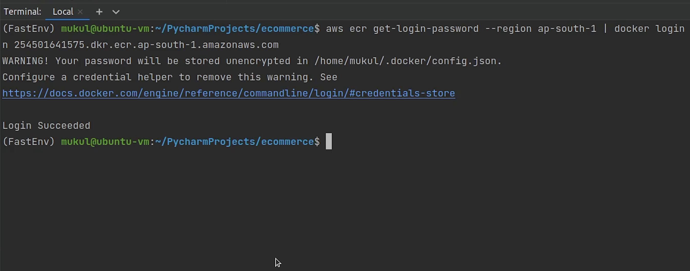
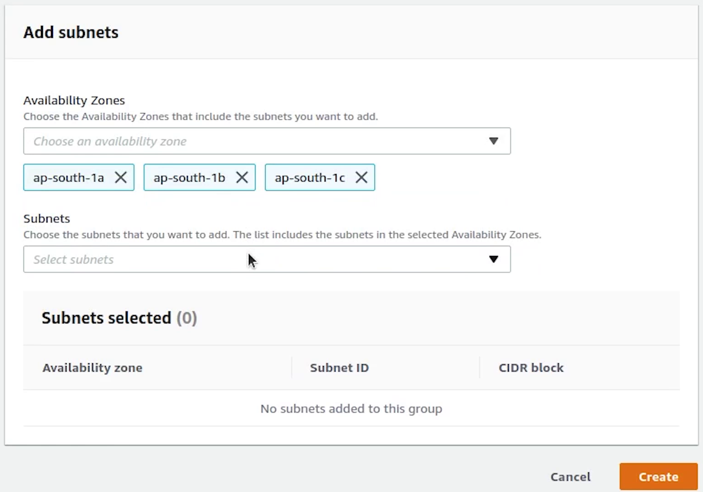

Hello everyone ! Welcome to PyCharm FastAPI Tutorial Series.

In this tutorial we will be deploying our application in AWS using the 
[Elastic Kubernetes Service(EKS)](https://aws.amazon.com/eks/) along-with setting up domain with SSL.


Make sure before proceeding, you have installed the [AWS Command Line](https://aws.amazon.com/cli/) application.


# eksctl

There is one more application we need to install in our system and that is **eksctl**. It is the official command line
tool for EKS and helps in managing clusters in EKS, developed by [WeaveWorks](https://www.weave.works/) and written in **Go**.

Make sure you have both **kubectl** and **eksctl** in your system, and also we expect from the audience 
they have previous working experience in AWS.


I am going to skip the installation steps, as it has clearly been provided in the aws & eksctl documentation. You can
follow that easily or there are tons of articles available on how to do that.


References : 
- [https://eksctl.io/](https://eksctl.io/)
- [https://docs.aws.amazon.com/eks/latest/userguide/eksctl.html](https://docs.aws.amazon.com/eks/latest/userguide/eksctl.html)


# IAM User

Coming back to [AWS Management Console](https://aws.amazon.com/console/), I will create an administrative user
from which we are going to access all our AWS Services. I generally **don’t recommend** this approach when you are
working in a production or sensitive environment, kindly follow the principle of the **least** privilege.


I will goto IAM and create a new user with **AdministratorAccess**.


I have already created the new user, I just need to create the access key. Now, I need to set up these keys in my AWS CLI.


I will open up my terminal and type: **aws configure**.


After that I will provide access key, secret access key and region name set to ap-south-1

We have successfully configured.


# Elastic Container Registry (ECR)

Next, we will go to ECR which is the [Elastic Container Registry](https://aws.amazon.com/ecr/). We will push our 
docker image to our ECR repository. I am actually trying to cover the use case when some people out
there want to work with a private registry instead of using a public registry like DockerHub.

I will create a repository and name it  **fastapi-ecommerce*. Visibility is going to be **private**.


Repository is created, let me push the docker image to ECR. But before pushing we need to authenticate
our credentials and after that only we would be able to push the image to AWS.


Once you open the repository, on the top right you will see a link appearing **“View push commands”**. I am going to
click on that.


I will copy the first line and execute in the terminal.




Login Succeeded. Now, build the image then tag it and finally push.


The image has been successfully pushed, let me verify in the console.

Yes, the image is appearing now and the total size is around 179 MB.


# Key Pairs

Now, I will create a private key **PEM** file, which will be used to get inside the EC2 machine. We won’t be 
getting inside any particular instance, as we will be handling everything through Kubernetes.  But this can be
used for many kinds of scenarios like debugging, checking something particular in the machine.

I will open **Key Pairs** which are going to appear in the **EC2 Dashboard** under **Network & Security**.


I will name the key pair as **fastapi-demo**. 


# Cluster

I will come back to PyCharm and create a directory called **eks**.


I will create a new file and name it **cluster.yml**.

We are going to create a three node cluster and the good part is the **[control plane](https://kubernetes.io/docs/concepts/overview/components/)** is taken care of by AWS itself.

Just for your  information EKS is not a free service. You pay **$0.10** per hour for each Amazon EKS cluster
that you create even if you don’t use it and separate cost of instances which are acting as nodes; their costs
are different based on instance types.

These are expensive services, make sure you have some credits before going ahead.


**cluster.yml**

```yaml
# If a nodegroup includes the attachPolicyARNs it must also include the default node policies,
# like AmazonEKSWorkerNodePolicy, AmazonEKS_CNI_Policy and AmazonEC2ContainerRegistryReadOnly.

apiVersion: eksctl.io/v1alpha5
kind: ClusterConfig
metadata:
  name: fastapi-demo
  region: ap-south-1
  version: "1.21"
managedNodeGroups:
  - name: fastapi-private-ng
    instanceType: t3a.small
    desiredCapacity: 3
    minSize: 3
    maxSize: 6
    volumeType: gp3
    volumeSize: 20
    privateNetworking: true
    iam:
      attachPolicyARNs:  # Reference : https://eksctl.io/usage/iam-policies/
        - arn:aws:iam::<REPLACE_THIS_NUMBER>:policy/SES_EKS_Policy   # <-- custom policy
        - arn:aws:iam::aws:policy/AmazonEKSWorkerNodePolicy
        - arn:aws:iam::aws:policy/AmazonEC2ContainerRegistryReadOnly
      withAddonPolicies:
        autoScaler: true
        imageBuilder: true
        albIngress: true
        externalDNS: true
        certManager: true
    ssh:
      allow: true
      publicKeyName: "fastapi-demo" # <-- ssh key name
```


Coming back to the code, you can ignore the yellow highlight which is coming up. This is because of the
eksctl configuration and the kubernetes plugin is not able to identify it, completely normal nothing to worry.


Let me explain quickly what we are trying to do.


We are going to create a Kubernetes cluster running **1.21** version, and it will be deployed in **ap-south-1** region.

Next we are creating the managed nodegroup. With Amazon EKS managed node groups, you don’t need to separately
provision or register the Amazon EC2 instances that provide compute capacity to run your Kubernetes applications. You
can create, automatically update, or terminate nodes for your cluster with a single operation, applications stay available.


You can go ahead and also create **unmanaged nodegroups** if you prefer that. We will be creating three ec2
instances and the instance type is going to be **t3a.small** also we are allocating a gp3 volume type of size 20 GB. Amazon EBS
gp3 volumes are the latest generation of general-purpose SSD.

Observe line number 16, **privateNetworking** set to true. This basically means our nodes can’t be accessed
publicly and all the ec2 instances will communicate over the private network. It’s not only EC2 even
if you can create Spot Instances or go serverless like [Fargate](https://aws.amazon.com/fargate/).


Next, observe line number 18 we are using the **attachPolicyARNs**. There are 4 policies which we have added to work
smoothly with the cluster. 

If a nodegroup includes the **attachPolicyARNs** it must also include the default node policies, like :

- ```AmazonEKSWorkerNodePolicy```
- ```AmazonEKS_CNI_Policy``` 
- ```AmazonEC2ContainerRegistryReadOnly```


Carefully observe line number 19 the ```SES EKS Policy```, this is not the default policy, 
instead it’s a custom policy which we have created to grant permission to send email through SES. Hang tight, 
I will show you in a while. Your ARN number is going to be different so make to sure replace that otherwise the
cluster creation will fail.


You can observe we have provided ses access to send email.


We are also using some add-on policies like auto-scaling, image builder which allows 
for full ECR (Elastic Container Registry) access along with certificate manager for 
managing ssl certificate and ALB Ingress referring to application load balancer.


And finally ssh access to nodes set to true and reference to the private key name **fastapi-demo** which we created earlier.


There are plenty more add-on policies which you can add based on your requirements, do check the eksctl official documentation. 

Let’s now go ahead and create the cluster.

Open up the terminal and move inside the **eks** directory.


I will type:

```bash
eksctl create cluster -f cluster.yml --auto-kubeconfig
```

* ```auto-kubeconfig``` is going to save the config file under the directory ```.kube/eksctl/clusters```
* The filename will be set as the cluster name which you have provided
* Cluster creation process will take somewhere around 15-20 minutes


The cluster has been successfully created. 


Now, I am going to copy the kubeconfig file **fastapi-demo** to our **eks** directory.


Let me check the number of nodes by passing the kubeconfig fastapi-demo.

```bash
kubectl get nodes --kubeconfig=fastapi-demo
```


You can observe three nodes are running and the operating system is backed by **Amazon Linux 2**. The nodes are
completely private, you can observe the internal IP and there is no external IP exposed.

# OIDC

Next, we are going to approve the OIDC provider.  To use IAM roles for service accounts, 
an IAM OIDC provider must exist for your cluster.

User authentication for Amazon EKS clusters can also be performed from [OpenID Connect](https://openid.net/connect/) (OIDC) Identity Provider (IDP). This
feature allows customers to integrate an OIDC identity provider with a new or existing Amazon EKS cluster running 
Kubernetes version 1.16 or later. The OIDC IDP can be used as an alternative to, or along with 
AWS Identity and Access Management (IAM). 

I am going to type : 

```bash
eksctl utils associate-iam-oidc-provider --region ap-south-1 --cluster fastapi-demo --approve
```

Reference:
- [https://docs.aws.amazon.com/eks/latest/userguide/enable-iam-roles-for-service-accounts.html](https://docs.aws.amazon.com/eks/latest/userguide/enable-iam-roles-for-service-accounts.html)


The OIDC provider is successfully created.


# Postgres

Next, we are going to create a Security Group for Postgres database, this will be required 
when we will be launching the RDS database.


I will goto **VPC** and then under **Security** you will find **Security Groups**.


I am going to provide a name and description. I will choose **fastapi-demo-cluster** as my vpc, this VPC is created by the EKS.


Under **Inbound Rules**, I will select Postgres which will be running on port 5432 
and IP access will be set to anywhere. It does not matter because the cluster nodes are in private mode, so we
won’t be able to access the database publicly.


Next we will move to RDS where we will be creating our **Subnet Group**.




I will be providing the VPC subnet private IP addresses from the  three availability zones:

- ap-south-1a
- ap-south-1b
- ap-south-1c


Our subnet group is created, now we will go ahead and complete the process of creating a new database.


Creation method is going to be **standard create** and the engine will be **Postgres** and the version which
we are going to use is **10.17**


DB instance identifier will be set to **sampledb**. Username is going to be **postgres**, and I will provide the 
master password.


DB instances will be **t2.micro**, we need to be in control of our costs.

We will disable the storage autoscaling.


Under **Connectivity**, choose **fastapi-demo** cluster, and automatically it has picked our custom rds eks db subnet group.

Public access will be set to No. Kind of extra precaution no one can access our db instance outside our cluster.


Next, I will be choosing the Security Group which we created earlier.


Under **Additional Configuration**, I am going to provide the database name. 


Disable backup, performance insights, maintenance and monitoring. As this is not a production setup , we can skip this.


Everything looks good, I am going to click on **Create database**.


It will take a few minutes to initialize our new db. We will come back to this later.


# RBAC


