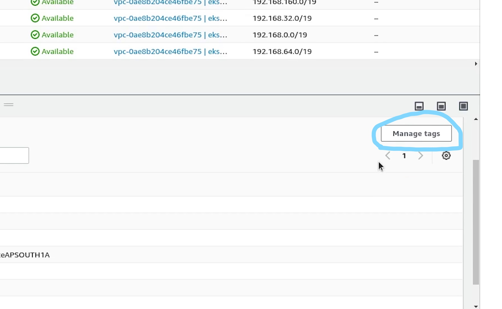
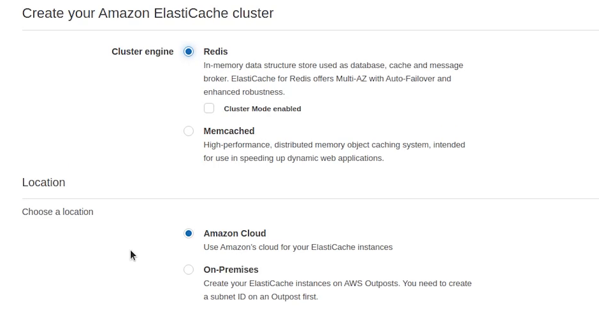

Hello everyone ! Welcome to PyCharm FastAPI Tutorial Series.

In this tutorial we will be deploying our application in AWS using the 
[Elastic Kubernetes Service(EKS)](https://aws.amazon.com/eks/) along-with setting up domain with SSL.


Make sure before proceeding, you have installed the [AWS Command Line](https://aws.amazon.com/cli/) application.


# eksctl

There is one more application we need to install in our system and that is **eksctl**. It is the official command line
tool for EKS and helps in managing clusters in EKS, developed by [WeaveWorks](https://www.weave.works/) and written in **Go**.

Make sure you have both **kubectl** and **eksctl** in your system, and also we expect from the audience 
they have previous working experience in AWS.


I am going to skip the installation steps, as it has clearly been provided in the aws & eksctl documentation. You can
follow that easily or there are tons of articles available on how to do that.


References : 
- [https://eksctl.io/](https://eksctl.io/)
- [https://docs.aws.amazon.com/eks/latest/userguide/eksctl.html](https://docs.aws.amazon.com/eks/latest/userguide/eksctl.html)


# IAM User

Coming back to [AWS Management Console](https://aws.amazon.com/console/), I will create an administrative user
from which we are going to access all our AWS Services. I generally **don’t recommend** this approach when you are
working in a production or sensitive environment, kindly follow the principle of the **least** privilege.


I will goto IAM and create a new user with **AdministratorAccess**.


I have already created the new user, I just need to create the access key. Now, I need to set up these keys in my AWS CLI.


I will open up my terminal and type: **aws configure**.


After that I will provide access key, secret access key and region name set to ap-south-1

We have successfully configured.


# Elastic Container Registry (ECR)

Next, we will go to ECR which is the [Elastic Container Registry](https://aws.amazon.com/ecr/). We will push our 
docker image to our ECR repository. I am actually trying to cover the use case when some people out
there want to work with a private registry instead of using a public registry like DockerHub.

I will create a repository and name it  **fastapi-ecommerce*. Visibility is going to be **private**.


Repository is created, let me push the docker image to ECR. But before pushing we need to authenticate
our credentials and after that only we would be able to push the image to AWS.


Once you open the repository, on the top right you will see a link appearing **“View push commands”**. I am going to
click on that.


I will copy the first line and execute in the terminal.


Login Succeeded. Now, build the image then tag it and finally push.


The image has been successfully pushed, let me verify in the console.

Yes, the image is appearing now and the total size is around 179 MB.


# Key Pairs

Now, I will create a private key **PEM** file, which will be used to get inside the EC2 machine. We won’t be 
getting inside any particular instance, as we will be handling everything through Kubernetes.  But this can be
used for many kinds of scenarios like debugging, checking something particular in the machine.

I will open **Key Pairs** which are going to appear in the **EC2 Dashboard** under **Network & Security**.


I will name the key pair as **fastapi-demo**. 


# Cluster

I will come back to PyCharm and create a directory called **eks**.


I will create a new file and name it **cluster.yml**.

We are going to create a three node cluster and the good part is the **[control plane](https://kubernetes.io/docs/concepts/overview/components/)** is taken care of by AWS itself.

Just for your  information EKS is not a free service. You pay **$0.10** per hour for each Amazon EKS cluster
that you create even if you don’t use it and separate cost of instances which are acting as nodes; their costs
are different based on instance types.

These are expensive services, make sure you have some credits before going ahead.


**cluster.yml**

```yaml
# If a nodegroup includes the attachPolicyARNs it must also include the default node policies,
# like AmazonEKSWorkerNodePolicy, AmazonEKS_CNI_Policy and AmazonEC2ContainerRegistryReadOnly.

apiVersion: eksctl.io/v1alpha5
kind: ClusterConfig
metadata:
  name: fastapi-demo
  region: ap-south-1
  version: "1.21"
managedNodeGroups:
  - name: fastapi-private-ng
    instanceType: t3a.small
    desiredCapacity: 3
    minSize: 3
    maxSize: 6
    volumeType: gp3
    volumeSize: 20
    privateNetworking: true
    iam:
      attachPolicyARNs:  # Reference : https://eksctl.io/usage/iam-policies/
        - arn:aws:iam::<REPLACE_THIS_NUMBER>:policy/SES_EKS_Policy   # <-- custom policy
        - arn:aws:iam::aws:policy/AmazonEKSWorkerNodePolicy
        - arn:aws:iam::aws:policy/AmazonEC2ContainerRegistryReadOnly
      withAddonPolicies:
        autoScaler: true
        imageBuilder: true
        albIngress: true
        externalDNS: true
        certManager: true
    ssh:
      allow: true
      publicKeyName: "fastapi-demo" # <-- ssh key name
```


Coming back to the code, you can ignore the yellow highlight which is coming up. This is because of the
eksctl configuration and the kubernetes plugin is not able to identify it, completely normal nothing to worry.


Let me explain quickly what we are trying to do.


We are going to create a Kubernetes cluster running **1.21** version, and it will be deployed in **ap-south-1** region.

Next we are creating the managed nodegroup. With Amazon EKS managed node groups, you don’t need to separately
provision or register the Amazon EC2 instances that provide compute capacity to run your Kubernetes applications. You
can create, automatically update, or terminate nodes for your cluster with a single operation, applications stay available.


You can go ahead and also create **unmanaged nodegroups** if you prefer that. We will be creating three ec2
instances and the instance type is going to be **t3a.small** also we are allocating a gp3 volume type of size 20 GB. Amazon EBS
gp3 volumes are the latest generation of general-purpose SSD.

Observe line number 16, **privateNetworking** set to true. This basically means our nodes can’t be accessed
publicly and all the ec2 instances will communicate over the private network. It’s not only EC2 even
if you can create Spot Instances or go serverless like [Fargate](https://aws.amazon.com/fargate/).


Next, observe line number 18 we are using the **attachPolicyARNs**. There are 4 policies which we have added to work
smoothly with the cluster. 

If a nodegroup includes the **attachPolicyARNs** it must also include the default node policies, like :

- ```AmazonEKSWorkerNodePolicy```
- ```AmazonEKS_CNI_Policy``` 
- ```AmazonEC2ContainerRegistryReadOnly```


Carefully observe line number 19 the ```SES EKS Policy```, this is not the default policy, 
instead it’s a custom policy which we have created to grant permission to send email through SES. Hang tight, 
I will show you in a while. Your ARN number is going to be different so make to sure replace that otherwise the
cluster creation will fail.


You can observe we have provided ses access to send email.


We are also using some add-on policies like auto-scaling, image builder which allows 
for full ECR (Elastic Container Registry) access along with certificate manager for 
managing ssl certificate and ALB Ingress referring to application load balancer.


And finally ssh access to nodes set to true and reference to the private key name **fastapi-demo** which we created earlier.


There are plenty more add-on policies which you can add based on your requirements, do check the eksctl official documentation. 

Let’s now go ahead and create the cluster.

Open up the terminal and move inside the **eks** directory.


I will type:

```bash
eksctl create cluster -f cluster.yml --auto-kubeconfig
```

* ```auto-kubeconfig``` is going to save the config file under the directory ```.kube/eksctl/clusters```
* The filename will be set as the cluster name which you have provided
* Cluster creation process will take somewhere around 15-20 minutes


The cluster has been successfully created. 


Now, I am going to copy the kubeconfig file **fastapi-demo** to our **eks** directory.


Let me check the number of nodes by passing the kubeconfig fastapi-demo.

```bash
kubectl get nodes --kubeconfig=fastapi-demo
```


You can observe three nodes are running and the operating system is backed by **Amazon Linux 2**. The nodes are
completely private, you can observe the internal IP and there is no external IP exposed.

# OIDC

Next, we are going to approve the OIDC provider.  To use IAM roles for service accounts, 
an IAM OIDC provider must exist for your cluster.

User authentication for Amazon EKS clusters can also be performed from [OpenID Connect](https://openid.net/connect/) (OIDC) Identity Provider (IDP). This
feature allows customers to integrate an OIDC identity provider with a new or existing Amazon EKS cluster running 
Kubernetes version 1.16 or later. The OIDC IDP can be used as an alternative to, or along with 
AWS Identity and Access Management (IAM). 

I am going to type : 

```bash
eksctl utils associate-iam-oidc-provider --region ap-south-1 --cluster fastapi-demo --approve
```

Reference:
- [https://docs.aws.amazon.com/eks/latest/userguide/enable-iam-roles-for-service-accounts.html](https://docs.aws.amazon.com/eks/latest/userguide/enable-iam-roles-for-service-accounts.html)


The OIDC provider is successfully created.


# Postgres

Next, we are going to create a Security Group for Postgres database, this will be required 
when we will be launching the RDS database.


I will goto **VPC** and then under **Security** you will find **Security Groups**.


I am going to provide a name and description. I will choose **fastapi-demo-cluster** as my vpc, this VPC is created by the EKS.


Under **Inbound Rules**, I will select Postgres which will be running on port 5432 
and IP access will be set to anywhere. It does not matter because the cluster nodes are in private mode, so we
won’t be able to access the database publicly.


Next we will move to RDS where we will be creating our **Subnet Group**.


I will be providing the VPC subnet private IP addresses from the  three availability zones:

- ap-south-1a
- ap-south-1b
- ap-south-1c


Our subnet group is created, now we will go ahead and complete the process of creating a new database.


Creation method is going to be **standard create** and the engine will be **Postgres** and the version which
we are going to use is **10.17**


DB instance identifier will be set to **sampledb**. Username is going to be **postgres**, and I will provide the 
master password.


DB instances will be **t2.micro**, we need to be in control of our costs.

We will disable the storage autoscaling.


Under **Connectivity**, choose **fastapi-demo** cluster, and automatically it has picked our custom rds eks db subnet group.

Public access will be set to No. Kind of extra precaution no one can access our db instance outside our cluster.


Next, I will be choosing the Security Group which we created earlier.


Under **Additional Configuration**, I am going to provide the database name. 


Disable backup, performance insights, maintenance and monitoring. As this is not a production setup , we can skip this.


Everything looks good, I am going to click on **Create database**.


It will take a few minutes to initialize our new db. We will come back to this later.

## 

# RBAC

Coming back to the PyCharm Terminal, I am going to create the role based access control (RBAC) for our ingress controller.

A **RoleBinding** grants permissions within a specific namespace whereas a **ClusterRoleBinding** grants that access cluster-wide.


```bash
kubectl apply -f https://raw.githubusercontent.com/kubernetes-sigs/aws-alb-ingress-controller/master/docs/examples/rbac-role.yaml
```

**eks/utils/rbac-role.yml**

```yaml
---
apiVersion: rbac.authorization.k8s.io/v1
kind: ClusterRole
metadata:
  labels:
    app.kubernetes.io/name: alb-ingress-controller
  name: alb-ingress-controller
rules:
  - apiGroups:
      - ""
      - extensions
    resources:
      - configmaps
      - endpoints
      - events
      - ingresses
      - ingresses/status
      - services
      - pods/status
    verbs:
      - create
      - get
      - list
      - update
      - watch
      - patch
  - apiGroups:
      - ""
      - extensions
    resources:
      - nodes
      - pods
      - secrets
      - services
      - namespaces
    verbs:
      - get
      - list
      - watch
---
apiVersion: rbac.authorization.k8s.io/v1
kind: ClusterRoleBinding
metadata:
  labels:
    app.kubernetes.io/name: alb-ingress-controller
  name: alb-ingress-controller
roleRef:
  apiGroup: rbac.authorization.k8s.io
  kind: ClusterRole
  name: alb-ingress-controller
subjects:
  - kind: ServiceAccount
    name: alb-ingress-controller
    namespace: kube-system
---
apiVersion: v1
kind: ServiceAccount
metadata:
  labels:
    app.kubernetes.io/name: alb-ingress-controller
  name: alb-ingress-controller
  namespace: kube-system
...
```

Kubernetes [service accounts](https://kubernetes.io/docs/tasks/configure-pod-container/configure-service-account/) are Kubernetes resources, 
created and managed using the Kubernetes API, meant to be used by in-cluster Kubernetes-created entities, such as Pods, 
to authenticate to the Kubernetes API server or external services.

Reference:
- [https://kubernetes.io/docs/reference/access-authn-authz/rbac/](https://kubernetes.io/docs/reference/access-authn-authz/rbac/)


Next, I will go to IAM and create an **AWS Load Balancer Policy**.


I already have the IAM policy file, you can take it directly from my repository placed under the EKS directory, simply I will copy and paste the JSON.

**eks/utils/iam-policy.json**

```json
{
"Version": "2012-10-17",
"Statement": [
{
"Effect": "Allow",
"Action": [
"acm:DescribeCertificate",
"acm:ListCertificates",
"acm:GetCertificate"
],
"Resource": "*"
},
{
"Effect": "Allow",
"Action": [
"ec2:AuthorizeSecurityGroupIngress",
"ec2:CreateSecurityGroup",
"ec2:CreateTags",
"ec2:DeleteTags",
"ec2:DeleteSecurityGroup",
"ec2:DescribeAccountAttributes",
"ec2:DescribeAddresses",
"ec2:DescribeInstances",
"ec2:DescribeInstanceStatus",
"ec2:DescribeInternetGateways",
"ec2:DescribeNetworkInterfaces",
"ec2:DescribeSecurityGroups",
"ec2:DescribeSubnets",
"ec2:DescribeTags",
"ec2:DescribeVpcs",
"ec2:ModifyInstanceAttribute",
"ec2:ModifyNetworkInterfaceAttribute",
"ec2:RevokeSecurityGroupIngress"
],
"Resource": "*"
},
{
"Effect": "Allow",
"Action": [
"elasticloadbalancing:AddListenerCertificates",
"elasticloadbalancing:AddTags",
"elasticloadbalancing:CreateListener",
"elasticloadbalancing:CreateLoadBalancer",
"elasticloadbalancing:CreateRule",
"elasticloadbalancing:CreateTargetGroup",
"elasticloadbalancing:DeleteListener",
"elasticloadbalancing:DeleteLoadBalancer",
"elasticloadbalancing:DeleteRule",
"elasticloadbalancing:DeleteTargetGroup",
"elasticloadbalancing:DeregisterTargets",
"elasticloadbalancing:DescribeListenerCertificates",
"elasticloadbalancing:DescribeListeners",
"elasticloadbalancing:DescribeLoadBalancers",
"elasticloadbalancing:DescribeLoadBalancerAttributes",
"elasticloadbalancing:DescribeRules",
"elasticloadbalancing:DescribeSSLPolicies",
"elasticloadbalancing:DescribeTags",
"elasticloadbalancing:DescribeTargetGroups",
"elasticloadbalancing:DescribeTargetGroupAttributes",
"elasticloadbalancing:DescribeTargetHealth",
"elasticloadbalancing:ModifyListener",
"elasticloadbalancing:ModifyLoadBalancerAttributes",
"elasticloadbalancing:ModifyRule",
"elasticloadbalancing:ModifyTargetGroup",
"elasticloadbalancing:ModifyTargetGroupAttributes",
"elasticloadbalancing:RegisterTargets",
"elasticloadbalancing:RemoveListenerCertificates",
"elasticloadbalancing:RemoveTags",
"elasticloadbalancing:SetIpAddressType",
"elasticloadbalancing:SetSecurityGroups",
"elasticloadbalancing:SetSubnets",
"elasticloadbalancing:SetWebAcl"
],
"Resource": "*"
},
{
"Effect": "Allow",
"Action": [
"iam:CreateServiceLinkedRole",
"iam:GetServerCertificate",
"iam:ListServerCertificates"
],
"Resource": "*"
},
{
"Effect": "Allow",
"Action": [
"cognito-idp:DescribeUserPoolClient"
],
"Resource": "*"
},
{
"Effect": "Allow",
"Action": [
"waf-regional:GetWebACLForResource",
"waf-regional:GetWebACL",
"waf-regional:AssociateWebACL",
"waf-regional:DisassociateWebACL"
],
"Resource": "*"
},
{
"Effect": "Allow",
"Action": [
"tag:GetResources",
"tag:TagResources"
],
"Resource": "*"
},
{
"Effect": "Allow",
"Action": [
"waf:GetWebACL"
],
"Resource": "*"
},
{
"Effect": "Allow",
"Action": [
"wafv2:GetWebACL",
"wafv2:GetWebACLForResource",
"wafv2:AssociateWebACL",
"wafv2:DisassociateWebACL"
],
"Resource": "*"
},
{
"Effect": "Allow",
"Action": [
"shield:DescribeProtection",
"shield:GetSubscriptionState",
"shield:DeleteProtection",
"shield:CreateProtection",
"shield:DescribeSubscription",
"shield:ListProtections"
],
"Resource": "*"
}
]
}
```


There is a warning coming up in the visual editor, I will remove elb and add it again.


As you can see I am specifying resources to all resources, but it’s prompting me as a best practice, define permissions
for only specific resources. 

I completely agree to that point, as this is a tutorial I am not getting 
too strict but **please follow the concept of the least privilege**.


# IAM Service Account

Next, I am going to create **iam service account**. You can associate an IAM role with a Kubernetes service account. This
service account can then provide AWS permissions to the containers in any pod that uses that service account.

Reference:
- [https://docs.aws.amazon.com/eks/latest/userguide/iam-roles-for-service-accounts.html](https://docs.aws.amazon.com/eks/latest/userguide/iam-roles-for-service-accounts.html)


```bash
eksctl create iamserviceaccount \
--region ap-south-1 \
--name alb-ingress-controller \
--namespace kube-system \
--cluster fastapi-demo \
--attach-policy-arn <YOUR_POLICY_ARN> \
--override-existing-serviceaccounts \
--approve
```

I will copy the policy ARN and replace it.


The IAM service account is created, let me verify that.


You can see one role has been successfully attached. You can check this role is present under Roles in the IAM Console.


# Ingress Controller

I will go ahead and create the **ingress controller**. An Ingress controller is a specialized load balancer
for Kubernetes (and other containerized) environments. It abstracts away the complexity of Kubernetes application
traffic routing and provides a bridge between Kubernetes services and external ones.


Reference : 
- [https://kubernetes-sigs.github.io/aws-load-balancer-controller/](https://kubernetes-sigs.github.io/aws-load-balancer-controller/)
- [https://aws.amazon.com/blogs/opensource/kubernetes-ingress-aws-alb-ingress-controller/](https://aws.amazon.com/blogs/opensource/kubernetes-ingress-aws-alb-ingress-controller/)


You can check out the website for more information related to deployment, configuration etc. 

This project was formerly known as **"AWS ALB Ingress Controller"**, and later rebranded to **"AWS Load Balancer Controller"**.


I will go ahead and apply the ingress controller.  A copy of this controller file is placed in my repository you can check for more reference.

```bash
$ kubectl apply -f https://raw.githubusercontent.com/kubernetes-sigs/aws-alb-ingress-controller/master/docs/examples/alb-ingress-controller.yaml --kubeconfig=<PATH_TO_CONFIG_FILE>

# Replace kubeconfig with fastapi-demo
$ kubectl apply -f https://raw.githubusercontent.com/kubernetes-sigs/aws-alb-ingress-controller/master/docs/examples/alb-ingress-controller.yaml --kubeconfig=fastapi-demo
```

**eks/utils/alb-ingress-controller.yaml**

```yaml
# Application Load Balancer (ALB) Ingress Controller Deployment Manifest.
# This manifest details sensible defaults for deploying an ALB Ingress Controller.
# GitHub: https://github.com/kubernetes-sigs/aws-alb-ingress-controller
apiVersion: apps/v1
kind: Deployment
metadata:
  labels:
    app.kubernetes.io/name: alb-ingress-controller
  name: alb-ingress-controller
  # Namespace the ALB Ingress Controller should run in. Does not impact which
  # namespaces it's able to resolve ingress resource for. For limiting ingress
  # namespace scope, see --watch-namespace.
  namespace: kube-system
spec:
  selector:
    matchLabels:
      app.kubernetes.io/name: alb-ingress-controller
  template:
    metadata:
      labels:
        app.kubernetes.io/name: alb-ingress-controller
    spec:
      containers:
        - name: alb-ingress-controller
          args:
            # Limit the namespace where this ALB Ingress Controller deployment will
            # resolve ingress resources. If left commented, all namespaces are used.
            # - --watch-namespace=your-k8s-namespace

            # Setting the ingress-class flag below ensures that only ingress resources with the
            # annotation kubernetes.io/ingress.class: "alb" are respected by the controller. You may
            # choose any class you'd like for this controller to respect.
            - --ingress-class=alb

            # REQUIRED
            # Name of your cluster. Used when naming resources created
            # by the ALB Ingress Controller, providing distinction between
            # clusters.
            # - --cluster-name=devCluster

            # AWS VPC ID this ingress controller will use to create AWS resources.
            # If unspecified, it will be discovered from ec2metadata.
            # - --aws-vpc-id=vpc-xxxxxx

            # AWS region this ingress controller will operate in.
            # If unspecified, it will be discovered from ec2metadata.
            # List of regions: http://docs.aws.amazon.com/general/latest/gr/rande.html#vpc_region
            # - --aws-region=us-west-1

            # Enables logging on all outbound requests sent to the AWS API.
            # If logging is desired, set to true.
            # - --aws-api-debug

            # Maximum number of times to retry the aws calls.
            # defaults to 10.
            # - --aws-max-retries=10
          env:
            # AWS key id for authenticating with the AWS API.
            # This is only here for examples. It's recommended you instead use
            # a project like kube2iam for granting access.
            # - name: AWS_ACCESS_KEY_ID
            #   value: KEYVALUE

            # AWS key secret for authenticating with the AWS API.
            # This is only here for examples. It's recommended you instead use
            # a project like kube2iam for granting access.
            # - name: AWS_SECRET_ACCESS_KEY
            #   value: SECRETVALUE
          # Repository location of the ALB Ingress Controller.
          image: docker.io/amazon/aws-alb-ingress-controller:v1.1.9
      serviceAccountName: alb-ingress-controller
```

Ingress Controller has been created, but we need to update some config which is basically the cluster name.

I am directly going to live edit the deployment file, the default editor which is picked is vim, but I am using nano, 
completely your choice. To use your favorite editor by default, set the environment variable **KUBE_EDITOR**, even you can use sublime text, notepad etc.


The controller is deployed in the **kube-system** namespace.

Under spec, I will provide the cluster name **fastapi-demo**.


Save and exit.

I will verify whether the controller is running or not. 


Looks fine. 

# Subnet Discovery

Next, after the controller we need to tag our subnets for subnet discovery by the load balancer.

For more information, visit the below link :
- [https://aws.amazon.com/premiumsupport/knowledge-center/eks-vpc-subnet-discovery/](https://aws.amazon.com/premiumsupport/knowledge-center/eks-vpc-subnet-discovery/)

I will tag all the subnets. The **shared** value allows more than one cluster to use the subnet.





Once, we are done with tagging all subnets, I will come back to RDS to check the status.


# K8s Manifests

The db is now available. I am going to copy the **endpoint**. But before that I will 
create a folder called **“deploy”** under **eks**.


I am going to create a new file and name it **db-service.yml**.


We are going to create an **ExternalName** Service.

**eks/deploy/rds/db-service.yml**

```yaml
apiVersion: v1
kind: Service
metadata:
  name: postgres-service
spec:
  type: ExternalName
  externalName:  <RDS_ENDPOINT_URL>
```

Services with type **ExternalName** work as other regular services, but when you want to access that service name,
instead of returning cluster ip of this service, it returns **CNAME** record with value that is mentioned in externalName
which in this case is the RDS endpoint.


I will be doing the same operation for Redis as well. For redis 
we will be using the **[ElastiCache](https://aws.amazon.com/elasticache/)** service provided by AWS.


Service name is going to be redis service, and I will come back and replace the external name.


**eks/deploy/elasticache/redis-service.yml**

```yaml
apiVersion: v1
kind: Service
metadata:
  name: redis-service
spec:
  type: ExternalName
  externalName:  <ELASTICACHE_ENDPOINT_URL>
```

Let’s go to **ElastiCache** and create our redis instance.




Same as usual I will create a private subnet group for redis (**redis-eks-subnetgroup**), the same we did for postgres. We are not covering this, if 
you have any confusion then follow the postgres private subnet setup. It's going to be same for elasticache as well.


I also need to create a custom security group for redis.


I will choose the version **5.0.6**

Make sure the node type is **t2.micro**, elasticache is an expensive service, be careful with that. 

Set replicas to 1 and uncheck Multi-AZ. Encryption I am leaving it as unchecked, completely your choice.


Backups are not required for this tutorial.

I will click on **Create**, and it’s going to take some time to initialize.


Okay, redis is now available.

I will copy the endpoint and replace it in the external name service.


I will copy the other services which we have done earlier when working with kubernetes locally and there is no change in that.

I need to replace the image url and this time we will be pointing to ECR Container Registry url instead of DockerHub.

**eks/deploy/code/deployment.yml**

```yaml
apiVersion: apps/v1
kind: Deployment
metadata:
  name: ecommerce-deployment
  labels:
    app: ecommerce
spec:
  replicas: 1
  selector:
    matchLabels:
      app: ecommerce-app
  template:
    metadata:
      labels:
        app: ecommerce-app
    spec:
      containers:
        - image: 254501641575.dkr.ecr.ap-south-1.amazonaws.com/fastapi-ecommerce:latest # replace with ECR
          imagePullPolicy: Always
          name: sample-container
          envFrom:
          - secretRef:
              name: ecommerce-secret
          ports:
            - containerPort: 5000
              name: fastapi
          readinessProbe:
            httpGet:
              port: 5000
              path: /docs
            initialDelaySeconds: 15
          livenessProbe:
            httpGet:
              port: 5000
              path: /docs
            initialDelaySeconds: 15
            periodSeconds: 15
```

**eks/deploy/code/service.yml**

```yaml
apiVersion: v1
kind: Service
metadata:
  name: ecommerce-service
  labels:
    app: ecommerce
spec:
  type: NodePort
  selector:
    app: ecommerce-app
  ports:
    - port: 5000
      targetPort: 5000
```

The service file will be running on port 5000, and you can see this needs to be a **NodePort** 
not cluster IP because traffic reaching the ALB (Application Load Balancer) is routed to NodePort
for your Service and then proxied to your pods.

**eks/deploy/code/secret.yml**

```yaml
apiVersion: v1
kind: Secret
metadata:
  name: ecommerce-secret
  labels:
    app: ecommerce
data:
  DATABASE_USERNAME: cG9zdGdyZXM=                 # postgres
  DATABASE_PASSWORD: bXVrdWwxMjM=                 # mukul123
  DATABASE_HOST: cG9zdGdyZXMtc2VydmljZQ==         # postgres-service
  DATABASE_NAME: c2FtcGxl                         # sample
  REDIS_HOST: cmVkaXMtc2VydmljZQ==                # redis-service
  REDIS_PORT: NjM3OQ==                            # 6379
  REDIS_DB: MA==                                  # 0
```

**eks/deploy/celery/deployment.yml**

```yaml
apiVersion: apps/v1
kind: Deployment
metadata:
  name: celery-deployment
  labels:
    app: ecommerce
spec:
  replicas: 1
  selector:
    matchLabels:
      app: celery-app
  template:
    metadata:
      labels:
        app: celery-app
    spec:
      containers:
        - image: 254501641575.dkr.ecr.ap-south-1.amazonaws.com/fastapi-ecommerce:latest
          command: ['celery', '-A', 'main.celery', 'worker', '-l', 'info']
          envFrom:
            - secretRef:
                name: celery-secret
          name: celery-container
```

**eks/deploy/celery/secret.yml**

```yaml
apiVersion: v1
kind: Secret
metadata:
  name: celery-secret
  labels:
    app: ecommerce
data:
  REDIS_HOST: cmVkaXMtc2VydmljZQ==      # redis-service
  REDIS_PORT: NjM3OQ==                  # 6379
  REDIS_DB: MA==                        # 0
```

**eks/deploy/job/migration.yml**

```yaml
apiVersion: batch/v1
kind: Job
metadata:
  name: fastapi-migrations
spec:
  template:
    spec:
      containers:
        - name: migration-container
          image: 254501641575.dkr.ecr.ap-south-1.amazonaws.com/fastapi-ecommerce:latest
          command: ['alembic', 'upgrade', 'head']
          envFrom:
            - secretRef:
                name: ecommerce-secret
      restartPolicy: Never
  backoffLimit: 3
```

## Ingress

Next, we are going to create an ingress, this is something which we did not do in our local system but indeed we 
need it here. In Kubernetes, an Ingress is an **object that allows access to your Kubernetes services from outside
the Kubernetes cluster** typically via HTTPS/HTTP. With Ingress, you can easily set up rules for routing traffic
without creating a bunch of Load Balancers or exposing each service on the node.   


From the point of view of a Kubernetes pod, **ingress** is incoming traffic to the pod, and **egress** is outgoing 
traffic from the pod.

As you can observe from the file, carefully see the data being passed in the annotations.

These are a few values you must have definitely observed when you have created an Application Load Balancer in AWS.

**eks/deploy/ingress/ingress.yml**

```yaml
apiVersion: extensions/v1beta1
kind: Ingress
metadata:
  name: ingress-ecommerce-service
  labels:
    app: ecommerce
  annotations:
    kubernetes.io/ingress.class: "alb"
    alb.ingress.kubernetes.io/scheme: internet-facing
    alb.ingress.kubernetes.io/healthcheck-protocol: HTTP
    alb.ingress.kubernetes.io/healthcheck-port: traffic-port
    alb.ingress.kubernetes.io/healthcheck-interval-seconds: '15'
    alb.ingress.kubernetes.io/healthcheck-timeout-seconds: '5'
    alb.ingress.kubernetes.io/success-codes: '200'
    alb.ingress.kubernetes.io/healthy-threshold-count: '2'
    alb.ingress.kubernetes.io/unhealthy-threshold-count: '2'
    alb.ingress.kubernetes.io/listen-ports: '[{"HTTPS":443}, {"HTTP":80}]'
    alb.ingress.kubernetes.io/certificate-arn: <REPLACE_CERTIFICATE_ARN>
    alb.ingress.kubernetes.io/ssl-policy: ELBSecurityPolicy-TLS-1-2-Ext-2018-06
    alb.ingress.kubernetes.io/actions.ssl-redirect: '{"Type": "redirect", "RedirectConfig": { "Protocol": "HTTPS", "Port": "443", "StatusCode": "HTTP_301"}}'
spec:
  rules:
    - http:
        paths:
          - path: /*
            backend:
              serviceName: ssl-redirect
              servicePort: use-annotation
          - path: /*
            backend:
              serviceName: ecommerce-service
              servicePort: 5000
```

We are doing some health checks and looking for a success response code of 200.

The listening ports are 80 and 443.

Observing line number 18, we need to replace the certificate ARN and for that we need to create a 
new certificate in **[AWS Certificate Manager](https://aws.amazon.com/certificate-manager/)**. We are going to do
it in a while.


Under **Rules** we are performing two operations, one is the SSL redirection which is being taken from the annotation
as mentioned in line number 20.


Next, we will be sending the traffic to our **ecommerce-service** which is running on port **5000** which indeed points
to FastAPI backend.

Just imagine in your head that NGINX is proxying requests internally 
to your backend service. This is what we are trying to achieve through the ingress.

You can also perform path based routing and redirect applications to different services based on the path.

Let me now deploy the kubernetes manifests except the ingress.

I will open up the terminal and move inside the eks directory.

Just to clarify I have deployed these manifests in the default namespace, completely up to you. If you want a 
separate namespace you can go ahead with that.


Celery and backend are running fine, and we don’t need to worry about postgres and redis as they 
are managed services provided by AWS.

We are having enough resources, let’s try to run six replicas of our backend service.


Six pods are running completely fine.

Now, let’s run the migration job.


Migration is completed. It was quite fast.

We are not using the **[ttlSecondsAfterFinished](https://kubernetes.io/docs/concepts/workloads/controllers/job/#clean-up-finished-jobs-automatically)**. If we use that then after a certain amount of seconds the job will be automatically removed.

Reference:
- [Automatic Clean-up for Finished Jobs](https://kubernetes.io/docs/concepts/workloads/controllers/ttlafterfinished/)

