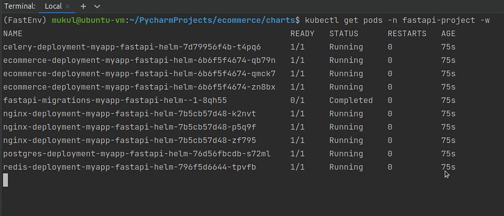
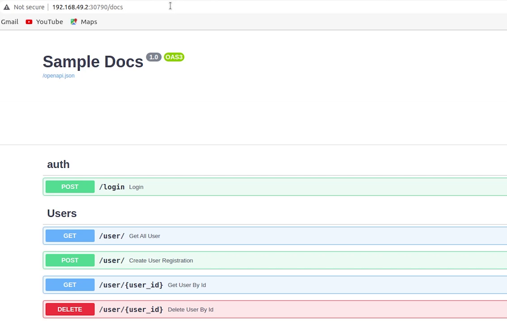

Hello everyone! Welcome to the PyCharm FastAPI Tutorial Series.


# Helm
In this tutorial we will be working with Helm. In simple terms, [Helm](https://helm.sh/) is a package manager for Kubernetes. It is a tool
that streamlines installing and managing Kubernetes applications. Think of it like ```Apt/Yum/Homebrew``` for K8s.

*Note: I will be showing a high-level use case of Helm. We won’t be getting deeper dive into Helm*


# Installation

So, let’s begin by installing Helm.


I will go to the official website of Helm that is [helm.sh](https://helm.sh/).


I will click on **Get Started**.

I will click on **Installing Helm** under **Introduction**.


As you can see there are multiple flavours of installing Helm. Either you can install directly from the 
binary, scripts, apt, or homebrew etc.


I am using **Ubuntu**, so I will follow the apt installation commands.


```bash
curl https://baltocdn.com/helm/signing.asc | sudo apt-key add -
sudo apt-get install apt-transport-https --yes
echo "deb https://baltocdn.com/helm/stable/debian/ all main" | sudo tee /etc/apt/sources.list.d/helm-stable-debian.list
sudo apt-get update
sudo apt-get install helm
```

Reference: [https://helm.sh/docs/intro/install/](https://helm.sh/docs/intro/install/)

Okay, we have successfully installed Helm.


# Repository

We are going to work with Helm Charts. Helm Charts are simply Kubernetes YAML manifests 
combined into a single package that can be advertised to your Kubernetes clusters.

Obviously, we need to store these charts and that is where we look for a Helm repository. At a high level, 
a chart repository is a location where packaged charts can be stored and shared. The official chart repository is 
maintained by the Helm Charts.

### Private Repositories

You can store charts in private repositories like in **Amazon S3** or **GithubPages**.


You will find all the helm charts in [Artifact Hub](https://artifacthub.io/).


Let me try to check for the **NGINX** package.


As you can see there are multiple charts for NGINX. Some have been uploaded by organizations and 
some by users. You can filter them out based on **verified publishers** or **official providers**.

# Installing NGINX Chart

This is how we are going to follow the installation steps.


```bash
helm repo add bitnami https://charts.bitnami.com/bitnami
helm install my-release bitnami/nginx
```

First, we are going to add the bitnami repository, and then we will install the helm chart and name it as **first-release**.

Let’s move to PyCharm, I will show a quick walk through how it works.

We have added the repository successfully. 


For getting a list of repositories, I am going to type: 

```bash
helm repo list
```


This is going to return the list of repositories present in our system.


Once you have added a repository we can search for various software packages provided by **[Bitnami](https://bitnami.com/)**.

We are going to search for [Drupal](https://www.drupal.org/) which is also packaged by Bitnami. Drupal is 
an “out of the box” web content management tool as well as a customizable platform. It is an Open Source CMS.

I will type: 

```bash
helm search repo drupal
```


You can observe we got the latest version of Drupal `9.2.7`.

**Chart Version** and **App Version** are completely different. App version is pointing to the stable version of Drupal.

I will try to search again but this time I will append **“--versions”** and it’s going to return a list of all Drupal versions.

```bash
helm search repo drupal --versions
```


You can install multiple versions of drupal simultaneously, and this is how Helm makes life easy for you.

Now, I will try to search for the NGINX package. As of this recording 1.21.3 is the current stable release for nginx.


I will move forward and install a nginx chart.

I will type the command: 

```bash
helm install my-release bitnami/nginx
```


Once a chart has been installed, you can check them by typing the command: 

```bash
helm list
```


Here the release name is **my-release**. When you use a chart reference with a repo prefix **(bitnami/nginx)**, Helm will
look in the local configuration for a chart repository named **'bitnami'**, and will then look for a chart in that 
repository whose name is **‘nginx'**.

As you can see the installation is complete and these are the few notes provided on how to check the application.


The app has been deployed in the default namespace, and it’s running on local port 80 and this is how you can get the service ip and service port.

I will type: 

```bash 
minikube service list
```

...which is going to provide me with the list of services running.


As you can see the **my-release-nginx** is running on port 30214. I am going to quickly check in the browser.


I will try to search for a different version of NGINX and try to install that.

We have the installed the latest stable release, I will go for an older release.

I will type the command: 

```bash
helm install my-release-2 bitnami/nginx --version 6.0.0
```

Version 6 is the chart version which indeed going to install the NGINX **1.19**.

As you can see there are two versions of NGINX running in parallel: one is 1.21.3 and the second is 1.19.0


If I now type: **minikube service list** I will get two different ports.

Even though we got 443, we are only concerned about port 80.


The latest release is running on port 30214 and the older release which is my-release-2-nginx is running on 30499.

So, this is the simplest use case of Helm. You can observe the benefits of using Helm Charts,  
also you can roll back or upgrade helm charts.

When you type: helm list it will provide a list of releases in the default namespace. You can 
also pass **all-namespaces** to get all releases present across namespaces.


You can also update the repository by typing:

```bash
helm repo update
```
Update gets the latest information about charts from the respective chart repositories. 


If you want to delete or remove the resources then you can type:

```bash
helm uninstall release
```
 
I am going to uninstall release 2 as well.


If I now type: **helm list** it will return empty. In the background Kubernetes will be clearing up the resources.


There is one more command called **helm history** which fetches release history.

Currently, we don’t have any release. Let me try to install nginx again.
 


I will type the command: 

```bash
helm history my-release
```


As of now, the revision is 1 and the app version deployed is 1.21.3 

In future when you will be doing an upgrade or rollback of your releases, this history command
will keep all the track of changes done.

If you want to read the instructions basically the notes then you can type: 

```bash
helm get notes my-release
```

It will provide a brief note about how to access your application.


So, these are a few of the benefits of using Helm.

# Creating Charts

Let’s move back to PyCharm and create a custom helm chart for our application.

I will create a directory under the root and name it **charts**.


I will open up my **Terminal** and go inside the directory.

I will type: 
```bash
create fastapi-helm
```

This is going to create a new chart.


Let me explain one by one.


### Chart.yaml

This file basically contains metadata about your chart.

The **apiVersion** is basically the chart api version which is v2 which is basically pointing to the Helm 3 version. 
If apiVersion is v1 it's basically telling that it uses previous versions of Helm.

**Description** is something optional. You can give brief information about your application.

Type of chart can be an **application** or **library** chart. As we are working on an application it’s going to be an application chart. 
According to Helm docs: *A library
chart is a type of Helm chart that defines chart primitives or definitions which can be shared by Helm templates in other charts. 
This allows users to share snippets of code that can be reused across charts, avoiding repetition and keeping charts DRY*.

**Version** is basically pointing towards the chart version and appVersion is basically the application version. 

Charts are identified using the version number, like in this example **0.1.0**.


### .helmignore

Next comes the helm ignore. Similar to gitignore , the **.helmignore** file is used to specify files you don't want to include in your helm chart. 


You can observe the empty chart directory. We are going to place all our dependent charts over here.

### templates

The **Template** folder contains all the Kubernetes manifest files. You can see they have provided sample manifests for nginx application, we are going to replace 
it with our manifest files which we have defined earlier when we were working with Kubernetes.


### _helpers.tpl


You are going to find a unique file called **_helpers.tpl**. This is basically a named template writing in Go Templating Language. 

A named template is also referred to as partial or a subtemplate.


Files whose name begins with an underscore **(_)** are actually rendered to Kubernetes object definitions, 
but are available everywhere within other chart templates for use.

The Helm client and library is written in the **Go programming language**. The library uses the Kubernetes client
library to communicate with Kubernetes.

### tests

We can also define tests in our helm charts. You can define as many as tests, and you can even create a test suite.


### values.yaml


And finally **values.yaml** file, it contains default values which are passed in Templates. You can dynamically
override this value when you are trying to install the chart which is quite helpful when CI/CD solutions.


As I said in the beginning we won’t be getting deep dive into Helm, for in-depth knowledge I would 
recommend following the official Helm documentation. 

# Replacing Charts

I have already created the Helm Charts for this tutorial, I am going to replace it with the default one.


As you can see we have replaced our files and these kubernetes 
manifest exactly similar to what we did in our previous video when working with Kubernetes.


The only difference is that we have parameterized those values like the namespace and app version. 

**charts/fastapi-helm/templates/nginx/nginx-deployment.yml**

```yaml
apiVersion: apps/v1
kind: Deployment
metadata:
  name: nginx-deployment-{{ include "fastapi-helm.fullname" . }}
  namespace: {{ .Release.Namespace }}
  labels:
    app: ecommerce
    version: {{ .Chart.AppVersion}}
spec:
  replicas: 8
  selector:
    matchLabels:
      app: ecommerce-nginx
  template:
    metadata:
      labels:
        app: ecommerce-nginx
    spec:
      containers:
        - image: "{{ .Values.nginxImage.repository }}:{{ .Values.nginxImage.tag | default .Chart.AppVersion }}"
          imagePullPolicy: {{ .Values.nginxImage.pullPolicy }}
          name: nginx-container
          ports:
            - containerPort: 80
          readinessProbe:
            httpGet:
              port: 80
              path: /docs
            initialDelaySeconds: 15
          livenessProbe:
            httpGet:
              port: 80
              path: /docs
            initialDelaySeconds: 15
            periodSeconds: 15
          volumeMounts:
            - name: nginx-config
              mountPath: /etc/nginx/conf.d/default.conf
              subPath: default.conf
      volumes:
        - name: nginx-config
          configMap:
            name: nginx-config-{{ include "fastapi-helm.fullname" . }}
```

As we have some memory constraints, I will pull down my memory and cpu consumption.

I have slightly modified the **Chart.yaml** file with basic information.

**charts/fastapi-helm/Chart.yaml**

```yaml
apiVersion: v2
name: fastapi-helm
description: A Helm chart for Kubernetes & FastAPI

# A chart can be either an 'application' or a 'library' chart.
#
# Application charts are a collection of templates that can be packaged into versioned archives
# to be deployed.
#
# Library charts provide useful utilities or functions for the chart developer. They're included as
# a dependency of application charts to inject those utilities and functions into the rendering
# pipeline. Library charts do not define any templates and therefore cannot be deployed.
type: application

# This is the chart version. This version number should be incremented each time you make changes
# to the chart and its templates, including the app version.
# Versions are expected to follow Semantic Versioning (https://semver.org/)
version: 0.1.0

# This is the version number of the application being deployed. This version number should be
# incremented each time you make changes to the application. Versions are not expected to
# follow Semantic Versioning. They should reflect the version the application is using.
# It is recommended to use it with quotes.
appVersion: "1.0.0"
```
Rest, I am not using **imagePullSecrets** or **ServiceAccounts**, So I am ignoring that.

**charts/fastapi-helm/values.yaml**

```yaml
# Default values for fastapi-helm.
# This is a YAML-formatted file.
# Declare variables to be passed into your templates.

replicaCount: 1

nginxImage:
  repository: nginx
  pullPolicy: IfNotPresent
  # Overrides the image tag whose default is the chart appVersion.
  tag: "1.21"

imagePullSecrets: []
nameOverride: ""
fullnameOverride: ""

serviceAccount:
  # Specifies whether a service account should be created
  create: true
  # Annotations to add to the service account
  annotations: {}
  # The name of the service account to use.
  # If not set and create is true, a name is generated using the fullname template
  name: ""

podAnnotations: {}

podSecurityContext: {}
  # fsGroup: 2000

securityContext: {}
  # capabilities:
  #   drop:
  #   - ALL
  # readOnlyRootFilesystem: true
  # runAsNonRoot: true
  # runAsUser: 1000

service:
  type: ClusterIP
  port: 80

ingress:
  enabled: false
  className: ""
  annotations: {}
    # kubernetes.io/ingress.class: nginx
    # kubernetes.io/tls-acme: "true"
  hosts:
    - host: chart-example.local
      paths:
        - path: /
          pathType: ImplementationSpecific
  tls: []
  #  - secretName: chart-example-tls
  #    hosts:
  #      - chart-example.local

resources: {}
  # We usually recommend not to specify default resources and to leave this as a conscious
  # choice for the user. This also increases chances charts run on environments with little
  # resources, such as Minikube. If you do want to specify resources, uncomment the following
  # lines, adjust them as necessary, and remove the curly braces after 'resources:'.
  # limits:
  #   cpu: 100m
  #   memory: 128Mi
  # requests:
  #   cpu: 100m
  #   memory: 128Mi


```

You can see how we import values through the templating syntax using the double curly braces.

**charts/fastapi-helm/templates/code/deployment.yml**

```yaml
apiVersion: apps/v1
kind: Deployment
metadata:
  name: ecommerce-deployment-{{ include "fastapi-helm.fullname" . }}
  namespace: {{ .Release.Namespace }}
  labels:
    app: ecommerce
    version: {{ .Chart.AppVersion}}
spec:
  replicas: 8
  selector:
    matchLabels:
      app: ecommerce-app
  template:
    metadata:
      labels:
        app: ecommerce-app
    spec:
      initContainers:
        - name: init-postgres-service
          image: postgres:10.17
          command: ['sh', '-c',
          'until pg_isready -h postgres-service.$(cat /var/run/secrets/kubernetes.io/serviceaccount/namespace).svc.cluster.local -p 5432;
          do echo waiting for database; sleep 2; done;']
      containers:
        - image: mukulmantosh/ecommerce-fastapi:latest
          imagePullPolicy: Always
          name: sample-container
          envFrom:
          - secretRef:
              name: ecommerce-secret-{{ include "fastapi-helm.fullname" . }}
          ports:
            - containerPort: 5000
              name: fastapi
          readinessProbe:
            httpGet:
              port: 5000
              path: /docs
            initialDelaySeconds: 15
          livenessProbe:
            httpGet:
              port: 5000
              path: /docs
            initialDelaySeconds: 15
            periodSeconds: 15
          resources:
            requests:
              memory: "512Mi"
              cpu: "0.5"
            limits:
              memory: "1Gi"
              cpu: "1"
```

As I said earlier, I have explicitly ignored parameterizing the ecommerce fastapi image, but you are free to do that.

I have done the same for Secret. As you see I have parameterized only a few things, but you have power to even customize the port number as well.

All the chart files are already committed in my [source code](https://github.com/mukulmantosh/FastAPI_EKS_Kubernetes/), and you can directly check it out on GitHub.


# Installing Custom Chart

Let’s now try to install the custom helm chart which we have defined.

I will open up my **Terminal** and move inside the **charts** folder.

I will type: 

```bash
helm install myapp fastapi-helm 
```
I will provide the namespace. Even if you don’t have the specific namespace, nothing to worry you can 
directly create the namespace through Helm itself by passing **--create-namespace**.


* Make sure before installing have a look into this file and update accordingly.

**charts/fastapi-helm/templates/postgres/postgres-pv.yml**

```yaml

  local:
    path: /run/desktop/mnt/host/e/postgres-data   # <-- if running with Docker desktop in windows
  nodeAffinity:
    required:
      nodeSelectorTerms:
        - matchExpressions:
            - key: kubernetes.io/hostname
              operator: In
              values:
                - docker-desktop    # <-- name of the node (docker-desktop, eks, minikube) etc.
```


Great! Chart has been installed. As you can see in the screen the instruction is coming from the **NOTES.txt** file. 
This file does not get installed.


Very minimalist information I have provided.

**charts/fastapi-helm/templates/NOTES.txt**

```text
Welcome to FastAPI with Kubernetes Helm Chart

1. Get the application URL by running these commands:

* NOTE: It may take a few minutes for all the services to be available.

You can watch the status of by running 'kubectl get all --namespace {{ .Release.Namespace }}'


export NODE_PORT=$(kubectl get svc nginx-service-{{ include "fastapi-helm.fullname" . }} -o jsonpath="{.spec.ports[0].nodePort}" --namespace {{ .Release.Namespace }})


echo "Visit http://127.0.0.1:$NODE_PORT to use your application"

echo "Happy Helming with FastAPI:)"
```

Let me quickly check how my pods are performing.



Everything is under running mode and the migration is also completed.

I will type: **minikube service list**.


Application is running on port 30790, let me try it out.

Great! Finally, it works. So you saw how easy it was to perform repeatable deployments in Kubernetes using Helm.



Also, there are many commands which we haven’t used like the linting.

I will type: 

```bash
helm lint fastapi-helm
```
It basically runs a series of tests to verify that the chart is completely perfect or
is there any syntax error or not. If the linter encounters things that will cause the chart
to fail installation, it’s going to emit error messages.


You can even package the chart and deploy to private or public repo 
like GitHub Pages or S3 or any other helm repository platform.


There is one more command which I forgot to mention and that is **helm list**, which displays the list of releases.

As the list is pointing to the default namespace, I will try to get the list from all namespaces.


Yes, we got the myapp which has been deployed in the fastapi-project namespace and the app version is 1.0.0

Now, I am going to uninstall it and show how easy it is to manage via Helm.


You can see all the resources are getting terminated. This command is quite comfortable compared to
manually delete pod, deployment, service etc.


There are many things which we did not cover when working with Helm. 

I definitely recommend you to check the official [documentation](https://helm.sh/docs/) or 
else you can check out a great book **[“Learning Helm”](https://www.oreilly.com/library/view/learning-helm/9781492083641/)** 
which is written by creators and maintainers of Helm.


This book covers everything related to Helm either working with templates or deploying charts, this is one
stop solution for Helm.

Thank you everyone, I am going to see you in the next tutorial where I will be working on the 
[Elastic Kubernetes Service](https://aws.amazon.com/eks/) offered by AWS.


