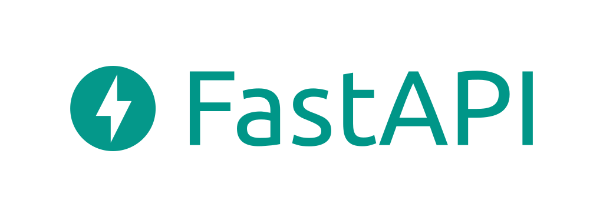
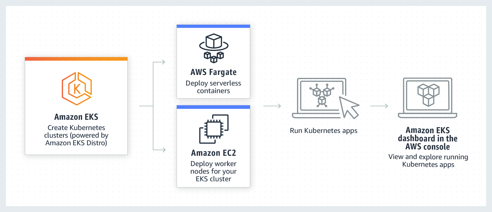

Hello everyone, Welcome to the PyCharm FastAPI tutorial series.
In this tutorial we are going to explore [FastAPI](https://fastapi.tiangolo.com) 
which is a high-performance framework. It’s a modern web framework 
which recently got huge popularity over the Internet, it’s backed by
[starlette](https://www.starlette.io/) and [pydantic](https://pydantic-docs.helpmanual.io/) and based on 
standard [type hints](https://www.python.org/dev/peps/pep-0484/).

# Background

FastAPI is a modern, fast (high-performance) web framework 
for building APIs with Python 3.6+ based on standard Python type hints.

The key features are:

- **Fast**: Very high performance, on par with NodeJS and Go (thanks to Starlette and Pydantic). One of the fastest Python frameworks available.

- **Fast to code**: Increase the speed to develop features by about 200% to 300%.

- **Fewer bugs**: Reduce about 40% of human (developer) induced errors.
- **Intuitive**: Great editor support. Completion everywhere. Less time debugging.
- **Easy**: Designed to be easy to use and learn. Less time reading docs.
- **Short**: Minimize code duplication. Multiple features from each parameter declaration. Fewer bugs.
- **Robust**: Get production-ready code. With automatic interactive documentation.
- **Standards-based**: Based on (and fully compatible with) the open standards for APIs: OpenAPI (previously known as Swagger) and JSON Schema.

For reference, you can visit the website [fastapi.tiangolo.com](https://fastapi.tiangolo.com/)

FastAPI is developed by [Sebastian Ramirez](https://twitter.com/tiangolo), who is 
currently working in Forethought as a Staff Software Engineer. He has contributed
code to countless open source projects like Typer & SQLModel as well as  related to
DevOps, Docker, Spark, Python, Angular and many more.

# Kubernetes

Image Credits :  [kubernetes.io](https://kubernetes.io/)

It’s not going to be only FastAPI, we are also going to play with Kubernetes, also known as 
**K8s**. 

The [Kubernetes](https://kubernetes.io/) Project was open-sourced by Google in 2014 after using it to run 
production workloads at scale for more than a decade.

It groups containers that make up an application into logical units for 
easy management and discovery. Kubernetes builds upon 15 years of experience
of running production workloads at Google, combined with best-of-breed ideas
and practices from the community.

# Google Borg System

Image Credits : [Google Research](https://research.google/)

Google’s Borg system is a cluster manager that runs hundreds of thousands of jobs, from many thousands of different applications, across a number of clusters each with up to
tens of thousands of machines.

It achieves high utilization by combining admission control, efficient task-packing, over-commitment, and machine
sharing with process-level performance isolation. 

It supports high-availability applications with runtime features that minimize fault-recovery time, and scheduling policies that reduce the probability of correlated failures. Borg simplifies
life for its users by offering a declarative job specification language, name service integration, real-time job monitoring, and tools to analyze and simulate system behavior.

You can also say Borg is the **predecessor** to Kubernetes.

To know more about Borg, read the research paper : [Large-scale cluster management at Google with Borg](https://research.google/pubs/pub43438/)

# AWS Elastic Kubernetes Service

Image Credits : [Amazon Web Services](https://aws.amazon.com/)

It’s not going to happen that we worked on Kubernetes, but then not deploy it
on a live server. 

We will be deploying our application on AWS using the [EKS (Elastic Kubernetes Service](https://aws.amazon.com/eks/) and
setting a three-node cluster along-with that, we will be also setting up [RDS](https://aws.amazon.com/rds/), 
[ElastiCache](https://aws.amazon.com/elasticache/) and a custom domain with [SSL](https://aws.amazon.com/certificate-manager/).

# Helm Charts

Image Credits: [CNCF](https://cncf-branding.netlify.app/projects/helm/)

Helm helps you manage Kubernetes applications — Helm Charts help you define, install, and upgrade even the most complex Kubernetes application.
Helm is a graduated project in the [CNCF (Cloud Native Computing Foundation)](https://www.cncf.io/) and is maintained by the [Helm community](https://github.com/helm/community).

And finally at last, I am going to give a sneak peek into Helm Charts, where we are 
going to package our application and indeed which help software vendors and 
developers to preconfigure their applications with sensible defaults.

# Source Code

For your reference, the entire source code will be available on [GitHub](https://github.com/mukulmantosh/FastAPI_EKS_Kubernetes). You can simply fork or clone the repo, and start working right away.