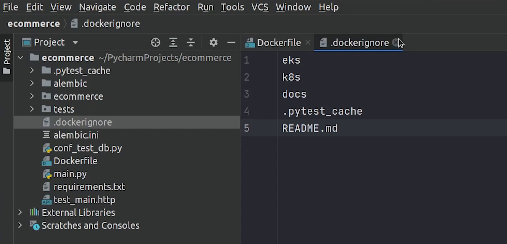

Hello everyone ! Welcome to PyCharm FastAPI Tutorial Series. 

In this tutorial we will be focusing on deploying our application in [Kubernetes](https://kubernetes.io/). It is an open-source container-orchestration 
system for automating computer application deployment, scaling, and management. It was originally designed by [Google](https://about.google/) and is now
maintained by the [Cloud Native Computing Foundation](https://www.cncf.io/).


So, let’s get started.


# Minikube

For our tutorial, we will be using minikube.


[minikube](https://minikube.sigs.k8s.io/docs/) is a tool that lets you run Kubernetes locally. Minikube runs a 
single-node Kubernetes cluster on your personal computer (including Windows, macOS and Linux PCs) so that you can
try out Kubernetes, or for daily development work.

Let me tell you one thing, there are multiple ways to install Kubernetes and tons of tutorials available on the Internet. 
You can check them out if you don’t want to go forward with minikube.

Also, I will be talking at a high level. We won’t be getting a deeper dive into Docker or Kubernetes, as you know 
these are subjects of their own, and I expect from the audience that they have experience working with these technologies.

If not I will share some links in my reference video where you can learn those topics separately.


# Installing Dependencies

Let’s begin by updating the system dependencies.

```bash
sudo apt-get update -y
sudo apt-get upgrade -y
```


After updating, I will install minikube dependencies.

```bash
sudo apt-get install -y curl wget apt-transport-https
```


Now, I will download the minikube binary.

```bash
sudo wget https://storage.googleapis.com/minikube/releases/latest/minikube-linux-amd64
```


I will copy the **minikube-linux-amd64** to **/usr/local/bin/minikube** and make it executable.

```bash
sudo cp minikube-linux-amd64 /usr/local/bin/minikube
sudo chmod +x /usr/local/bin/minikube
```


I will type the minikube version, just to verify.

Looks Good, minikube is successfully installed.


Next, I will install the **[kubectl](https://kubernetes.io/docs/reference/kubectl/overview/)** which is the Kubernetes command-line tool,
which allows you to run commands against Kubernetes clusters.

For your reference, you can follow this link : [https://kubernetes.io/docs/tasks/tools/install-kubectl-linux/](https://kubernetes.io/docs/tasks/tools/install-kubectl-linux/)

### Install kubectl binary with curl on Linux

```bash
sudo curl -LO "https://dl.k8s.io/release/$(curl -L -s https://dl.k8s.io/release/stable.txt)/bin/linux/amd64/kubectl"
sudo chmod +x kubectl
sudo mv kubectl /usr/local/bin
```

Once it has been downloaded, I will make it executable and move it to **/usr/local/bin** path.


We are done. Let’s start the minikube, but before starting I will create a folder in my home directory which will be 
required for mounting, for storing postgres database files.


### Installing Docker

I won’t show the installation step of Docker because there are tons of tutorials on that. But I will 
share a good tutorial which I found in the DigitalOcean community, you can check that out.

- [https://www.digitalocean.com/community/tutorials/how-to-install-and-use-docker-on-ubuntu-20-04](https://www.digitalocean.com/community/tutorials/how-to-install-and-use-docker-on-ubuntu-20-04)

Once docker is installed, we will move ahead and start the minikube.

At the time of this recording we are using Kubernetes **1.22** version.

### Starting Minikube

To start the minikube server run the below command :

```bash
minikube start --mount-string "$HOME/postgres-data:/data" --driver=docker --install-addons=true --kubernetes-version=stable
```


The installation will take some time.

Once minikube has been started successfully, to verify I will run the below command :

```bash
kubectl get nodes
```


You can see that our single node is running perfectly fine.

Now, it's time to come back to PyCharm and write our Dockerfile.


# Dockerfile

According to docker documentation, A Dockerfile is a text document that contains all the 
commands a user could call on the command line to assemble an image. 

- [Dockerfile best practices](https://docs.docker.com/develop/develop-images/dockerfile_best-practices/)


We are using Python 3.8 slim image. The slim image is a paired down version of the full image. This image generally only installs the minimal packages needed to run your particular tool. 


There is an interesting article in [Medium](https://medium.com/) talking about different docker images, do check that out.

- [Alpine, Slim, Stretch, Buster, Jessie, Bullseye — What are the Differences in Docker Images?](https://medium.com/swlh/alpine-slim-stretch-buster-jessie-bullseye-bookworm-what-are-the-differences-in-docker-62171ed4531d)


**Dockerfile**

```dockerfile
# pull official base image
FROM python:3.8.11-slim-buster

# create directory for the app user
RUN mkdir -p /home/app

# create the app user
RUN addgroup --system app && adduser --system --group app   #  going to create a group and a user.


# Next, we will move forward and create our app directory where we will copy our code.
ENV HOME=/home/app
ENV APP_HOME=/home/app/code
RUN mkdir $APP_HOME
WORKDIR $APP_HOME

# set environment variables
ENV PYTHONDONTWRITEBYTECODE 1
ENV PYTHONUNBUFFERED 1
ENV ENVIRONMENT prod


# Following up, we will install system and python dependencies.
RUN apt-get update \
  && apt-get -y install netcat gcc libpq-dev \
  && apt-get clean

# install python dependencies
RUN pip install --upgrade pip
RUN pip install -U setuptools
COPY ./requirements.txt .
RUN pip install -r requirements.txt

# After that I will copy the entire code, change ownership and finally run the gunicorn process at port 5000.
# add app
COPY . .

# chown all the files to the app user
RUN chown -R app:app $APP_HOME

# change to the app user
USER app

# run gunicorn
CMD gunicorn --bind 0.0.0.0:5000 main:app -k uvicorn.workers.UvicornWorker
```

## Plugins

There are some cool plugins available for Docker & Kubernetes in PyCharm which I forgot to mention. Let me quickly install them.


Docker plugin is already installed, let me check for Kubernetes.


We will use the Kubernetes plugin later, and I will show you how cool it is to manage pods through PyCharm.

Before that, let's build our docker image.

I will run the below command : 

```bash
docker build -t mukulmantosh/ecommerce-fastapi:1.0  .
```

The build process is complete.


Next, we need to host this docker image, so we will deploy this image in DockerHub. [DockerHub](https://hub.docker.com/) is basically a
docker registry where you can store and share your docker images, the same way you store code in GitHub repositories. 


As you can see I have already created the docker repository, currently it is private but later, I will make it public.

As you can see I already have an image with a tag as latest.


Before pushing the image to DockerHub, I will create a **.dockerignore** file which is similar to **.gitignore**. 




I will add some files and directories which won’t be part of the docker image.

I will rebuild the image and provide the tag as shown in the DockerHub. As we have already **latest** tag, we will create a tag with version **1.0**

Now, we are going to push the image to DockerHub, before that we need to authenticate our credentials.

I will type the below command and pass the credentials (username & password) :

```bash
docker login
```


For pushing the docker image, I will type the below command : 

```bash
docker push mukulmantosh/ecommerce- fastapi:1.0
``` 


I will change the visibility of the repository to public because it's required when we need this image to be used with Kubernetes.


If you have a use case when working with Kubernetes, you need to use images from a private registry, 
then definitely check out the documentation provided by Kubernetes.

- [Pull an Image from a Private Registry](https://kubernetes.io/docs/tasks/configure-pod-container/pull-image-private-registry/)

They have clearly explained in the documentation.

We are done with the Dockerfile and the image got built successfully, and we hosted the image in DockerHub.

Now, it’s time to play with Kubernetes.


# K8s Manifests

I am going to create a directory in root and name it **k8s**. As you know k8s is a short form of Kubernetes. 

K8s is just an abbreviation of Kubernetes (**"K" followed by 8 letters "ubernete" followed by "s"**).


Under K8s directory, I will create multiple directories.

## Namespace

First I will create a **namespace**. In Kubernetes, namespaces provide a mechanism for isolating groups of resources
within a single cluster. Names of resources need to be unique within a namespace, but not across namespaces.


If you have observed one thing, all these files end with **.yaml** extension. The Kubernetes resources are created 
in a declarative way, thus making use of YAML files. 

Resources such as **pods**, **services**, and **deployments** are created by using the YAML files.

You can create resources with imperative commands, but it is suggested that declarative ways are much more flexible.

Coming back, I will set the namespace to **fastapi-project**.

So, all the pods, deployments, secrets will fall under this namespace.


**k8s/namespace/ns.yml**

```yaml
apiVersion: v1
kind: Namespace
metadata:
  name: fastapi-project
  labels:
    name: fastapi-project
```

After namespace, I will create a directory and name it code in which we will be writing deployment, services and secret.

Don’t worry, at the end of this tutorial I will explain the flow using a diagram.


## Deployment

Let’s move first with the deployment. A **deployment** is an object in Kubernetes that lets you manage
a set of identical pods. Without a deployment, you’d need to create, update, and delete a bunch of pods manually.


With a deployment, you declare a single object in a YAML file. This object is responsible for creating the pods,
making sure they stay up to date, and ensuring there are enough of them running.

You can also easily autoscale your applications using a Kubernetes deployment.

As you can see we will be running 8 replica pods of our application and Kubernetes will take care 
of that by checking the desired state. Kubernetes has a self-healing mechanism, It restarts containers
that fail, replaces containers, kills containers that don't respond to your user-defined health check, 
and doesn't advertise them to clients until they are ready to serve.

**k8s/code/deployment.yml**

```yaml
apiVersion: apps/v1
kind: Deployment
metadata:
  name: ecommerce-deployment
  namespace: fastapi-project
  labels:
    app: ecommerce
spec:
  replicas: 8
  selector:
    matchLabels:
      app: ecommerce-app
  template:
    metadata:
      labels:
        app: ecommerce-app
    spec:
      initContainers:
        - name: init-postgres-service
          image: postgres:10.17
          command: ['sh', '-c',
          'until pg_isready -h postgres-service.$(cat /var/run/secrets/kubernetes.io/serviceaccount/namespace).svc.cluster.local -p 5432;
          do echo waiting for database; sleep 2; done;']

      containers:
        - image: mukulmantosh/ecommerce-fastapi:latest
          imagePullPolicy: Always
          name: sample-container
          envFrom:
          - secretRef:
              name: ecommerce-secret
          ports:
            - containerPort: 5000
              name: fastapi
          readinessProbe:
            httpGet:
              port: 5000
              path: /docs
            initialDelaySeconds: 15
          livenessProbe:
            httpGet:
              port: 5000
              path: /docs
            initialDelaySeconds: 15
            periodSeconds: 15
          resources:
            requests:
              memory: "512Mi"
              cpu: "0.5"
            limits:
              memory: "1Gi"
              cpu: "1"
```

When working with Kubernetes, you are going to hear this word many times and that is **Pod**.

A pod is the smallest execution unit in Kubernetes. Pods are ephemeral by nature; if a pod (or the node it executes on) fails, 
Kubernetes can automatically create a new replica of that pod to continue operations. Pods include one or more 
containers (such as Docker containers).

You can see we have defined **InitContainers**. In Kubernetes, an init container is the one that 
starts and executes before other containers in the same Pod. It's meant to perform initialization
logic for the main application hosted on the Pod. For example, create the necessary user accounts, 
perform database migrations, create database schemas and so on.

But over here we are just checking whether our database server is up and running using the **[pg_ready](https://www.postgresql.org/docs/9.3/app-pg-isready.html)** command.


Now, under the **containers** section, we will define the docker image which we have already pushed to DockerHub.

**imagePullPolicy** has been set to **Always**. Every time the kubelet launches a container, it's going to pull the 
image from the container registry.

After that we are going to define a **secret**. We will implement this in a while. 

The container port is going to 5000.

Then we are going to do health checks using the **readiness probe** and **liveness probe**.

Readiness probes are designed to let Kubernetes know when your app is ready to serve traffic. Kubernetes makes sure the readiness probe passes before allowing a service to send traffic to the pod.

The kubelet uses liveness probes to know when to restart a container. For example, liveness probes could catch a deadlock, where an application is running, but unable to make progress.

As you can observe we are using the **httpGet** request to check for path **/docs** to return 200 response at a period of 15 seconds.


For your reference, read this documentation:
- [Configure Liveness, Readiness and Startup Probes](https://kubernetes.io/docs/tasks/configure-pod-container/configure-liveness-readiness-startup-probes/)


Next, we are going to define the **memory limit** to 512MB and cpu and expect it won’t cross above that in case there is a memory leak.


A Container that requests 0.5 CPU is guaranteed half as much CPU as a Container that requests 1 CPU. You can use the suffix m to mean milli.

CPU is always requested as an absolute quantity, never as a relative quantity; 0.1 is the same amount of CPU on a single-core, dual-core, or 48-core machine.


## Secret

Next, we are going to create a secret. A Secret is an object that contains a small amount of sensitive data such as a password, a token, or a key. 
Secrets are similar to **[ConfigMaps](https://kubernetes.io/docs/concepts/configuration/configmap/)** but are specifically intended to hold confidential data.

Kubernetes accepts secrets as base64 encoded values, encoding and encryption both are different. If you are interested in encryption, then check out [bitnami sealed secrets](https://github.com/bitnami-labs/sealed-secrets).

We have provided the base64 values, decrypted values you can see in the comments what we are exactly passing.

**k8s/code/secret.yml**

```yaml
apiVersion: v1
kind: Secret
metadata:
  name: ecommerce-secret
  namespace: fastapi-project
  labels:
    app: ecommerce
data:
  DATABASE_USERNAME: bXVrdWxtYW50b3No       # mukulmantosh
  DATABASE_PASSWORD: bXVrdWwxMjM=           # mukul123
  DATABASE_HOST: cG9zdGdyZXMtc2VydmljZQ==   # postgres-service
  DATABASE_NAME: c2FtcGxlZGI=               # sampledb 
```

## Service

Next, we are going to work on **[Service](https://kubernetes.io/docs/concepts/services-networking/service/)**.

We could use a deployment without a service to keep a set of identical pods running in the Kubernetes cluster. The deployment could be scaled up and down and pods could be replicated. Each pod could be accessed individually via direct network requests (rather than abstracting them behind a service), but keeping track of this for a lot of pods is difficult and this is where we introduce service.

A service is responsible for enabling network access to a set of pods. It does not matter how many pods come and go, the service is going to maintain a single IP address.


Image Credit : [Kubernetes : Using a Service to Expose Your App](https://kubernetes.io/docs/tutorials/kubernetes-basics/expose/expose-intro/)

As you can see we have created a clusterIP service, internally we can talk with this service at port 5000. You can specify the type as ClusterIP otherwise it will be considered as a ClusterIP only if you don’t mention any type. 

**k8s/code/service.yml**

```yaml
apiVersion: v1
kind: Service
metadata:
  name: ecommerce-service
  namespace: fastapi-project
  labels:
    app: ecommerce
spec:
  selector:
    app: ecommerce-app
  ports:
    - port: 5000
      targetPort: 5000
```

There are many service type like :

- **ClusterIP** : Exposes a service which is only accessible from within the cluster.
- **NodePort** : Exposes a service via a static port on each node’s IP.
- **LoadBalancer** : Exposes the service via the cloud provider’s load balancer.
- **ExternalName** : Maps a service to a predefined externalName field by returning a value for the CNAME record.

References:
- [https://kubernetes.io/docs/concepts/services-networking/service/](https://kubernetes.io/docs/concepts/services-networking/service/)
- [https://kubernetes.io/docs/concepts/services-networking/connect-applications-service/](https://kubernetes.io/docs/concepts/services-networking/connect-applications-service/)


We are done with the code part. Let’s move forward with the web server configuration that is [NGINX](https://www.nginx.com/).

# NGINX


I am going to speed up the process. I expect you to check my source code, as I have already provided all the YAML files.


This is the nginx deployment blueprint, as you can observe we will be running 8 replicas of nginx 1.21 version and the 
container port is 80 and as usual we are doing the common health checks.

**k8s/nginx/nginx-deployment.yml**

```yaml
apiVersion: apps/v1
kind: Deployment
metadata:
  name: nginx-deployment
  namespace: fastapi-project
  labels:
    app: ecommerce
spec:
  replicas: 8
  selector:
    matchLabels:
      app: ecommerce-nginx
  template:
    metadata:
      labels:
        app: ecommerce-nginx
    spec:
      containers:
        - image: nginx:1.21
          name: nginx-container
          ports:
            - containerPort: 80
          readinessProbe:
            httpGet:
              port: 80
              path: /docs
            initialDelaySeconds: 15
          livenessProbe:
            httpGet:
              port: 80
              path: /docs
            initialDelaySeconds: 15
            periodSeconds: 15
          volumeMounts:
            - name: nginx-config
              mountPath: /etc/nginx/conf.d/default.conf
              subPath: default.conf
      volumes:
        - name: nginx-config
          configMap:
            name: nginx-config
```

We are using a volume mount to mount our configuration and replace the default configuration provided by NGINX.

## ConfigMap

Next, we will define ConfigMap.

According to Kubernetes documentation : *A ConfigMap is an API object used to store non-confidential data in key-value pairs. Pods 
can consume ConfigMaps as environment variables, command-line arguments, or as configuration files in a volume*.

If you observe carefully from line number 10 to 23 we are changing the nginx configuration 
and proxying the request to the backend application.


Line number 11 clearly shows that the request is going to the internal ecommerce service which is running at port 5000.

**k8s/nginx/nginx-config.yml**

```yaml
apiVersion: v1
kind: ConfigMap
metadata:
  name: nginx-config
  namespace: fastapi-project
  labels:
    app: ecommerce
data:
  default.conf: |
    upstream ecommerce_project {
        server ecommerce-service:5000;
    }
    server {
        listen 80;
        location / {
            proxy_pass http://ecommerce_project;
            proxy_set_header X-Forwarded-For $proxy_add_x_forwarded_for;
            proxy_set_header Host $host;
            proxy_redirect off;
        }
    }
```

Next, we will create the nginx service which is basically a **nodeport** service.


Observe carefully from line number 13 to 15.

We are using port, targetPort and nodePort.

- **Port** exposes the Kubernetes service on the specified port within the cluster. Other pods within the cluster can communicate with this server on the specified port.

- **TargetPort** is the port on which the service will send requests to, that your pod will be listening on. Your application in the container will need to be listening on this port also.

- **NodePort** exposes a service externally to the cluster by means of the target node's IP address and the NodePort.


As I said earlier we have different service types and the nginx service is a **nodeport** service. In simple terms we can access the pod externally through the port number 30009.

**k8s/nginx/nginx-service.yml**

```yaml
apiVersion: v1
kind: Service
metadata:
  name: nginx-service
  namespace: fastapi-project
  labels:
    app: ecommerce
spec:
  type: NodePort
  selector:
    app: ecommerce-nginx
  ports:
    - port: 80
      targetPort: 80
      nodePort: 30009
```

We have completed the nginx, next we will work on postgres.


# Postgres


As you can observe the postgres deployment we will be only running one pod.

**k8s/postgres/postgres-deployment.yml**

```yaml
apiVersion: apps/v1
kind: Deployment
metadata:
  name: postgres-deployment
  namespace: fastapi-project
spec:
  replicas: 1
  selector:
    matchLabels:
      app: postgres-container
  template:
    metadata:
      labels:
        app: postgres-container
        tier: backend
    spec:
      containers:
        - name: postgres-container
          image: postgres:10.17
          envFrom:
            - secretRef:
                name: postgres-secret
          ports:
            - containerPort: 5432
          resources:
            requests:
              memory: "512Mi"
              cpu: "0.5"
            limits:
              memory: "1Gi"
              cpu: "1"
          volumeMounts:
            - name: postgres-volume-mount
              mountPath: /var/lib/postgresql/data
      volumes:
        - name: postgres-volume-mount
          persistentVolumeClaim:
            claimName: postgres-pvc
```

The container will be running on port 5432 and some memory limits have been applied.

We will be introducing two major things : **[persistentVolume](https://kubernetes.io/docs/concepts/storage/persistent-volumes/)** and **[persistentVolumeClaim](https://kubernetes.io/docs/concepts/storage/persistent-volumes/#persistentvolumeclaims)**.


Volumes let your pod write to a filesystem that exists as long as the pod exists. Volumes also let you share data between containers in the same pod. 


Persistent volumes exist beyond containers, pods, and nodes. A pod uses a persistent volume claim to get read and write access to the persistent volume.


You can observe the PersistentVolume, we are creating a storage of 2GB in size, also the access mode is ReadWriteMany. 

There are 4 types of access modes: 

- **RWO** - ReadWriteOnce
- **ROX** - ReadOnlyMany
- **RWX** - ReadWriteMany
- **RWOP** - ReadWriteOncePod

**k8s/postgres/postgres-pv.yml**

```yaml
kind: PersistentVolume
apiVersion: v1
metadata:
  name: postgres-pv
  namespace: fastapi-project
  labels:
    type: local
    app: ecommerce
spec:
  persistentVolumeReclaimPolicy: Delete
  storageClassName: local-storage
  capacity:
    storage: 2Gi
  volumeMode: Filesystem
  accessModes:
    - ReadWriteMany
  local:
    #path: /run/desktop/mnt/host/e/postgres-data   # <-- if running with docker desktop in windows
     path: /data
  nodeAffinity:
    required:
      nodeSelectorTerms:
        - matchExpressions:
            - key: kubernetes.io/hostname
              operator: In
              values:
                - minikube # <-- name of the node (docker-desktop, minikube) etc.
```

We have set a reclaim policy to **Delete**, and you have the option to retain as well. Deletion removes both the PersistentVolume object from Kubernetes, and the 
associated storage asset in the external infrastructure.

**storageClassName** is currently local storage, but even you can use AWS EBS Storage, Google Storage etc.

Observe carefully on line number 18 and 26.


**Path** is basically pointing towards the directory where the postgres files will be installed. If you are using Docker Desktop in Windows then this is the way you need to provide the path and the postgres-data folder is already present in the E drive.

As you know we are running our application in a linux machine, then we need to provide the home directory path of the postgres-data folder which we mounted in the beginning when starting the minikube.


And line number 26, will be replaced with minikube.

Next, I will create the persistent volume claim.

## PersistentVolumeClaim

A PersistentVolumeClaim is a request for a resource with specific attributes, such as storage size. As I said earlier,  
A pod uses a persistent volume claim to get read and write access to the persistent volume. For our case we are pointing
the volume name to **postgres-pv**.

**k8s/postgres/postgres-pvc.yml**

```yaml
kind: PersistentVolumeClaim
apiVersion: v1
metadata:
  name: postgres-pvc
  namespace: fastapi-project
  labels:
    type: local
    app: ecommerce
spec:
  storageClassName: local-storage
  accessModes:
    - ReadWriteMany
  resources:
    requests:
      storage: 2Gi
  volumeName: postgres-pv
```

After we are done with volumes, we will create the secrets and services.

**k8s/postgres/postgres-secret.yml**

```yaml
apiVersion: v1
kind: Secret
metadata:
  name: postgres-secret
  namespace: fastapi-project
  labels:
    app: ecommerce
data:
  POSTGRES_DB: c2FtcGxlZGI=  # sampledb
  POSTGRES_USER: bXVrdWxtYW50b3No   # mukulmantosh
  POSTGRES_PASSWORD: bXVrdWwxMjM=   # mukul123
```


**k8s/postgres/postgres-service.yml**

```yaml
kind: Service
apiVersion: v1
metadata:
  name: postgres-service
  namespace: fastapi-project
spec:
  selector:
    app: postgres-container
  ports:
    - protocol: TCP
      port: 5432
      targetPort: 5432
```

The postgres service is a clusterIP service, so we will only do internal communication.

We are done with Postgres, now we will move to Redis.

## Redis

Same as usual we will create deployment and service files for [Redis](https://redis.io/).

We will run the redis 6.2.5 alpine image.


**k8s/redis/deployment.yml**

```yaml
apiVersion: apps/v1
kind: Deployment
metadata:
  name: redis-deployment
  namespace: fastapi-project
  labels:
    app: ecommerce
spec:
  replicas: 1
  selector:
    matchLabels:
      app: redis-app
  template:
    metadata:
      labels:
        app: redis-app
    spec:
      containers:
        - image: redis:6.2.5-alpine
          imagePullPolicy: IfNotPresent
          name: redis-container
          ports:
            - containerPort: 6379
          readinessProbe:
            tcpSocket:
              port: 6379
          livenessProbe:
            tcpSocket:
              port: 6379
            periodSeconds: 15
          resources:
            limits:
              memory: 256Mi
              cpu: 125m
            requests:
              cpu: 70m
              memory: 200Mi


```
The redis service will be running on port 6379.

**k8s/redis/service.yml**

```yaml
apiVersion: v1
kind: Service
metadata:
  name: redis-service
  namespace: fastapi-project
  labels:
    app: ecommerce
spec:
  selector:
    app: redis-app
  ports:
    - port: 6379
      targetPort: 6379

```

We are done with redis, now we will move to celery.


## Celery

[Celery](https://docs.celeryproject.org/en/stable/getting-started/introduction.html) is a task queue implementation for Python web applications used to asynchronously execute work outside the HTTP request-response cycle.

It won’t be having any service, only deployment and secret because celery will be used for processing the background tasks.

**k8s/celery/deployment.yml**

```yaml
apiVersion: apps/v1
kind: Deployment
metadata:
  name: celery-deployment
  namespace: fastapi-project
  labels:
    app: ecommerce
spec:
  replicas: 1
  selector:
    matchLabels:
      app: celery-app
  template:
    metadata:
      labels:
        app: celery-app
    spec:
      initContainers:
        - name: init-redis-service
          image: busybox:1.28
          command: [ 'sh', '-c', "until nslookup redis-service.$(cat /var/run/secrets/kubernetes.io/serviceaccount/namespace).svc.cluster.local; do echo waiting for redis-service; sleep 2; done" ]

      containers:
        - image: mukulmantosh/ecommerce-fastapi:latest
          command: ['celery', '-A', 'main.celery', 'worker', '-l', 'info']
          envFrom:
            - secretRef:
                name: celery-secret
          name: celery-container

```

You can observe that we are using a busybox image in our init containers just to do nslookup of whether our redis service is present or not. Don’t consider this as a health check.


Observe line number 25, we will spin up a container from our backend image and execute the celery command.

Next, I will create the celery secret. I will also decode the values and show you what I am passing.


**k8s/celery/secret.yml**

```yaml
apiVersion: v1
kind: Secret
metadata:
  name: celery-secret
  namespace: fastapi-project
  labels:
    app: ecommerce
data:
  REDIS_HOST: cmVkaXMtc2VydmljZQo=  # redis-service
  REDIS_PORT: NjM3OQo=              # 6379 
  REDIS_DB: MAo=                    # 0
```

After we are done with celery, I will create a Job which will handle database migration.


# Job

A Kubernetes job is a supervisor for pods carrying out batch processes, that is, a process that runs for a certain time to completion, for example a calculation or a backup operation.

I will create migration and secret yaml files.


If you observe the code carefully, in line number 13 the migration command will run with backoff limit set to 15.

I will also check in the init container whether the postgres database is running or not. If it’s healthy then only the migration command will run.

Also, after 100 seconds the job will expire, it does not matter whether the job was finished successfully or not.


**k8s/job/migration.yml**

```yaml
apiVersion: batch/v1
kind: Job
metadata:
  name: fastapi-migrations
  namespace: fastapi-project
spec:
  ttlSecondsAfterFinished: 100
  template:
    spec:
      containers:
        - name: migration-container
          image: mukulmantosh/ecommerce-fastapi:latest
          command: ['alembic', 'upgrade', 'head']
          envFrom:
            - secretRef:
                name: migration-secret
      initContainers:
        - name: init-postgres-service
          image: postgres:10.17
          command: [ 'sh', '-c',
              'until pg_isready -h postgres-service.$(cat /var/run/secrets/kubernetes.io/serviceaccount/namespace).svc.cluster.local -p 5432;
          do echo waiting for database; sleep 2; done;' ]
      restartPolicy: OnFailure
  backoffLimit: 15
```

**k8s/job/secret.yml**

```yaml
apiVersion: v1
kind: Secret
metadata:
  name: migration-secret
  namespace: fastapi-project
  labels:
    app: ecommerce
data:
  DATABASE_USERNAME: bXVrdWxtYW50b3No              # mukulmantosh
  DATABASE_PASSWORD: bXVrdWwxMjM=                  # mukul123
  DATABASE_HOST: cG9zdGdyZXMtc2VydmljZQ==          # postgres-service
  DATABASE_NAME: c2FtcGxlZGI=                      # sampledb
```

Finally, we have completed all modules which are required for Kubernetes.

# Deployment

Let’s now begin the deployment.

I will open up the **Terminal** and move inside **k8s** directory.

I will run a set of commands, just follow along with me.

First, I am going to create the namespace.

```bash
kubectl apply -f namespace
```

namespace got created.

After namespace, I will create postgres and the other remaining modules.


Something is wrong, let me check what is being missed out.

Ohh ok, I got it. The path needs to **/data**. This is what we mounted when we started the minikube.


Let me try again.


And Yes, Postgres is running now.

Let me now move forward and deploy the other remaining modules.

Except Job, everything has been created.

Let me now check the status of the pods by typing :

```bash
kubectl get pods -n fastapi-project
```

As you can see some pods are in the pending state, creation state and some are still in the initialization phase.

Let’s wait for a few more seconds to see the progress.


For your information, if your system has less resources than try to decrease the number of replicas instead of running 8 replicas trying running with 1 or 2. 


As you can see almost all the applications are running except ecommerce which has 3 pending pods and the reason behind this is insufficient cpu and our system is running on low resources, So I am going to decrease the number of replicas for both codebase and nginx.


As you can see all the pods are running now. There are three backend pods, three nginx pods, one pod for redis, celery and postgres.


Everything looks good.


There is one remaining thing which we haven’t run yet and that is the migration.


Let’s complete that.


Yes, the migration has been completed.

# Results

Let me now check in the browser. But before that we need to retrieve the service ip address. If you are working with Docker Desktop in Windows you can simply access through localhost.

But with Minikube we need to get the IP.
I will type : 

```bash
minikube service list
```


And  Yes, the IP address is running on port 30009, docs have been loaded. Let’s test our API.


I will create a new user, and won't change anything in the request body. I care about the response.


Yes, our user has been successfully created and received 201 status code and the entire stack is running in Kubernetes.

If you are new to Kubernetes, then this video does not make any sense. But if you have already got an understanding of Kubernetes, then it would be very easy to conceptualize what I am trying to do.


# Diagram
This diagram will help you to visualize the K8s deployments and the interconnected services.


# Kubernetes Plugin

Taking a small break, there is one more interesting thing that PyCharm provides. You can directly manage your
Kubernetes resources through PyCharm instead of using the terminal.

Let me give you a sneak peek.

As you remember we have already installed the Kubernetes Plugin, and now we are going to check how it works.


Click on **View** → **Tool Windows** → **Services**


You can check that it has detected the minikube. It has automatically detected the configuration.


I will try to create a namespace. I will click on this green play button, and it will execute it directly.


As you know we already have the namespace, let me change it quickly.


Now, I am going to deploy all the stack but through PyCharm using the play button.


You can even see the status of all the pods which have been deployed.


Great part is that I can also see the Jobs, Deployments, Services, Cron Jobs, Replica Sets etc.

This makes life easy by managing everything at one place.


You can even see the PersistentVolume and PersistentVolumeClaim.


There is one more thing provided by Minikube, and that is the dashboard.


I will the below command and press enter :

```
minikube dashboard
```

This is basically the [Kubernetes Dashboard](https://kubernetes.io/docs/tasks/access-application-cluster/web-ui-dashboard/), the same way you can easily check all your cluster information.


You will find more detailed information over here.


Coming back to PyCharm, you can even follow logs of the specific pod, and you can open the shell as well.


One last thing before we end this tutorial, you can also change the **kubeconfig** file. For example: if your cluster 
is running on a public cloud like AWS or its being self-hosted in an on-premise server 
then you can easily communicate with the cluster by changing the kubeconfig. 


So, I hope you liked this tutorial, if not take some time it’s not a race. I will see you in the next tutorial where
we will be talking about Helm Charts.

