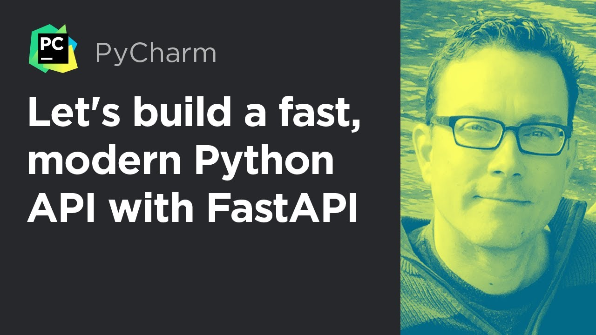
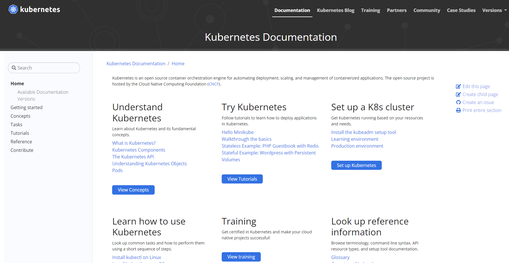

Hello everyone! Welcome to the PyCharm FastAPI Tutorial Series.

In this tutorial I will do some honorable mentions of reference materials which helped me to prepare this tutorial.

Let’s begin.

# FastAPI

If you are starting up fresh with FastAPI, then I would definitely recommend following the official documentation. It has 
a complete end-to-end explanation covering tutorial based steps along-with advanced materials.

Source: [https://fastapi.tiangolo.com/](https://fastapi.tiangolo.com/)

It is quite common that, when working with FastAPI, you might end up with some issues. For that I would say 
look for the **issues** section of the FastAPI repository, most of the time 
the common problem which you are facing might have a solution already present.

Source: [https://github.com/tiangolo/fastapi/issues](https://github.com/tiangolo/fastapi/issues)

If you don’t find the answer go ahead and ask, definitely you 
are going to get help from the FastAPI community, and I would also suggest 
helping others in the problems the users are facing. In this way the community grows,
It’s a great experience working with like-minded people.

# PyCharm by JetBrains 

Interesting videos provided by the official PyCharm YouTube Channel.

## Smarter FastAPI Tooling

Source: [https://www.youtube.com/watch?v=r6fBoBTRfT4](https://www.youtube.com/watch?v=r6fBoBTRfT4)

## Let's Build a Fast, Modern Python API with FastAPI

Source: [https://www.youtube.com/watch?v=sBVb4IB3O_U](https://www.youtube.com/watch?v=sBVb4IB3O_U)

## 10 Reasons You'll Love PyCharm Even More in 2021

Source: [https://www.youtube.com/watch?v=sJriZQsMHrw](https://www.youtube.com/watch?v=sJriZQsMHrw)

# Talk Python

If you are interested in taking your Python knowledge to the next level then I would 
suggest watching video courses provided by Talk Python Training. 

Source: [https://training.talkpython.fm/](https://training.talkpython.fm/)

[Michael Kennedy](https://twitter.com/mkennedy) and his team really create amazing courses. They have two courses 
on FastAPI, if you want to get deeper inside do check them out. Also, if you work with PyCharm 
then definitely you will always have a feeling that I know only 10% of PyCharm. Nothing to worry about because there
is a great course [Effective PyCharm](https://training.talkpython.fm/courses/explore_pycharm/mastering-pycharm-ide), definitely check this out if you want to take productivity 
to the next level.

# TestDriven.IO

Source: [https://testdriven.io/](https://testdriven.io/)

TestDriven.IO is an amazing website with quality content. There are good quality contents
related to Python, Flask, TDD, FastAPI and also working with task queues like Celery in Django or FastAPI.

# AWS

If you have no knowledge about AWS or planning to take AWS certification in the future, then I would 
recommend watching courses in [Udemy](https://www.udemy.com/) provided by [Stephane Maarek](https://aws.amazon.com/developer/community/heroes/stephane-maarek/), amazing content starting from no 
cloud experience in AWS to doing advanced level stuff. 

Source: [https://www.udemy.com/user/stephane-maarek/](https://www.udemy.com/user/stephane-maarek/)

# Kubernetes

Interested in working with Kubernetes then definitely check out the official Kubernetes documentation with tons of examples.

Source: [https://kubernetes.io/](https://kubernetes.io/)

Some people prefer watching videos when they are starting up with a new technology. Mumshad is a Kubernetes expert, 
his courses of Kubernetes are really amazing and if you are starting up your Kubernetes journey for the first time
then definitely check out his courses in [Udemy](https://www.udemy.com/) or [KodeKloud](https://kodekloud.com/).

Sources: 
- [https://www.udemy.com/user/mumshad-mannambeth/](https://www.udemy.com/user/mumshad-mannambeth/)
- [https://kodekloud.com/](https://kodekloud.com/)

# Elastic Kubernetes Service

You have AWS & Kubernetes experience, and now you want to play with EKS which is the Elastic Kubernetes Service.
This course provided by [Kalyan Reddy](https://www.stacksimplify.com/) is going to be one of the best. He covers everything related to 
EKS starting from the ground level whether it is horizontal pod autoscaler, cluster autoscaler, 
ExternalDNs or setting up logging. I would say this course I liked very much as it covered in-depth 
knowledge about EKS.

Sources: 
- [https://www.udemy.com/user/kalyan-reddy-9/](https://www.udemy.com/user/kalyan-reddy-9/)
- [https://www.stacksimplify.com/](https://www.stacksimplify.com/)
- [https://www.udemy.com/course/aws-eks-kubernetes-masterclass-devops-microservices/](https://www.udemy.com/course/aws-eks-kubernetes-masterclass-devops-microservices/)

# Books

## Helm

Next, I would recommend reading some books like Learning Helm written by the creator and maintainers of Helm, a great
book if you are starting with Helm for the first time.

Source: [https://www.oreilly.com/library/view/learning-helm/9781492083641/](https://www.oreilly.com/library/view/learning-helm/9781492083641/)

## Kubernetes: Up and Running, 2nd Edition

Kubernetes: Up and Running by O'Reilly. Great book if you are starting up with Kubernetes for the first
time covers a lot of material. As you can see [Brendan Burns](https://www.linkedin.com/in/brendan-burns-487aa590) as one the contributors in this book, 
he is the distinguished engineer at Microsoft, currently serving as Corporate Vice-President and working on containers and devops as well as 
co-founder of Kubernetes.

The third edition: **Kubernetes: Up and Running, 3rd Edition** is coming soon.

Sources:
- [https://www.oreilly.com/library/view/kubernetes-up-and/9781492046523/](https://www.oreilly.com/library/view/kubernetes-up-and/9781492046523/)
- [https://www.oreilly.com/library/view/kubernetes-up-and/9781098110192/](https://www.oreilly.com/library/view/kubernetes-up-and/9781098110192/)

## Kubernetes Best Practices

There is one more book where he has contributed and that is Kubernetes Best Practices. Great book, if you have already got the taste
of working in Kubernetes and going to work in the production systems do check this out.

Source: [https://www.oreilly.com/library/view/kubernetes-best-practices/9781492056461/](https://www.oreilly.com/library/view/kubernetes-best-practices/9781492056461/)

# YouTube Community

Finally, the YouTube community where you are going to find tons of tutorials written by many amazing content creators. Whether
it’s Python, AWS or Kubernetes you will find so much content that it feels like a never ending loop.

Source:` [https://www.youtube.com/](https://www.youtube.com/)

I hope you enjoy reading this tutorial, do share and subscribe to the channel. Looking forward to coming up with
more amazing content.

