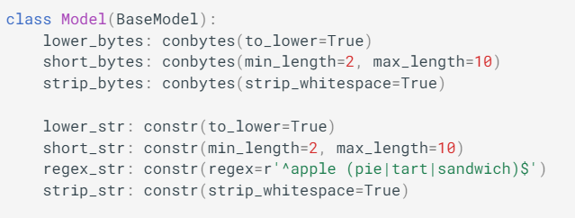
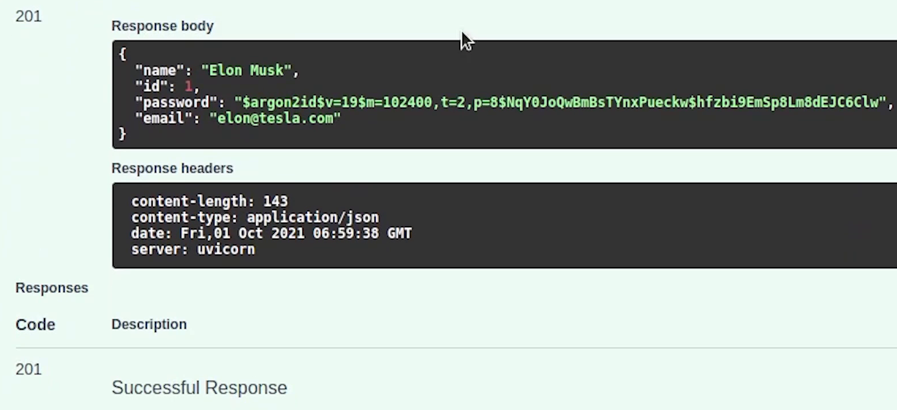

Hello everyone ! Welcome to PyCharm FastAPI Tutorial Series. 
In this tutorial we are going to implement RestAPIs for our User module. Before 
moving forward, I need to speak about Pydantic and its benefits.


# Pydantic

You must be aware that FastAPI & Typer uses Pydantic. [Pydantic](https://pydantic-docs.helpmanual.io/) helps 
in data validation and setting management also enforces python 
type hints during runtime. It’s extremely fast and easy to use as well !


If you have already worked with serializers in drf and marshmallow 
with flask then definitely you can compare their similarity with pydantic.


Pydantic also supports dataclasses, if you want the same kind of
validation in dataclasses instead of using the base model. 

Keep in mind that pydantic data class is a drop-in replacement.


Coming to benchmarks, Pydantic is very fast compared to 
other validation libraries. You can observe that 
```django-rest-framework``` is **12.3x** slower along-with ```marshmallow``` which is **2.4x** slower.

You don’t need to install pydantic separately, it’s already bundled with FastAPI.

Let me go back to the IDE, and create a few files which I will explain their usage in a while.


# Schema Definition

In the **schema.py** file, We are going to write our pydantic models.

Let me do the necessary imports. I will create a class **User** which imports **BaseModel**. 

As from the pydantic documentation, The primary means of defining objects in 
pydantic is via models *(models are simply classes which inherit from BaseModel)*.


As you can see we have created three fields: ```name```, ```email```, ```password```.


**Name** is constr which is basically a **Constrained Type**. It’s possible to 
define primitive types that have more constraints on their values. The 
str must have at least 2 characters and max 50 characters.

Email requires **[email-validator](https://pypi.org/project/email-validator/)** to be installed; the input string 
must be a valid email address. 

Make sure to install email-validator otherwise the **EmailStr** will throw an error.


```
pip install email-validator==1.13
```

And finally the password will be a normal string.

If you are interested to know more about different types of validators, then it’s 
already mentioned in the [official documentation](https://pydantic-docs.helpmanual.io/), you can check over there.


As you can see we can do a lot of things with Pydantic, like converting to
lowercase, strip whitespaces and even regex pattern matching.


Image Credits : Pydantic


Our schema has been successfully defined, now switch back to **router.py** file.

# API Router
Once your application starts growing up, you might need to place your
path operations in a specific file like what we are going to do in our 
router.py file. This helps better organize your code and focus only on 
the user routes.

We are going to import the **APIRouter** and create an instance for it.

I will also do the necessary imports apart from api router like 
```Depends```, ```status```, ```Response``` and ```HTTPException``` which 
will be required.

I am also going to do imports from ```sqlalchemy```, ```services```, ```validator```, ```schema``` etc.


Don’t worry about now I will be writing the implementation in the above files which I mentioned like services and validator.


As you can see on line number **8**, we are going to create an instance of our APIRouter.


It’s going to be prefixed with **“/user”** and I will also provide a tag name, which helps in categorizing it easily.

Let’s begin by creating our first api endpoint for our User Registration. 


I will create an async function ```create_user_registration``` in which I am going to pass two params,
one is a **request** which takes in User schema, the pydantic model which
we defined earlier and the second one is the **database**, if you don’t 
mention anything in database it will accept it as query parameter 
which we don’t want.

The database is going to be a type of Session which comes from SQLAlchemy, 
if you now directly go and run it, then it throws an error saying it’s
not a valid pydantic field.


# Dependency Injection

To overcome that we are going to use **Depends**, which is basically a
[Dependency Injection](https://fastapi.tiangolo.com/tutorial/dependencies/) provided by FastAPI itself. 

We are going to inject the **get_db** connection.

As per the FastAPI Documentation: *Dependency Injection means, 
in programming, that there is a way for your
code (in this case, your path operation functions) to declare
things that it requires working and use: "dependencies"*.

This is very useful when you need to:

- Have shared logic (the same code logic again and again).
- Share database connections.
- Enforce security, authentication, role requirements, etc.
- minimizing code repetition.

I encourage you to check more about this in the FastAPI Documentation. You can
even create [sub-dependencies](https://fastapi.tiangolo.com/tutorial/dependencies/sub-dependencies/) and [global dependencies](https://fastapi.tiangolo.com/tutorial/dependencies/global-dependencies/) as well.

# Validation

Moving ahead with our API creation, we need to first make sure to 
check whether email already exists in the database or not. If it 
exists then we won’t allow the user to register again with the same email address.


I am going to create a ```verify_email_exist``` function which is going to take email and database.


Email will be string and database will be session, let me change database 
to db_session that looks more clear to me.

The function might return User, or it will return None. 

Let me come back to the router.


If a user exists then I will raise an HTTPException with status 400 and a message.

If the user is not present then I will move ahead and store the new record in the db.  I will write the business logic in services where I will create a function called ```new_user_register```.


One thing I missed is that the function needs to be async. Async and Await go hand in hand.


Taking a pause in the router at line between 14-18, you might be thinking this validation
could have taken care at the pydantic level itself. 

You shouldn't be performing any IO inside pydantic validators. I was also
exploring in the beginning, when I came across this interesting issue
where there is discussion going on for Pydantic validation with 
database connection. 

You can check out this link to know more about it : [https://github.com/tiangolo/fastapi/issues/979](https://github.com/tiangolo/fastapi/issues/979)


Luckily, I got a chance to interact with Sebastian in PyCon India 2021, and to
get rid of these issues he built something called [SQLModel](https://sqlmodel.tiangolo.com/) which you 
might have heard recently. It is designed to be compatible with FastAPI,
Pydantic, and SQLAlchemy.

Do check out SQLModel documentation, it’s quite interesting.


# User Register Service

Coming back to PyCharm, let’s move ahead with our register function. I am going to do as usual 
necessary imports.

The function is going to return a new User object. 


We are now going to commit and then refresh.


Basically,```db.refresh``` means to expire and then immediately
get the latest data for the object from the database. It involves
an immediate database query, which you may consider unnecessarily expensive.

You can use the type annotation, it’s not mandatory. But it’s good
to use because this is going to be the future of Python
where everything will be leading towards type hints. PyCharm does
provide great support for type hints.


So, our router part is done. Now we need to register the route in 
our main controller.

Open **main.py**, first I am going to remove the two routes which were 
generated through PyCharm. We don’t need this anymore.


Let me give brief information to our API Docs, we can add more information. I am
just sticking to only title and version.

Now, we need to include the router. I will type ```app.include_router()```

I am going to import the user router and pass it in the ```include_router```.


Registering our router is done. Let’s move ahead and start our server. Open the browser and navigate to docs.

Looks like I missed something.  I missed adding the router decorator to our function. 


It’s going to be a POST method, pointing at / slash path and 201 status code will be returned in response.


**router.py**
```python

from typing import List

from fastapi import APIRouter, Depends, status, Response, HTTPException
from sqlalchemy.orm import Session

from ecommerce import db
from ecommerce.auth.jwt import get_current_user
from . import schema
from . import services
from . import validator

router = APIRouter(
    tags=['Users'],
    prefix='/user'
)


@router.post('/', status_code=status.HTTP_201_CREATED)
async def create_user_registration(request: schema.User, database: Session = Depends(db.get_db)):
    # Read More : Pydantic Validation with Database (https://github.com/tiangolo/fastapi/issues/979)

    user = await validator.verify_email_exist(request.email, database)
    if user:
        raise HTTPException(
            status_code=400,
            detail="The user with this email already exists in the system.",
        )

    new_user = await services.new_user_register(request, database)
    return new_user

```


Let me check what is coming up in docs.


Thanks to Pydantic, the schema was generated very smoothly.


Let me try out the API and try registering a new user. I will provide a name, 
email and password and click on **Execute**.


Before going ahead, there is an issue in storing password. Let me fix it quickly and try again.

This issue has been already addressed. You can get the latest copy of the source code from GitHub.

Replace ```self.password``` with ```password```


I will try now to register. 


Yes, it works. Our user has been successfully registered.  




I am returning the user model response, if you want you can even return a custom response.

I hope you enjoyed this tutorial. In the upcoming tutorial I will be 
focusing more on writing rest apis for other modules. 

Stay tuned !


