Hello everyone! Welcome to the PyCharm FastAPI Tutorial Series.

We have successfully created the user registration API. Let’s quickly move on
and complete the remaining APIs for our User module like getting a 
list of all users, retrieving or deleting user information based on id
or primary key.


# User Listing

Back to our **router.py**

I am going to create a function ```get_all_users``` which will return the list of all users from the database.

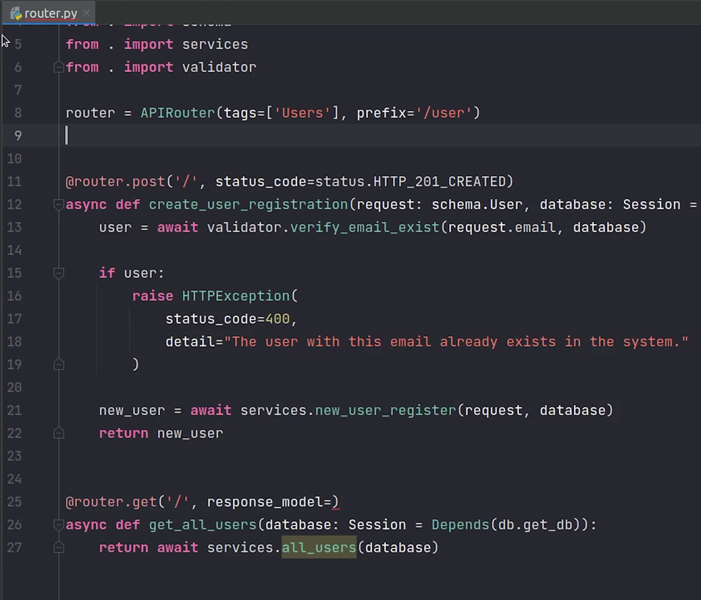

I am going to register the route and create a response model.

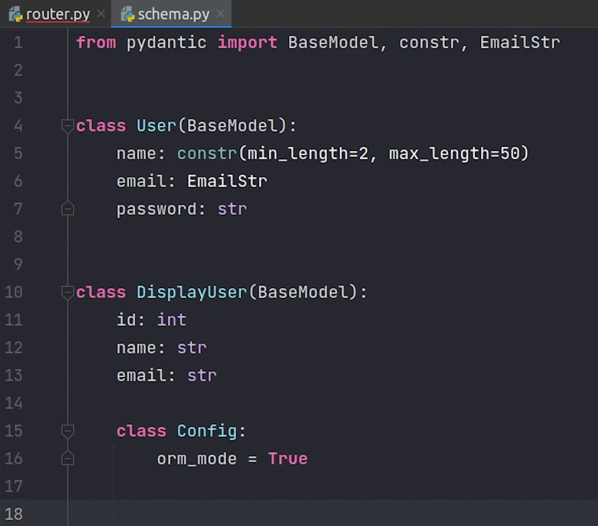

I will move to schema and create a class DisplayUser which inherits from BaseModel.

I will be returning **id**, **name** and **email**.


We will be creating a Config class, which controls the behaviour of Pydantic, 
in this we are going to set the attribute ```orm_mode=True```, which basically
is to map the ORM Objects defined in our models. As per the FastAPI
Documentation, without ```orm_mode```, if you returned a SQLAlchemy 
model from your path operation, it wouldn't include the relationship 
data...even if you declared those relationships in your Pydantic models.

But with ORM mode, as Pydantic itself will try to access the data 
it needs from attributes (instead of assuming a dict).

You can visit this link for more information : [ORM Mode (aka Arbitrary Class Instances)](https://pydantic-docs.helpmanual.io/usage/models/#orm-mode-aka-arbitrary-class-instances)


In our response model we are going to use ```List```, because we will return
a list of user objects instead of one object.

```python
@router.get('/', response_model=List[schema.DisplayUser])
async def get_all_user(database: Session = Depends(db.get_db), current_user: schema.User = Depends(get_current_user)):
    return await services.all_users(database)
```

Let's go ahead and create our service for ```all_users```

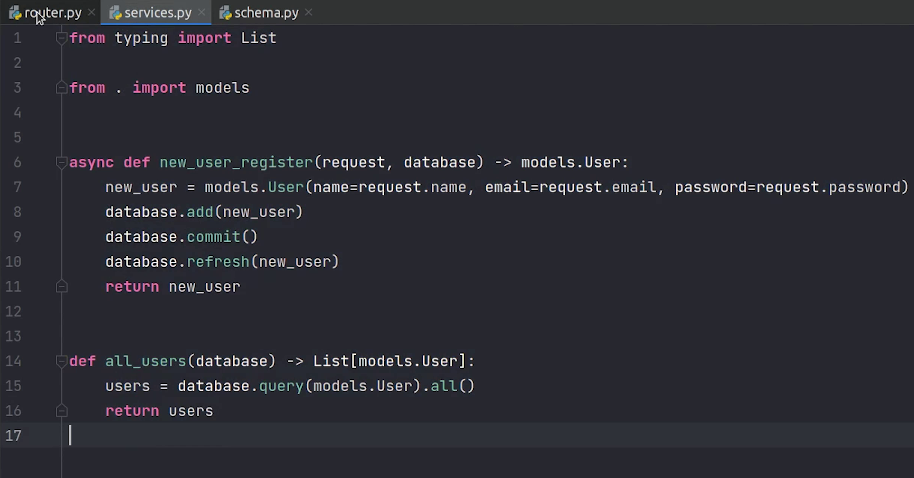

We will be returning all users from the database.

Once done, I will check the API is reflecting in the Swagger UI.

And yes, the new endpoint is reflecting. Let me test it out.

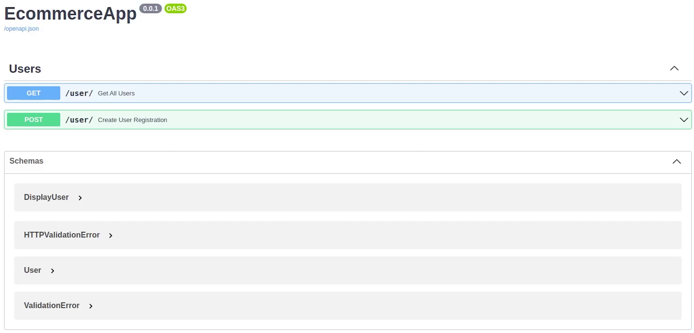

Yes, it works fine. As of now I only have one user, let me create some dummy users and check again.

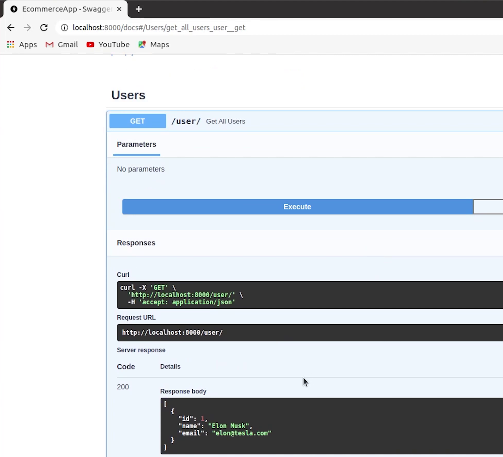

After creating some dummy users, you can see we received a list of users present in our database.

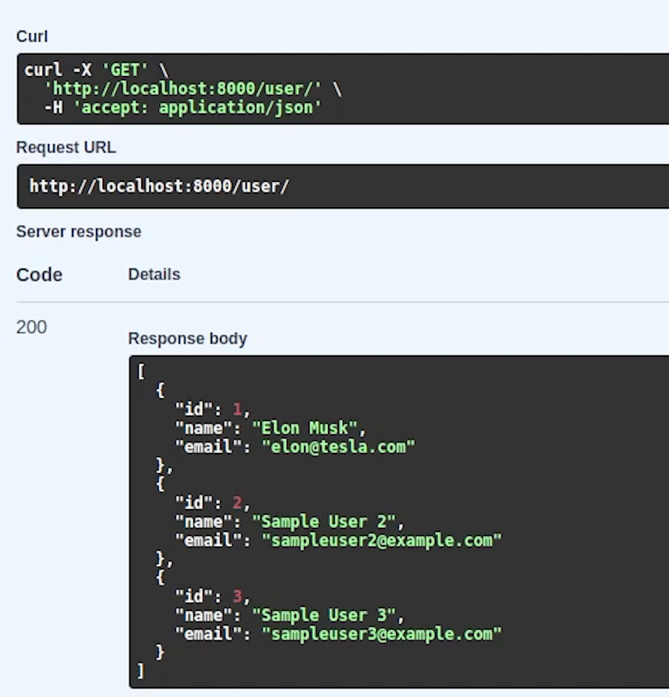


# Retrieving User by ID

Now, let’s go back to the router and create a new endpoint to
retrieve user details by id, basically focusing on one particular
user information. 

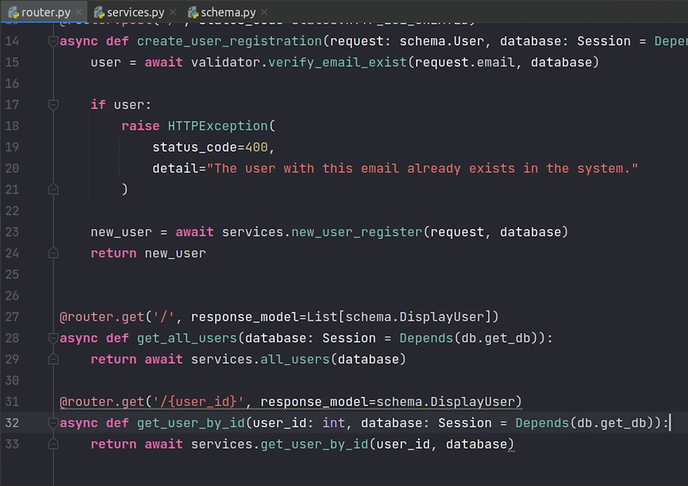

The route is going to receive ```user_id``` which we will take in the path parameter. 


```python
@router.get('/{user_id}', response_model=schema.DisplayUser)
async def get_user_by_id(user_id: int, database: Session = Depends(db.get_db),
                         current_user: schema.User = Depends(get_current_user)):
    return await services.get_user_by_id(user_id, database)
```

The response model will return ```DisplayUser```, we will be returning only one user, so there is no point in using a list.

I will create a new service ```get_user_by_id```, in which I will pass the user id and the database.

I will be using ```Optional``` because the user might be there in the db or not. 

If the user is present that’s good I will return the user object else I will raise an exception.

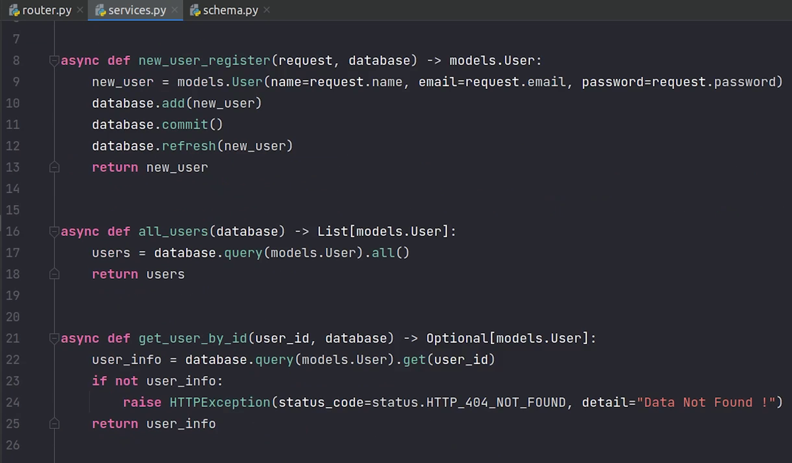

```python
async def get_user_by_id(user_id, database) -> Optional[models.User]:
    user_info = database.query(models.User).get(user_id)
    if not user_info:
        raise HTTPException(status_code=status.HTTP_404_NOT_FOUND, detail="Data Not Found !")
    return user_info
```

Looks good! Let me check in the browser again. 

Yes, it’s reflecting. I will try to send the ```user id``` of a specific user and test.


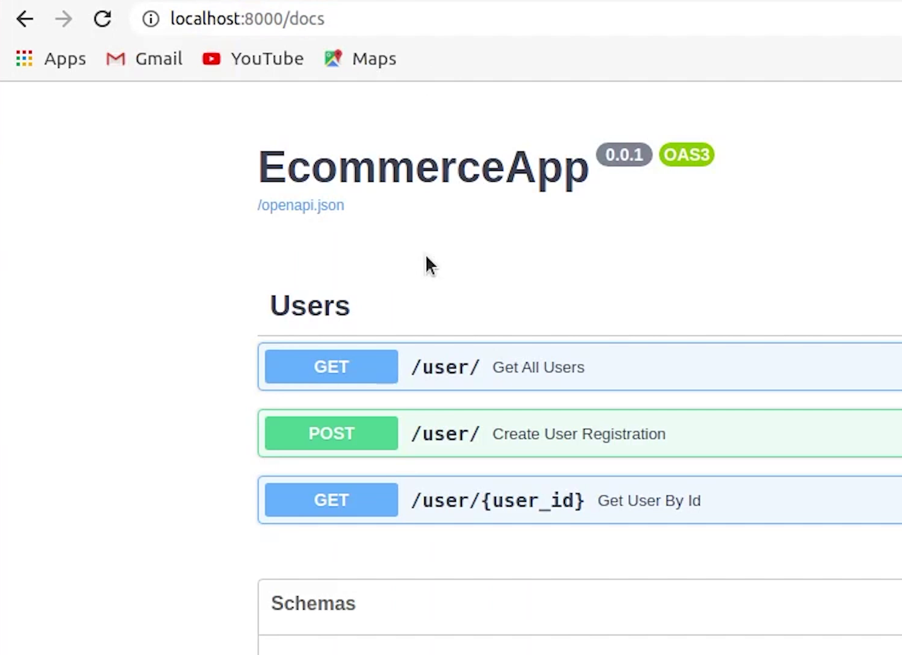

If I pass 1 it will return **Elon Musk**, 2 and 3 will return **Sample User 2** and **Sample User 3**.

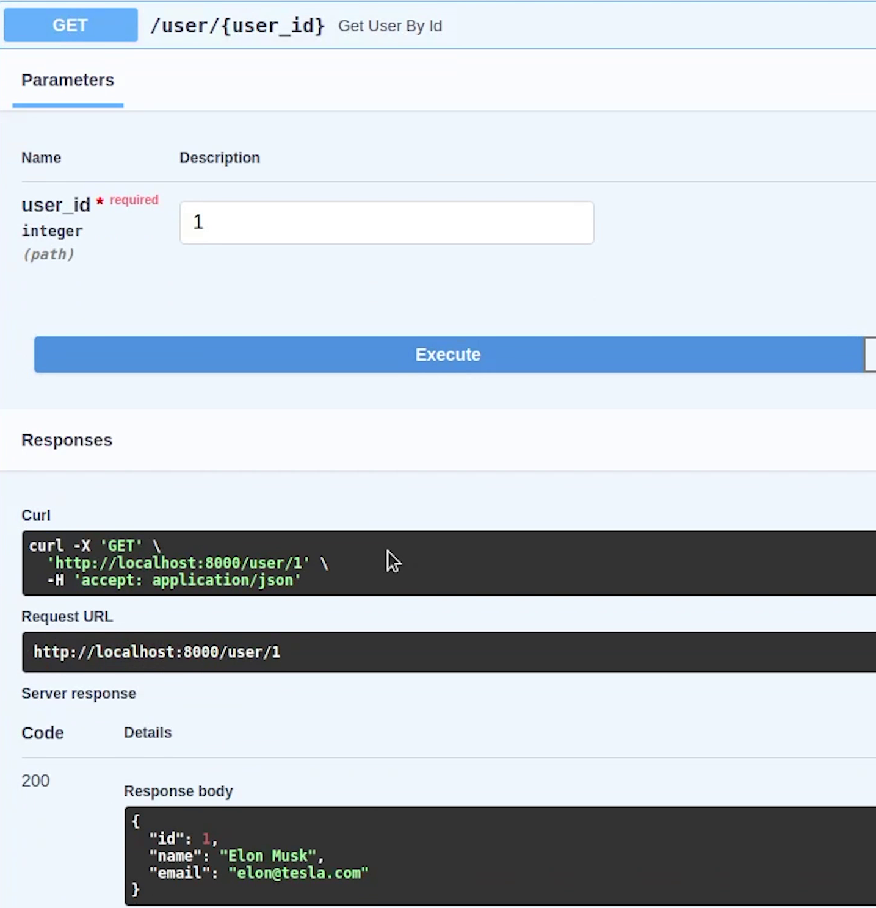

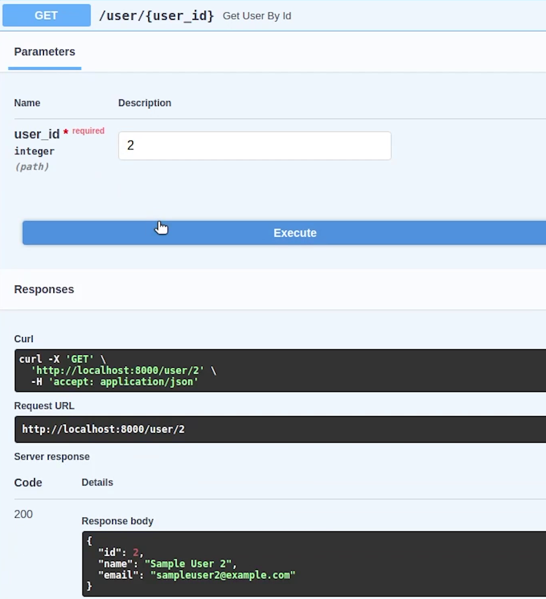

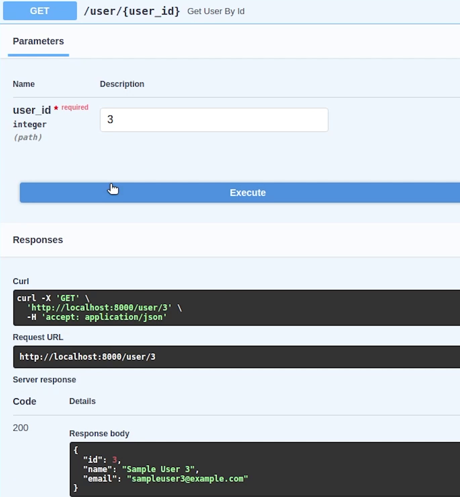

# Delete User

Let’s move back again to the router and create our last 
endpoint **delete user by id**. Same as previous, only difference... 
we won’t return any response. Instead, we delete the object from the database.


The response class will be the base `Response` class. You can create your own custom 
response class or when creating a FastAPI class instance or an 
APIRouter you can specify which response class to use by default.

**router.py**

```python
@router.delete('/{user_id}', status_code=status.HTTP_204_NO_CONTENT, response_class=Response)
async def delete_user_by_id(user_id: int, database: Session = Depends(db.get_db),
                            current_user: schema.User = Depends(get_current_user)):
    return await services.delete_user_by_id(user_id, database)
```
**services.py**

```python
async def delete_user_by_id(user_id, database):
    database.query(models.User).filter(models.User.id == user_id).delete()
    database.commit()
```
To know more about custom response, visit this [link](https://fastapi.tiangolo.com/advanced/custom-response/#default-response-class).


We successfully created the four endpoints: 
- user registration
- listing
- retrieving user by id
- delete user

**router.py**

```python
from typing import List

from fastapi import APIRouter, Depends, status, Response, HTTPException
from sqlalchemy.orm import Session

from ecommerce import db
from ecommerce.auth.jwt import get_current_user
from . import schema
from . import services
from . import validator

router = APIRouter(
    tags=['Users'],
    prefix='/user'
)

# Interesting Question for Global Dependency
# https://github.com/tiangolo/fastapi/issues/2481


@router.post('/', status_code=status.HTTP_201_CREATED)
async def create_user_registration(request: schema.User, database: Session = Depends(db.get_db)):
    # Read More : Pydantic Validation with Database (https://github.com/tiangolo/fastapi/issues/979)

    user = await validator.verify_email_exist(request.email, database)
    if user:
        raise HTTPException(
            status_code=400,
            detail="The user with this email already exists in the system.",
        )

    new_user = await services.new_user_register(request, database)
    return new_user


@router.get('/', response_model=List[schema.DisplayUser])
async def get_all_user(database: Session = Depends(db.get_db), current_user: schema.User = Depends(get_current_user)):
    return await services.all_users(database)


@router.get('/{user_id}', response_model=schema.DisplayUser)
async def get_user_by_id(user_id: int, database: Session = Depends(db.get_db),
                         current_user: schema.User = Depends(get_current_user)):
    return await services.get_user_by_id(user_id, database)


@router.delete('/{user_id}', status_code=status.HTTP_204_NO_CONTENT, response_class=Response)
async def delete_user_by_id(user_id: int, database: Session = Depends(db.get_db),
                            current_user: schema.User = Depends(get_current_user)):
    return await services.delete_user_by_id(user_id, database)
```

**services.py**

```python
from typing import List, Optional

from fastapi import HTTPException, status

from . import models


async def new_user_register(request, database) -> models.User:
    new_user = models.User(name=request.name, email=request.email, password=request.password)
    database.add(new_user)
    database.commit()
    database.refresh(new_user)
    return new_user


async def all_users(database) -> List[models.User]:
    users = database.query(models.User).all()
    return users


async def get_user_by_id(user_id, database) -> Optional[models.User]:
    user_info = database.query(models.User).get(user_id)
    if not user_info:
        raise HTTPException(status_code=status.HTTP_404_NOT_FOUND, detail="Data Not Found !")
    return user_info


async def delete_user_by_id(user_id, database):
    database.query(models.User).filter(models.User.id == user_id).delete()
    database.commit()
```

Let’s re-test the delete feature.


I will delete the user id **3**. 


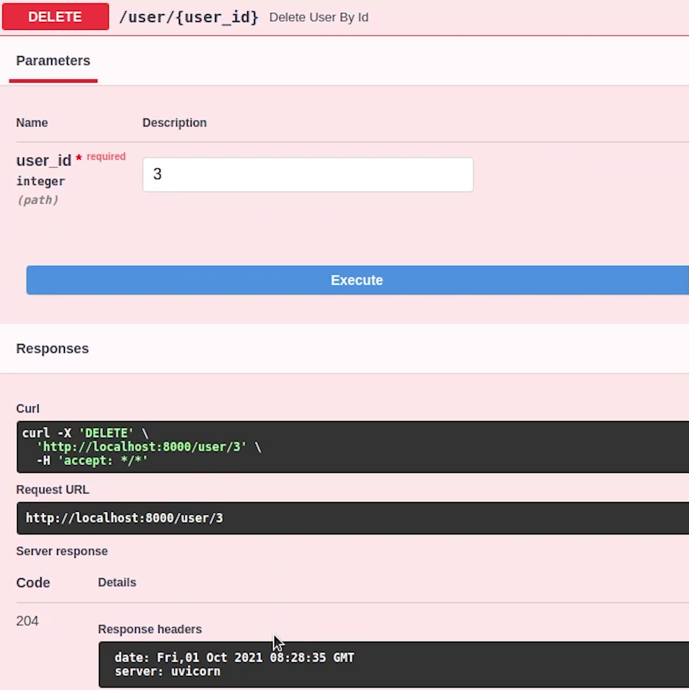

You can see I got the response **204**.

If I now try to retrieve the information for user id 3, it will raise an exception with a not found message.

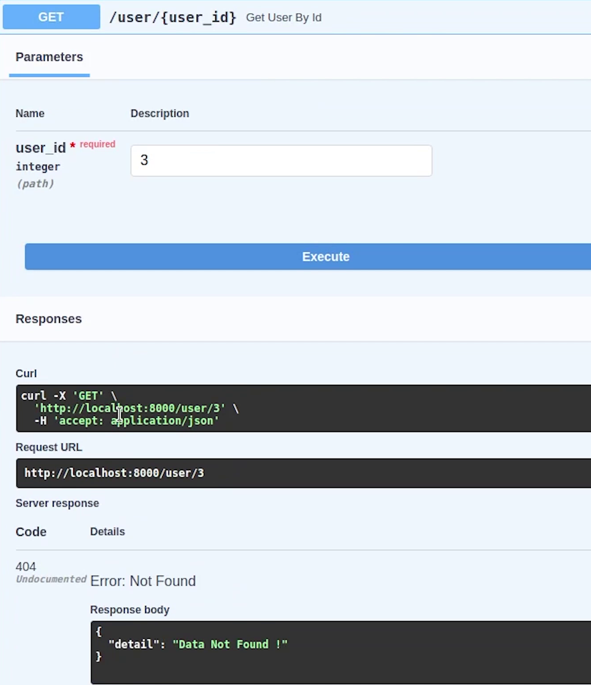

You can also see, the user listing is returning two objects, the third object has been successfully deleted.

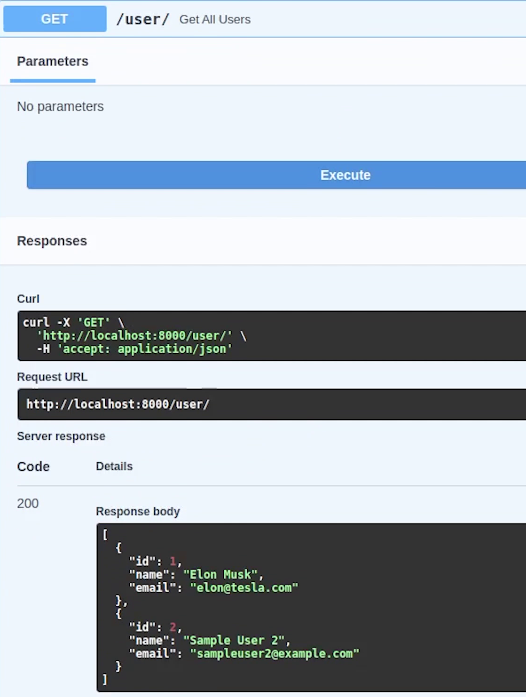

Great! We have successfully completed the User module.

So, stay tuned. I will see you in the next tutorial, where we will be covering the products.
