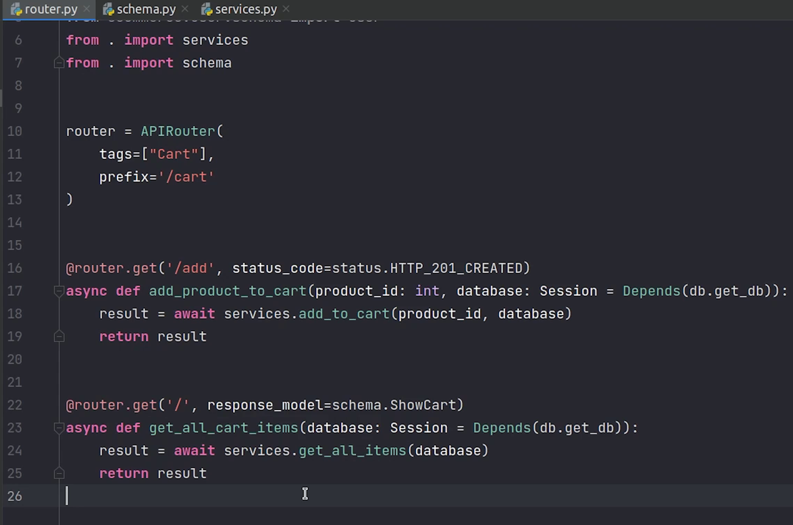

Hello everyone! Welcome to the PyCharm FastAPI Tutorial Series.


# ReDoc

As you know FastAPI provides  automatic docs support using Swagger UI. There is one more
docs page provided by FastAPI known as **[Redoc](https://github.com/Redocly/redoc)**. 

**Redoc** is an open-source tool for generating documentation from OpenAPI definitions.

Point to your browser to **/redoc** path.


By default, Redoc offers a three-panel, responsive layout:

- The left panel contains a search bar and navigation menu.
- The central panel contains the documentation.
- The right panel contains request and response examples.


You can even disable the docs along with changing the docs url path.


# HTTPClient

There is one more thing I would like to mention. You can test the APIs through 
PyCharm itself via [HTTPClient](https://www.jetbrains.com/help/pycharm/http-client-in-product-code-editor.html).

Click on **Tools** → **HTTP Client** → **Create Request in HTTP Client**.


I am going to copy the `curl` request and try to run it.


You can see we are receiving the response, this is something you can try out when working with PyCharm.


# Cart

Coming back to the tutorial, we are going to focus on working on two modules: Order and Cart, both are interrelated.

Let’s begin by creating models for our cart module.


I am going to do the necessary imports.

Next, I will be creating two classes: **Cart** and **CartItems**.


Let me give you a high-level overview.

So, in the cart table you can see that every user will be getting a unique cart id.

And CartItems will be storing cart id and product id. In this way, we will easily identify how many items are there in the cart for a particular user.

You can observe that we have created relationships with cart and product, also a foreign key mapping of user in cart model.

**models.py**
```python
from datetime import datetime

from sqlalchemy import Column, Integer, ForeignKey, DateTime
from sqlalchemy.orm import relationship

from ecommerce.db import Base
from ecommerce.products.models import Product
from ecommerce.user.models import User


class Cart(Base):
    __tablename__ = "cart"

    id = Column(Integer, primary_key=True, autoincrement=True)
    user_id = Column(Integer, ForeignKey(User.id, ondelete="CASCADE"), )
    cart_items = relationship("CartItems", back_populates="cart")
    user_cart = relationship("User", back_populates="cart")
    created_date = Column(DateTime, default=datetime.now)


class CartItems(Base):
    __tablename__ = "cart_items"

    id = Column(Integer, primary_key=True, autoincrement=True)
    cart_id = Column(Integer, ForeignKey("cart.id", ondelete="CASCADE"), )
    product_id = Column(Integer, ForeignKey(Product.id, ondelete="CASCADE"), )
    cart = relationship("Cart", back_populates="cart_items")
    products = relationship("Product", back_populates="cart_items")
    created_date = Column(DateTime, default=datetime.now)
```

Reference:
- [Concepts of backref and back_populate in SQLAlchemy](https://stackoverflow.com/questions/51335298/concepts-of-backref-and-back-populate-in-sqlalchemy)


Now, I will go to the user model and product model where I will create back populates with the cart and cart items.


Let’s move ahead and create the schema. Before that, don't forget to register the model.


For migrate, I will type the below command : 

```
alembic revision --autogenerate
alembic upgrade head
```

The tables are reflecting in our database.

You can observe the foreign key relationships. In cart items we have the foreign key
with cart id and product id. 

In the cart table we have a foreign key with user id.


Our model part is done, let’s move to cart where we will be creating routes, 
services, schema etc.


I am going to create the router and do the necessary imports.

We will create the **APIRouter** and provide the tag name as **Cart**.

We will be creating three apis for our cart.

 - Adding product to the cart
 - Getting all the items present in the cart
 - Removing cart item by id

Let’s begin by writing our first api, add product to the cart.

We will be passing ```product_id``` and also validate whether that 
specific product exists in our database or not.

**router.py**

```python
@router.get('/add', status_code=status.HTTP_201_CREATED)
async def add_product_to_cart(product_id: int, 
                              database: Session = Depends(db.get_db)):
    result = await add_to_cart(product_id, database)
    return result
```

We will also validate whether product quantity is less than
or equal to 0. If so, then the item is out of stock.


On line 18, we will try to get the user information. For now, as a workaround
I will provide the email manually but in the upcoming videos when we will 
be working on auth and jwt, I will get the user info from the token.

Next, I will try to get cart information. If not present then we will create a new one.


Now, I am going to create one more async function ```add_items``` in which I will pass cart id and product id.


**services.py**

```python
async def add_to_cart(product_id: int, database: Session = Depends(db.get_db)):
    product_info = database.query(Product).get(product_id)
    if not product_id:
        raise HTTPException(status_code=status.HTTP_404_NOT_FOUND, detail="Data Not Found !")

    if product_info.quantity <= 0:
        raise HTTPException(status_code=status.HTTP_404_NOT_FOUND, detail="Item Out of Stock !")

    user_info = database.query(User).filter(User.email == "elon@tesla.com").first()

    cart_info = database.query(Cart).filter(Cart.user_id == user_info.id).first()
    if not cart_info:
        new_cart = Cart(user_id=user_info.id)
        database.add(new_cart)
        database.commit()
        database.refresh(new_cart)
        await add_items(new_cart.id, product_info.id, database)
    else:
        await add_items(cart_info.id, product_info.id, database)
    return {"status": "Item Added to Cart"}
```

We are done with the implementation, I am going to register the cart router.


Let’s now test the api in swagger.

I am going to pass a valid product id. 


You can see we got success response with 201 status code and message “Item Added to Cart”

I am going to re-verify the database whether a record has been added or not.


Yes, it exists. You can see the cart id coming from the cart table as foreign key relationship.


Let’s move on with the remaining two apis, get and remove items from the cart.


I am going to create a Pydantic Schema which will be helpful for retrieving items from the cart.

I will create a class ```ShowCartItems``` which inherits the BaseModel.

Products are going to fetch the information from the product schema.

I will create one more class called ```ShowCart``` which is going to return the list of cart items.


**schema.py**

```python
import datetime
from typing import List

from pydantic import BaseModel

from ecommerce.products.schema import Product


class ShowCartItems(BaseModel):
    id: int
    products: Product
    created_date: datetime.datetime

    class Config:
        orm_mode = True


class ShowCart(BaseModel):
    id: int
    cart_items: List[ShowCartItems] = []

    class Config:
        orm_mode = True
```

I will move back to the router, where I will continue working on the api to get all cart items.



At line 41, I am trying to pass the email manually but in the later videos we are going to change it.


We are done, let’s check what response we are getting.


As you can see we got the cart information along-with detailed product information.


Let’s continue with our last api remove cart item by id.

In delete api there is no response in return, only the status code of 204.

**router.py**

```python
@router.delete('/{cart_item_id}', status_code=status.HTTP_204_NO_CONTENT, response_class=Response)
async def remove_cart_item_by_id(cart_item_id: int, 
                                 database: Session = Depends(db.get_db)):
    await remove_cart_item(cart_item_id, database)
```


First, we need to get the user information, then the cart id of that specific user.


**services.py**

```python
async def remove_cart_item(cart_item_id: int, database) -> None:
    user_info = database.query(User).filter(User.email == "elon@tesla.com").first()
    cart_id = database.query(Cart).filter(User.id == user_info.id).first()
    database.query(CartItems).filter(and_(CartItems.id == cart_item_id, CartItems.cart_id == cart_id.id)).delete()
    database.commit()
    return
```

We are done, let’s test it out.


I am going to pass a valid cart item id.
      
                                             

You can see the item has been deleted. Let me verify that.

                                             

As you can see, the "get all cart items" API has returned an empty list. That means
our cart item was successfully deleted and now our cart is completely empty.

                                             

I hope you understand how cart functionality works. Instead of storing cart items 
in a database you can store cart items in memory like redis, you can play with
that completely up to you.

In the next tutorial, we will work on the Order where we are going to see
how to place an order successfully.

Stay tuned!
