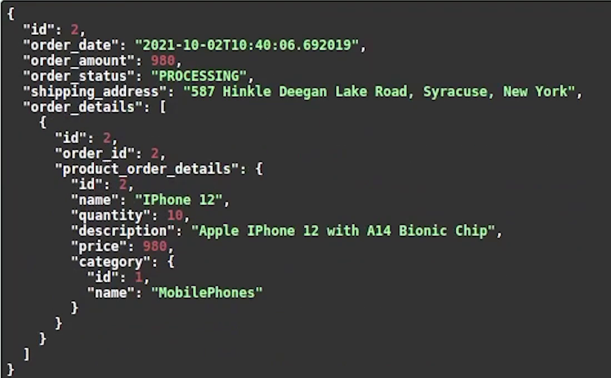

Hello everyone ! Welcome to PyCharm FastAPI Tutorial Series.


As you know we have covered most of our apis, we have completed working on the cart feature.

Currently, we have some products in our cart. Now, we are going to place an order.

Let’s move forward and complete the order module.


# New Order

Same as usual I am going to create **models.py** file.

Let me do the necessary imports.

I will create two classes, ```Order``` and ```OrderDetails```.


**models.py**

```python

from datetime import datetime

from sqlalchemy import Column, Integer, String, Float, ForeignKey, Text, DateTime
from sqlalchemy.orm import relationship
from ecommerce.user.models import User
from ecommerce.products.models import Product
from ecommerce.db import Base


class Order(Base):
    __tablename__ = "order"

    id = Column(Integer, primary_key=True, autoincrement=True)
    order_date = Column(DateTime, default=datetime.now)
    order_amount = Column(Float, default=0.0)
    order_status = Column(String, default="PROCESSING")
    shipping_address = Column(Text)
    customer_id = Column(Integer, ForeignKey(User.id, ondelete="CASCADE"), )
    order_details = relationship("OrderDetails", back_populates="order")
    user_info = relationship("User", back_populates="order")


class OrderDetails(Base):
    __tablename__ = "order_details"

    id = Column(Integer, primary_key=True, autoincrement=True)
    order_id = Column(Integer, ForeignKey('order.id', ondelete="CASCADE"), )
    product_id = Column(Integer, ForeignKey(Product.id, ondelete="CASCADE"), )
    order = relationship("Order", back_populates="order_details")
    product_order_details = relationship("Product", back_populates="order_details")
    quantity = Column(Integer, default=1)
    created = Column(DateTime, default=datetime.now)
```

Order table will contain columns like ordering date, amount, order status, 
shipping address and foreign key relationship with user and order details.


Order details table will contain foreign key relationships with order
and products table along-with quantity and created date.


Basically, we shouldn’t do ```CASCADE```, because in future if someone deletes 
the product then order & order details will also get removed. But of course we don’t want 
to do that because we need to preserve order information. It doesn't matter in future 
if the product gets removed from the system the order information should be preserved. 

This is a tutorial. We can ignore this scenario, but when working 
in a real-world scenario we need to store it which may be beneficial
for future audit purposes.

Let me go to the product and user model and create the references.

Let me now register the model and generate the schema.  


For generating the schema, I will type the following command : 

```
alembic revision --autogenerate
alembic upgrade head
```

The schema has been generated successfully, let me just do a cross-check in the database.


You can observe the table along-with the connected relationships.

Next, I am going to create the router file and do necessary imports.

I will also create other two files : services and schema.

I am going to initialize the ```APIRouter``` and provide the tags name as ```Orders```.


We are going to work on two apis :

- one is returning the orders list 
- and the second one is initiating or placing a new order


Placing a new order is not like we are going to
use PayPal or going to do any live transaction. We are just going to
do a demo of the order flow.


So, let’s begin our first api on initiate order, or you can say placing order.  

**router.py**

```python
from typing import List

from fastapi import APIRouter, Depends, status
from sqlalchemy.orm import Session

from ecommerce import db
from ecommerce.orders.services import initiate_order, get_order_listing
from ecommerce.user.schema import User
from .schema import ShowOrder

router = APIRouter(
    tags=['Orders'],
    prefix='/orders'
)


@router.post('/', status_code=status.HTTP_201_CREATED, response_model=ShowOrder)
async def initiate_order_processing(database: Session = Depends(db.get_db)):
    result = await initiate_order(database)
    return result
```

I am going to create a pydantic schema for our ```ShowOrder``` class.

**schema.py**

```python
import datetime
from typing import List, Optional

from pydantic import BaseModel

from ecommerce.products.schema import ProductListing


class ShowOrderDetails(BaseModel):
    id: int
    order_id: int
    product_order_details: ProductListing

    class Config:
        orm_mode = True


class ShowOrder(BaseModel):
    id: Optional[int]
    order_date: datetime.datetime
    order_amount: float
    order_status: str
    shipping_address: str
    order_details: List[ShowOrderDetails] = []

    class Config:
        orm_mode = True
```

As you can see we created two classes ```ShowOrder``` and ```ShowOrderDetails```. ShowOrder 
will contain a list of OrderDetails, and OrderDetails will contain product information. You
can recall the foreign key relationship with ```Order``` and ```OrderDetails```.  

You can observe the nested linking between order, order details and products.

Moving back to the router, we are going to create a service named ```initiate_order```.

I will do the necessary imports.

First, I am going to get user information. Currently, we are manually retrieving 
through email but very soon we will change this implementation in our upcoming tutorial.


**services.py**

```python
from typing import List

from fastapi import HTTPException, status

from ecommerce.cart.models import Cart, CartItems
from ecommerce.orders.models import Order, OrderDetails
from ecommerce.user.models import User


async def initiate_order(database) -> Order:
    user_info = database.query(User).filter(User.email == "elon@tesla.com").first()
    cart = database.query(Cart).filter(Cart.user_id == user_info.id).first()

    cart_items_objects = database.query(CartItems).filter(Cart.id == cart.id)
    if not cart_items_objects.count():
        raise HTTPException(status_code=status.HTTP_404_NOT_FOUND, detail="No Items found in Cart !")

    total_amount: float = 0.0
    for item in cart_items_objects:
        total_amount += item.products.price

    new_order = Order(order_amount=total_amount,
                      shipping_address="587 Hinkle Deegan Lake Road, Syracuse, New York",
                      customer_id=user_info.id)  ## <-- I forgot to add this line, which has been rectified later.
    database.add(new_order)
    database.commit()
    database.refresh(new_order)

    bulk_order_details_objects = list()
    for item in cart_items_objects:
        new_order_details = OrderDetails(order_id=new_order.id,
                                         product_id=item.products.id)
        bulk_order_details_objects.append(new_order_details)

    database.bulk_save_objects(bulk_order_details_objects)
    database.commit()

    # Send Email
    # TODO in next tutorial

    # clear items in cart once new order is placed
    database.query(CartItems).filter(CartItems.cart_id == cart.id).delete()
    database.commit()

    return new_order

```

Next, I will be retrieving cart items. Then, we are going to calculate the total price of items present in our cart.

After that we are going to initiate the new order. We will do bulk insert of our order details objects.

Once the order has been successfully placed, we will send an email. But pausing it for now, we will come back later and work on the implementation. 

After we have successfully sent the email, we will clear the cart items and return the new order instance.

We are done with the implementation for placing an order. Let’s come back to the router and work on the second api : getting a list of orders.


**router.py**

```python
@router.get('/', status_code=status.HTTP_200_OK, response_model=List[ShowOrder])
async def orders_list(database: Session = Depends(db.get_db)):
    result = await get_order_listing(database)
    return result
```

The response will be returning a list of orders present in the db.

You can observe the ```get_order_listing``` function, it’s first going to retrieve user information
and after that it will return all order information for that specific user.

**services.py**

```python
async def get_order_listing(database) -> List[Order]:
    user_info = database.query(User).filter(User.email == "elon@tesla.com").first()
    orders = database.query(Order).filter(Order.customer_id == user_info.id).all()
    return orders
```

I am going to register the router in the **main.py** file.


I will come back to the swagger ui and refresh the page.


You can see the two apis.

First, let me see what I am getting from the order list api.


As you can see currently there are no orders, it has sent an empty list as a response.

You can see the cart that we have currently one item present, so that will be good enough to place a new order.


I am going to execute the **Initiate Order**.


You can observe that the order has been successfully placed and the current status 
is under processing. The response returned contains a nested schema which has order 
id  followed by order details and then product 
information along-with detailed category information.

Now, let’s check what’s coming in the order list.

Something is wrong. I forgot to add the customer id when creating a new order. Let me fix this quickly.


Let me manually update the customer id in the database itself. As you know we only missed the customer id otherwise everything is correct, I am just avoiding to repeat the whole process.


You can see we finally got the response, it’s returning a list of orders which contains deep nested information like order details, products and categories.


We have already purchased IPhone 13 whose product id was 1. Now we will purchase IPhone 12 whose product id is 2.
 
I am going to add the product to the cart.


We got one item in our cart. You can verify through get all cart items api.


Now, let’s initiate the order.
 


Okay, the order got placed. If I try to do it again, it won’t happen. As you know, once an order is placed we are cleaning our items present in the cart.

Let me check the OrderList API to see what it is going to return.


Ok, you can see that it returned a list of orders containing both products IPhone 12 & 13.

Finally, we completed the entire flow of the ecommerce application like creating users, products, categories, adding products, moving to cart and at last placing order.

In the next tutorial, I will show how to send an email using Redis and Celery.
