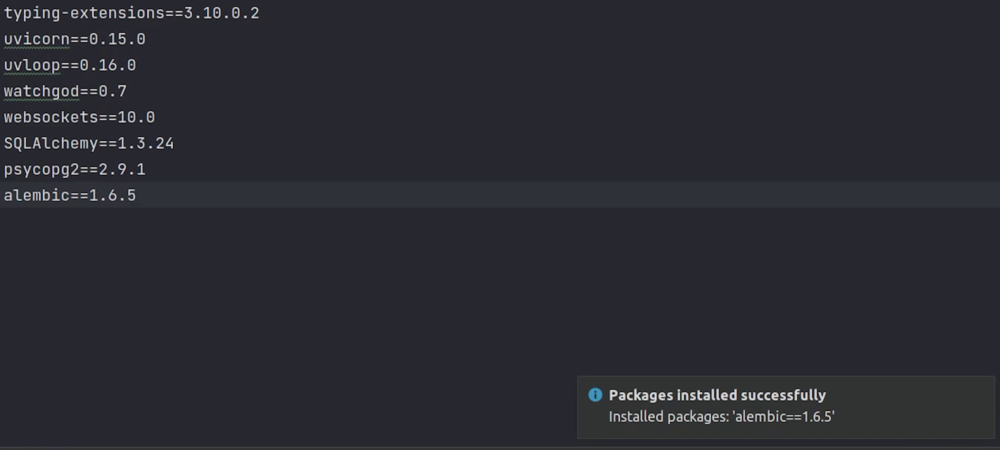
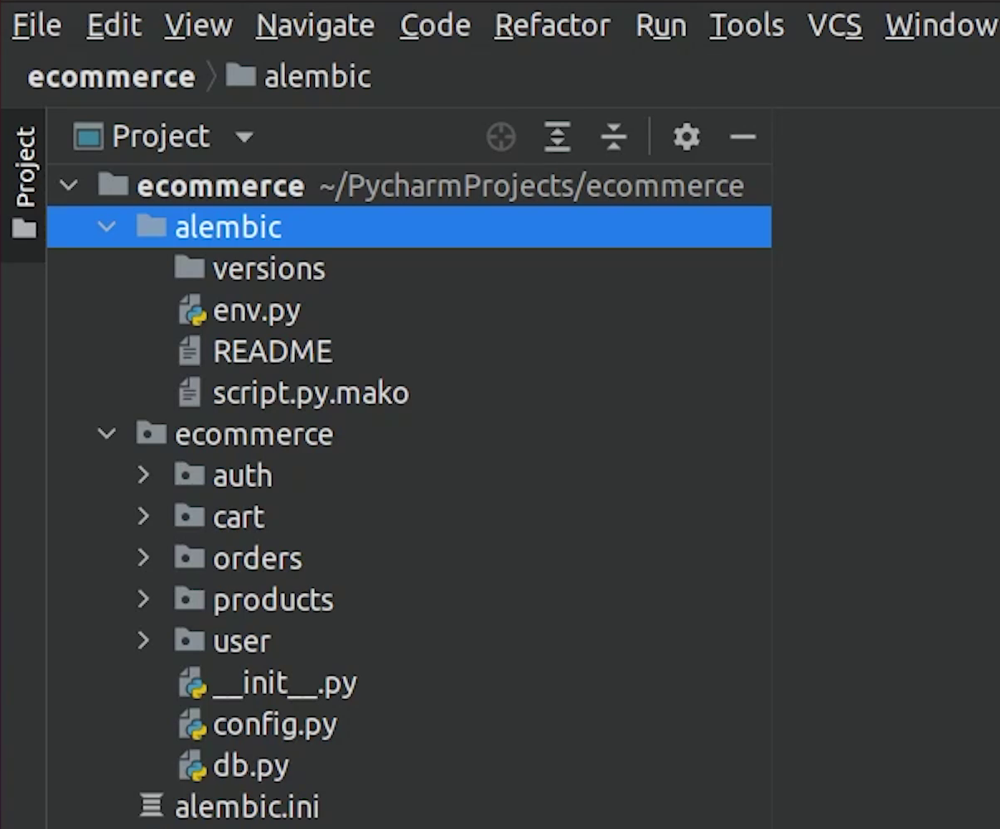

Hello everyone ! Welcome to PyCharm FastAPI Tutorial Series. In this tutorial we are going to connect FastAPI with Postgres. 


# DataGrip

Before moving ahead, let us connect to our Postgres Database via the 
[DataGrip](https://www.jetbrains.com/datagrip/) plugin which is already
bundled in PyCharm Professional.

I will click on the Database Explorer, then click on **plus (+)** and I will choose **Postgres**.


I will provide necessary credentials like host, port, username, password & database name.     


I will click on **Test Connection**, just to verify everything is working fine.

Once the connection is successful, I will click on **Apply** and then **OK**.


You can observe that there are no tables, so let’s begin by creating our database connection.


# Database Connection

I will create a **db.py** file and do the necessary imports from sqlalchemy and 
the config file from where I will need the environment 
variables like the username, password etc.


I will create the connecting string and name the variable ```SQLALCHEMY_DATABASE_URL```

Next, I will use the common functions like ```create_engine``` and ```sessionmaker``` 

As per the sqlalchemy documentation, the engine is the starting point for any 
SQLAlchemy application. It's the **“home base”** for the actual database and its db api.


In order to interact with the database, a session object is required. The purpose 
of ```sessionmaker``` is to provide a factory for session objects with a fixed configuration. 


The ```declarative_base``` characteristic is used to create a base class. This function is
described in ```sqlalchemy.Ext.Declarative``` module. Later we are going to inherit it to
create database models.


At line 22, We will create an instance of a ```SessionLocal()```, which is actually a database session.


**Source Code** : 

```python

from sqlalchemy import create_engine
from sqlalchemy.ext.declarative import declarative_base
from sqlalchemy.orm import sessionmaker

from . import config

DATABASE_USERNAME = config.DATABASE_USERNAME
DATABASE_PASSWORD = config.DATABASE_PASSWORD
DATABASE_HOST = config.DATABASE_HOST
DATABASE_NAME = config.DATABASE_NAME

SQLALCHEMY_DATABASE_URL = f"postgresql://{DATABASE_USERNAME}:{DATABASE_PASSWORD}@{DATABASE_HOST}/{DATABASE_NAME}"

engine = create_engine(SQLALCHEMY_DATABASE_URL)

SessionLocal = sessionmaker(autocommit=False, autoflush=False, bind=engine)

Base = declarative_base()


def get_db():
    db = SessionLocal()
    try:
        yield db
    finally:
        db.close()
```

# Migrations

We are done with the db config part, next we need to deal with something called **migrations**. 

It basically performs schema migrations whenever we add (or drop) tables or columns from our databases.

According to FastAPI docs : *A **"migration"** is the set of steps needed
whenever you change the structure of your SQLAlchemy models, add a new attribute, etc. to 
replicate those changes in the database, add a new column, a new table, etc.*

To know more about migration, check out this [link](https://fastapi.tiangolo.com/tutorial/sql-databases/).


For our tutorial, we will be using [Alembic](https://alembic.sqlalchemy.org/en/latest/). It is a widely used library for database 
migrations, you might have already heard about it.

Let’s begin by installing the package alembic with version 1.6.5, this is the version which we are going to use.



After successfully installing alembic, we will move ahead with initializing the setup.


# Alembic Setup

I am going to type **“alembic init alembic”**.

```
alembic init alembic
```


It creates a directory named **alembic** in the project root, along-with few files and a
subdirectory named **versions** which keeps track of migrations files. 

We are going to update the database configuration in the **env.py** file.





Again, I am going to do the necessary imports. Make sure to point target metadata to base metadata.
  


I will create a ```get_url``` function, where I will be returning the database connection string.


Make sure to update line number 52 with ```get_url``` function.


Comment the ```connectable``` variable which falls under ```run_migrations_online``` function.


**Source Code** :

```python
from __future__ import with_statement

from logging.config import fileConfig

from alembic import context
from sqlalchemy import engine_from_config, pool

# this is the Alembic Config object, which provides
# access to the values within the .ini file in use.
config = context.config

# Interpret the config file for Python logging.
# This line sets up loggers basically.
fileConfig(config.config_file_name)

# add your model's MetaData object here
# for 'autogenerate' support
# from myapp import mymodel
# target_metadata = mymodel.Base.metadata
# target_metadata = None

from ecommerce import config as config_env
from ecommerce.db import Base  

target_metadata = Base.metadata


# other values from the config, defined by the needs of env.py,
# can be acquired:
# my_important_option = config.get_main_option("my_important_option")
# ... etc.


def get_url():
    db_user = config_env.DATABASE_USERNAME
    db_password = config_env.DATABASE_PASSWORD
    db_host = config_env.DATABASE_HOST
    db_name = config_env.DATABASE_NAME
    return f"postgresql://{db_user}:{db_password}@{db_host}/{db_name}"


def run_migrations_offline():
    """Run migrations in 'offline' mode.

    This configures the context with just a URL
    and not an Engine, though an Engine is acceptable
    here as well.  By skipping the Engine creation
    we don't even need a DBAPI to be available.

    Calls to context.execute() here emit the given string to the
    script output.

    """
    url = get_url()
    context.configure(
        url=url, target_metadata=target_metadata, literal_binds=True, compare_type=True
    )

    with context.begin_transaction():
        context.run_migrations()


def run_migrations_online():
    """Run migrations in 'online' mode.

    In this scenario we need to create an Engine
    and associate a connection with the context.

    """
    configuration = config.get_section(config.config_ini_section)
    configuration["sqlalchemy.url"] = get_url()
    connectable = engine_from_config(
        configuration, prefix="sqlalchemy.", poolclass=pool.NullPool,
    )

    with connectable.connect() as connection:
        context.configure(
            connection=connection, target_metadata=target_metadata, compare_type=True
        )

        with context.begin_transaction():
            context.run_migrations()


if context.is_offline_mode():
    run_migrations_offline()
else:
    run_migrations_online()
```

We are done with the alembic setup. Next, we are going to create models for our user module.


# User Model

I am going to create **models.py** file under **user** and perform necessary imports.


I am going to create a class called ```User``` which is going to inherit ```Base```. My table 
name will be represented as **“users”**

I will define the necessary columns like id, name, email, password.

- **“Id”** will be the primary key and gets auto-increment on every new row insert. 
- **“Name”** will be string with max length of 50
- **“Email”** will be string but with a unique index.
- **“Password”** will also be a string with max 255 characters.


We won’t be storing passwords as plain-text, it will be stored in encrypted format.

For encrypting the password, I will create a separate file called **hashing**, where I will be writing the 
encryption logic.

We are going to use the **passlib** package, you can observe it has been mentioned in the FastAPI 
documentation as well.


We won’t be using bcrypt, instead we will use argon2. 

[Argon2](https://en.wikipedia.org/wiki/Argon2) is a modern ASIC resistant and GPU-resistant 
secure key derivation function. It has better password cracking resistance.

Let's install the package.

```
pip install passlib[argon2]
```

Once the installation is complete, update the **requirements.txt** file.

Next, I will move to the hashing file and do the necessary imports from passlib library.


I will create two functions ```verify_password``` and ```get_password_hash```, this is
something which I have taken directly from the FastAPI [documentation](https://fastapi.tiangolo.com/tutorial/security/oauth2-jwt/), even you can 
also refer to that directly.


We are done with the hashing, next we will import this file in models.


In ```__init__``` constructor, we are going to call the ```get_password_hash``` function which will return the encrypted password 
and this will be stored in the db.

The ```check_password``` function will verify whether the plain-text password and encrypted password hash is valid or not.

**models.py**
```python

    def __init__(self, name, email, password, *args, **kwargs):
        self.name = name
        self.email = email
        self.password = hashing.get_password_hash(password)

    def check_password(self, password):
        return hashing.verify_password(self.password, password)

```

**Source Code** :

```python

from sqlalchemy import Column, Integer, String
from sqlalchemy.orm import relationship
from ecommerce.db import Base
from . import hashing


class User(Base):
    __tablename__ = "users"

    id = Column(Integer, primary_key=True, autoincrement=True)
    name = Column(String(50))
    email = Column(String(255), unique=True)
    password = Column(String(255))
    order = relationship("Order", back_populates="user_info")
    cart = relationship("Cart", back_populates="user_cart")

    def __init__(self, name, email, password, *args, **kwargs):
        self.name = name
        self.email = email
        self.password = hashing.get_password_hash(password)

    def check_password(self, password):
        return hashing.verify_password(self.password, password)

```


# Migrating New Changes

We are done with the implementation for our user model. Next, we are going to create our first migration.


But before that, I need to register the model in the environment (**env.py**), so it can be tracked easily.


Once, you have imported the user model in environment, I will go ahead to the Terminal and run the
below command : 

```
 alembic revision --autogenerate
```


As you can see clearly, it has created a migration file 
which will be residing under the **versions** directory.


The migration file has been created successfully, let's move and 
migrate the new changes into our database.

I will type the command:

```
alembic upgrade head
```


Let me check in the **Database Explorer** and verify that new tables are appearing.


Yes, two new tables have been created. There is a table name called **alembic_version**, which
basically keeps history of all migrations applied. You can compare its similarity with
the django migrations table if you have previously worked with Django.

Also, the user table has been migrated.  

In the next tutorial, we will be focusing on writing RestAPIs and performing CRUD operations.  


