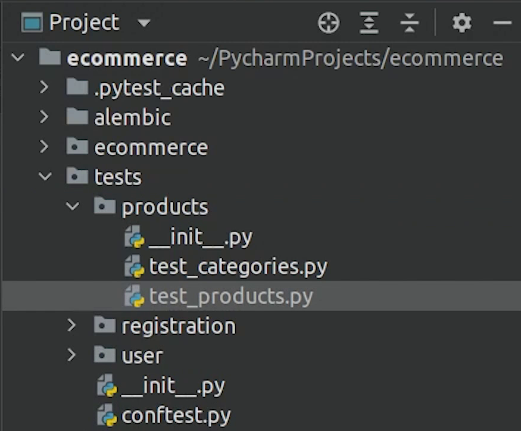

Hello everyone! Welcome to the PyCharm FastAPI Tutorial Series.

In this tutorial we are going to work on Unit Testing using [Pytest](https://docs.pytest.org/) and [Asyncio](https://docs.python.org/3/library/asyncio.html).

# AnyIO

As you can see on my screen, recently FastAPI introduced **[AnyIO](https://anyio.readthedocs.io/en/stable/)**. AnyIO is an asynchronous networking
and concurrency library that works on top of either asyncio or [Trio](https://trio.readthedocs.io/en/stable/).


# Installing Dependencies

We won’t be working on anyio because our video was recorded earlier, and we will be using the **pytest-asyncio** module.


pytest-asyncio is an Apache2 licensed library, written in Python, for testing asyncio code with pytest.

Along with pytest we also use [HTTPX](https://github.com/projectdiscovery/httpx).


HTTPX is a fully featured fast HTTP client for Python 3, which provides sync and async APIs, and 
support for both HTTP/1.1 and HTTP/2.

Do check the official documentation, it has tons of cool examples.

Even if you don’t want to use asyncio, you can work with the ```TestClient``` which is backed by **Starlette**.

Reference :
- [https://fastapi.tiangolo.com/tutorial/testing/](https://fastapi.tiangolo.com/tutorial/testing/)

There is an interesting article written by [Anthony Shaw](https://tonybaloney.github.io/) : **async test patterns for Pytest**, do check that out. 

- [https://tonybaloney.github.io/posts/async-test-patterns-for-pytest-and-unittest.html](https://tonybaloney.github.io/posts/async-test-patterns-for-pytest-and-unittest.html)


# Setting Up

Coming back to PyCharm, as you know for testing we need to have a separate test database which we have already created.

I will create a new package called **tests**.

I will create a new file under root and name it **conf_test_db**. Here we are going to set up 
the engine for our test database.


Let me do the necessary imports.


We are going to provide the test database name along-with other db credentials.

I will make sure whenever the test begins the tables are dropped and re-created again.

**conf_test_db.py**

```python
from sqlalchemy import create_engine
from sqlalchemy.orm import sessionmaker

from ecommerce import config
from ecommerce.db import Base, get_db
from main import app

DATABASE_USERNAME = config.DATABASE_USERNAME
DATABASE_PASSWORD = config.DATABASE_PASSWORD
DATABASE_HOST = config.DATABASE_HOST
DATABASE_NAME = config.TEST_DATABASE_NAME

SQLALCHEMY_DATABASE_URL = f"postgresql://{DATABASE_USERNAME}:{DATABASE_PASSWORD}@{DATABASE_HOST}/{DATABASE_NAME}"

engine = create_engine(SQLALCHEMY_DATABASE_URL)
TestingSessionLocal = sessionmaker(autocommit=False, autoflush=False, bind=engine)

Base.metadata.drop_all(bind=engine)
Base.metadata.create_all(bind=engine)


def override_get_db():
    try:
        db = TestingSessionLocal()
        yield db
    finally:
        db.close()


app.dependency_overrides[get_db] = override_get_db
```

As you can see we are trying to override the dependencies. 


As per the FastAPI documentation: There are some scenarios where you might want to override a dependency during testing.

You don't want the original dependency to run (nor any of the sub-dependencies it might have). Instead, you want
to provide a different dependency that will be used only during tests (possibly only some specific tests), and
will provide a value that can be used where the value of the original dependency was used.


Next, we will be creating a file name **conftest** under **tests** directory. This will contain the base config for our pytest.


I will do necessary imports and along-with that I will create a pytest
fixture which will create a dummy user before our test runs.


The purpose of a test fixture is to ensure that there is a well known and fixed environment in 
which tests are run so that results are repeatable.

Examples of fixtures:

- Loading a database with a specific set of data
- Copying a specific known set of files
- Preparation of input data and set-up/creation of fake or mock objects


You can see we have set auto use to True. As per pytest documentation, Sometimes you may want to have a 
fixture (or even several) that you know all your tests will depend on. **“Autouse”** fixtures are a convenient
way to make all tests automatically request them.

And finally after the tests are done we will remove the user from the db.

**conftest.py**

```python
import pytest

from ecommerce.user.models import User


@pytest.fixture(autouse=True)
def create_dummy_user(tmpdir):
    """Fixture to execute asserts before and after a test is run"""
    # Setup: fill with any logic you want
    from conf_test_db import override_get_db
    database = next(override_get_db())
    new_user = User(name='John', email='john@gmail.com', password='john123')
    database.add(new_user)
    database.commit()

    yield  # this is where the testing happens

    # Teardown : fill with any logic you want
    database.query(User).filter(User.email == 'john@gmail.com').delete()
    database.commit()
```

We are done now with the configuration. Let’s begin our first test.


# Begin Testing

I will create different modules and place them under tests. We will begin first with users.


I will do the necessary imports, and then I will create a function to test all users.

I will retrieve the access token and pass it in the api headers. If everything is good then I 
will get a 200 status code. It’s a very basic test of what I am trying to do.


**test_user.py**

```python
import pytest
from httpx import AsyncClient

from ecommerce.auth.jwt import create_access_token
from conf_test_db import app


@pytest.mark.asyncio
async def test_all_users():
    async with AsyncClient(app=app, base_url="http://test") as ac:
        user_access_token = create_access_token({"sub": "john@gmail.com"})
        response = await ac.get("/user/", headers={'Authorization': f'Bearer {user_access_token}'})
    assert response.status_code == 200
```

Next, I will open up Terminal and type pytest.


As you can see the test has been successfully passed.


Let me now try to do it through PyCharm instead of using the terminal.

I will click on **Run** and then **Edit Configurations**.

I will click on the plus (+) sign and add pytest.


I am going to provide a name and set target to custom and finally 
update the working directory. Make sure it’s pointing to the correct python interpreter.


And finally click on Apply then OK.

And yes, it works perfectly fine. We don’t need to manually type again.


Let’s cover the remaining modules.

We will now write the unit test for the user registration.

I am using a faker library, which helps me in getting dummy names, email, password etc. [Faker](https://faker.readthedocs.io/en/master/)
is basically a Python package that generates fake data for you. 

```
pip install Faker==8.12.0
```

Make sure to sync the **requirements.txt** from my source code.


We are done with the implementation and expect the user will be successfully registered and 201 status code will be returned.

Let’s test it out.


And yes, the test has passed.

We are done with the registration, next we will move to products.

We will be testing products and categories. I will create separate files for them.



In Category, we will test: create, list and delete endpoints.

**test_categories.py**

```python
import pytest
from httpx import AsyncClient

from ecommerce.products.models import Category
from conf_test_db import app, override_get_db


@pytest.mark.asyncio
async def test_new_category():
    async with AsyncClient(app=app, base_url="http://test") as ac:
        response = await ac.post("/products/category", json={'name': 'Apparels'})
    assert response.status_code == 201
    assert response.json()['name'] == "Apparels"


@pytest.mark.asyncio
async def test_list_get_category():
    async with AsyncClient(app=app, base_url="http://test") as ac:
        database = next(override_get_db())
        new_category = Category(name="Food")
        database.add(new_category)
        database.commit()
        database.refresh(new_category)
        first_response = await ac.get("/products/category")
        second_response = await ac.get(f"/products/category/{new_category.id}")
    assert first_response.status_code == 200
    assert second_response.status_code == 200
    assert second_response.json() == {"id": new_category.id, "name": new_category.name}


@pytest.mark.asyncio
async def test_delete_category():
    async with AsyncClient(app=app, base_url="http://test") as ac:
        database = next(override_get_db())
        new_category = Category(name="Electronics")
        database.add(new_category)
        database.commit()
        database.refresh(new_category)
        response = await ac.delete(f"/products/category/{new_category.id}")
    assert response.status_code == 204
```

We are done with the category, next we will create a file for products where we will test the create and listing endpoints.


**test_products.py**

```python
import pytest
from httpx import AsyncClient

from conf_test_db import app
from tests.shared.info import category_info, product_info


@pytest.mark.asyncio
async def test_new_product():
    async with AsyncClient(app=app, base_url="http://test") as ac:
        category_obj = await category_info()
        payload = {
            "name": "Quaker Oats",
            "quantity": 4,
            "description": "Quaker: Good Quality Oats",
            "price": 10,
            "category_id": category_obj.id
        }

        response = await ac.post("/products/", json=payload)
    assert response.status_code == 201
    assert response.json()['name'] == "Quaker Oats"
    assert response.json()['quantity'] == 4
    assert response.json()['description'] == "Quaker: Good Quality Oats"
    assert response.json()['price'] == 10


@pytest.mark.asyncio
async def test_list_products():
    async with AsyncClient(app=app, base_url="http://test") as ac:
        category_obj = await category_info()
        await product_info(category_obj)

        response = await ac.get("/products/")
    assert response.status_code == 200
    assert 'name' in response.json()[0]
    assert 'quantity' in response.json()[0]
    assert 'description' in response.json()[0]
    assert 'price' in response.json()[0]
```

**shared/info.py**

```python
from faker import Faker

from ecommerce.products.models import Category, Product
from conf_test_db import override_get_db


async def category_info() -> Category:
    fake = Faker()
    database = next(override_get_db())
    category_count = database.query(Category).filter().count()
    if category_count <= 0:
        category_obj = Category(name=fake.name())
        database.add(category_obj)
        database.commit()
        database.refresh(category_obj)

    else:
        category_obj = database.query(Category).order_by(Category.id.desc()).first()
    return category_obj


async def product_info(category_obj: Category) -> Product:
    database = next(override_get_db())

    payload = {
        "name": "Quaker Oats",
        "quantity": 4,
        "description": "Quaker: Good Quality Oats",
        "price": 10,
        "category_id": category_obj.id
    }
    new_product = Product(**payload)
    database.add(new_product)
    database.commit()
    return new_product
```

We are now done with the products, let’s test it out.


Yes, all the seven apis have passed successfully.

Next, we will complete the remaining modules like ```orders```, ```cart```, ```home``` and ```login```.

Same kind of operation I will be doing, you can follow me.

**test_home.py**

```python
import pytest
from httpx import AsyncClient

from conf_test_db import app


@pytest.mark.asyncio
async def test_root():
    async with AsyncClient(app=app, base_url="http://test") as ac:
        response = await ac.get("/")
    assert response.status_code == 404
    assert response.json() == {"detail": "Not Found"}
```

**test_login.py**

```python
import pytest

from httpx import AsyncClient

from conf_test_db import app


@pytest.mark.asyncio
async def test_login():
    async with AsyncClient(app=app, base_url="http://test") as ac:
        response = await ac.post("/login", data={'username': 'john@gmail.com', 'password': 'john123'})
    assert response.status_code == 200


```

**test_cart.py**

```python
import pytest
from httpx import AsyncClient

from ecommerce.auth.jwt import create_access_token
from conf_test_db import app
from tests.shared.info import category_info, product_info


@pytest.mark.asyncio
async def test_add_to_cart():
    async with AsyncClient(app=app, base_url="http://test") as ac:
        category_obj = await category_info()
        product_obj = await product_info(category_obj)
        user_access_token = create_access_token({"sub": "john@gmail.com"})

        response = await ac.get(f"/cart/add",
                                params={'product_id': product_obj.id},
                                headers={'Authorization': f'Bearer {user_access_token}'})

    assert response.status_code == 201
    assert response.json() == {"status": "Item Added to Cart"}


@pytest.mark.asyncio
async def test_cart_listing():
    async with AsyncClient(app=app, base_url="http://test") as ac:
        user_access_token = create_access_token({"sub": "john@gmail.com"})

        response = await ac.get(f"/cart/", headers={'Authorization': f'Bearer {user_access_token}'})

    assert response.status_code == 200
```


As you can see on line number 11, once you place an order successfully, you need to send an email. But this 
is something we need to do on a live server, not during a test, so I will try to do a mock which basically is
going to return true. 

Mocking means **creating a fake version of an external or internal service that can stand
in for the real one**.

```python
import pytest
from httpx import AsyncClient

from ecommerce.auth.jwt import create_access_token
from conf_test_db import app
from tests.shared.info import category_info, product_info


@pytest.mark.asyncio
async def test_order_processing(mocker):
    mocker.patch('ecommerce.orders.tasks.send_email', return_value=True)

    async with AsyncClient(app=app, base_url="http://test") as ac:
        user_access_token = create_access_token({"sub": "john@gmail.com"})
        category_obj = await category_info()
        product_obj = await product_info(category_obj)

        cart_response = await ac.get(f"/cart/add",
                                     params={'product_id': product_obj.id},
                                     headers={'Authorization': f'Bearer {user_access_token}'})

        order_response = await ac.post("/orders/", headers={'Authorization': f'Bearer {user_access_token}'})

    assert cart_response.status_code == 201
    assert order_response.status_code == 201


@pytest.mark.asyncio
async def test_order_listing():
    async with AsyncClient(app=app, base_url="http://test") as ac:
        user_access_token = create_access_token({"sub": "john@gmail.com"})
        response = await ac.get("/orders/", headers={'Authorization': f'Bearer {user_access_token}'})

    assert response.status_code == 200
```

We have finally completed all the unit tests. Let me run and check the results.

Great! 13 of 13 tests have been successfully passed, and it was quite fast. 


So, I hope you understand the testing flow. I do recommend checking the FastAPI pytest documentation 
if you want to get deeper into this topic.


I also recommend checking out this book : 

[Python Testing with pytest](https://pragprog.com/titles/bopytest2/python-testing-with-pytest-second-edition/), Second Edition 
written by [Brian Okken](https://twitter.com/brianokken) which is expected to be released in 2022.


Image Credit: [The Pragmatic Bookshelf](https://pragprog.com/)

There are lots of things which we did not cover, but it’s covered in this book. I hope you will enjoy it.


I am going to see you in the next tutorial, where we will be focusing on deploying our application on Kubernetes.


