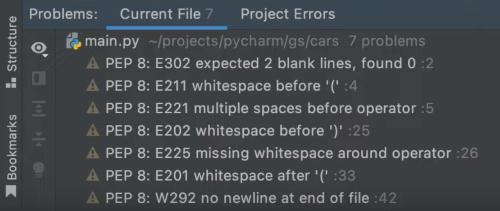

In the previous step, we saw how PyCharm makes it easy to work with your project’s Python packages. In this step, we are going to talk about one of the most important reasons to use PyCharm - code assistance. Can the IDE make me more productive?

This is the code that will be using in this tutorial:
```Python
class Car:

    def __init__(self, speed=0):
        self.speed = speed
        self.odometer = 0
        self.time = 0

    def say_state(self):
        print("I'm going {} kph!".format(self.speed))

    def accelerate(self):
        self.speed += 5

    def brake(self):
        if self.speed < 5:
            self.speed = 0
        else:
            self.speed -= 5

    def step(self):
        self.odometer += self.speed
        self.time += 1

    def average_speed(self):
        if self.time != 0:
            if self.time != 0:
                return self.odometer / self.time
            else:
                pass

```

## Code Completion

First off, let’s talk about context-aware code completion, where the IDE uses all kinds of smarts to help you finish your typing. Live templates are one such example. The keyboard shortcut is (**⌘J** | **Ctrl+J**) but PyCharm will invoke them by default when you start typing some code that matches a Live Template. You can find a list of Live Templates in your Preferences/Settings (**⌘,** | **Ctrl+Alt+S**) and you can also [add your own](https://www.jetbrains.com/help/pycharm/creating-and-editing-live-templates.html).


PyCharm also offers you basic and type-based smart completion. For example, if we start typing something here, PyCharm prompts with options to complete my code, so we won’t need to type the full line. For example, if you have this code in the above class and type in `C`, PyCharm will offer you `Car`.

```Python
if __name__ == '__main__':
  bmw = C
```


If it’s the correct completion, as it is in this case, we can just press *Enter*, and PyCharm will complete the line for you. If the correct completion is in the list, but not selected, we can use the arrows in your keyboard to go up and down to select it and then press `Enter`. And finally, if the correct completion is not in the list yes, we can keep typing until PyCharm figures it out for you.

Code completion is not only available for classes, but also for methods. We created a variable called `bmw` that instantiates from the `Car` class. If we want to use one of its methods, we can write `bmw` plus `dot`...

```Python
if __name__ == '__main__':
  bmw = Car
  bmw.
```
...and PyCharm will offer [basic completion](https://www.jetbrains.com/help/pycharm/auto-completing-code.html#basic_completion) for the available methods.


Here's a cool tip - while `Enter` adds the suggested completion, you can also press `tab` to switch an existing one for the new one, saving you time.

Code completion is also available for keywords. Let’s say you want to import a package. If you start typing `i` at the top of your file...


```Python
i
```

... PyCharm will immediately offer `import` as a possible completion.


The cool thing about code completion is that you can also use it in many other places, including method parameters, Dictionaries, Django templates, inside f-strings, and much, much more. Check out [the documentation](https://www.jetbrains.com/help/pycharm/auto-completing-code.html) for more details.

That’s cool, but how does PyCharm do it? We just saw a very simple example, but sometimes you will be working within much more complex projects with multiple inter-dependencies. How can PyCharm understand what class you are about to instantiate, what method you are about to call, and so on?

PyCharm examines the code of your entire project and creates a virtual map. This makes PyCharm fully aware of your code and allows actions like code completion to be performed immediately. The process of reading your entire project is called ‘indexing’ and it happens when you open your project, switch between branches, load or unload plugins, or after large external file updates.

So next time you hear your laptop fans right after you open a new project, have in mind that this process will end soon and will give you access to powerful features that will make your life easier in a few moments.

## Syntax Highlighting

Another productivity booster that you might take for granted is syntax highlighting.

As you can see in our script, PyCharm automatically detects keywords such as `def`, `for`, `while`, as well as class names, parameters, etc, and renders them in different colors.


This makes it easier for you to scan your code, quickly recognize errors, and have a better overview of your code structure. You can update the color scheme if you prefer. To see how, [check out the documentation](https://www.jetbrains.com/help/pycharm/configuring-colors-and-fonts.html).

## Code Intentions
One of the most important features for improving your code quality is what we call intention actions. As you work in the editor, PyCharm continually analyzes your code to find ways to optimize it and detect errors. Whenever the IDE finds possible improvements it shows a yellow bulb icon next to the current line.

Here, for instance, we added `if sudden == True`. Although it's valid syntax, it can be optimized, so PyCharm shows you the yellow bulb right away. To access the intention action available for this line of code, we can click the light bulb or use the (*Alt+Enter* | *⌥⏎*) keyboard shortcut.


As you can see, PyCharm is offering to ‘Replace boolean expression with 'sudden'’. Intention actions cover a wide range of situations from warnings, to optimizations, to automation.

Let’s say I want to invert this `if` condition. If I position my caret here (show) PyCharm offers to handle it for me and I accept. 


I can also undo this to go back to the way the code was if I want to. 

We've looked at warnings, but sometimes there are errors and PyCharm can also find any problems within your code. In this case, whenever it happens, the light bulb color will be red. This is a signal that a quick-fix is available and to check possible solutions you can use the same commands as before.

We can see one example of a quick fix if we try to use a package without installing it first. Let’s change our car from bmw to tesla and add `web_page` as a property of the class Car. Now, let’s create a quick method to fetch the Tesla website, assuming that the car needs this information to work.

I’ve written the method mentioning the package `requests` but I haven’t installed it yet. Let’s see what PyCharm offers us, using (*Alt+Enter* | *⌥⏎*) this time.


`Install and import package requests` sounds like what we need, so this is what we'll select it. As you see, PyCharm not only installed the package inside my virtual environment, but it also auto-imported it to my script! The red squiggly and the light bulb are gone, and the code should run smoothly now.

In this example, we imported an external package, but we could have also imported something from within the project. PyCharm makes it easy to fix problems, such as imports, without interrupting your flow.

## Viewing Problems
No one likes problems, right? Neither does PyCharm or the PyCharm team. That’s why we work hard to make it easier for you to write better code and stay away from errors.
But they happen. Let's take a look at two quick ways to spot them in a file.

When PyCharm finds warnings or errors, besides light bulbs and squiggly lines, it also displays your errors in the scrollbar. Let’s see how it looks. Here is a file with a number of problems. As you can see, the stripes indicate where the problem was found. To see more information about the problem you can hover the stripe, or click it to navigate to the proper line.


If you don't want to scroll down your entire file searching for problems, though, the second quick way to spot problems is by checking the Problems widget. 


It summarizes errors and warnings and lets you quickly navigate to the Problems Tool window (**⌘6** | **Alt+1**) to have a better description of what is going on. Here we can see the error and quickly navigate to the line where it happens. We can also look across our entire project. 



Let’s fix this error and use the [code reformat action](https://www.jetbrains.com/help/pycharm/reformat-and-rearrange-code.html#reformat_file) (**⌥⌘L** | **Ctrl+Alt+L**) to put everything in the right place. 


Now the errors and warnings are gone, and the file is formatted following PEP-8 conventions.

## Conclusion

Congratulations! You just saw how to use PyCharm to help you write better code with fewer errors, but this is just the tip of the iceberg. 

In the next step, we’ll see how to use [Run Configurations](https://www.jetbrains.com/help/pycharm/run-debug-configuration.html) to run your Python scripts.
