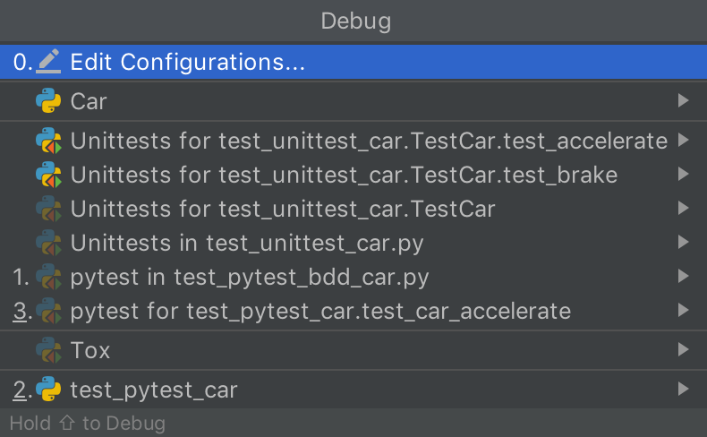
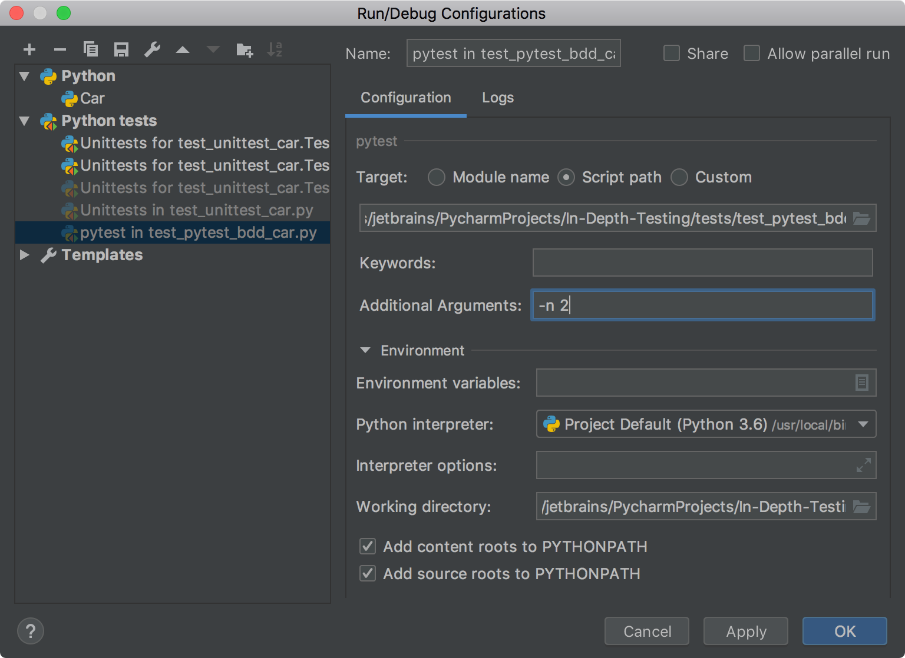

In this step, you will edit a temporary Run/Debug configuration to enable running tests on multiple CPUs.

**Powerful shortcuts**: 
-  `Shift-Alt-F10` (Windows) or `Ctrl-Alt-R` (macOS) to run and edit Run/Debug configurations. 

When you perform run, debug, or test operations with PyCharm, you always start a corresponding process based on 
one of the existing or newly created _Run/Debug_ configuration using its parameters. 
See <a href="https://www.jetbrains.com/help/pycharm/run-debug-configuration.html" target="_blank">Working with Run/Debug configurations</a>. 

# Edit Run/Debug configurations

You might have noticed that each time you run a test, you see the new entity added to the list of available 
Run/Debug configurations.

For the most cases you don't need to edit it. However, you can specify some helpful settings or define additional variables
to enhance your test execution. In our example, you will run the pytest-bdd tests on several CPUs for better test
performance. 

In case of just two tests, you might not notice the difference, but when your test suite contains several tests with 
long-time execution, parallel running may save time.

1. First, install one more package to enable distributed testing. 
Press `Ctrl-Alt-S` (Win/Linux) or `Cmd-,` (macOS) to open the **Settings/Preferences** dialog. Then select 
**Project &lt;project name&gt; | Project interpreter**. Click the **+** icon to open the **Available packages** dialog and 
install the `pytest-xdist` package. 

2. Now let's look at the test Run/debug configuration. Press `Shift-Alt-F10` (Windows) or `Ctrl-Alt-R` (macOS) for
quick access to the basic operations with Run/Debug configurations.

Note that the list contains configurations for all test runs. Click **Edit Configurations** or press 0 to proceed.

3. Examine the dialog.

It contains all the configurations for Python scripts and Python tests you ran before. 
There are many arguments and variables you can define.
See <a href="https://www.jetbrains.com/help/pycharm/run-debug-configuration-py-test.html" target=_blank">
Pytest Run/Debug configuration</a> for more details about configuration options.

4. In the **Additional Arguments** field specify the number of the CPUs to run the tests: 
`-n 2` and save the changes. When you execute your test scenarios next time, the tests will be run in parallel.
