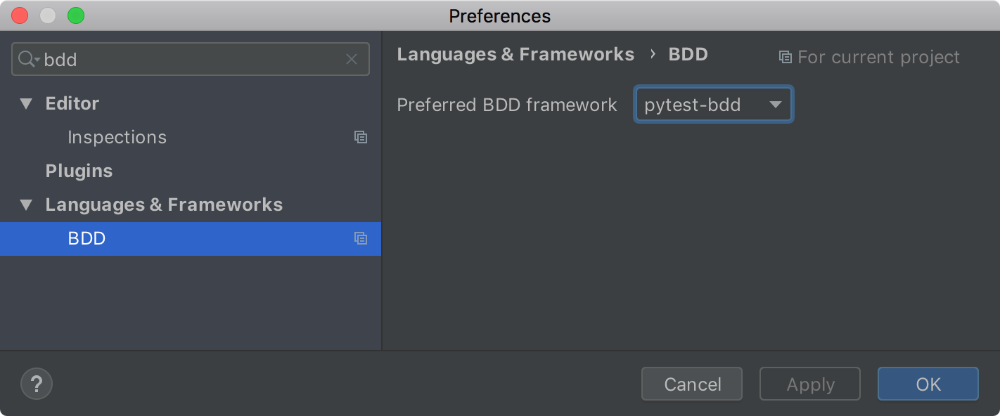
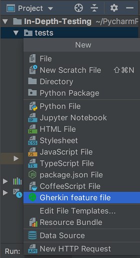
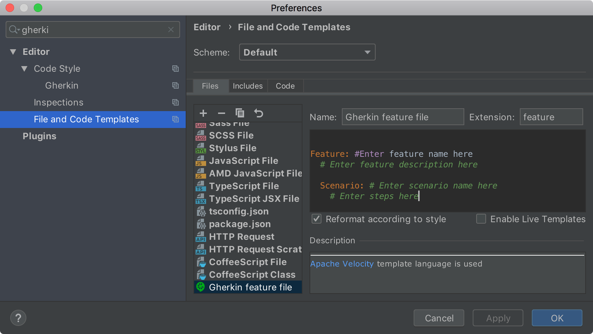
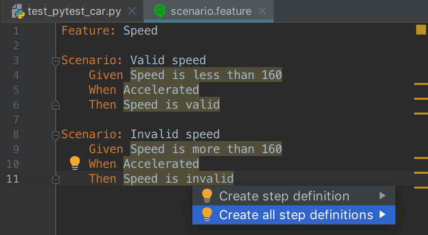
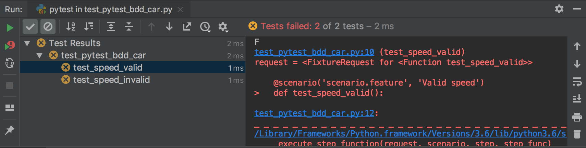
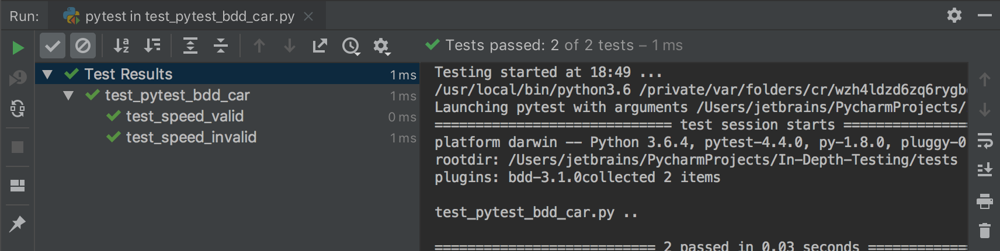

In this step, you can implement test scenarios using the pytest testing framework and pytest-bdd 
package. 

**Powerful shortcuts**: 
- `Ctrl-Alt-S` (Win/Linux) or `Cmd-,` (macOS) to open the **Settings/Preferences** dialog.
- `Alt-Insert` (Windows) or `Cmd-N` (macOS) to create a new file.
- `Alt-Enter` (Windows and macOS) to open the list of the available intention actions.

In the previous steps of this tutorial, you test the `Car.py` application using the _Unittest_
testing framework.
It is time to explore additional capabilities provided by PyCharm for the _pytest_ framework.
Pytest supports Behavior-Driven Development (BDD) through the pytest-bdd package.
You can record the scenario that defines the behavior using the 
<a href="https://docs.cucumber.io/gherkin/reference/" target="_blank">Gherkin language</a>.

# Enable pytest and pytest-bdd
First ensure that you have installed the `pytest` and `pytest-bdd` packages for your project interpreter and select pytest 
as the test runner.

1. Press `Ctrl-Alt-S` (Win/Linux) or `Cmd-,` (macOS) to open the **Settings/Preferences** dialog. Then select 
**Project &lt;project name&gt; | Project interpreter**.

2. Inspect the list of the installed packages. Click the **+** icon to open the **Available packages** dialog and 
install the missing packages. See <a href="" target="_blank">Installing packages</a> for more details.

3. Now, go to the **Tools | Python Integrated Tools** dialog to select the preferred test runner.
Remember that the easiest way yo find the required setting pages is to start typing something relevant in the 
**Search** filed, for example, "testing" or "test runner". Select **pytest** in the **Default test runner** list. 

4. Last tweak: type "bdd" in the **Search** field of the **Settings/Preferences** dialog to quickly get to the 
**Languages & Frameworks | BDD** dialog, then select **pytest-bdd** in the **Preferred BDD framework** list.    



Having this done, you're ready to implement a test scenario with pytest-bdd.

# Record a scenario

1. First, create a Gherkin file. Select the **test** directory in the **Project** tool window and press `Alt-Insert` 
(Windows) or `Cmd-N` (macOS). Then select **Gherkin feature file**.



Enter the filename, for example, `scenario` and click **Ok** to complete the task.

2.  Note that PyCharm has already inserted some code template in the newly create feature file. This template is 
defined in the corresponding **File and Code Template** settings. 



So if any of your project implies creating a lot of 
test scenarios using Gherkin files, you know where you can customize the code template to better meet your project 
requirements.  

3. Modify the default Gherkin template in the `scenario.feature` file and add the following code:

```gherkin
Feature: Speed

Scenario: Valid speed
    Given Speed is less than 160
    When Accelerated
    Then Speed is valid

Scenario: Invalid speed
    Given Speed is more than 160
    When Accelerated
    Then Speed is invalid
```
  
This scenario validates the car's speed and implies that the valid car speed shouldn't exceed 160 km per hour.
Note that PyCharm highlights the steps because they do not have any corresponding definition assigned to them.

   

# Create step definitions

1. To quickly add all step definitions for the scenario, use the dedicated _intention action_ provide by PyCharm. Click the
bulb in the **Editor** or press `Alt-Enter` (Windows and macOS), then select **Create all step definitions**.
In the opened dialog, specify the name of the test file, for example, `test_pytest_bdd_car.py`, select 
**Python (pytest-bdd)** from the **File type** list, and click **Ok** to save the changes.
PyCharm creates the predefined steps that contain everything you need by the testing logic.
Let us add it:

```python
from pytest_bdd import scenario, given, when, then
import pytest
from Car import Car


@pytest.fixture
def my_car():
    return Car()


@scenario('scenario.feature', 'Valid speed')
def test_speed_valid():
    pass


@scenario('scenario.feature', 'Invalid speed')
def test_speed_invalid():
    pass


@given("Speed is less than 160")
def set_valid_speed(my_car):
    my_car.speed = 50


@given("Speed is more than 160")
def set_invalid_speed(my_car):
    my_car.speed = 200


@when("Accelerated")
def car_accelerate(my_car):
    my_car.accelerate()


@then("Speed is valid")
def success(my_car):
    assert my_car.speed_validate()


@then("Speed is invalid")
def fail(my_car):
    assert not my_car.speed_validate()
```
  
Note that PyCharm auto-completion works for pytest _fixture_ created in this test code.  Let us examine the test.
It checks `speed == 50` for the "Valid speed" scenario and `speed == 200` for the "Invalid speed" scenario.
All should work fine. Let us run the test suite by using one of the favourite ways.

Strangely enough, the tests failed.

  

It appeared that the `speed_validate` function has not been declared in tested Python file. Let's add it to `Car.py`:

```python
def speed_validate(self):
    return self.speed <= 160
```

Rerun the tests to ensure that all test scenarios pass successively. 

  