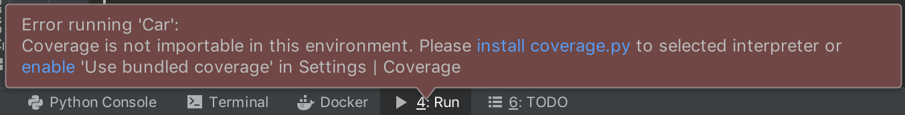
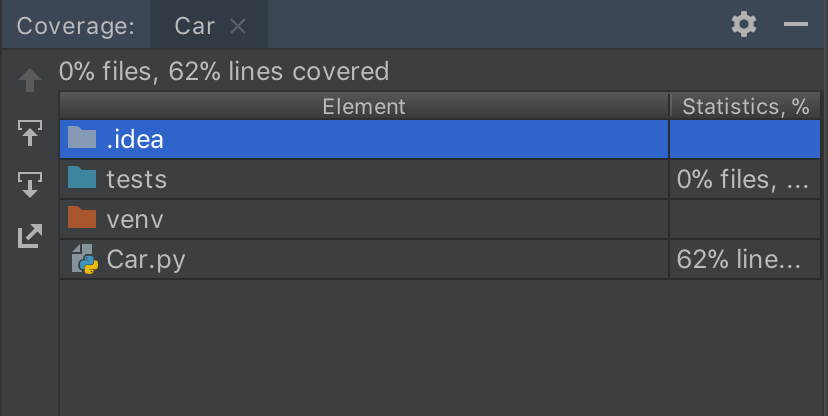
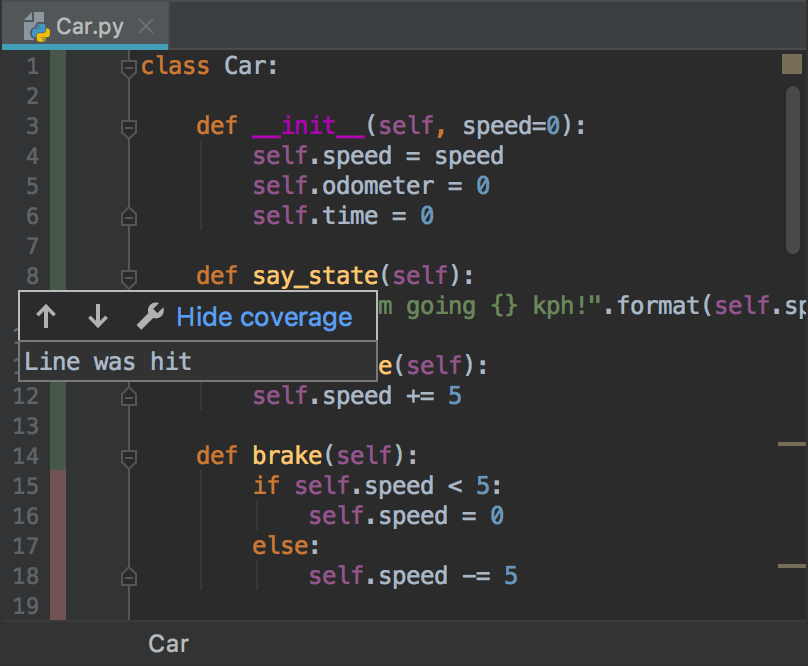
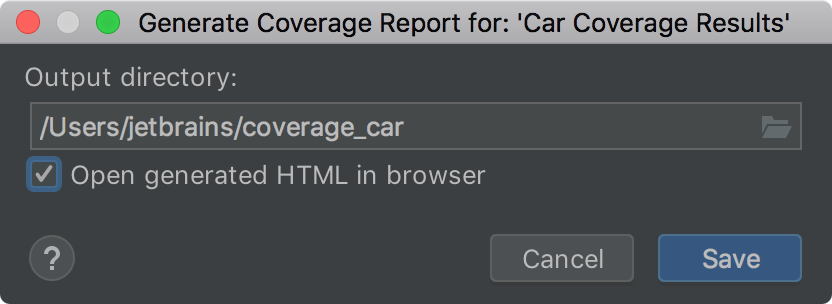

In this step, you obtain and evaluate coverage data for your project.

**Powerful Shortcuts**: 
-  `Alt-Ctrl-F6` (Win/Linux) or `Alt-Command-F6` (macOS) to show coverage data.

When working on a big project, you often need to collect code coverage statistics.
PyCharm comes with some handy instruments to collect, visualize, and summarize code coverage details.

# Run with code coverage
You can several options to execute you script with code coverage:
- Open the desired file in the editor, and select **Run <name> with coverage**
 from the context menu. When running tests with coverage, note that you can 
 run the entire test class, or each individual test method, depending on the 
 caret location.
- Select the desired run/debug configuration, and then from the main menu select
 **Run | Run <run/debug configuration name> with coverage**.
- On the main toolbar, click the **Run with coverage** icon. 
  This will launch the currently selected run/debug configuration.

So, let's open the `Car.py` file in the editor, right-click it, and select **Run Car.py with 
coverage**.

# Enable code coverage in your project

In this tutorial, we always checked if the required package has been properly
installed in your project.
Even though, this time your skipped any checks,
PyCharm takes care of the coverage settings and prompts the required actions:

You can just click the **enable** link in that message to let running `Car.py` 
with code coverage.

# Preview coverage data

Once you have successfully executed `Car.py`, the **Coverage** tool window appears:

In this dialog, you can preview the percent of code covered by test in `Car.py`, 
which is now 62%.

For more detailed visualization, press Alt-Ctrl-F6` (Win/Linux) or `Alt-Command-F6` (macOS), 
then specify `Car.py` as the target script. In the left gutter, the green color indicates
the code lines that are covered with tests, and the red color indicates the lines that are not 
covered yet.

 This visualization might be particularly helpful when you need to decide, 
 which parts of your code need more tests.
 
 You can alter the colors in the **Settings/Preferences** dialog. Select  **Editor | Color Scheme | 
 General**, expand the **Line Coverage** item in the list of settings, and specify
 any alternative colors for fully covered, partially covered, or uncovered lines.
 
 # Generate report
 
 Sometimes you need to meet customer's requirements and provide the certain percentage of 
 code coverage. The quick way to summarize the related information is to 
 generate the report and hand-off it to the customer or publish on the target server.

To create a Coverage report, select **Tools | Generate Coverage Report** from the main 
menu or click the corresponding icon on the **Coverage** tool window toolbar.
 
  

For your convenience, click the **Open generated HTML in browser** to immediately
open the report in the browser. 