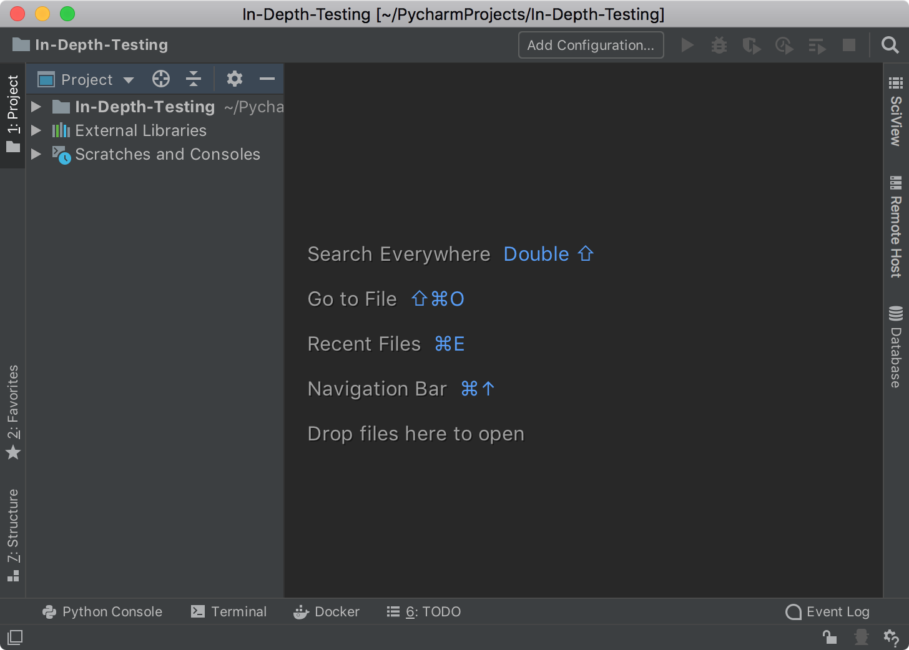
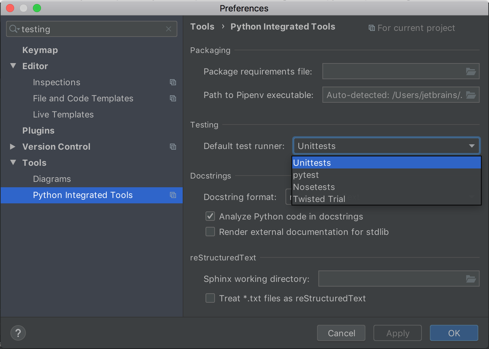

In this step, you can set up your project and select the dedicated test runner.
Whatever you do in PyCharm, you do it in a project. So, first of all create the
dedicated project, then add your application, and select how it will be tested.

**Powerful shortcuts**: 
- `Double Shift` to Search Everywhere.
-  `Ctrl-Alt-S` (Win/Linux) or `Cmd-,` (macOS) to open Settings/Preferences.

# Create a project

1. Run your PyCharm installation. Depending on your previous work, you have two
options:
    - If you’re on the **Welcome** screen, click the **Create New Project** link. 
    - If you’ve already got a project open, choose **File | New Project** from the main menu.
2. You need to specify a project interpreter to run your application and tests, so 
in the **New Project** dialog you need to enter the project name, and either accept the
default virtual environment settings or setup a new one. 

    
    Click **Create** to finalize this step.
3. When you have just created a project in PyCharm, you should expect to see the project tree:
    
    
    
    Mind the shortcuts that PyCharm prompts. In particular, the very first one, 
    **Search Everywhere** is a universal start for you when you're not sure about the
    next step. This `Double Shift` magic helps you perform any action or find any 
    element of your application.
4. Select the project root in the project tree (in this example, **In-Depth-Testing**)
and just double press the `Shift` key. Begin typing "Python" in the search field and 
then you should see the **Python File** action to create a new Python file.     

    
    
   Select it and in the opened dialog specify the name of the newly created file 
   (In our example, `Car.py`). 
   Similarly, you can create a new file by selecting **File | New...** from the 
   main menu or by right clicking the project root and selecting **Python File**.
5. Add the following code to the `Car.py` file:
```python
class Car:

    def __init__(self, speed=0):
        self.speed = speed
        self.odometer = 0
        self.time = 0

    def say_state(self):
        print("I'm going {} kph!".format(self.speed))

    def accelerate(self):
        self.speed += 5

    def brake(self):
        if self.speed < 5:
            self.speed = 0
        else:
            self.speed -= 5

    def step(self):
        self.odometer += self.speed
        self.time += 1

    def average_speed(self):
        if self.time != 0:
            return self.odometer / self.time
        else:
            pass
if __name__ == '__main__':

    my_car = Car()
    print("I'm a car!")
    while True:
        action = input("What should I do? [A]ccelerate, [B]rake, "
                 "show [O]dometer, or show average [S]peed?").upper()
        if action not in "ABOS" or len(action) != 1:
            print("I don't know how to do that")
            continue
        if action == 'A':
            my_car.accelerate()
        elif action == 'B':
            my_car.brake()
        elif action == 'O':
            print("The car has driven {} kilometers".format(my_car.odometer))
        elif action == 'S':
            print("The car's average speed was {} kph".format(my_car.average_speed()))
        my_car.step()
        my_car.say_state()
```         
6. You have the project, and you have the application to test. Let's decide *how* we will test `Car.py`.
You have already learned the magic shortcut to any action in PyCharm. There is another quite helpful
shortcut to open the project Settings (Windows/Linux)/Preferences (masOS), a series of various options to 
work with the IDE. Press `Ctrl-Alt-S` (Win/Linux) or `Cmd-,` to open this dialog. Then in the search field, 
start typing "testing". The **Python Integrated Tools** is what we're looking for.

   

    Inspect the **Testing** area on that page. You might notice that **Unittest** is the default testing framework.
It means each time you run a test, it will be executed by this framework. The default test runner also 
defines the way PyCharm create tests for your application. Choose a testing framework to start with 
and click **OK** to save the settings.

7. The finishing touch for this step is to create a directory in your project tree that is dedicated 
for the tests. Select the project root, then again you have three options: right-click the root and select
**New | Directory**, select **File | New** from the main menu, or use double press the `Shift` key and type 
"Directory" to find the action. 
Name the newly created directory `tests`. 
By this moment you're ready to create your first test in PyCharm.
   