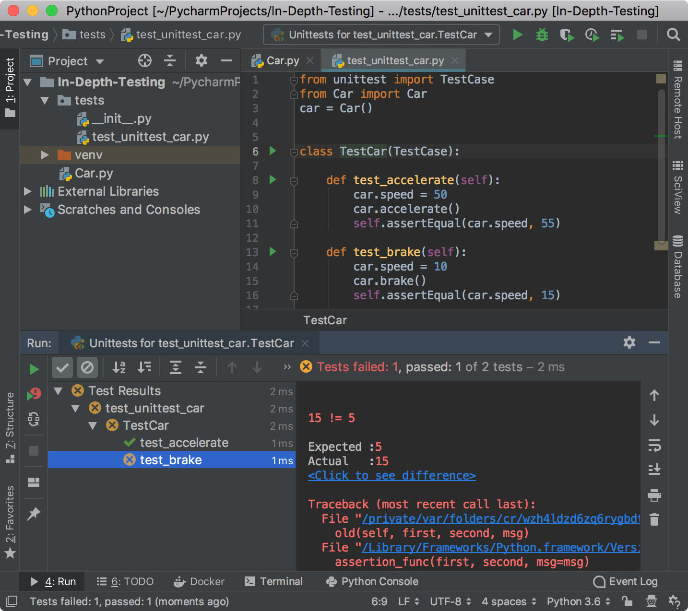
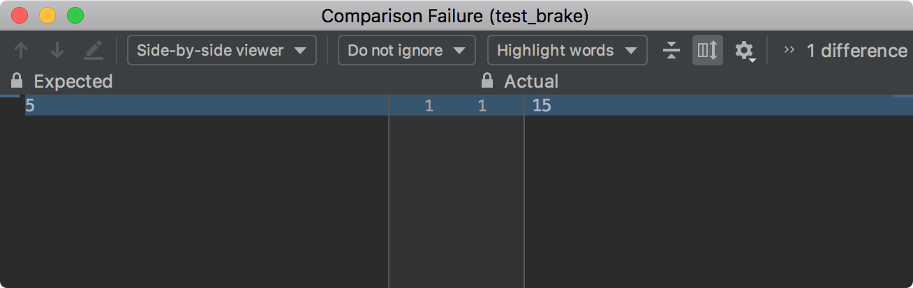
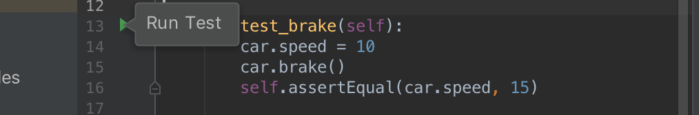
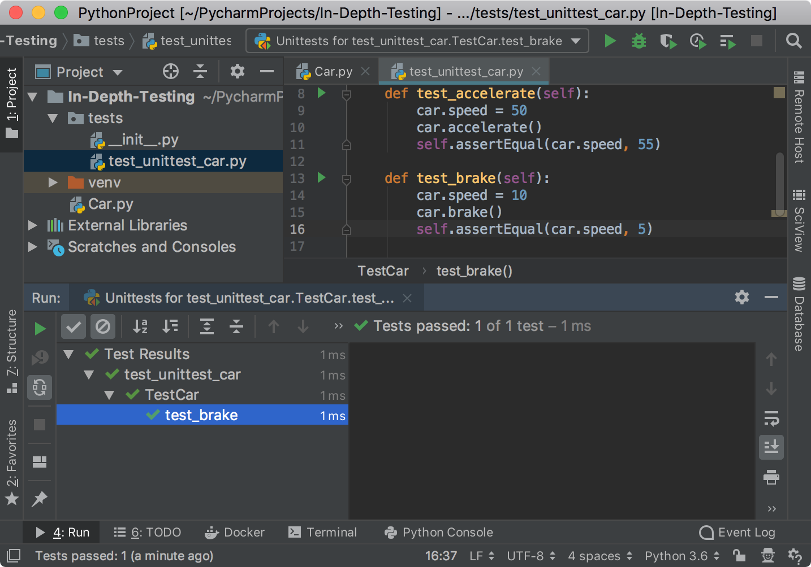
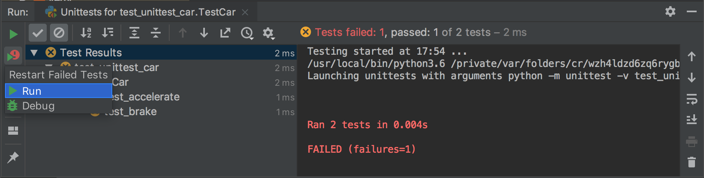

In this step, you learn how to run tests and evaluate the execution results.

**Powerful shortcuts**: 
-  `Ctrl-Shift-F10` (Win/Linux) or `Shift-Ctrl-R` (macOS) to execute a test.
-  `Ctrl-F5` (Windows) or `Cmd-R` (macOS) to rerun all failed tests.

**How you can run the test**
- Shortcuts
- The **Run** icon in the left gutter of the **Editor**
- Context menu in the test code
- Context menu in the test tree of the **Test runner** tab 

# Execute a test suite

The easiest way to execute the test is to press `Shift-10` (Win/Linux) or `Ctrl-R` (macOS).
The **Run** tool window opens and shows the test execution status:



Although the very first test is quite simple, you can obtain the detailed information about the 
test execution in the **Test Runner** tab of the **Run** window. 

It has two toolbars to perform various actions with tests:
 - The <a href="https://www.jetbrains.com/help/pycharm/test-runner-tab.html#runToolbar" target="_blank">Run toolbar</a> 
 the left (vertical) toolbar that enables you to rerun tests or setup an auto-rerun mode.
 - The <a href="https://www.jetbrains.com/help/pycharm/test-runner-tab.html#testingToolbar" target="_blank">Testing toolbar</a>
  the top (horizontal) toolbar that enables you to monitor the tests and analyze results 
  
The left-hand pane shows the tree view of all tests:
- The root node represents the test selected to run.
- The nested nodes represent the hierarchy of test suites and test cases.
- The leaf nodes represent the individual tests.
The status of each test is indicated by an icon. One of two tests fails. 

The output pane shows the output of the current test suit. You can see the assertion error reported for 
`car.speed == 15`.  

# View differences

Note that because you use the `assertEqual` function in your tests, the test runner provides the 
ability to compare the actual and expected values of the variable being asserted.
Click the **Click to see difference** link to preview the variable values in the **Difference viewer**



# Rerun the failed test

Now modify the `test_brake` function to pass the test:

```python
def test_brake(self):    
    car.speed = 10
    car.brake()
    self.assertEqual(car.speed, 5)
```
This change should make the test successful. You can press `Ctrl-F5` (Windows) or `Cmd-R` (macOS)
to rerun the tests. However, there is no need to rerun all tests in the `TestCar` class.
To run each test function separately, you can either use the context menu for a particular test 
in the test suite tree or click the corresponding **Run** icon in the left gutter of the **Editor**.

 

The **Test runner** tab shows that the test passed without any assertion errors. 
Because this time you have executed only the `test_brake` test, the **Test Runner** shows only 
specific execution details. 



# Rerun tests automatically

PyCharm lets you rerun any test automatically.


Just click the **Rerun** button on the **Run** toolbar and each time the source code has been changed,
 the test will be rerun automatically. Use the **Set AutoTest Delay** options available in **Settings**
 of the <a href="https://www.jetbrains.com/help/pycharm/test-runner-tab.html#testingToolbar" target="_blank">Testing toolbar</a> to
 set a specific time interval in seconds for restarting test after the test code change.
 
# Debug a failed test

When something goes wrong with the test, you can always opt to debugging. The quickest way to debug a failed test
is to pres `Shift` and click the **Rerun Failed Tests** button on the <a href="https://www.jetbrains.com/help/pycharm/test-runner-tab.html#runToolbar" target="_blank">Run toolbar</a>.
Then select **Debug** and the debugging starts.



At this point, you've learned how to create, run, and evaluate tests in the PyCharm IDE. Proceed with the tutorial
to learn more complicated but helpful concepts and techniques.