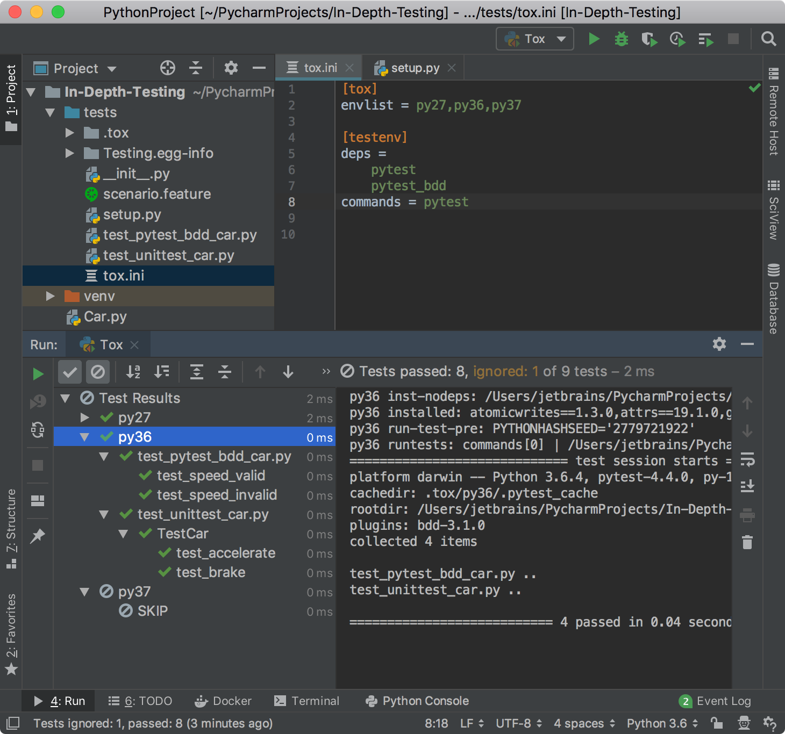

In this step, you run all your test suites on several interpreters.

**Powerful shortcuts**: 
-  `Ctrl-Shift-F10` (Win/Linux) or `Ctrl-R` (macOS) to run the `tox.ini` file.

By this moment, we execute test for the `Car.py` application using the interpreter
specified for your project. However, sometimes you need to check if your test 
suite can be executed on various Python versions. One option is to switch the project 
interpreter and rerun the test suite. Another, the better solution, is to 
run it on the predefined set of Python versions with the help of the `tox` package.

# Enable tox in your project

1. First, ensure that the `tox` package is installed for your project. Press `Ctrl-Alt-S` (Win/Linux) or `Cmd-,` (macOS) to open the **Settings/Preferences** dialog. Then select 
**Project &lt;project name&gt; | Project interpreter**.

2. Inspect the list of the installed packages. If there is no `tox` package installed, 
click the **+** icon to open the **Available packages** dialog and 
install it. See <a href="" target="_blank">Installing packages</a> for more details.

3. Select the **test** directory in the **Project** tool window and press `Alt-Insert` 
(Windows) or `Cmd-N` (macOS), specify the name of the file, `tox.ini` and add the following
code to it:

```ini
[tox]
envlist = py27,py36,py37

[testenv]
deps =
    pytest
    pytest_bdd
commands = pytest
```

With this `.ini` file, you will run your pytest_bdd test scenarios for Python 2.7, 3.6, and 3.7.
You also record the test runner in `commands` and package dependencies in `deps`.

# Create the setup.py file

Another requirement is to add the `setup.py` to your project. 
PyCharm provides you the quickest way to generate it. 
From the main menu, select **Tools | Create setup.py**.
The following file will be generated:

```python
from setuptools import setup


setup(
    name='Testing',
    version='',
    packages=[''],
    url='',
    license='',
    author='jetbrains', install_requires=['pytest']
)
```

If you don't want to put any additional project specific details, you may leave this
file as is.

# Run all tests with tox

Now, you're ready to execute the `tox.ini` file. 
You can either select the file in the **Project** tool window and use the context menu.
Alternatively, you can press `Ctrl-Shift-F10` (Win/Linux) or `Ctrl-R` (macOS).

Then preview the **Test runner** tab in the **Run** tool window.
 

The test scenarios ran successfully for Python 2.7 and 3.6. Because Python 3.7 is
not available on the sample system, the test runner skipped the corresponding run.

