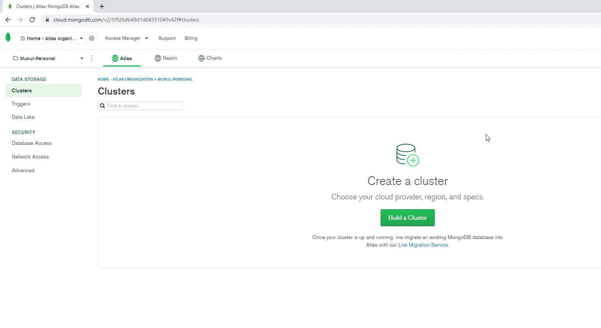
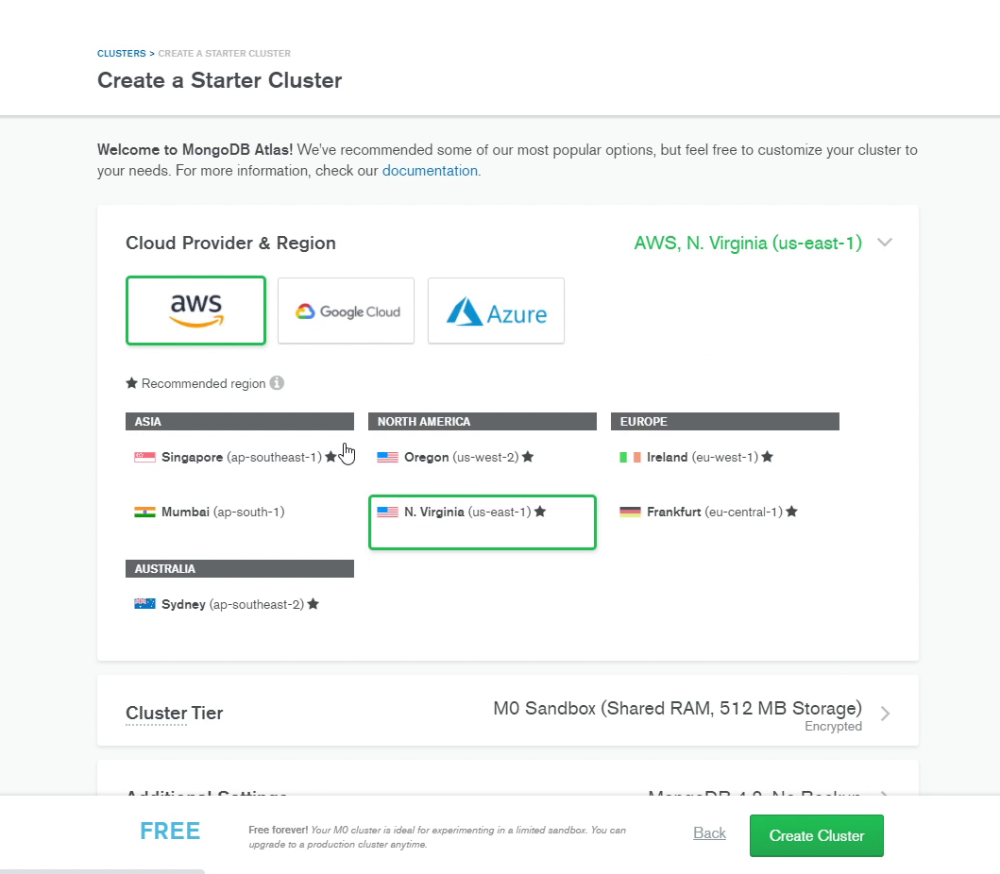
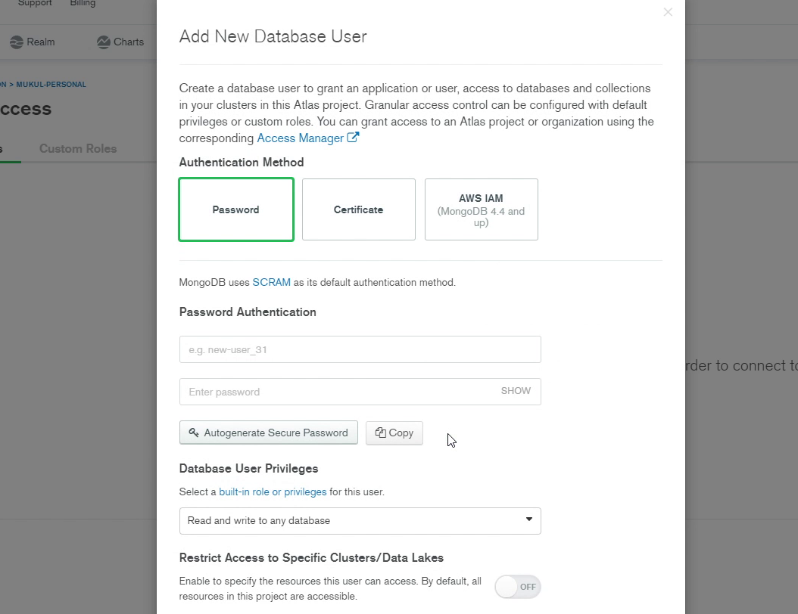
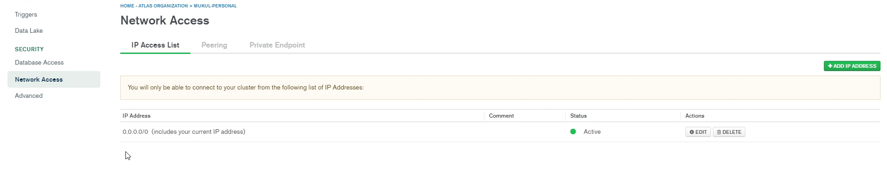
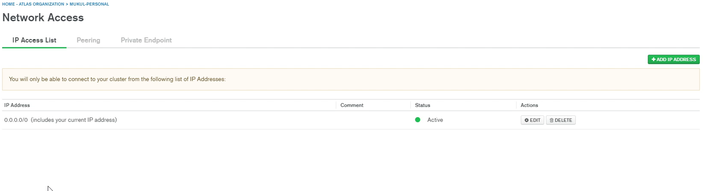
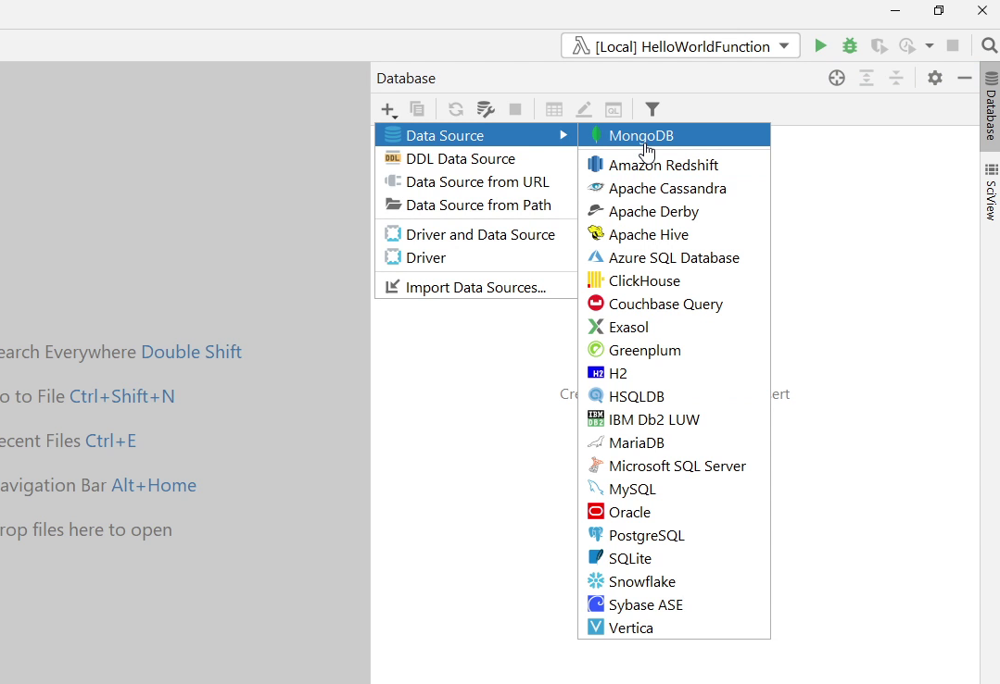
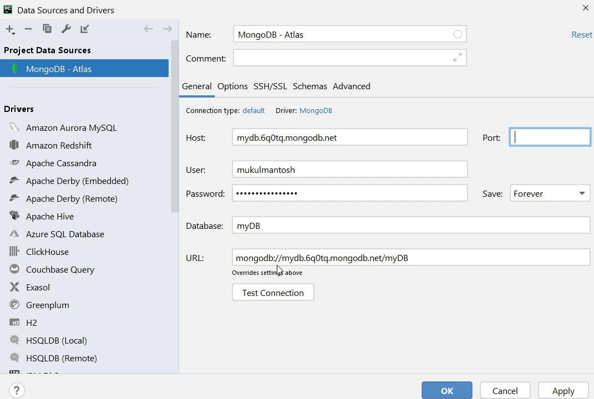
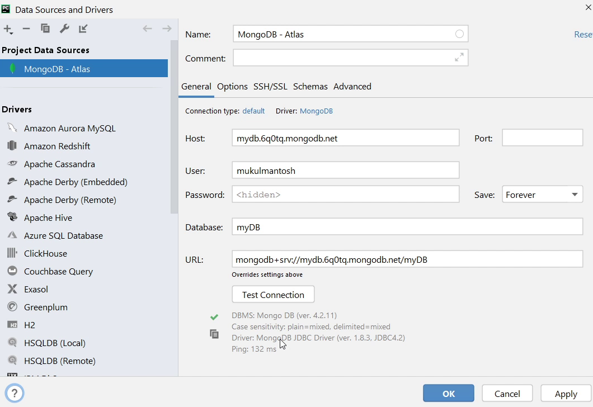

In this tutorial we are going create a MongoDB Cluster and connect through PyCharm.

# MongoDB Atlas

MongoDB is open-source cross-platform document-oriented database. As you know 
MongoDB provides a managed database as a service which is also known as <strong>MongoDB Atlas</strong>.
They offer free storage upto 512MB which is good enough for development but not suitable for 
production workloads.

This is the landing page which provides a list of information related to your databases.

Now I am going to click on <strong>Build a Cluster</strong>. I will choose Shared Cluster which is <strong>FREE</strong> of cost.

I will choose <strong>AWS</strong> as my cloud provider and pick <strong>Mumbai (ap-south-1)</strong> region to reduce latency.

I will set cluster name as <strong>myDB</strong>, after that I will click on <strong>Create Cluster</strong>.
It will take a few minutes to provision the new cluster.

# Database Access

Once the database has been successfully created, 
We need to create a <strong>Database User</strong> which will be authorized
to connect to the database.

Click on <strong>Database Access</strong>. Provide a username and click on, <strong>Autogenerate Secure Password</strong>.

In <strong>Database User Privileges</strong> make sure you have access to <strong>Read and write to any database</strong>.

Also, make sure to enable permission to access the cluster, and finally click on <strong>Add User</strong>. It will take some time to reflect those changes.

Now, click on <strong>Network Access</strong>.

Make sure to whitelist your IP Address. As you can see, for this tutorial, I have provided <strong>0.0.0.0</strong> which means I can connect to the database from 
any IP Address. This is definitely not good when it comes to security. Please follow the <strong>Defense in Depth</strong> approach and try to restrict IP addresses. 
Exposing everything to the outer world makes it more vulnerable to data breaches and hacking. 

After setting up the Network Access, it will take some time for changes to take effect.

Once the changes have been successfully updated, I will be following the instructions
for connecting to the MongoDB Database.

I am going to click on <strong>Connect</strong> and then will click on <strong>Connect using MongoDB Compass</strong>, 
and finally I will copy the <strong>connection string</strong>.

# Connecting through PyCharm

I will click on the <strong>Database</strong> section. I will click on the + (plus) button,  hover to <strong>Data Source</strong> and then click on <strong>MongoDB</strong>.

Now, paste the <strong>connection string</strong> in the <strong>Host</strong> Section. 
We will be updating all the information like user, database name, password and the URL.

After that I am going to click on <strong>Test Connection</strong> to check whether 
I am able to establish connection to the DB or not, as you can see the connection was successful. I will click on Apply and then OK.

We have successfully connected with the MongoDB Database through PyCharm. 

