For this tutorial we are going to protect our APIs from unauthorized access by 
creating Lambda Authorizer, formerly known as CustomAuthorizer. 
It is an API Gateway feature that uses a Lambda function to control access
to your API.

Interested to know more about custom authorizers, please visit [Configure a Lambda authorizer using the API Gateway console
](https://docs.aws.amazon.com/apigateway/latest/developerguide/configure-api-gateway-lambda-authorization-with-console.html). 

# Custom Authorizers

Okay, let me first remove the <strong>Authorizers</strong> which I have declared 
in the <strong>template.yaml</strong> file. By the way, if you have observed from
the beginning, we are using Authorizer as <strong>None</strong>, but we did not set up
the Default Authorizer. If you try to deploy the functions it’s not going to work,
and it would lead to an error because you haven’t set up the <strong>Authorizer</strong>. So, let’s begin.

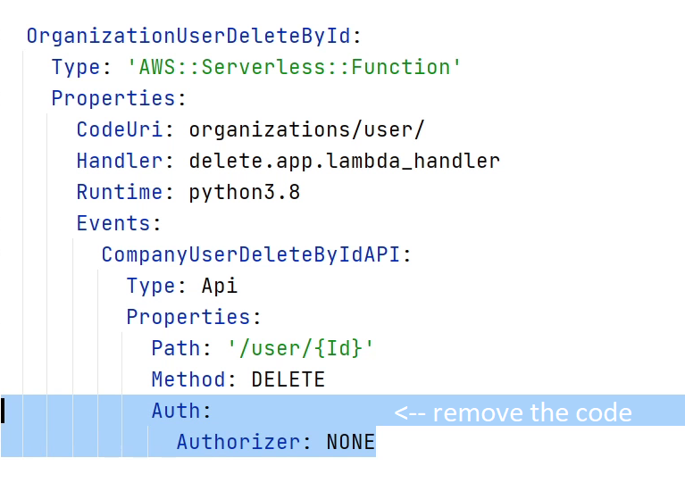

Let me start by creating an <strong>authorizer</strong> package under <strong>user</strong>. I 
will follow the usual process like creating <strong>app.py</strong> file

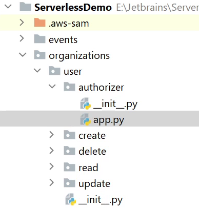

I will be using an existing blueprint for the <strong>Authorization</strong> process.
It’s already available in <strong>AWS Lambda</strong> under the <strong>Blueprints</strong>. I
am going to copy this logic into my <strong>app.py</strong>

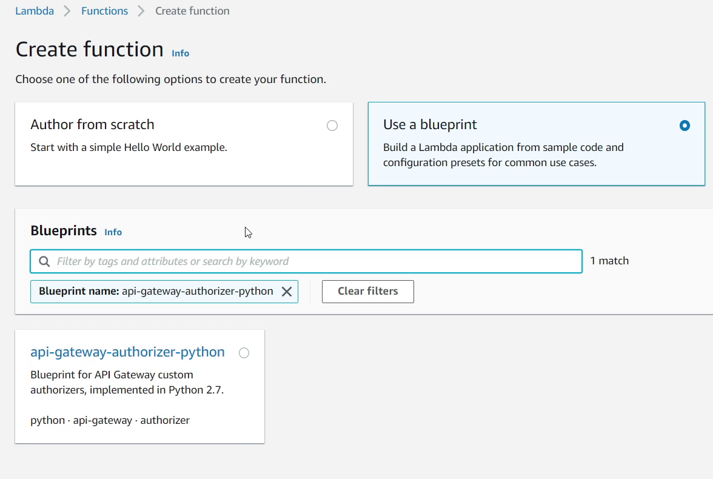

Below, I am providing the final snippet of custom authorizer blueprint. 

The source code is available on Github at [https://github.com/mukulmantosh/ServerlessDemo](https://github.com/mukulmantosh/ServerlessDemo)

`embed:tutorials/intro-aws/authentication/auth.py`

If you have observed the logic carefully, you will notice that I have slightly refactored the code according to my requirements.

You can see line number <strong>23</strong>, that I am retrieving the authorization
token from the headers. Watch at  line <strong>30</strong> I am calling a method <strong>auth_token_decode</strong>
which is going to check whether the token is valid or not. If the token is 
valid then the policy is going to allow all HTTP methods else all methods will 
be denied.

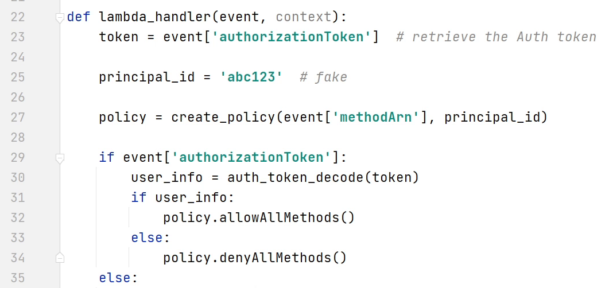

I won’t be going into too much detail as the blueprint code is already available in AWS Lambda. For reference, visit this [link](https://github.com/awslabs/aws-apigateway-lambda-authorizer-blueprints).

Let’s open the <strong>template.yaml</strong> where I am going to define the <strong>authorizer</strong> under <strong>Resources</strong>. 
The identifier is going to be named as <strong>MyApi </strong>.

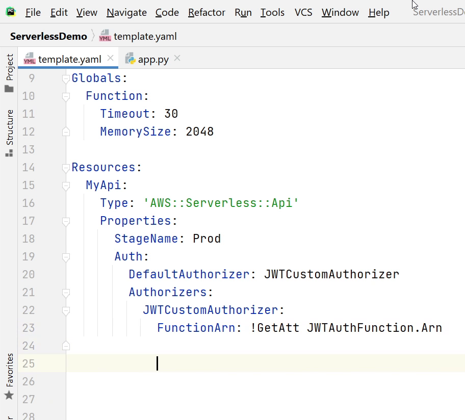

Under <strong>Properties</strong>, I am going to define the <strong>StageName</strong>. Stage name 
represents an API stage, you can provide any random text, but the common stage name 
which is widely used is <strong>dev</strong>, <strong>prod</strong>, <strong>stage</strong> or <strong>test</strong>. 
You will see it appearing in the API Gateway URI (Uniform Resource Identifier).

Under <strong>Auth</strong>, I will provide a name to my default authorizer. 
I am going to name it as <strong>JWTCustomAuthorizer</strong>.

<strong>FunctionArn</strong> is our Lambda function which is handling the
authorization process. <strong>Arn</strong> stands 
for <strong>Amazon Resource Name</strong>. 

It’s a naming convention to identify a resource.

As you can see the below image, <strong>JWTAuthFunction</strong> is going to process
the authorization once we receive the tokens.  As usual, we are going to provide the
handler, runtime etc. We are also using an environment variable 
called <strong>SECRET_KEY</strong> for encoding and decoding of our JWT Tokens. 

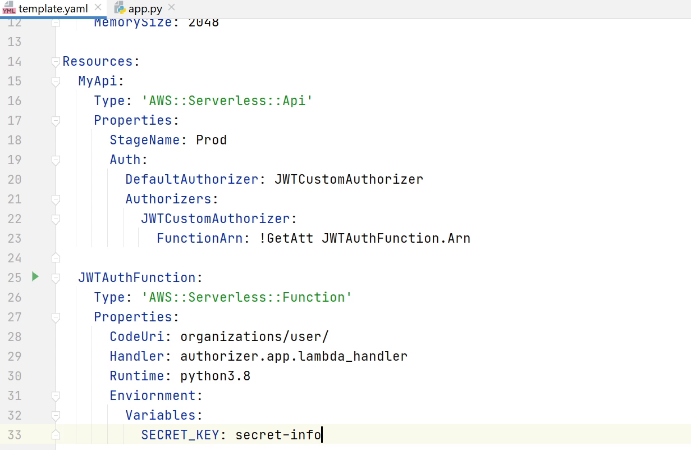

Okay, we have defined the CustomAuthorizer. Let us now make a reference to each
function so each API will only work when a token is provided.

Below I have provided the final code snippet how it is going to look like.

`embed:tutorials/intro-aws/authentication/template.yaml`

As you can see in my screen for the <strong>CreateUserAPI</strong>, I am referring to
the CustomAuthorizer through <strong>RestApiId</strong>. Until then, I have 
set the <strong>Authorizer</strong> as <strong>None</strong> which is completely
valid. I can exclude APIs for which I don’t want an authorizer for example
like the <strong>LoginAPI</strong>.

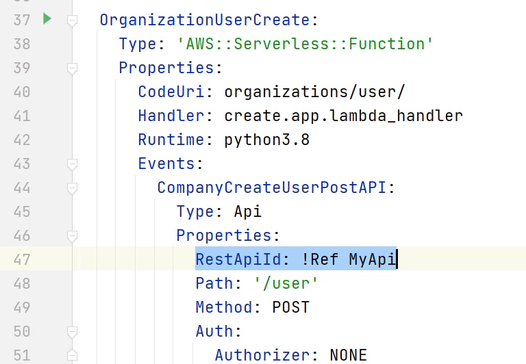

As I am done with my template.yaml file, let me go to the codebase
and create a package for Login API. 

I will follow the standard process that I did for the previous apis. 

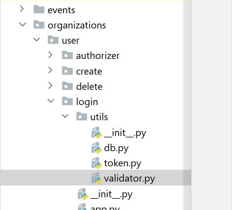

I am going to create a <strong>token.py</strong> file where I will be defining two
functions one for creating a new jwt token, and the other refresh token 
which will be used to generate new token based on previous token validity
until it hasn't expired.

JWT stands for <strong>JSON Web Token</strong> it is a self-contained way for
securely transmitting information between parties as a JSON object. This information
can be verified and trusted because it is digitally signed. JWTs can be signed using
a secret or a public/private key pair. Again, JWT is a standard, meaning that all
JWTs are tokens, but not all tokens are JWTs.

If you want to get more information about JWT then visit [jwt.io](https://jwt.io/).

Below, I have provided the final code snippet how it is going to look like.

`embed:tutorials/intro-aws/authentication/token.py`

As you can see the function <strong>create_access_token</strong> which is going to take
the user information and encode it and return us back with a long 
encrypted string. This token is only valid for 5minutes.

Ok we are done with the tokens. Let’s move to the <strong>validator.py</strong> file.

I am going to create <strong>UserLoginSchema</strong> in which I will be taking
email and password as required input. In the validation function I will check whether
the email provided exists in the db or not and not. For the password I will verify
with the encrypted password stored in the database.

If the password verification is successful then I will generate a new token
and send it back in the response.

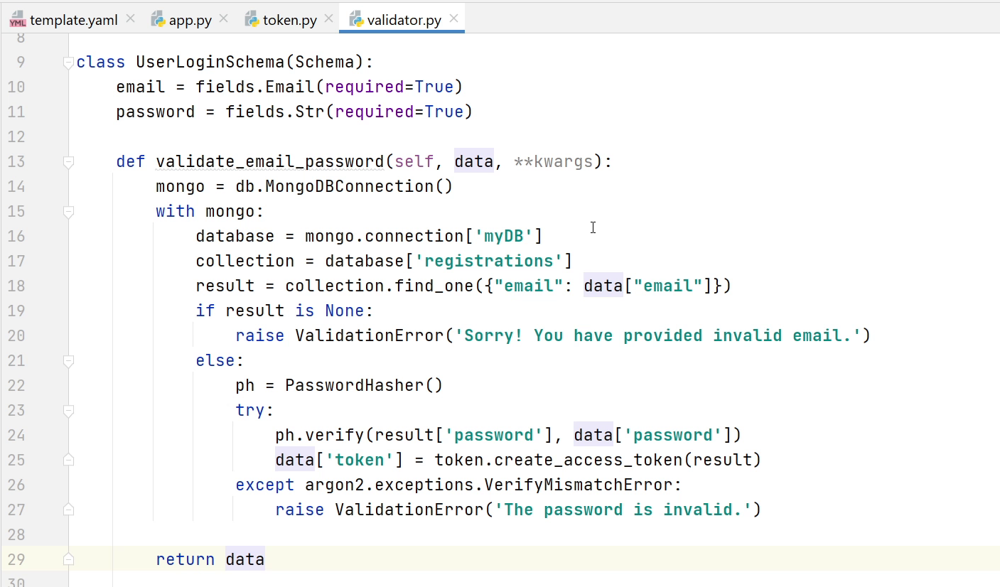

Next, I am going to create a <strong>RefreshTokenSchema</strong> which takes the 
token as required input. If the existing token is valid then it is going 
to return a new token in the response else it will raise a validation error.

Below, I have provided the final code snippet how the <strong>validator.py</strong> is going to look like.

`embed:tutorials/intro-aws/authentication/validator.py`

Let’s move to <strong>app.py</strong>. I am going to define the lambda handler.
As you have seen before I will be parsing the event body and passing into my 
schema for validation and post-processing. 

If the validation is successful then it will return a token with 
200 http response else it will raise an error with 400 status code.

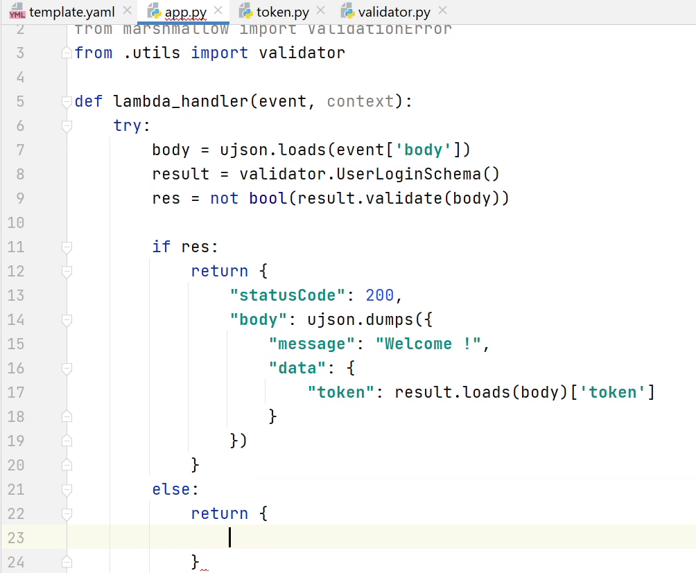

I will be also defining one more function <strong>token_refresh</strong> in the same file. 
It is also going to perform the same kind of operation taking an existing token as
input and returning it back with a new token.

Below, I have provided the final code snippet how the <strong>app.py</strong> is going to look like.

`embed:tutorials/intro-aws/authentication/app.py`

Now, I am going to register the UserLogin & RefreshToken API in 
the <strong>template.yaml</strong> file.

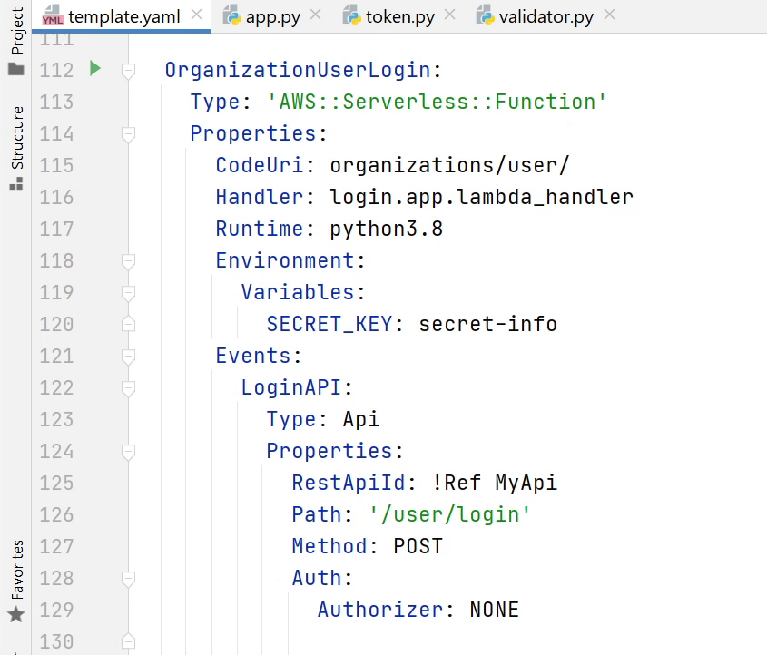

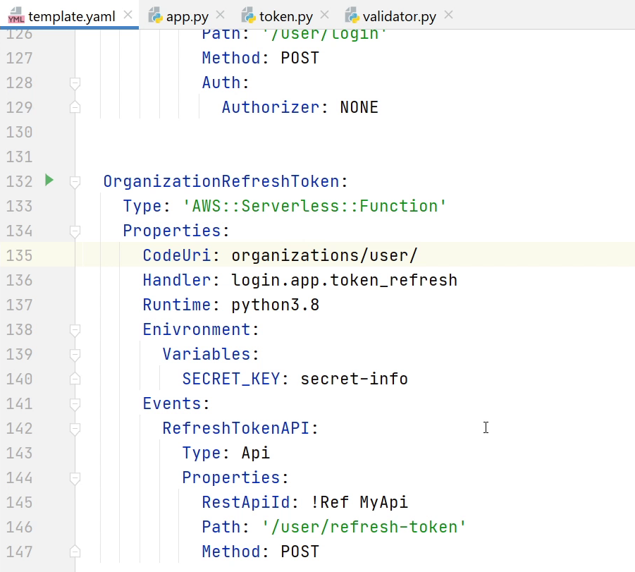

We have registered the APIs. Before testing out the API there are some
issues which I have missed, let me fix that. Open <strong>app.py</strong> and
goto line number <strong>19</strong> it should be <strong>load</strong> not loads, remove ‘<strong>s</strong>’.

Next, I will goto <strong>token.py</strong> file remove <strong>decode</strong> in line number <strong>15</strong>. 

For the refresh token function in line number <strong>21</strong>, I need to 
mention the algorithm <strong>HS256</strong>. You can follow the source code in [Github](https://github.com/mukulmantosh/ServerlessDemo).
It's already up-to-date.

Let’s test out the functionality. I will click on <strong>Run</strong> and then <strong>Edit Configurations</strong>

You can see I have provided <strong>email</strong> and <strong>password</strong>. 

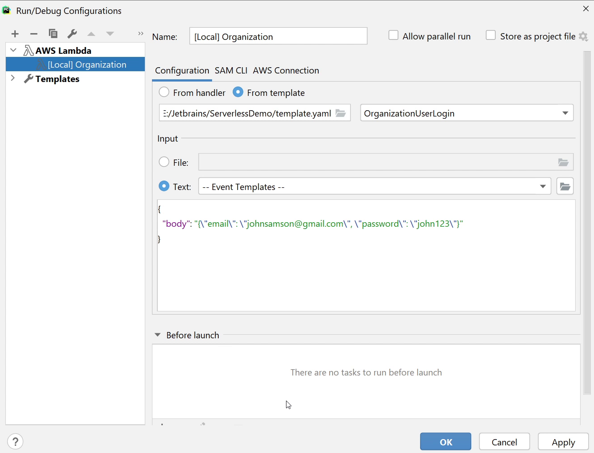

Let me run the function and check out what response I get.

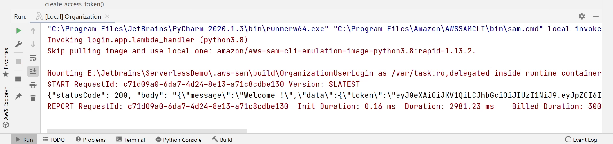

Okay, I am receiving a new token. Now, I am going to pass this token to the RefreshToken function and in return I will receive a new token.

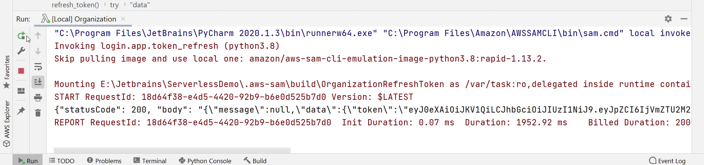

I am receiving a new token. Both the functions are working Great !

In the upcoming tutorial I will be writing Unit Tests to make sure our functions are working fine before deployment.

