Hello everyone, today I will be working on APIs basically focusing in CRUD operations.

Source code is available on [Github](https://github.com/mukulmantosh/ServerlessDemo).

# Create (C)

We are going to create an **Organization** directory and as we know, 
every organization has users or employees. Thus, we are going to perform four different operations
like **Create**, **Read**, **Update**, **Delete**.

Let me start creating the **organizations** directory. But before that let me delete the **hello world**.

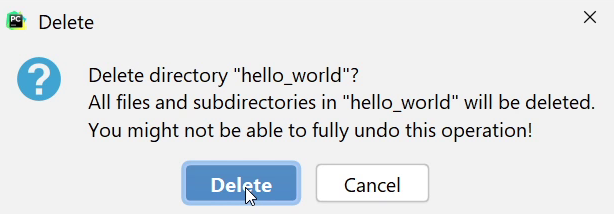

I am going to place **requirements.txt** under organizations. 
Basically it needs to be placed under the **users** directory. I just forgot to do that,
but I have rectified in my upcoming video. Don’t worry, you can find the entire 
tutorial source code in [Github](https://github.com/mukulmantosh/ServerlessDemo).

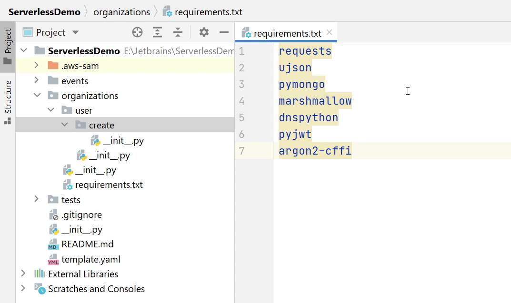

Let me give you brief idea about the packages which I am using in this project. 

`requests` package allows you to send HTTP requests using Python.

`ujson` is also known as ultra json and written purely in C. It is very fast compared to the standard json module.

`pymongo` & `dnspython` both are required dependencies for connecting to a MongoDB Database.

`marshmallow`  module helps convert complex data types, such as objects, to and from native Python data types. This module is normally used with Flask but if you are coming from Django Rest Framework background you can compare it with serializers.

`pyjwt` is a Python library which allows you to encode and decode JSON Web Tokens (JWT).  We will be using the JWT module in the Login & Refresh Token APIs.

`argon2` is a cryptographic hashing algorithm, most recommended for password hashing. It is also the winner of the 2015 Password Hashing Competition, a community-organized open competition to select a next generation hashing algorithm. 
It’s designed not to be easier to compute on custom hardware than it is to compute on an ordinary CPU.

* Make sure to run `pip install -r requirements.txt`

I will be creating different packages like (**create**,**read**, **update**, **delete**) under users.

Under the **create** directory, I will create an **app.py** file and utils package 
where I will be storing basic utilities like db connection and validator.

Now, I am going to write the code for connecting to MongoDB, but before that let me open MongoDB Atlas and copy the connection string for Python driver.

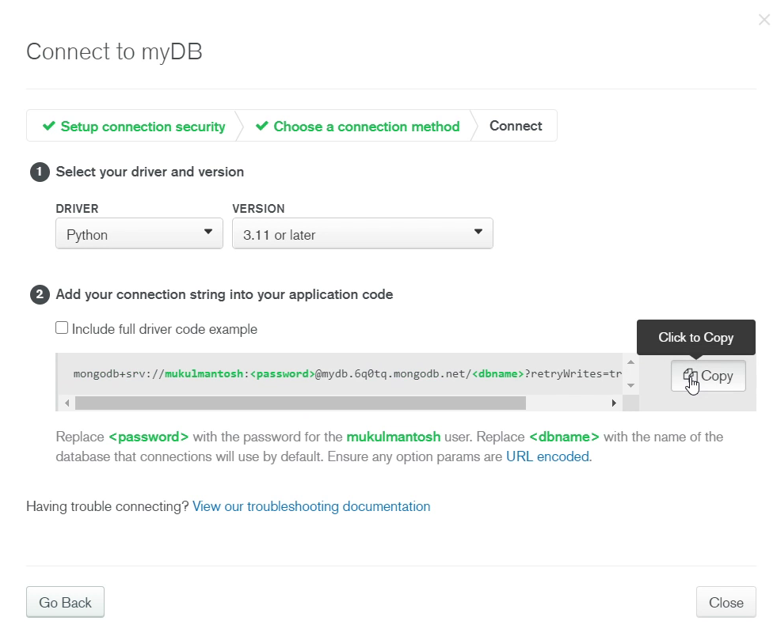

I will be creating a **MongoDBConnection** Class. This class is actually a **context manager**, 
as you may know Context managers allow you to allocate and release resources precisely when you want to. 
The primary motivation behind context managers is resource management.

As you can see in the below code, we have used special methods `__enter__` and `__exit__`. 
The enter method will help to establish connection with the database, and the exit method will take care to close the connection.

`embed:tutorials/intro-aws/crud/db.py`

Now I will open the **validator.py** file and start creating a schema using the **marshmallow** module.

We won’t be storing plain-text passwords in the database. 
You can see that we are using the **encrypt** function which returns the hashed value.

`embed:tutorials/intro-aws/crud/create_validator.py`

You can see how the schema looks similar to [**DRF Serializers.**](https://www.django-rest-framework.org/api-guide/serializers/) For post-processing 
you can see we are using **post_load** decorator for encrypting our passwords as well validating email
for their existence in the db.

Now, I am going to open **app.py** where the main business logic resides.

Let me first import the necessary modules. Next, I will define the **lambda handler**.

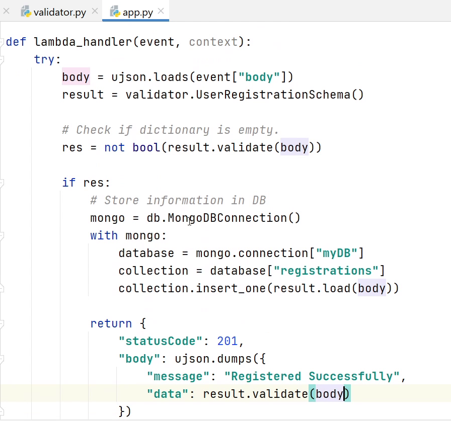

All the information will be coming under the **event body**. I need to parse the information using the **json** module.

The **UserRegistrationSchema** will be validating and processing whether all the inputs provided are correct or not.
If the validation fails, or there is a generic key error, then it will raise a bad request, 
otherwise I will store the record in the registrations collection and return 201 HTTP response.

Below code is the final snippet how the **app.py** is going to look like.

`embed:tutorials/intro-aws/crud/create_app.py`

Now, I am going to open the **template.yaml** file.

I have a global timeout of 30 seconds, and set the memory size to 2GB, it's completely based on your preference.

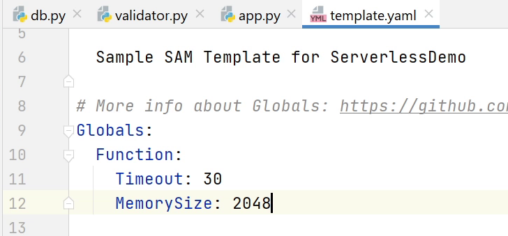

After setting the memory limit, I am going to register the API.

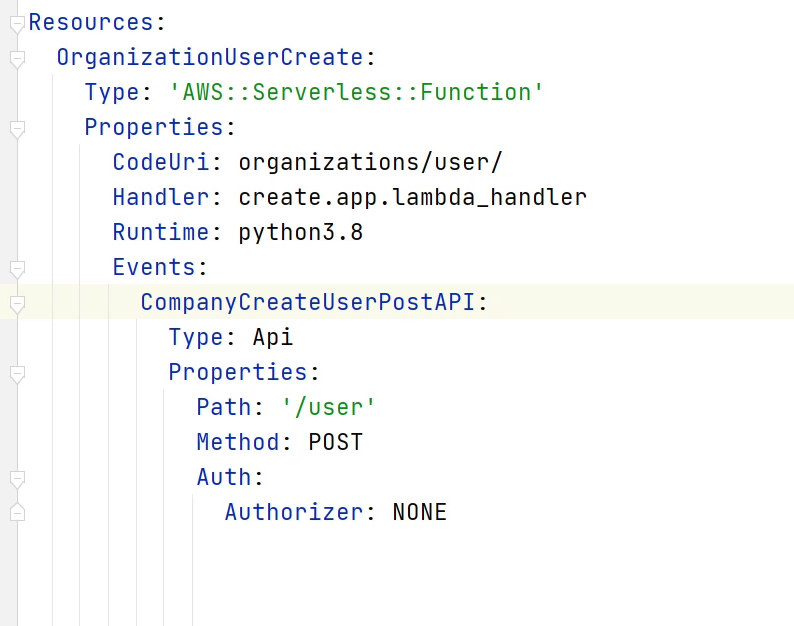

**Codeuri** points to the directory where my code resides and **Handler** is combination of **folder_name.file_name.function_name**

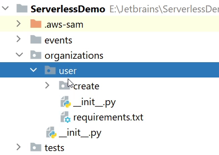

Please make sure **requirements.txt** is placed under the **user** directory, otherwise the build will fail.

We are now ready to test our application.  Let me copy a sample snippet from `event.json`. 
I will be passing dummy information in the body to check whether my function is able to create a new user.

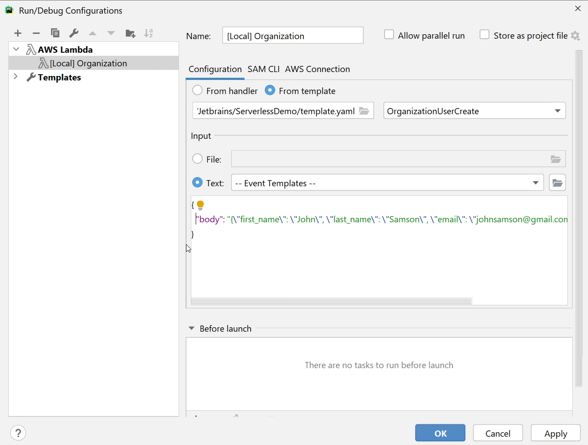

Okay, as you can see in the console, the user has been registered successfully. 

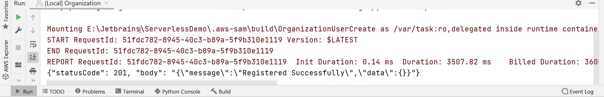

Let me verify the data is also present in MongoDB. 

Yes, the record has been successfully inserted in our database and even the password is
stored in encrypted format.

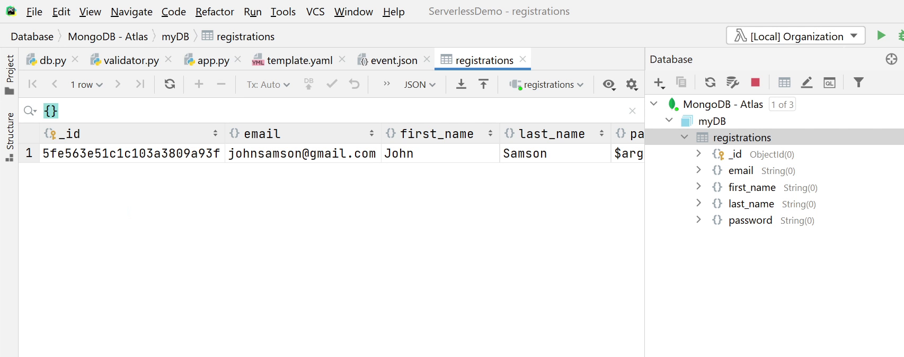

Finally, we can store the user information in our database. Let’s move and create an API
which retrieves a list of users from the database.

# Read (R)

I am going to create a **read** package under the user. 
I will follow a similar kind of implementation as I did for the create operation.

I am going to copy the **db.py** file from utils and place it under the **read/utils**.

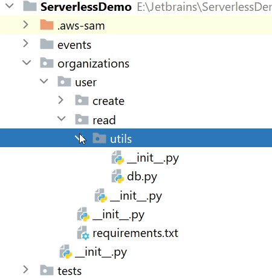

Same as previous, I will create **app.py** where I will be defining my business logic.

You can see on line **7** that I am trying to retrieve the id from path parameters. 
The ID is referring to the primary key of a specific user.

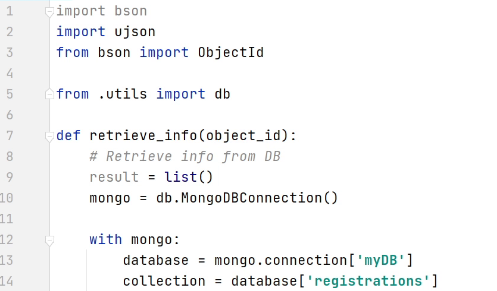

The **retrieve_info** function will take **object_id** as an input. **Object_id**
is referring to the ID which we receive from **PathParameters**, if object_id is present in the db we return information
related to that specific user else we return all users list.

This is how the final code going to look like.

`embed:tutorials/intro-aws/crud/read_app.py`

The implementation is done. Let’s move to **template.yaml** file and register our API.

We will register two APIs. One is **OrganizationUserRead** and **OrganizationUserReadById**.

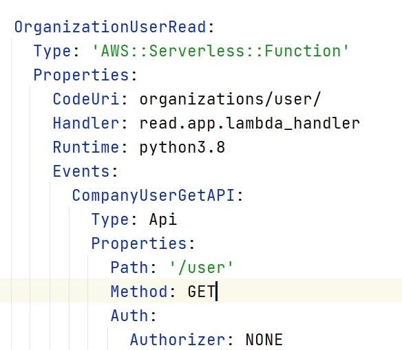

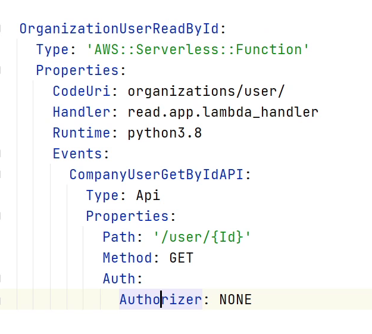

You can see both the APIs are pointing to the same business logic. 
In **ReadById**  we are passing **Id** as a 
parameter for getting information for a particular user.

Let’s test out the functionality. 
I will click on **Run** and then **Edit Configurations**. 
This is a GET API we don’t need to pass anything in the body. 

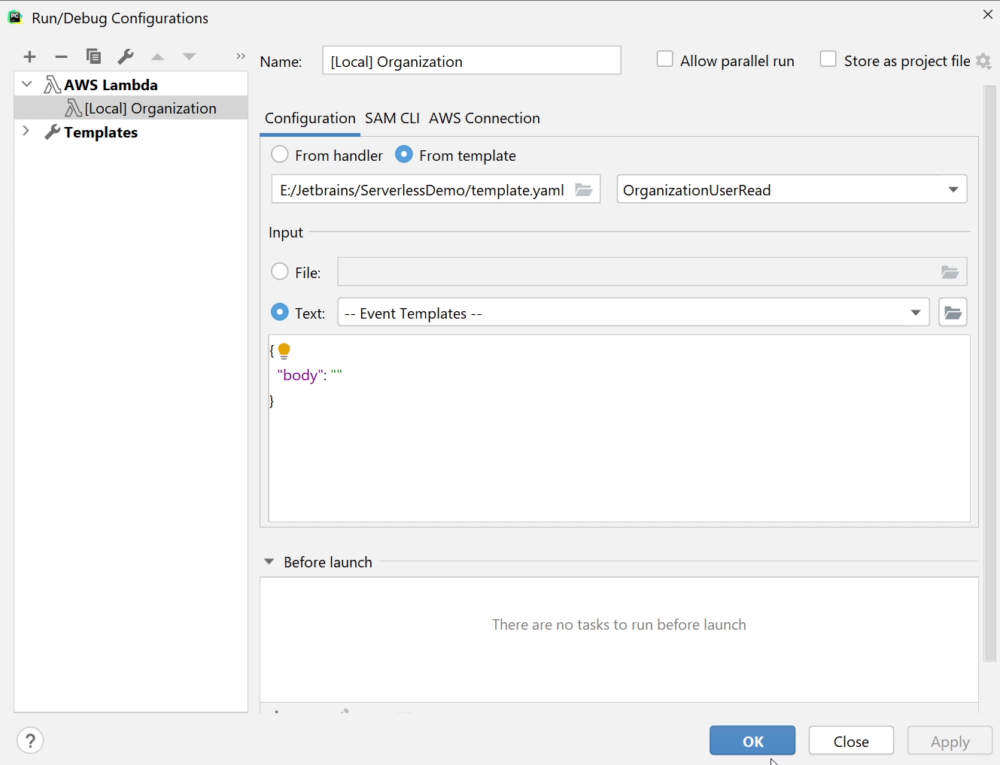

On a Windows machine you will get a Docker prompt for file sharing, kindly accept it.

As you can below in the console, we are receiving all users list.

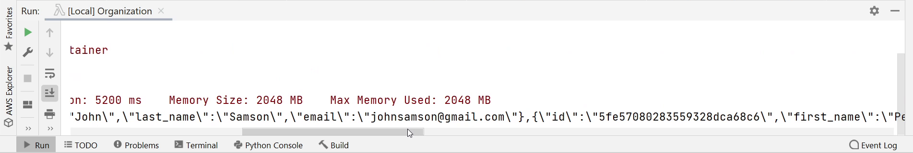

Now, I will try to retrieve information for a specific user. Let me first go to 
the **registrations** collection. 

I will copy the **_id** for the user **Mike Jones**.

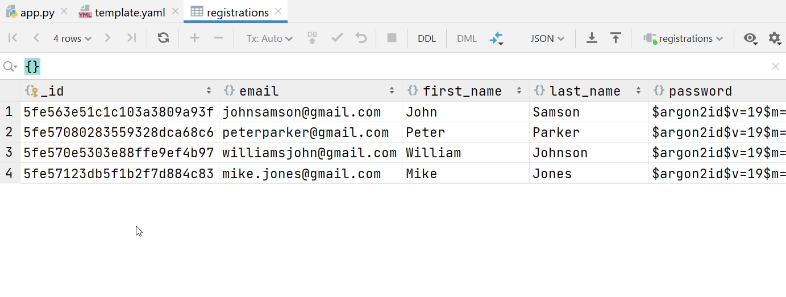

I will then paste the **_id** it in the **pathParameters**. I will click on Apply and then OK.

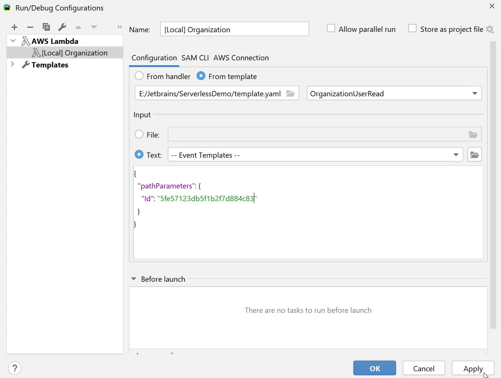

Before running the app, I have found an issue which needs to be fixed otherwise our code is not going work.

Open **app.py** goto line number **45** it should be **“Id”**, I should be uppercase.

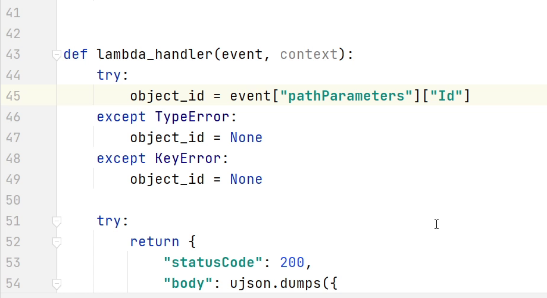

Save it and let me try to run again.

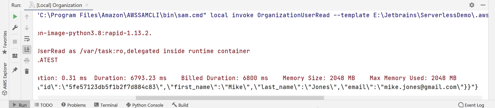

It's working fine. We are getting information for user **Mike Jones**. 

Finally, our API is able to retrieve information from the database. Let’s move on and create an API which will be used to update records in our database.

# Update (U)

I am going to create an **update** package under the user. I will follow the same approach that I did before for create & read operations.

As you can see over here at line **10** that we are again capturing **Id**. If the Id is
present in the database we will move forward and update all the required fields else it will raise an error.

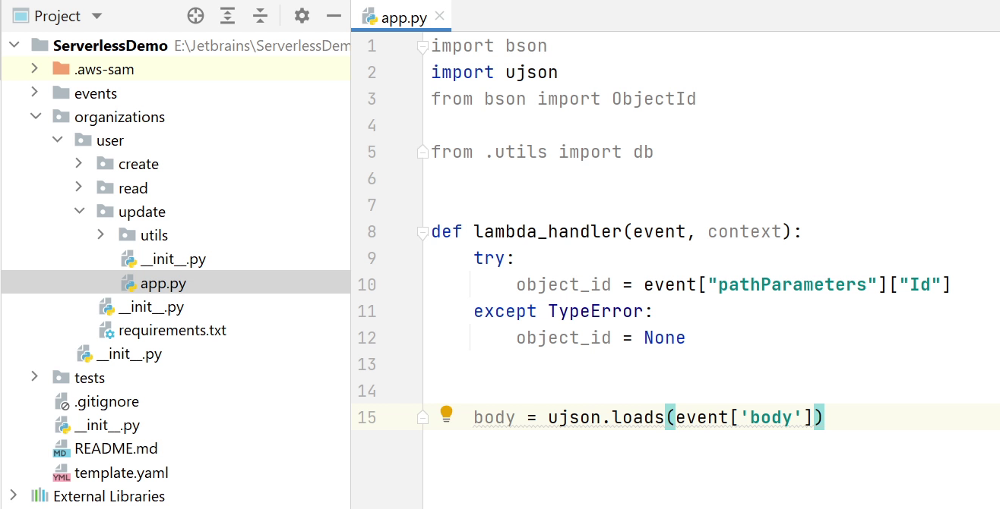

I will call the **update_one** operation, observe line number **25** which will search whether
the ObjectId exists in the database if yes then it will set the new values. If the update is successful
then it will return 200 HTTP Response.

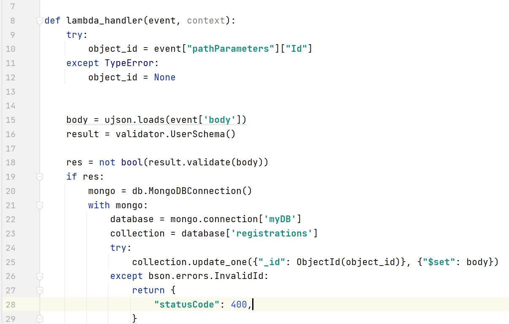

This is how the final code for the update operation is going to look like.

`embed:tutorials/intro-aws/crud/update_app.py`

Let’s register the API in the **template.yaml** file. As this API is being used to update our records, 
so the method is going to be **PUT**.

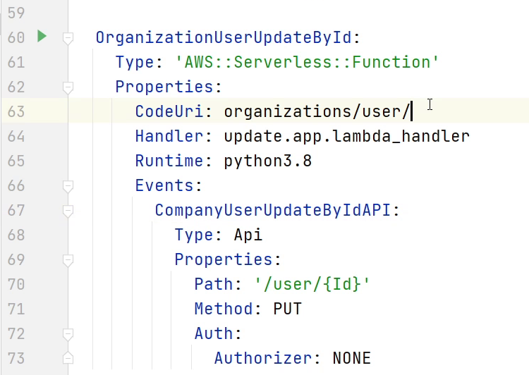

 
Now, let’s test the functionality. I will click on **Run** and then **Edit Configurations**.

I will pass necessary information like **id** in path parameters and in the body I will send the 
values for firstname, lastname and email which needs to be updated.

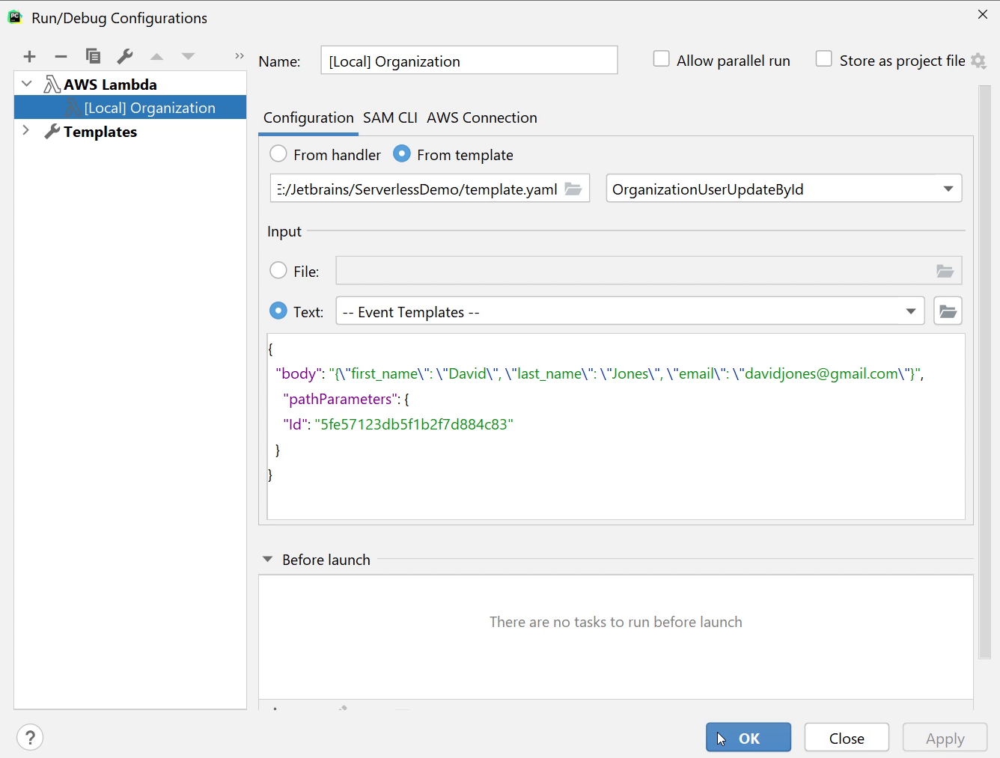

Apply the changes and try to run again.

Finally, our data has been successfully updated. 

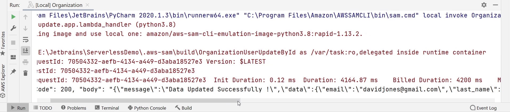

Let me refresh the **registrations** collection and verify whether data has been updated or not. 

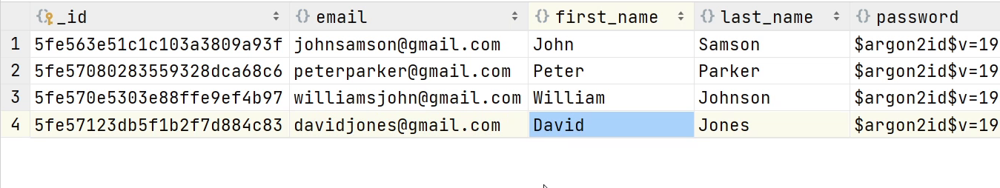

Great ! The data has been updated.

# Delete (D)

Let’s now move to the final part where we are going to remove records from the database by creating a DeleteAPI.

I am going to perform the same kind of operations that I did previously for other operations.

You can see over here at line **9** that we are again capturing **Id**. 
I will call the **delete_one** operation which will remove the object from the database.

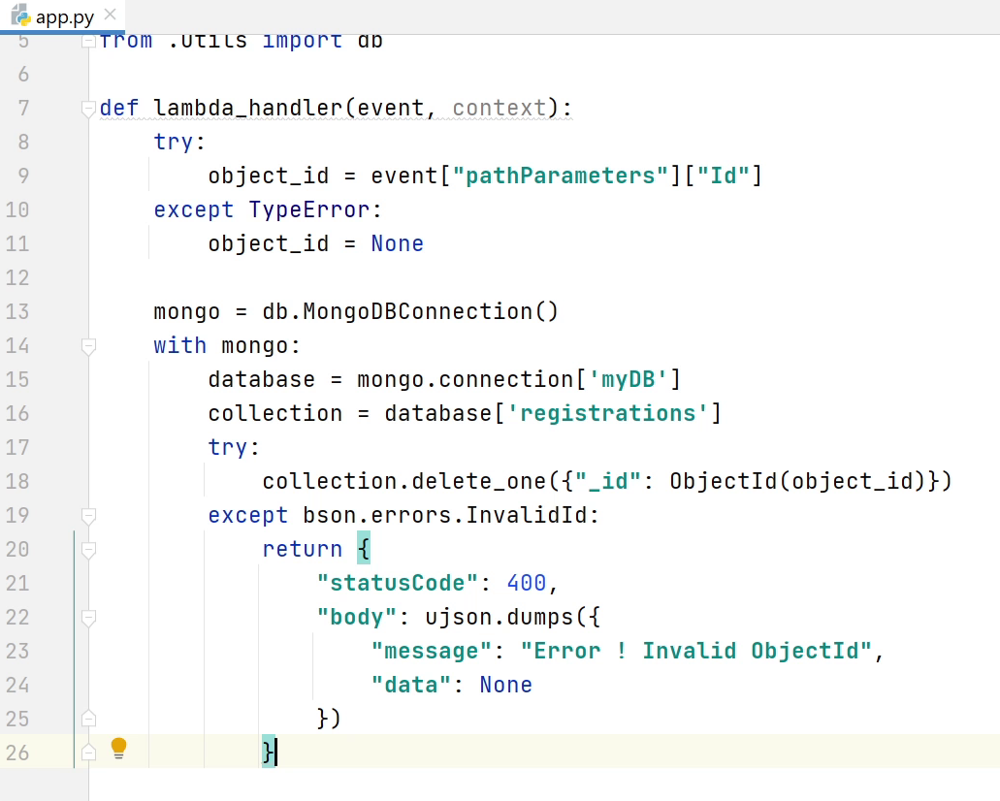

We are performing a similar kind of operation what we did for the update.

Okay, our implementation is done. This is how the final code is going to look like.

`embed:tutorials/intro-aws/crud/delete_app.py`

Let’s now register our API in **template.yaml** file and test out the functionality.

I am going to remove the last row **David Jones** from the **registrations** collection.

Click on **Run** and then **Edit Configurations**. 
I will pass the **id** of David Jones in **pathParameters**.

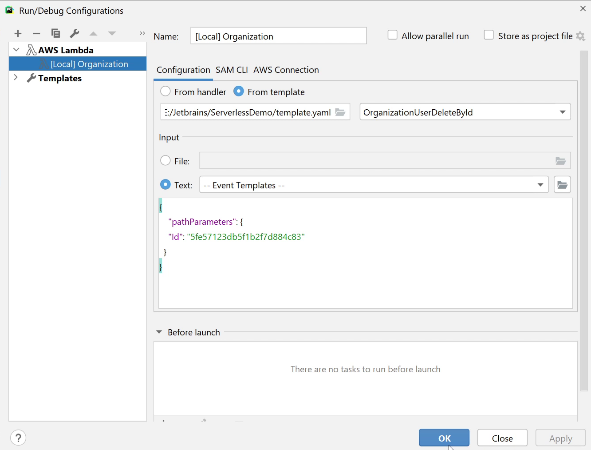

I will apply the changes and try to run again.

The data has been successfully deleted from the db. Let me refresh the collection and verify it.

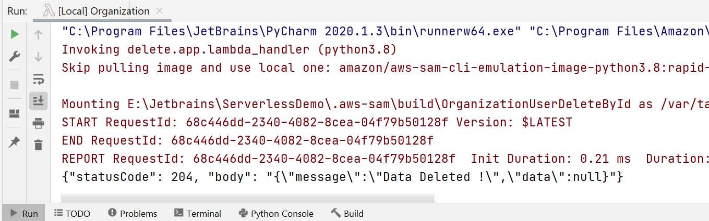

Great! The record has been removed.

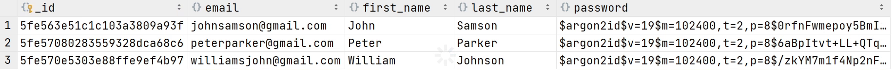

We have successfully completed the entire CRUD (Create, Read, Update & Delete) APIs. In the upcoming tutorial
we will be working on the Custom Authorizers to protect our APIs.
