In this tutorial we are going to deploy our functions in AWS and test it through Postman.

# Beginning Launch in AWS

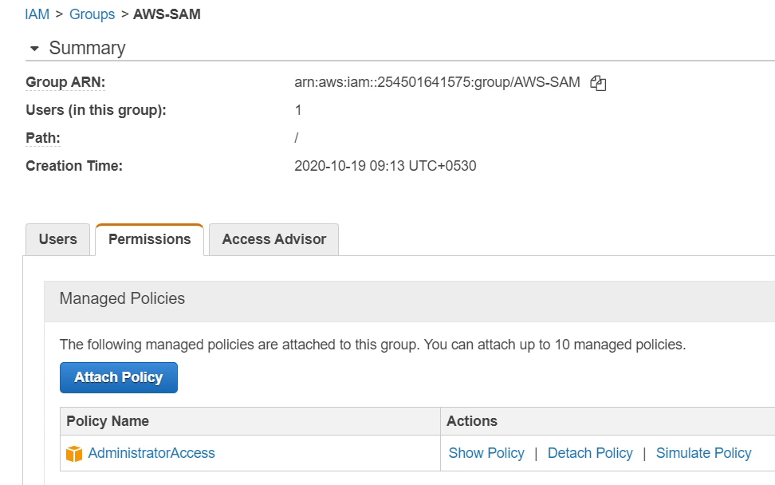

Before we start, I want to give some information, as you can see in the above image,
I have chosen <strong>AdministratorAccess</strong> which provides complete access to
all the AWS Resources. In my previous video, I used different policies, there is no
problem in that, but recently there was information shared by AWS
that AWS Lambda will deprecate two managed policies called <strong>"AWSLambdaFullAccess"</strong> 
and <strong>"AWSLambdaReadOnlyAccess"</strong> on January 25, 2021.

For this tutorial I have used <strong>AdministratorAccess</strong>, but to be honest
its not recommended approach from point of security and access controls.

* Please follow the [Security best practices in IAM (Identity & Access Management)](https://docs.aws.amazon.com/IAM/latest/UserGuide/best-practices.html).

PyCharm is already open, I will right click on the project <strong>ServerlessDemo</strong>, 
then at the bottom I click on <strong>Deploy Serverless Application</strong>.

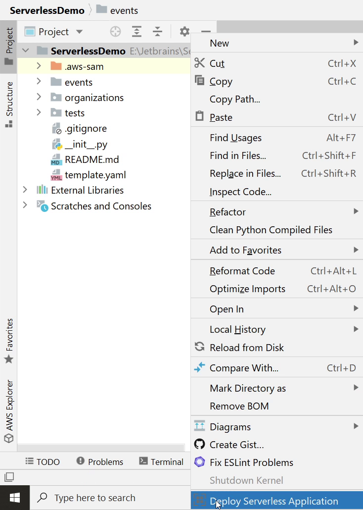

I will provide the stack name as <strong>ServerlessDemoStack</strong>. This is required for the CloudFormation. 

Next, I will create an S3 bucket <strong>serverless-pycharm-demo</strong>, it will be created in the <strong>ap-south-1</strong> region.

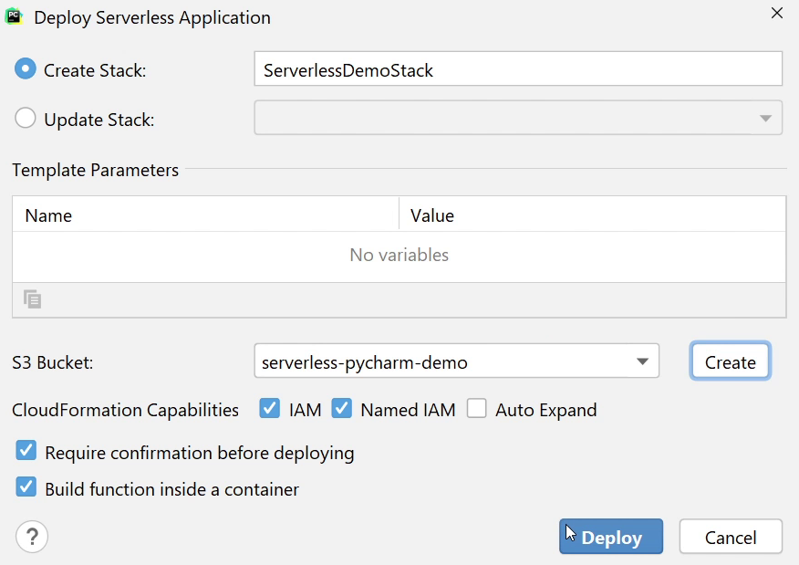

Make sure <strong>“Require confirmation before deploying”</strong> 
and <strong>“build function inside a container”</strong> are both checked.

Then finally I will click on <strong>Deploy</strong>. It will take some time to build and package the application.  

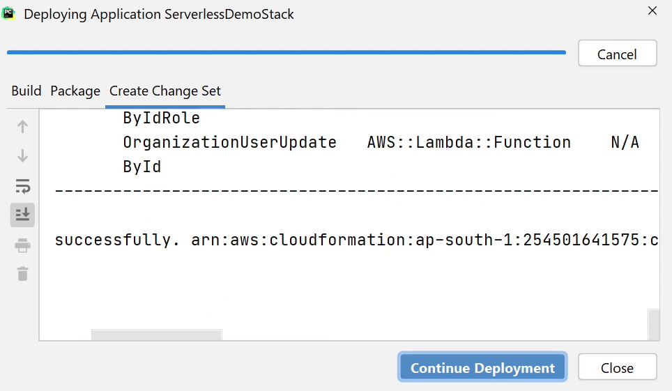

Once the build & packaging process is complete, then I am going to click on <strong>Continue Deployment.</strong>

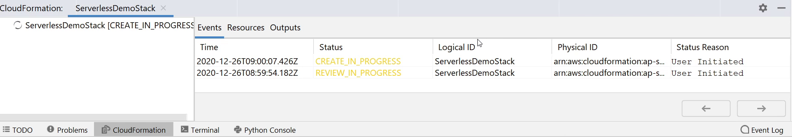

You can see on the CloudFormation Console that the stack is getting created. 
It will take a few minutes to complete. 

Okay, the stack has been successfully deployed. I will open the AWS Management Console and search for <strong>API Gateway</strong>.

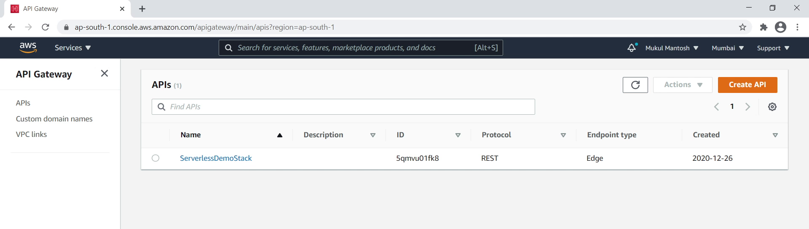

Let me give you brief idea what is API Gateway. <em>Amazon API Gateway is a fully managed service that makes it easy for developers to create, publish, maintain, monitor, and secure APIs at any scale.</em> 

As you can see I am in the API Gateway Console, and it is displaying the <strong>ServerlessDemoStack</strong> which we created.

You can see the list of APIs along-with their request Methods like GET, POST, PUT and DELETE.

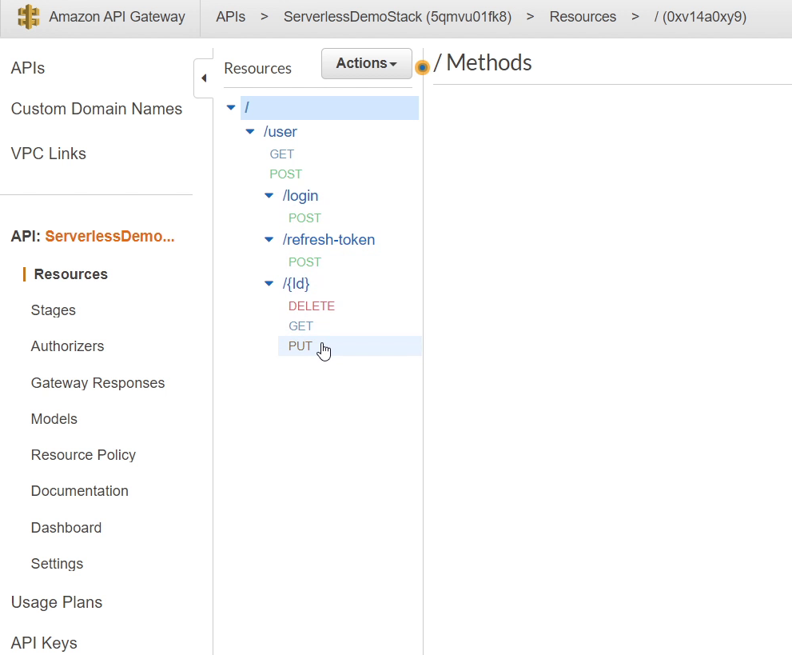

Next, I will click on <strong>Stages</strong> which you can see in the left sidebar. 
You remember we created the stage name as <strong>Prod</strong> in the <strong>template.yaml</strong> file.

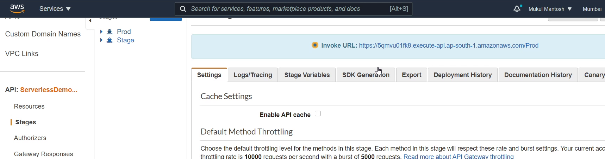

You can see the <strong>Invoke URL</strong> in the above image, this the URL from which we are going to access our API, 
I am going to copy the URL and paste it in Postman.

Okay, let’s begin by testing the <strong>Login API</strong>. I am going to provide
email and password. If the credentials are authenticated successfully then
I will receive a [JWT](https://jwt.io/) token.

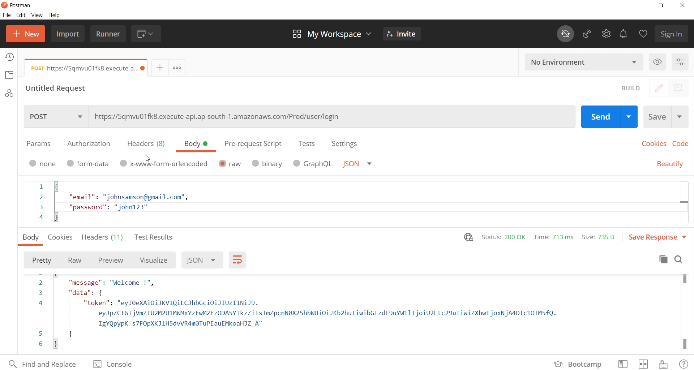

As you can see I have been successfully authenticated and also I received a token in response.

This token will be used subsequently in other operations to authorize the requests.

I am going to retrieve list of users, for that I need to pass the token in the <strong>Authorization</strong> header,
and the request method is got to be <strong>GET</strong>. 

You can see I am able to retrieve all users. 

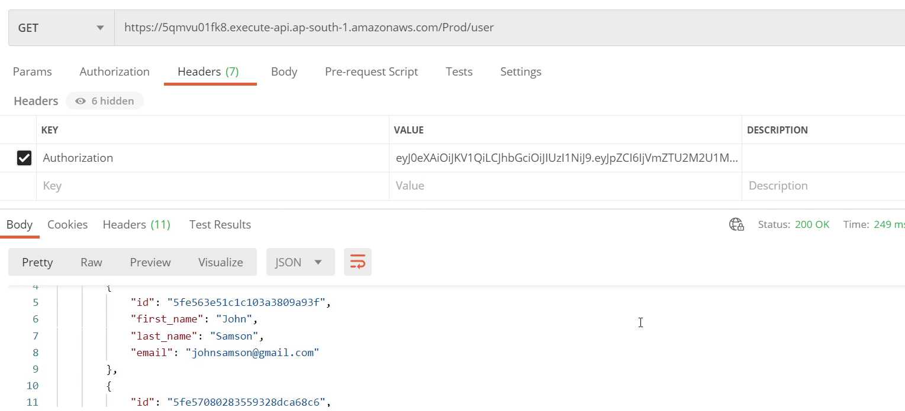

Let me try to get information for a specific user. You can see that I am also receiving information for that particular user.

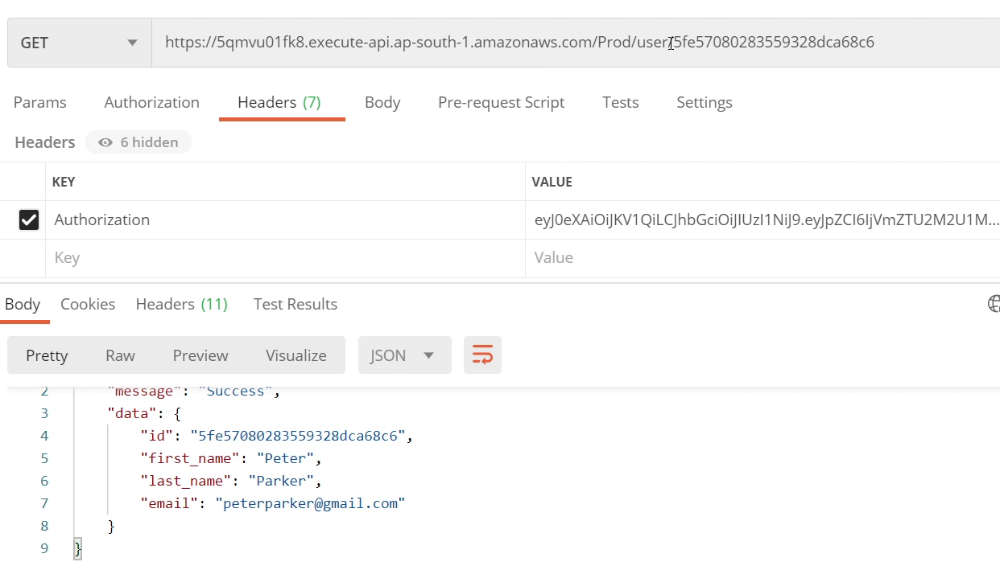

Now, I am going to create a new user, and the request method is going to be <strong>POST</strong>. I will be providing all the necessary information, make sure to pass the token in the Authorization header.

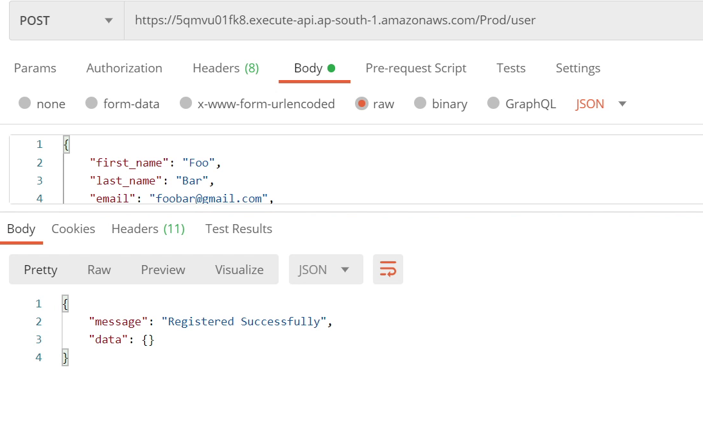

Okay, we have successfully created a new user. So, I am going to perform update operation on the same record.

The method is going to be <strong>PUT</strong>. I will modify the first name and last name into lower case and change the email address from gmail to yahoo.

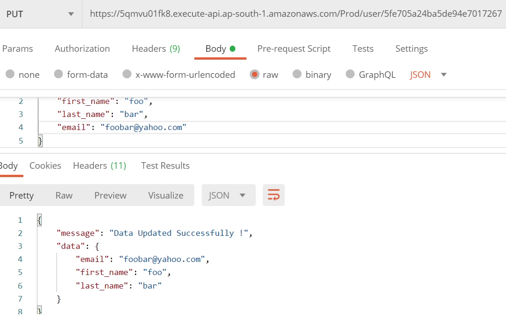

The data has been successfully updated as you can see on the above image.

Let’s move with the final API to delete records from the database.

The method is going to be <strong>DELETE</strong>. I don’t need to pass anything in the body.

You can see I received 204 HTTP Response that means the record has been successfully removed from the database.

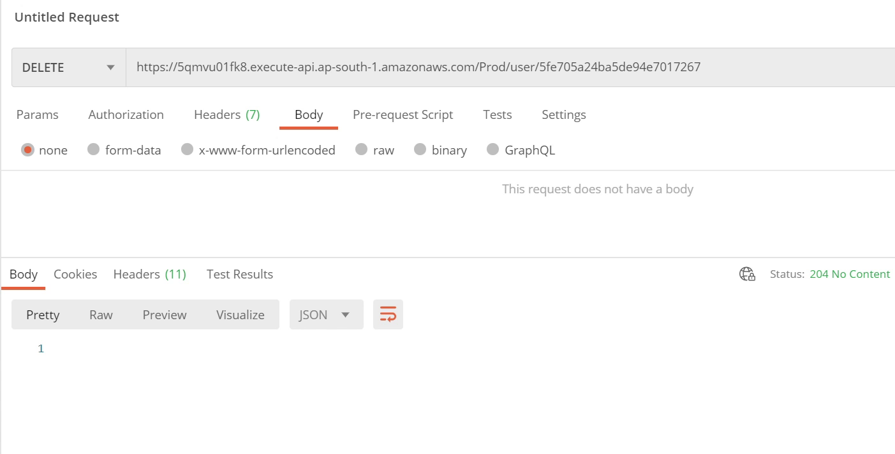

Finally, we have successfully performed all the operations starting from development to deployment in AWS and all this happened smoothly through PyCharm. 

This tutorial is a jump-start for those who want to get started with AWS Lambda
and create serverless APIs. I suggest following the AWS documentation, 
to stay updated about their latest offerings, and the new improvements they
are adding to their tech stack. 