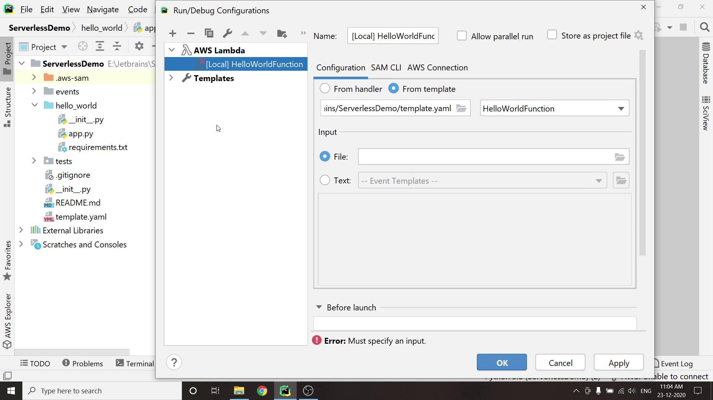
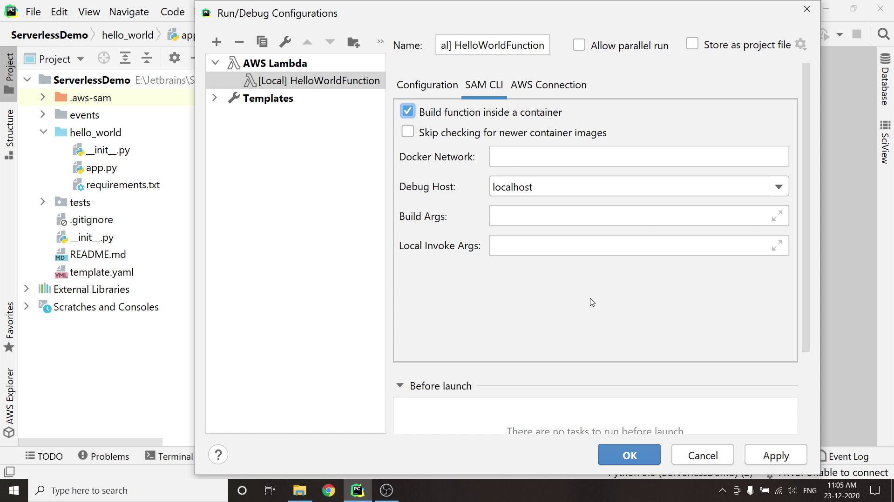

In this tutorial we are going to run our lambda functions inside a container.

# Docker

We are going to use Docker. Docker is an open platform for developing, shipping, and
running applications. Docker lets you separate your applications from your 
infrastructure, so you can deliver software quickly. If you are using Windows then you can use
something called <strong>Docker Desktop</strong>. 

Just follow the official documentation for the installation process, and you will be good to go.

# Configurations

PyCharm is already running. I will click on <strong>Run</strong> 
then I will go to <strong>Edit Configurations</strong>.

Now, I need to choose <strong>Event Templates</strong>. 
I am going to pick a template called <strong>“Hello World”</strong>. 
This event is going to be passed into our Lambda function.

After that, I will click on <strong>SAM CLI</strong>, 
make sure to check <strong>“Build function inside a container”.</strong>

Click on Apply and then OK.

Then I will goto run and click on <strong>Run HelloWorld</strong> Function.

If you are running on Windows, then Docker Desktop will prompt for sharing the file. Kindly accept it.

As you can see, this is my JSON Response which I received from my lambda function. 
In the console you will be receiving more information like how much duration it took
to execute the function along-with billed duration and max memory used.

This is how we can run and debug our lambda functions locally in our machine.
