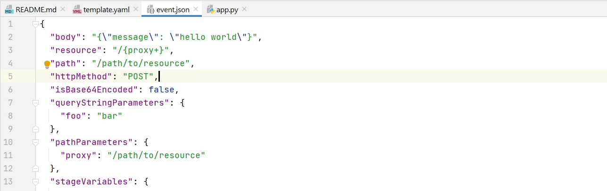

In this tutorial step, we will be setting up the new project and exploring the project structure.

# New Project

As you can see the latest PyCharm Interface as they are offering in **2020.3**

Below we have the PyCharm Professional 2020.3 `New Project screen`. To start, I will click on the **New Project** button.

I will be choosing the **AWS Serverless Application**.

As you can see **Location** points to path of my codebase. 

For this tutorial, I have chosen `E:\Jetbrains\ServerlessDemo` as my path. 

The runtime is going to be **Python3.8**, and we will be using the default SAM Template **AWS SAM Hello World**.

You are free to use virtual environment of your choice. I am sticking to **virtualenv**.

There is something new added by the AWS plugin to the interface called **Package Type** which provides two options: **Zip** & **Archive**.

**Zip* is basically archiving and storing it into Amazon S3 
and **Image** is storing the Docker Images in AWS ECR 
also known as Amazon Elastic Container Registry. We are now good to go. I will click on **Create**, and we will 
wait for a few minutes for the project to get initialized.

# AWS Toolkit

Before doing a deep dive into the Project Layout 
if you want to get more information
about the AWS Toolkit please visit the website
[aws.amazon.com/pycharm](https://aws.amazon.com/pycharm/) which is offered by AWS. 
This Toolkit is developed by AWS so over here you can see what
are the features they are providing along-with their recorded webinars
and all other information you can find in their website.

# Project Layout

You can see how this project looks like. 
This is a small kind of blueprint or starter template. 

The heart of this application is the **template.yaml** file.

It looks similar to **CloudFormation**. 
It’s basically an extension to the CloudFormation Template.
If you have previously worked with CloudFormation then its
basically known as **Infrastructure as a Code**. 
It is a tool from AWS that allows you to spin up resources
quickly and everything is being managed via code. 
If you don’t use AWS and you rely on different cloud vendors
then you can use an open-source tool provided by HashiCorp called [Terraform](https://www.terraform.io/). Terraform is an open-source 
infrastructure as code software tool that provides a consistent
CLI workflow to manage hundreds of cloud services. The great 
advantage of using Terraform is that you can use it with any cloud 
provider.

As you can see in the template over here there is 
something like **“description”**, **“template version”**. This is the global information about your functions. All the functions will be getting a time-out after 3 seconds. You can also define your memory requirements.

We will be registering our APIs under this **Resources** section.

There are two properties **CodeUri** and **Handler**. 
CodeUri is the directory in the business-logic reside
and Handler is the combination of file name and 
function name (**app.lambda_handler**). 

**Lambda handler** is nothing but a pure python function. It takes a set of events and from
that event you will be getting all information like the request body etc. 

This is the sample response structure of the lambda function.  

So, in the lambda function you might have seen something called **events** & **context**. 
I will dig deeper into this.

When Lambda runs your function, it passes a context object to the handler. 
This object provides methods and properties that provide information about 
the invocation, function, and execution environment.

As you can see on my screen this is a list of **properties** which you can pass
in your lambda context. I will provide the link in the description if you want to go into more
details about the Lambda Context.

Apart from context there is one more thing passed called **events**.
According to AWS an event is a JSON-formatted document that contains data for a 
Lambda function to process. The Lambda runtime converts the event to an object and
passes it to your function code. It is usually of the Python dict type. It can also
be list, str, int, float, or the NoneType.

If you want more information, please visit [AWS Lambda context object in Python](https://docs.aws.amazon.com/lambda/latest/dg/python-context.html)

In the above image you can see a sample event which can be used for testing the functions as you can see over here
what are the data that is passed to the lambda function. 
The sample shows how we are passing the request body.

There is a **tests** directory. If you want to write some unit tests, your Lambda functions
locally can use the same sample **event.json** file.

# Template Anatomy

If you want to get into more details about Serverless Functions then there is something 
called **[Template Anatomy](https://docs.aws.amazon.com/AWSCloudFormation/latest/UserGuide/template-anatomy.html)** as you can see on my screen. Here you will get more information about what data we can pass to the SAM Template. 
There are lots of properties over here which you can pass to your serverless functions. You can set the events, environments, handlers and you can even set the memory size. 

You will feel intimidated at first, but don’t worry, we will be exploring step by step. In the upcoming tutorial I will show you how to run the Lambda function locally using 
Docker Container.
