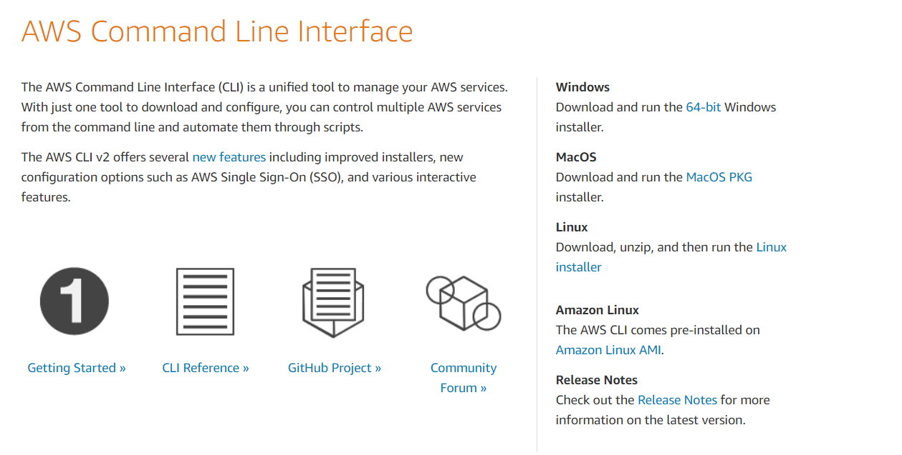
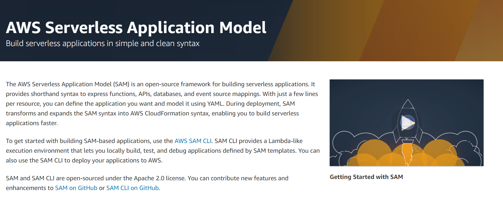
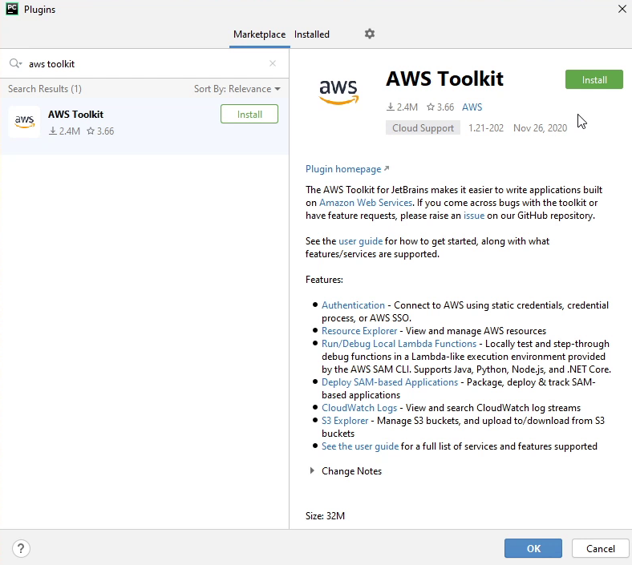
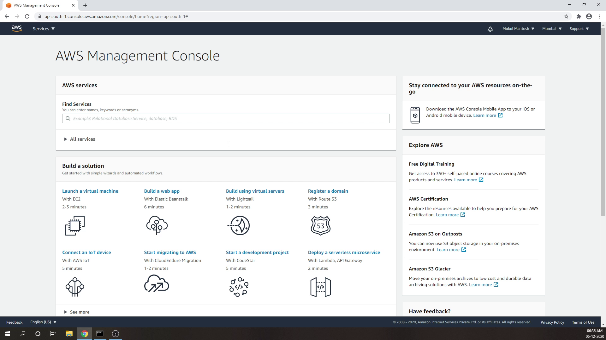
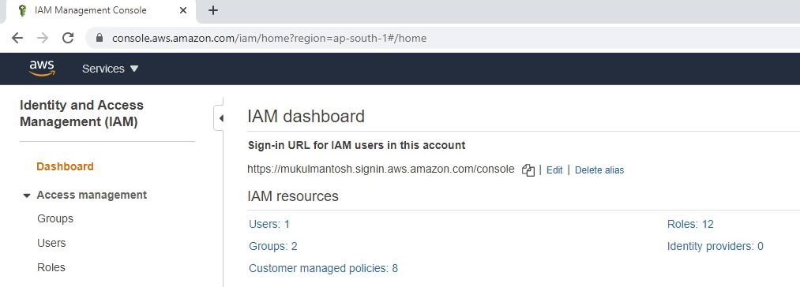
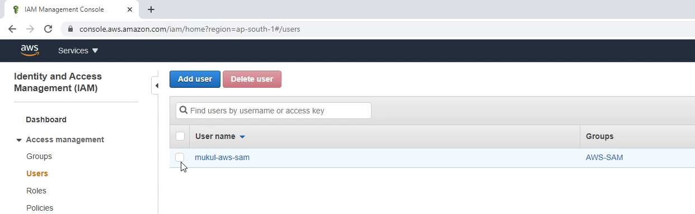
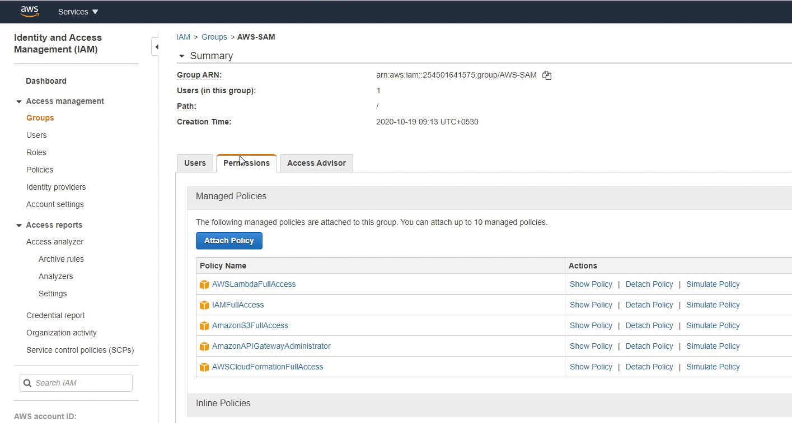
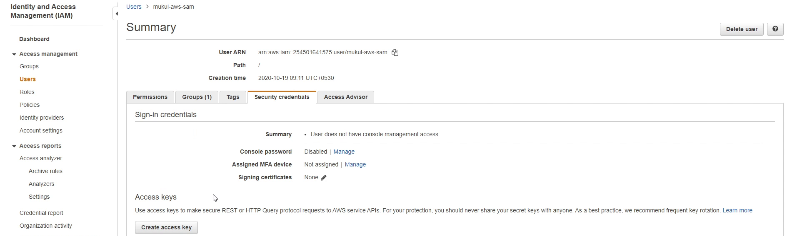
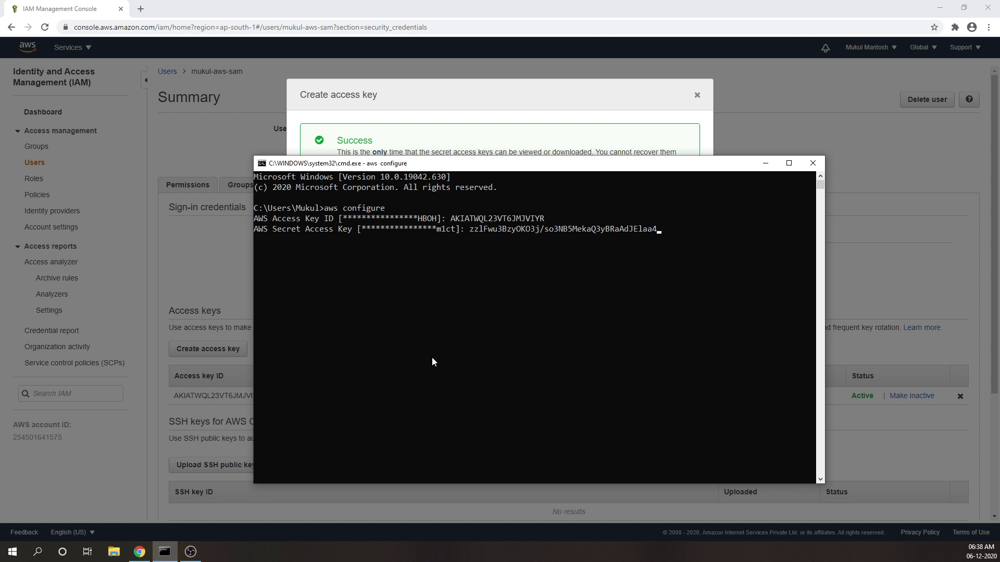

In this tutorial step, let's install all the required dependencies.

# AWS CLI
Let's start first by downloading the AWS Command-Line Interface from `aws.amazon.com/cli`. 
As I am using a Windows machine, I will download the 64-bit installer. 
You can follow the same website if you are using Mac or Linux.

Before moving forward with AWS SAM, make sure you have installed following dependencies.
  - AWS CLI 
  - [Docker](https://www.docker.com/)

# AWS SAM (Serverless Application Model)

According to Amazon, the AWS Serverless Application Model (SAM) is an open-source framework for building serverless applications.
A serverless application is a combination of Lambda functions, 
event sources, and other resources that work together to perform tasks.
Note that a serverless application is more than just a 
Lambda function -— it can include additional resources such as APIs,
databases, and event source mappings.

You can download the setup file from `aws.amazon.com/serverless/sam` and follow the 
same installation process like you did above for the CLI.

# AWS Toolkit

This plugin is developed by the Amazon AWS team. It is an open source plug-in for the PyCharm IDE
that makes it easier to create, debug, and deploy python applications on Amazon Web Services. 
The toolkit provides an integrated experience for developing serverless applications,
including assistance for getting started, step-through debugging, and deploying from the IDE.

To learn more about this plugin, refer to this link [AWS Toolkit for PyCharm](https://aws.amazon.com/pycharm/).

To install the plugin follow the below steps.

 - Go to `Settings -> Plugins`
 - Search `AWS Toolkit`
 - Click on `Install`

# AWS Management Console

Before starting up the project make sure that you have an AWS Account. 
As you may know, AWS provides a free tier for some of the services,
up to 12 months. Also, there are some services which are even free 
after 12 months, such as AWS Lambda, which provides 1 million free
requests per month and 400,000 GB-seconds of compute time per month.

To know more about AWS, please visit [aws.amazon.com](https://aws.amazon.com/)

# Identity & Access Management (IAM)

Once you have created an account and successfully logged into AWS, then we 
will goto IAM section. IAM stands for Identity & Access Management. IAM lets you manage access to AWS services and resources securely. 

When I click on users, basically it will show me the lists of users 
residing in my account. As you can see, I have one user. I will click
on that specific user to get more information.

You can see below that user falls under a **Group**. 
A group is a collection of IAM users. Groups let you specify permissions for multiple users and make it easier to manage.

Over here I have provided full access to some of the AWS services 
because of the tutorial, but this is definitely not a good practice.
You should always follow the principle of least privilege. 
Okay, we are done with the Groups. Let’s move back to the Users. 

I will click on the specific user. Now I will hover to **Security Credentials.**
I am now going to click on `create access key`, and it is 
going to provide me **access key id** and **secret access key**.

I will copy the credentials and open Command Prompt or Terminal. I will type **aws configure**
which will prompt me to enter **aws access key id** and **secret access key**.

Once done, you are finally set to access your AWS Services programmatically
through the CLI. You have completed installing the system dependencies.