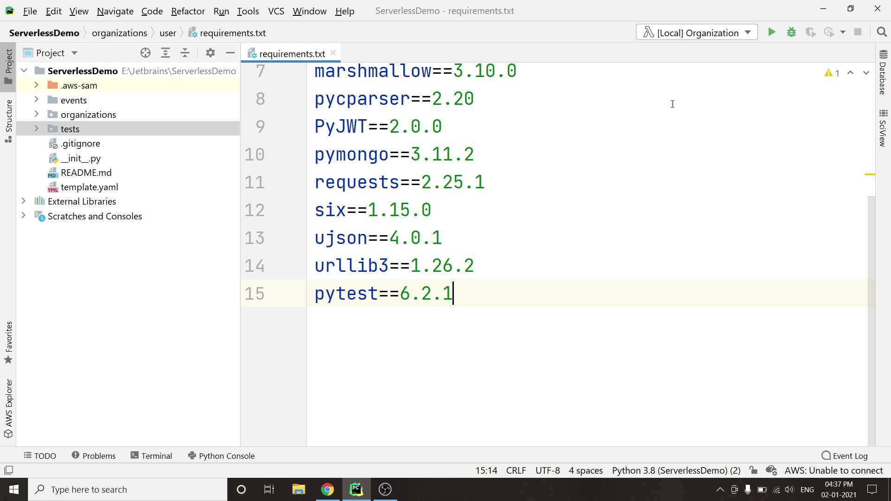
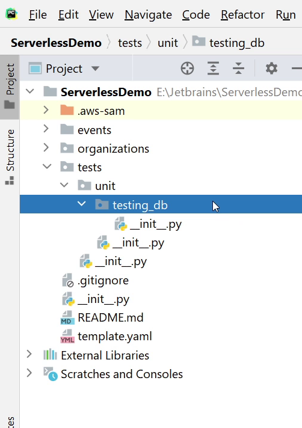
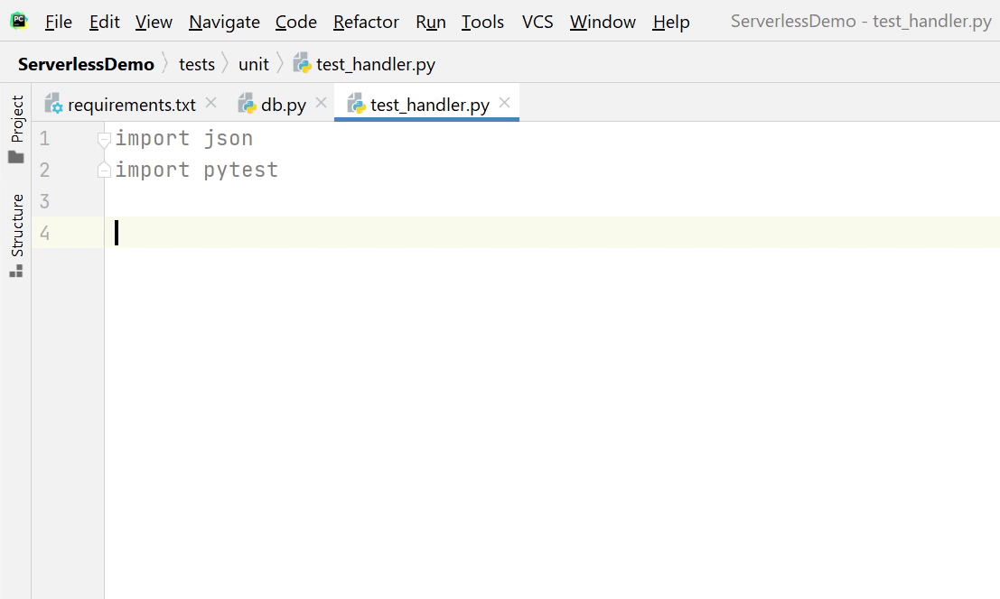
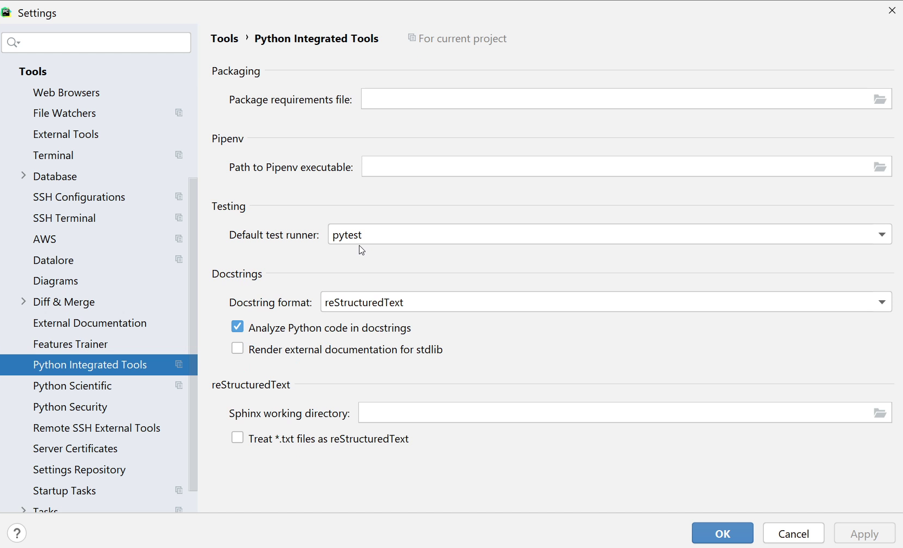
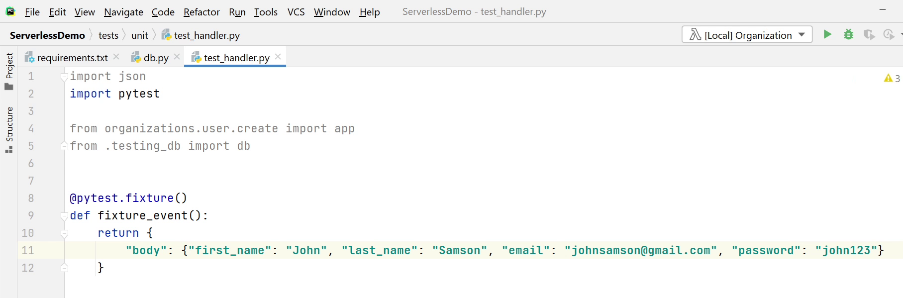
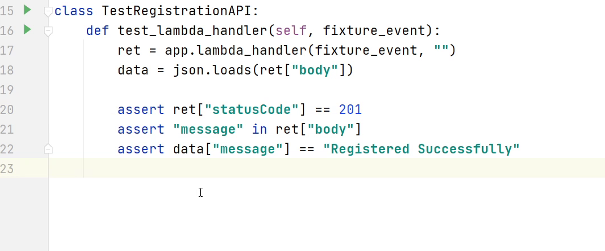
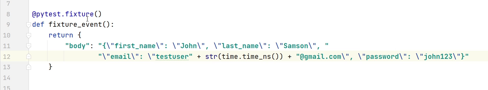
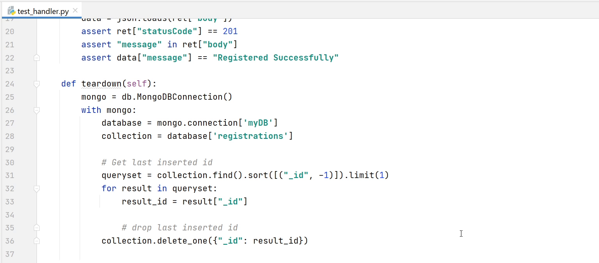
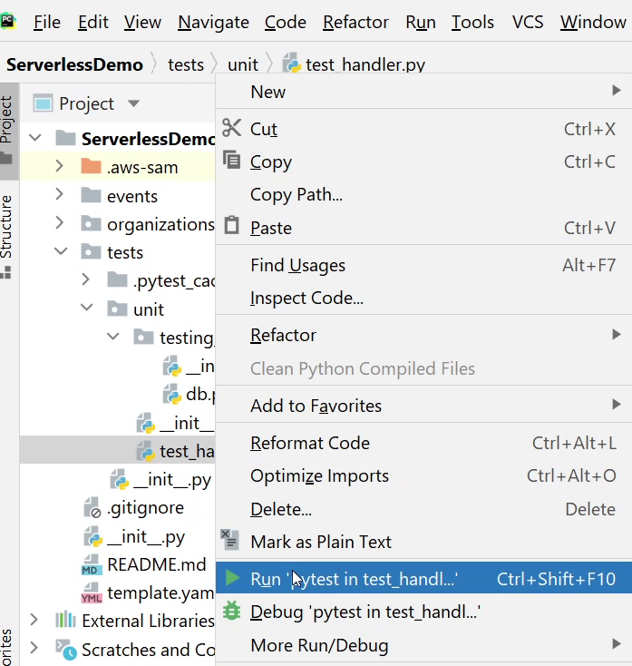
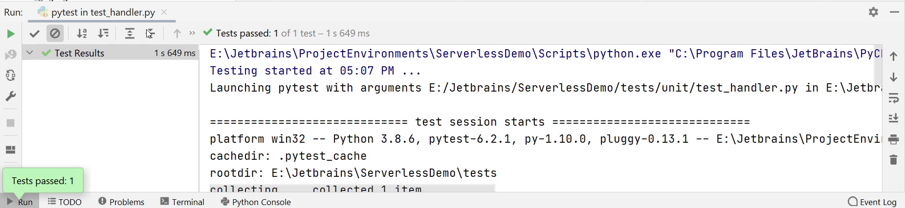

In this tutorial we are going to work on Unit Tests.

# Unit Testing

According to Wikipedia : <em>Unit tests are automated tests written and run by software
developers to ensure that a section of an application (known as the "unit") meets its 
design and behaves as intended.</em>

I will be covering only one scenario that will help you understand how we can begin with
unit testing. 

# Installing Requirements

First, install the <strong>pytest</strong> package. 
It's the most popular python testing framework, widely used by developers and QA engineers.

# Let's begin testing

I am going to start from scratch. Let me first delete the default <strong>test_handler.py</strong> file.
I will create a db.py file under the testing_db package which will contain the same 
database connection logic which I used earlier.

Next, I create the <strong>test_handler.py</strong> file under the unit package where I will write the unit tests.

Now, I am going to import the necessary modules like <strong>json</strong> and <strong>pytest</strong>.

Next, I am going to setup <strong>pytest</strong> as my default test runner. 

Go to `Settings -> Tools -> Python Integrated Tools` and set the default test runner to <strong>pytest</strong>.

Let’s resume where we left and import the necessary modules.

I am going to create a sample fixture, according to Wikipedia <em>"A software test fixture sets up
a system for the software testing process by initializing it, thereby satisfying any
preconditions the system may have."</em>

You can see in the above image, I will be passing a sample user information to run my test case.

I will begin creating the <strong>TestRegistrationAPI</strong> class where I will be loading my fixture and passing it into the lambda handler.

Before running the test case, make sure to add escape characters in the sample
fixture as shown in line 11 and 12. As you can see on the below image,
every time I run the test case, I will receive a different email address. 
This is just for creating randomness, nothing special.

In the <strong>teardown</strong> method I will be flushing only the last inserted object from the database.

Okay, now I am ready to test. I will right click on the file <strong>test_handler</strong> and then I will click on <strong>Run “pytest in test_handler”</strong>.

The test has begun. It will take a few minutes or less than that based on the acceptance criteria.

Awesome ! The test has been successfully passed. This was a basic glimpse of unit testing. 
If you  are interested to know more about testing then refer to this interesting tutorial [Visual Testing with pytest](../visual_pytest/)
written by [Paul Everitt](../../authors/pwe/).
