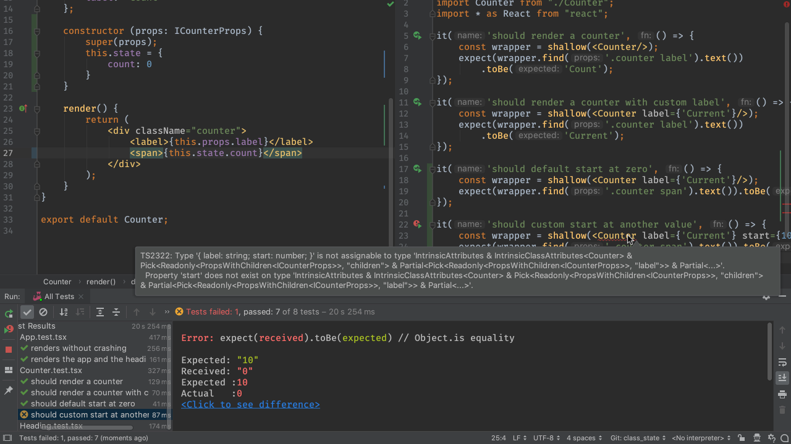
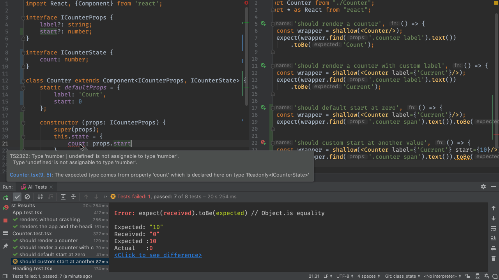

In [Class Components With Props](../class_props/) we made a child component 
using a class, with one property passed in. We used classes for child 
components when they have state or need hooking into one of React's 
lifecycle methods.

That's the topic of this step. We're want a reusable counter component 
that internally keeps a count of clicks.

This step, though, will be just the minimum: no actual clicking to update
state, for example. We will stick to introducing component state and
modeling it in TypeScript.

## Code

The finished code for this tutorial step is 
[in the repository](https://github.com/JetBrains/pycharm_guide/tree/master/demos/tutorials/react_typescript_tdd/class_state).


## Always Start With a Test

It's becoming our pattern: 

- We write a *failing* test first

- Then *implement* the presentation component

- Then wire it into the *parent* 

To begin, have `Counter.tsx` in the left-hand tab and `Counter.test.tsx` 
in the right-hand tab. Also, stop the `start` process if it is running 
and make sure the `Jest` run config is running.

Here's a `Counter.test.tsx` test to show that the counter starts at zero,
which *fails*, because we have a static `<span>1</span>`:

```typescript{}
it('should default start at zero', () => {
    const wrapper = shallow(<Counter label={'Current'}/>);
    expect(wrapper.find('.counter span').text()).toBe('0');
});
```

Over in `Counter.tsx`, let's first write the interface for our *state*. 
What does the local state look like? Pretty easy:

```typescript
interface ICounterState {
    count: number;
}
```

Now the class definition and constructor can setup state, which we'll use
in the `render` method:

```typescript{}
class Counter extends Component<ICounterProps, ICounterState> {
    static defaultProps = {
        label: 'Count'
    };

    constructor(props: ICounterProps) {
        super(props);
        this.state = {
            count: 0
        };
    }

    render() {
        return (
            <div className="counter">
                <label>{this.props.label}</label>
                <span>{this.state.count}</span>
            </div>
        );
    }
}
```

Several things changed in this:

- `Component<>` has a second generic, for the state

- We added a class `constructor`

- This constructor is passed the props (which we'll use in a moment)

- The constructor *must* call the superclass's constructor

- We assign some local state

Note that, when tying in the JSX/TSX, we got autocompletion not only 
on `.state`, but also `.count`. That's the value of making an interface.

## Starting Value

Sometimes we want a counter that starts somewhere besides zero. Let's pass
in an optional prop for the starting value. First, the test in
`Counter.test.tsx`:

```typescript{}
it('should custom start at another value', () => {
    const wrapper = shallow(<Counter label={'Current'} start={10}/>);
    expect(wrapper.find('.counter span').text()).toBe('10');
});
```

As before, our test fails, but before that, our IDE warns us that we have
violated the `<Counter/>` contract. 



We'll fix the interface in `Counter.tsx`:

```typescript{3}
interface ICounterProps {
    label?: string;
    start?: number;

}
```

Then, add it to the `defaultProps`:

```typescript{3}
static defaultProps = {
    label: 'Count',
    start: 0

};
```

Finally, change the component *state* to get its initial value from the
component *props*:

```typescript{4}
constructor(props: ICounterProps) {
    super(props);
    this.state = {
        count: props.start

    };
}
```

When we do this, though, TypeScript gets mad:
 
```
Error:(21, 13) TS2322: Type 'number | undefined' is not assignable 
to type 'number'. Type 'undefined' is not assignable to type 'number'.
``` 


 
We said the `start` property was optional, by putting a `?` in the 
interface field. As the compiler error explains, this means it can be 
a `number` *or* a `null`. In the component *state*, though, we say 
it can only be a `number`.

[TypeScript 2.7](https://www.typescriptlang.org/docs/handbook/release-notes/typescript-2-7.html)
provides an elegant fix for this with *definite assignment assertion*.
Sometimes you know better than the compiler. At the point of assignment,
make an "I'm sure" assignment -- a *definite* assignment -- by suffixing the
value with an exclamation:

```typescript{4}
constructor(props: ICounterProps) {
    super(props);
    this.state = {
        count: props.start!
        
    };
}
```

Alas, as of this writing, ESLint has a parser error on this. Instead, 
let's put a type guard around the assignment of the prop to the state:

```typescript{}
constructor(props: ICounterProps) {
    super(props);
    const count: number = props.start ? props.start : 0;
    this.state = {count: count};
}
```

Not only is the compiler happy, but our test is happy. We have a
`<Counter/>` component which shows a value from local component state and
which can optionally be passed in a starting value.

## Wire Into UI

We wrap up each step by wiring the standalone component changes into the
parent component, first through testing, then by looking in the browser.
First up, we open `App.test.tsx` and add a single line to test the
initial counter value:

```typescript{5}
it('renders the app and the heading', () => {
    const wrapper = mount(<App/>);
    expect(wrapper.find('h1').text()).toBe('Hello React');
    expect(wrapper.find('.counter label').text()).toBe('Current');
    expect(wrapper.find('.counter span').text()).toBe('0');
});
```

What changes in `App.tsx`? In this case, nothing. We want to use the default
value of zero.

If you'd like, restart the `start` run configuration and view this in the
browser, so make sure everything still looks good. When done, terminate the
`start` script.
