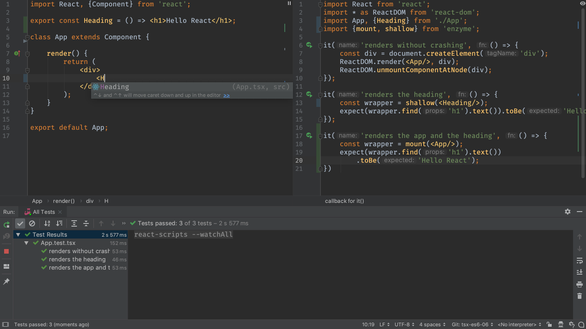

Functional programming has become quite popular, with React being one of
the leaders in the web development space. 
[create-react-app](../../../technologies/cra) generates
a *class* component for our `App`, because classes allow the full range of
React capabilities (local state, lifecycle methods, etc.). But React
encourages
[stateless functional components (SFCs)](https://reactjs.org/docs/components-and-props.html)
for simple, presentational components. 

Let's extract our heading into a TypeScript-driven SFC, using TDD 
along the way.

## Code

The finished code for this tutorial step is 
[in the repository](https://github.com/JetBrains/pycharm_guide/tree/master/demos/tutorials/react_typescript_tdd/functional_components).

## Prep

Since we're not using the browser until the end, stop the `start` process
if it is still running. This is optional, but prevents your computer from
doing compiling/transpiling/bundling work that's unneeded.

Then, make sure you run your [Jest](../../../technologies/jest) run configuration if it
wasn't already running.

Next, have `App.tsx` and `App.test.tsx` open side-by-side, as discussed
in [Testing](../testing/).

Finally, let's return our `App` to a simpler form by removing the field
and handlers, which will gradually add back in:

```typescript{}
class App extends Component {
  render() {
        return (
            <div>
                <h1>Hello React</h1>
            </div>
        );
    }
}
```

## Tiny Heading Component

Our heading was more than just text on a screen. It had:

- A dynamically-driven value

- An event handler

In the world of React, we'd actually turn that into a tiny "presentation"
component that is controlled by its parent component. We'll walk through that
refactoring in this step.

First, change the second test to import a non-existing `Heading`
component:

```typescript{}
it('renders the heading', () => {
    const wrapper = shallow(<Heading/>);
    expect(wrapper.find('h1').text())
        .toBe('Hello React');
});
```

Your test now fails, saying that the component doesn't exist. Let's write it.
In `App.tsx`, add the following above the `App` class:

```jsx
export const Heading = () => <h1>Hello React</h1>;
```

Back in our test, click on `<Heading/>` and type `Alt-Enter`. Your import
line is updated to:

```typescript{}
import App, { Heading } from './App';
```

## Point Parent at Child Component

Our tests pass again. We're testing both components: `App` and `Heading`.
But `App` doesn't use `Heading`. Let's fix this, but first, let's write
a test.

We're using Enzyme's `shallow` renderer, which doesn't go into subcomponents.
For that, let's use Enzyme's
[mount method](http://airbnb.io/enzyme/docs/api/mount.html) which does a
full rendering including children. 

Add a new test:

```typescript{}
it('renders the app and the heading', () => {
    const wrapper = mount(<App/>);
    expect(wrapper.find('h1').text())
        .toBe('Hello React');
});
```

`mount` isn't imported. Click on it, then use `Alt-Enter` to generate the
import.

We can now change our `App` component to use the `Heading` component:

```typescript{}
class App extends Component {
    render() {
        return (
            <div>
                <Heading/>
            </div>
        );
    }
}
```

Note that the IDE does the autocompletion on `<Heading/>`.



Our tests still pass because the new child component emitted the same result
as the previous inline `<h1>`.

## Single Responsibility Principle

React likes to promote something called the
[single responsibility principle](https://reactjs.org/docs/thinking-in-react.html).
We saw this above, extracting the heading into a component focused on the
heading. This frequently extends to files as well: one component per file.

Let's move the heading to its own file. Cut and paste the SFC into
`Heading.tsx`:

```typescript{}
import React from react;

const Heading = () => <h1>Hello React</h1>;

export default Heading;
```

When you first copied it over, the `h1` had a TypeScript error on it. This
was because React wasn't imported. Click on the `h1` and do `Alt-Enter`
to let the IDE generate the import. Also note that we made `Heading` a
default export, which is the current pattern for ES6 module structuring.

Let's extract the `renders the heading` test into `Heading.test.tsx`:

```typescript{}
import { shallow } from enzyme;
import React from react;
import Heading from './Heading';

it('renders the heading', () => {
    const wrapper = shallow(<Heading/>);
    expect(wrapper.find('h1').text())
        .toBe('Hello React');
});
```

Remember to use `Alt-Enter` to clean up missing imports, including the
missing `React` import if needed.

Back in `App.tsx` we have an error on `<Heading/>`. It's no longer
locally defined. We need to import it. Click on the symbol and use
`Alt-Enter` to let the IDE generate the import for you.

Finally, `App.test.tsx` had an unused -- and broken -- import of
`Heading` from `App.tsx`. Let's remove it. You can let the IDE clean 
up your imports with `Optimize Imports` (`Ctrl-Alt-O` Win/Linux/macOS.)

Our three tests across 2 test files pass again. We've successfully extracted
our component.

## Adding TypeScript

Our SFC is in good shape. It's really simple: just a callable arrow function
that returns some JSX.

But later it's going to get complex: properties that get passed in, a block
which has some logic, and more. TypeScript can help us formalize this
child components relationship with its parent. For SFCs, React ships with a
type that you can put on the component to say "this is a React SFC".

Let's do so. Back in `Heading.tsx`:

```typescript{}
const Heading: FC = () => <h1>Hello React</h1>;
```

Remember to add `FC` to the imports from React.

All we did at this point was provide some type information for `Heading`.
We'll add much more to this later, starting with the next section.

## See Also

- http://airbnb.io/enzyme/docs/api/ReactWrapper/mount.html
