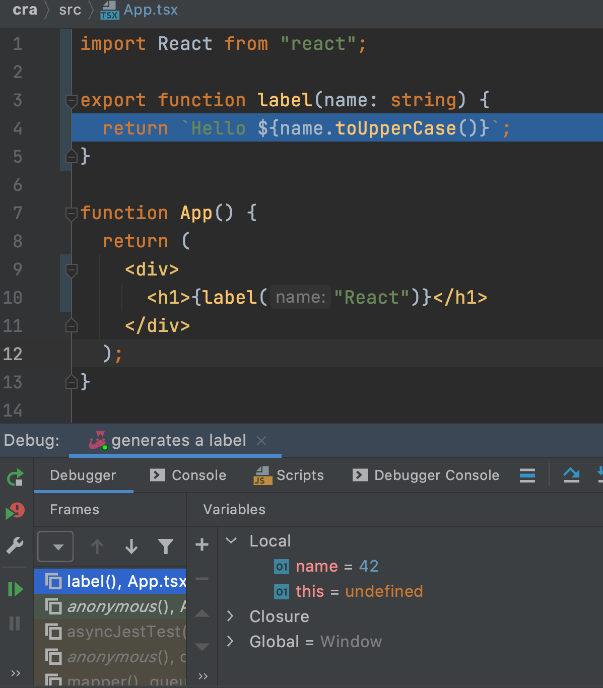

In the [previous step](../testing/) we used testing as a way to
develop our component without switching to a browser.

Sometimes our code has problems that require investigation with a debugger.
For React, that usually means a trip to the browser to set a breakpoint and
use the Chrome developer tools. Let's show how the IDE's debugger, combined
with TDD, can make this investigation far more productive.

## Code

The finished code for this tutorial step is 
[in the repository](https://github.com/JetBrains/pycharm_guide/tree/master/demos/tutorials/nodejs_debugging/).

## Cleanup

First, let's remove some unused code from our first test,
`renders without crashing`. Delete the last 3 lines and leave it as:

```typescript{}
it('renders without crashing', () => {
    const div = document.createElement('div');
    ReactDOM.render(<App/>, div);
    ReactDOM.unmountComponentAtNode(div);
});
```

## Hello Parameter

Let's use TDD to make our component's greeting a bit more
dynamic. Start in the side-by-side mode described in the previous section,
with both `App.tsx` and `App.test.tsx` open.

First, add a method to the `App` class, above the `render` method:

```jsx
label() {
    return 'Hello React';
}
```

The IDE gives us two warnings:

- The method can be static

- The method is unused

We'll ignore both of those, as development below will change both 
warnings.

Then, in `render`, change the `<h1>` to use the output of this method, 
using autocompletion for the method name:

```jsx
<h1>{this.label()}</h1>
```

We didn't write a test first. That's sort of ok: we didn't change the
rendering itself. But we also didn't test the method. Let's do that now by
adding a test in `App.test.tsx`:

```typescript{}
it('generates a label', () => {
    const a = new App({});
    expect(a.label()).toBe('Hello React');
});
```

In this test we don't need a component with TSX and a fake DOM etc. It's a
TypeScript method that returns a string. Nice! To conform to the 
`React.Component` constructor signature, we pass in an empty object as 
props. Note how the IDE gave us a placeholder reminder.

Let's make the method slightly dynamic by passing in a name for the label,
then converting that name to uppercase. First, change our tests to the
behavior we expect. The `generates a label` test needs its last line
changed to:

```typescript{}
expect(a.label('React')).toBe('Hello REACT');
```

While we're at it, change the `renders a heading` test to look for 
`REACT` instead of `React`.

Our tests now fail, thus we need to implement this feature. Moreso, 
the TypeScript compiler is helping us "fail faster", telling us we broke 
the contract, even before the test runs. Nice squared!

The `<h1>`, like the test, needs to pass in a value:

```typescript{}
    <h1>{this.label('React')}</h1>
```

Now it's just a matter of changing the method to accept an argument, then
uppercasing the return value:

```typescript{}
label(name) {
    return `Hello ${name.toUpperCase()}`;
}
```

Note that the IDE has a quick fix, via `Alt-Enter`, to convert the string
to an ES6 template string (the backticks.)

With that, our tests pass, but the TypeScript compiler is angry: the `name`
argument doesn't have a supplied type. Let's fix that:

```typescript{}
label(name: string) {
    return `Hello ${name.toUpperCase()}`;
}
```

No surprise: the IDE has an `Alt-Enter` quick fix for this -- in this
case, `Infer parameter types from usage`.

## Stop at Breakpoint

Let's see debugging in action. Imagine we pass in a number and we can't
figure out why our method is failing.

Let's do so. In the last `generates a label` test, change the argument to
`a.label(42)`.

First, note that TypeScript told our test that the supplied value was not
assignable to a string. This is the *beauty* of TypeScript. Especially in
test-writing, it helps you "fail faster". Meaning, when paired with a smart
IDE, it moves the failure directly under your eyeballs, in the most immediate
location...the place where you typed it. Moreover, it provides very specific
error messages.

Let's go ahead and debug this. Click in the gutter beside that line to set
a breakpoint. Then right-click on the test in the tool window and run it
under the debugger. Execution stops on that line. We can then step into our
method call.


Execution stops in our method. We can inspect the local values and see that
`name` is `42`.



We can now poke and prod our code interactively, in the execution context
where it fails. 


This is a very productive development cycle: write tests,
when stuck, use the debugger. No flailing around with `console.log` in a
browser's dev tools window.

Let's clean up:

- Click the red square to stop the debugger

- Close the Debugger tool tab window

- Click the red circle to clear the breakpoint

- Change the test's label argument from `42` back to `React`

- Re-open the Run Tool window

As a note, in this step, the only two files that changed were 
`App.tsx` and `App.test.tsx`.
