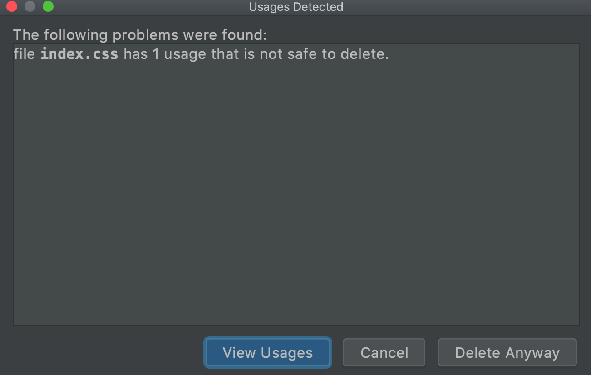

In our [previous step](../project_setup/) we generated a project then 
took a look around. We'll use that step as the starting point and do 
some cleaning up:

- Use the IDE to reformat code

- Strip out unneeded "Hello World" artifacts to simplify our starting point

Along the way we'll show some IDE features in action.

## Code

The finished code for this tutorial step is 
[in the repository](https://github.com/JetBrains/pycharm_guide/tree/master/demos/tutorials/react_typescript_tdd/project_cleanup).

## Reformatting Code

We currently have the test runner script running. If you have it running
via `npm run-script test` in a terminal window, terminate that process with
`Ctrl-C` or the equivalent. If you ran it in PyCharm Professional, close
that tool window (and click `Terminate` on the dialog.)

In PyCharm Professional, reformatting code is simple. In fact, it's something
you will do constantly. You currently have `App.test.tsx` open. Let's use the 
`Reformat Code` action (`Ctrl-Alt-L` Win/Linux, `Alt-Cmd-L` macOS) to set 
everything to proper indentation.

Close that tab and go back to `App.tsx`. Do the same `Reformat Code`
operation there as well.

## Linting

This is a...complicated topic.

In the world of React, ESLint has become very popular and `create-react-app` 
comes with ESLint preconfigured. TSLint is popular for TypeScript projects, but 
``create-react-app --typescript`` doesn't use it. Why? The TypeScript and TSLint 
teams are joining forces to enhance ESLint's TypeScript support.

Prettier is another linting project that has gotten popular. WebStorm has direct 
integration for Prettier...it can detect its presence, turn it on, and provide a 
shortcut for a ``Reformat with Prettier`` action. For this tutorial, since CRA 
doesn't support Prettier, we'll skip it.

Thus, for this tutorial, we will stick with the IDE's built-in code reformatter 
and rules.

## Clean Up, Clean Up

In `App.tsx`, let's do some steps to make a simpler starting point for the 
rest of the series. First, remove all the markup in the `render` method 
and replace it:

```jsx
  render() {
    return (
        <div>
            <h1>Hello React</h1>
        </div>
    );
  }
```

In PyCharm Professional you can quickly generate markup using
[Emmet](../../../technologies/emmet). Highlight the existing `div` to 
replace and enter `div>h1<enter>Hello React`:


We have an ESLint error on line 2, which we can see by hovering over the 
gray squiggly line:

`Unused import logo from './logo.svg`

We could stop what we're doing, move that line, and delete it. But 
the IDE makes this easy with the `Optimize Imports` action 
(`Ctrl-Alt-O` for Win/Linux and macOS). Invoke that and remove the 
unused import.

While you're at it:

- Delete the `import './App.css';` line

- Delete the `logo.svg` and `App.css` files

In PyCharm, when you do a delete, you're actually doing a "Safe Delete", with
the option to look for places in the project where you might have used it.
Give it a try by starting the delete process on `index.css`. The IDE will
warn you:



## More IDE Goodies

We're talking about cleanup. Let's look at some other ways the IDE can 
do our janitorial work.

Let's say were in a file and were writing something like `class App` and
hadn't imported React yet.

Simulate this by changing the first line to the following:

```typescript{}
import { Component } from react;
```

The IDE tells you about the error, with a red squiggly on the usage of
`React`.


Click on it, then `Alt-Enter` and choose `Add Import Statement`. PyCharm
generates the proper import:


Let's say I wanted to rename `App`. Where is it being used? Right-click
on it, then choose `Find Usages`. A window pops up. Turns out it's being
used in a lot of places. Double-click on the usage in `index.tsx`. PyCharm
opens the file, moves to the line, and puts the cursor in the right spot.

How about the other direction...you're sitting on the usage and want to go
to the definition? Use `Cmd-B` to jump to the class that defines `App`.

We could now start the process of renaming by visiting all the usages. Bleh.
Can't we let the IDE do it for me? Click on `App` in `class App` and hit
`Ctrl-T`, then choose `Rename` to Refactor Rename the class to `MyApp`:


In the tool window showing you the consequences, choose `Do Refactor`.

Oh no, that's not what I wanted! Do I have to do another refactor? Nope. The
IDE did all those operations in one editor transaction. Just use Undo and
say `Ok` on the dialog.
