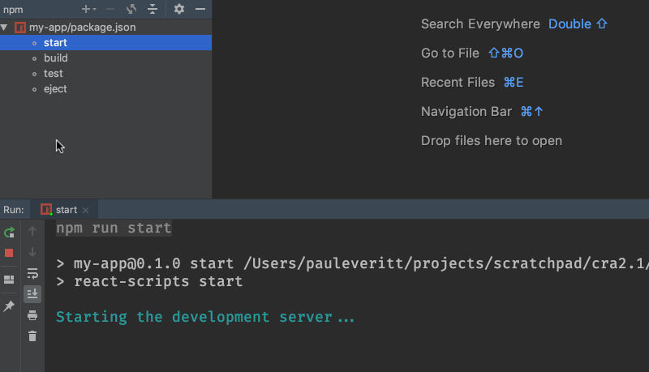
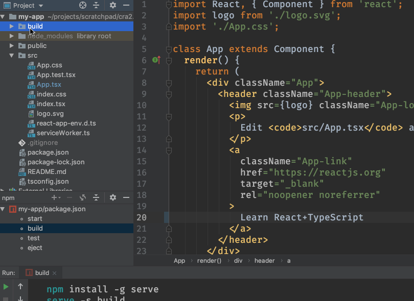
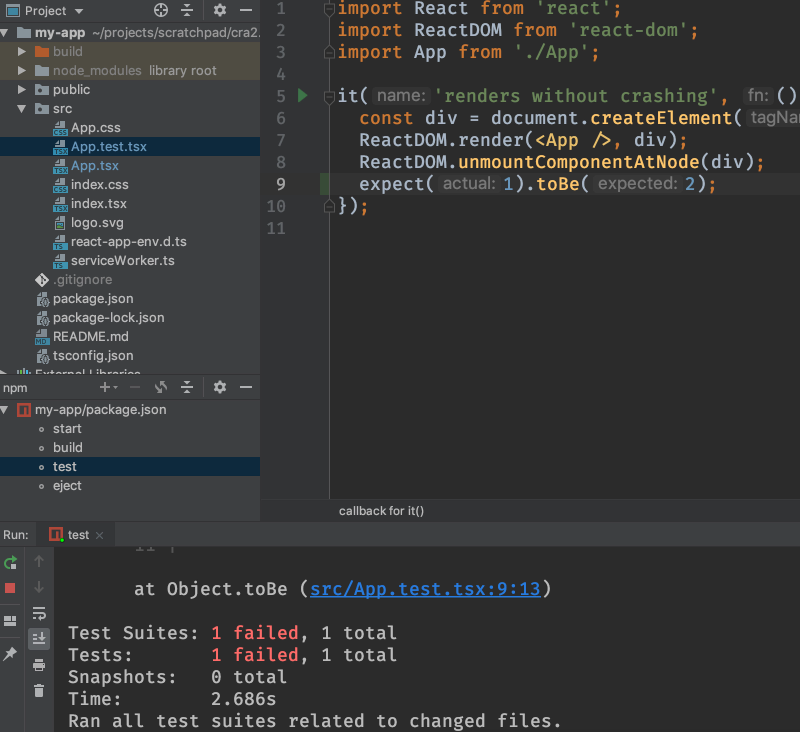

React has become very popular, as has TypeScript. But it can be difficult to
keep your tools and build configurations up-to-date. Many frameworks have
recently built CLI (command-line interface) tools that make those decisions
for you, using best practices. They'll generate a project with the right
choices then update those choices as things evolve.

React's [create-react-app](../../../technologies/cra) takes care of 
this, and it recently added support for TypeScript. In this tutorial 
step, we generate the project then open it in the IDE.

## Code

The finished code for this tutorial step is 
[in the repository](https://github.com/JetBrains/pycharm_guide/tree/master/demos/tutorials/react_typescript_tdd/project_setup).

## Project Creation

Before anything can happen, you have to install NodeJS on your system.

As shown [in the docs](https://levelup.gitconnected.com/typescript-and-react-using-create-react-app-a-step-by-step-guide-to-setting-up-your-first-app-6deda70843a4), 
use the `npx` command introduced in npm 5.2 to get a package and install 
a command, without having to globally install a package. Thus, to 
use `create-react-app` to make a TypeScript project:

```bash

$ npx create-react-app my-app --typescript
```

*Note: PyCharm Professional has a UI for generating React projects 
from `create-react-app`, but at the time of this writing, it doesn't 
yet support passing the `--typescript` flag.*

You now have a working React+TypeScript project, toolchain, and hello-world
style app. It's actually quite an achievement. Assembling all of this, and
*keeping* it assembled, is an incredible effort. `create-react-app` has 
shifted that off your shoulders, onto their's. Trust me, it's a big deal.

## Show Me a Page

Let's see this React+TypeScript page in our browser. npm scripts make
it easy to discover commands that are common to a project. The most common?
Starting the dev server, which compiles the universe, serves a page over
HTTP, and helpfully opens your browser:

```bash

    $ npm run-script start
```

This dev server is watching for changes. If you edit a file, it will
regenerate the universe and tell the page to reload. Open `src/App.tsx`
and change `Welcome to React` to `Welcome to React TypeScript`, then
save. Your terminal shows a recompile and your browser updates.

PyCharm Professional puts a nice UI on this. Click on the `npm` tool icon
(usually on the left) and double click `start` in the listing of run
scripts. You'll get a run window at the bottom with a UI for showing
output and restarting. Alternatively, open `package.json` and click the
green play icon in the gutter by the run scripts:



What scripts does `create-react-app` generate in `package.json`? Here 
is the full file:

`embed:tutorials/react_typescript_tdd/project_setup/package.json`

As you can see, it's quite compact. The genius of `create-react-app` 
lies in moving a bunch of configuration to files it manages in its 
packages. You can then upgrade those packages and gain new/fixed 
wiring of all the JavaScript build tools.

## Production Build

That's great for development, but for production, we need files on disk,
shrunk as small as possible. There's a lot of complexity behind this, but
`create-react-app` has hidden it behind an npm script:

```bash

    $ npm run-script build
```

This generates output into a `build` directory. The output is
self-contained, including even an `index.html` file. You can copy it to a
static hosting site as-is.

Running this is easy in PyCharm Professional: just click on `build` in the
npm tool window. This generates a `build` directory in your project root 
with the production output of you project. 



As an optimization, right-click on the new ``build``
directory and ``Mark Directory As | Excluded``. This prevents the IDE from
indexing the contents of that directory, which you don't need during
development.

## This Is Only a Test

Projects generated from [create-react-app](../../../technologies/cra) 
are also wired for testing: dependencies, configuration files, and sample 
tests. We'll see more later, but for now, let's run the tests. 
Unsurprisingly, it's similar to the above:

```bash

    $ npm run-script test
```

This uses the [jest](../../../technologies/jest) test runner.

Double-click the `test` entry in the `npm` tool window to try again:

```bash

    $ npm run-script test
```

The tests auto-run as you edit, updating much faster once first loaded. To
see this in action, open `src/App.test.tsx` and add a line to the test:

```typescript{5}
    it('renders without crashing', () => {
      const div = document.createElement('div');
      ReactDOM.render(<App />, div);
      ReactDOM.unmountComponentAtNode(div);
      expect(1).toBe(2);
      
    });
```

When you save this, the test runner output tells you about the test failure.
Change the `2` to a `1` and save, and the tests pass.

As with the other run scripts, you can double-click to run the npm scripts
in an IDE tool window in PyCharm Professional. But that's the less-interesting
way to do it. We'll show in [Unit Testing with Jest and Enzyme](../testing/) 
the more-PyCharmic way.



## Conclusion

In this first step we used existing tools to generate a working
React+TypeScript project, with all the tooling configured. We also gave a
brief tour of driving this in the IDE.

In our next step we'll clean up some of the generated app, fix some of the
tooling, and take a look a little more at how TypeScript with a smart IDE
helps your productivity.
