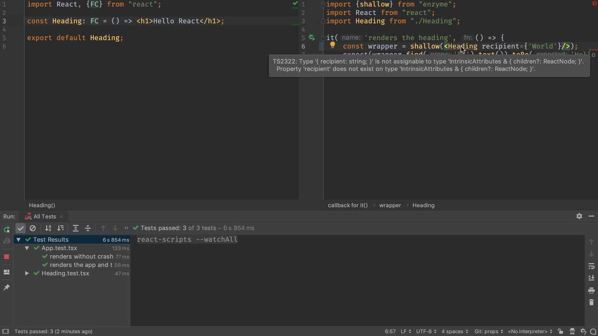
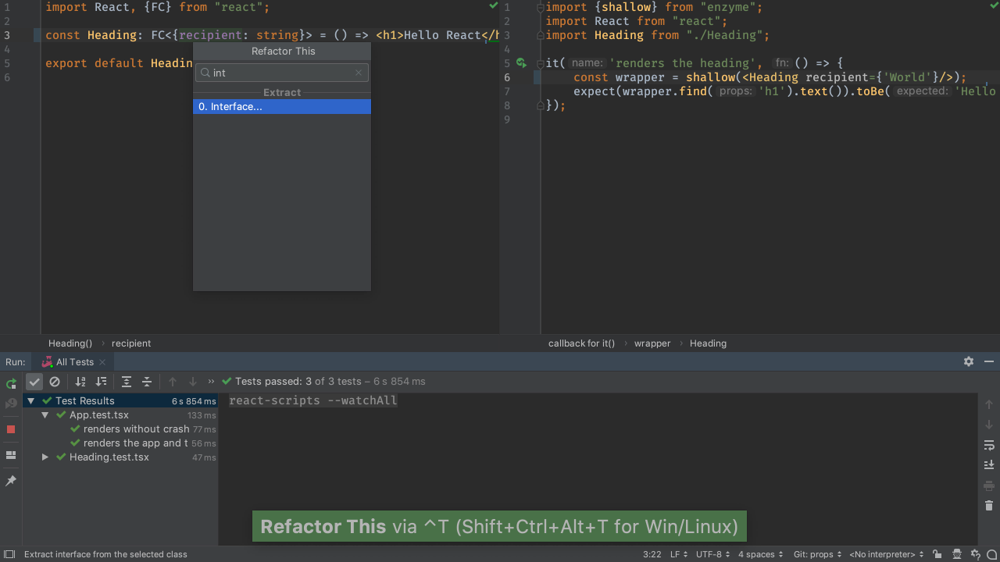

Components and subcomponents are the zen of React. Information is shared
from parent to child using properties, and TypeScript helps us formalize
that relationship.

In this tutorial step, we make our child component reusable by passing the
value that should be displayed in the greeting. Along the way, we formalize
the parent/child component interface with...an interface, of course.

We'll start from the ending of
[the previous step](../functional_components/). Remember, we're
doing TDD, so let's have `Heading.tsx` and `Heading.test.tsx` open
side-by-side, with the Jest run configuration running.

## Code

The finished code for this tutorial step is 
[in the repository](https://github.com/JetBrains/pycharm_guide/tree/master/demos/tutorials/react_typescript_tdd/props).

## Hello Recipient

We're going to change the `Heading` component to accept the name of the
recipient to say hello to. This value will come in as a prop. For example,
`<Heading recipient={'World'}/>`.

As usual, let's start in our tests. In `Heading.test.tsx`, change our wrapper
construction to the following:

```typescript{}
const wrapper = shallow(<Heading recipient={'World'}/>);
```

Our tests still pass but the IDE tells us TypeScript doesn't compile:

```
    Error:(6, 30) TS2322: Type '{ recipient: string; }' is not assignable 
    to type 'IntrinsicAttributes & { children?: ReactNode; }'.
    Property 'recipient' does not exist on type 'IntrinsicAttributes 
    & { children?: ReactNode; }'.
```



Our test provided an object `{ recipient: string; }` as props but the
component's TypeScript definition didn't accept that. Let's change the props to
allow `recipient` as a string. In `Heading.tsx`:

```typescript{}
const Heading: FC<{recipient: string}> = () => <h1>Hello React</h1>;
```

The `React.FC` type is a generic which accepts props as the first
argument and optional state as the second. We defined the type information
for our props inline and the error went away: TypeScript now knows that a
`recipient` string is a required argument.

Doing type information inline is clunky. Let's use a TypeScript interface
to define our type information:

```typescript{}
export interface IHeadingProps {
    recipient: string
}

const Heading: FC<IHeadingProps> = () => <h1>Hello React</h1>;
```

One useful tip: the IDE can do the extraction for you. Put the cursor in the
the `{recipient: string}` object and do `Ctrl-T | Interface` then type
in the name.



Our component isn't using this prop yet. The most obvious solution: grab the
`props`:

```typescript{}
const Heading: FC<IHeadingProps> = (props) =>
    <h1>Hello {props.recipient}</h1>;
```

Good news, our tests fail, as expected! Let's fix just the test in
`Heading.test.tsx` by having it expect the value `toBe('Hello World')`.
When that test is updated, the `renders the heading` test will pass. 
We'll get to the failing `App.test.tsx` tests in a moment.

It can be cumbersome to type `props.` in front of every prop. ES6 has some
called object destructuring which lets you "unpack" an object and bring into
scope *just the value* you want. As a side benefit, it makes it clear at the
entry point what that arrow function requires.

Let's switch to object destructuring, and since our line is getting long,
use a block:

```typescript{}
const Heading: FC<IHeadingProps> = ({recipient}) => {
    return <h1>Hello {recipient}</h1>;
}
```

Note that, as you were typing inside `({})`, the IDE knew what were the
possible completions. This is from the TypeScript interface on the props.

## Default Prop

We can shut up the the `App.test.tsx` tests by having a default recipient.
We'll use ES6 object destructuring's syntax for setting a value when the
destructured object doesn't have that key:

```typescript{}
const Heading: FC<IHeadingProps> = ({recipient = 'React'}) => {
    return <h1>Hello {recipient}</h1>;
}
```

Yay, all our tests pass! But if you revisit `App.tsx` you'll see that
TypeScript isn't happy about `<Heading/>`:

```
Error:(8, 18) TS2741: Property 'recipient' is missing in type '{}' 
but required in type 'IHeadingProps'.
```

That defeats the purpose of a default value. Good news: TypeScript thought of
that and lets you mark an interface field as optional using a question mark.
Back in `Heading.tsx`:

```typescript{}
interface IHeadingProps {
    recipient?: string
}
```

Our tests pass *and* TypeScript is happy. But we forgot to write a test for
the default value. Let's add this to `Heading.test.tsx`:

```typescript{}
it('renders the default heading', () => {
    const wrapper = shallow(<Heading/>);
    expect(wrapper.find('h1').text())
        .toBe('Hello React');
});
```

We now have a child component that is passed in an optional value, with a
default, and an enforceable contract saying it must be a string. We did all
of this with simple idioms from TypeScript and ES6.

And guess what? We never looked at the browser. If you'd like, fire up the
`start` run configuration and take a look at the browser to confirm it's
still working. Make sure to turn off `start` when done.

## See Also

- https://mikebridge.github.io/articles/getting-started-typescript-react-2/
