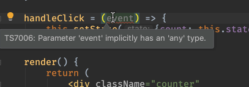
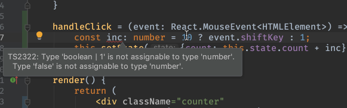

Our counter component has local state, but doesn't respond to clicks. We
need to add event handlers, which we first introduced in
[TSX and ES6](../tsx_es6/).

We'll do so, of course, by writing tests first. This requires a small
addition to our flow of test writing, but once mastered, it's easy and useful.

Like in previous steps, start with the following setup:

- `Counter.tsx` and `Counter.test.tsx` in side-by-side tabs

- Start the `Jest` run configuration

- Stop the `start` run configuration

## Code

The finished code for this tutorial step is 
[in the repository](https://github.com/JetBrains/pycharm_guide/tree/master/demos/tutorials/react_typescript_tdd/rich_events_and_testing).

## First Failing Test

Let's start with a failing test that clicks on the div and checks if the
number is updated. In `Counter.test.tsx`, clone the first test and change
it as follows:

```typescript{}
it('should increment the count by one', () => {
    const wrapper = shallow(<Counter/>);
    expect(wrapper.find('.counter span').text()).toBe('0');
    wrapper.find('.counter').simulate('click');
    expect(wrapper.find('.counter span').text()).toBe('1');
});
```

This test makes a component instance, checks its initial value, pretends to
click using `simulate`, then checks the final value.

`simulate`, what's that? It's the big idea in this tutorial step. You can 
pretend to click, or dispatch other DOM events, even without a real 
browser or "mouse". JSDOM can "simulate" the event.

This new test fails: the number didn't increment. Which is good!

What's really good: that was dead simple. In one line we automated doing a
click and checking the result. Much more pleasurable than switching to the
browser and clicking everything in your app to see if your change works
without breaking the universe.

## `onClick` Handler

The component doesn't handle clicks. Let's head to `Counter.tsx` and add
a click handler:

```jsx
<div
    className="counter" 
    onClick={() => this.setState({count: this.state.count + 1})}
>
    <label>{this.props.label}</label>
    <span>{this.state.count}</span>
</div>
```

Our test passes. But that's putting some logic into the component, plus 
we discussed that arrow functions inside the `render` can have performance 
impacts. Let's move it out into a click handler, which also makes that 
behavior easier to test in isolation:

```typescript{}
handleClick = () => {
    this.setState({count: this.state.count + 1});
};

render() {
    return (
        <div
            className="counter"
            onClick={this.handleClick}>
            <label>{this.props.label}</label>
            <span>{this.state.count}</span>
        </div>
    );
}
```

## Advance By Ten with Shift-Click

Let's add one more feature: if you click with the Shift key pressed, you
increase by 10. Along the way, let's add more type information to better
benefit from TypeScript.

The `handleClick` arrow function actually gets an event passed, which
we aren't using. Let's add it in:

```typescript{}
handleClick = (event) => {
    this.setState({count: this.state.count + 1});
};
```

This works but TypeScript gives a compiler error. Our `tsconfig.json`
disallows implicit `any`. 



That's easy enough to solve:

```typescript{}
handleClick = (event: any) => {
    this.setState({count: this.state.count + 1});
};
```

But that's cheating. What type is that event? It's a `MouseEvent`. Let's
put the correct typing on the argument:

```typescript{}
handleClick = (event: React.MouseEvent<HTMLElement>) => {
    this.setState({count: this.state.count + 1});
};
```

Ugh, that's a lot of keystrokes. Is it worth it? Let's show why. First, in
`handleClick`, let's determine the value to increment by, first as a mistake:

```typescript{2,3}
handleClick = (event: React.MouseEvent<HTMLElement>) => {

    const inc = 10 ? event.shiftKey : 1;

    this.setState({count: this.state.count + inc});
}
```

TypeScript told us that we were trying to add a boolean to a number. Let's 
set the type of `inc` explicitly, instead of inferring it. Our first fix:

```typescript{}
const inc: number = 10 ? event.shiftKey : 1;
```

That's closer. TypeScript now moves the error to the correct line:

```
Error:(28, 31) TS2365: Operator '+' cannot be applied to types 
'number' and 'boolean | 1'.
```

We see that we have the order wrong on the ternary...a frequent, maddening, 
easy-to-miss error. 



Here's the correct version:

```typescript{}
const inc: number = event.shiftKey ? 10 : 1;
```

Our click-handler test now fails, though. It needs a fake event object passed
into `handleClick`, with `shiftKey` in the object. Let's fix that test,
then clone to cover the with-shift case:

```typescript{}
it('should increment the count by one', () => {
    const wrapper = shallow(<Counter/>);
    expect(wrapper.find('.counter span').text()).toBe('0');
    wrapper.find('.counter').simulate('click', {shiftKey: false});
    expect(wrapper.find('.counter span').text()).toBe('1');
});

it('should shift-click increment the count by ten', () => {
    const wrapper = shallow(<Counter/>);
    expect(wrapper.find('.counter span').text()).toBe('0');
    wrapper.find('.counter').simulate('click', {shiftKey: true});
    expect(wrapper.find('.counter span').text()).toBe('10');
});
```

Our tests pass. We have a test to handle the new shift-click implementation.
Moreover, we have type information to help us when we pass in the wrong data,
even from a test.

As we have been doing, give this a try in the browser by firing up the
`start` run configuration and clicking, then shift-clicking, in the browser.
When done, terminate the `start` process.
