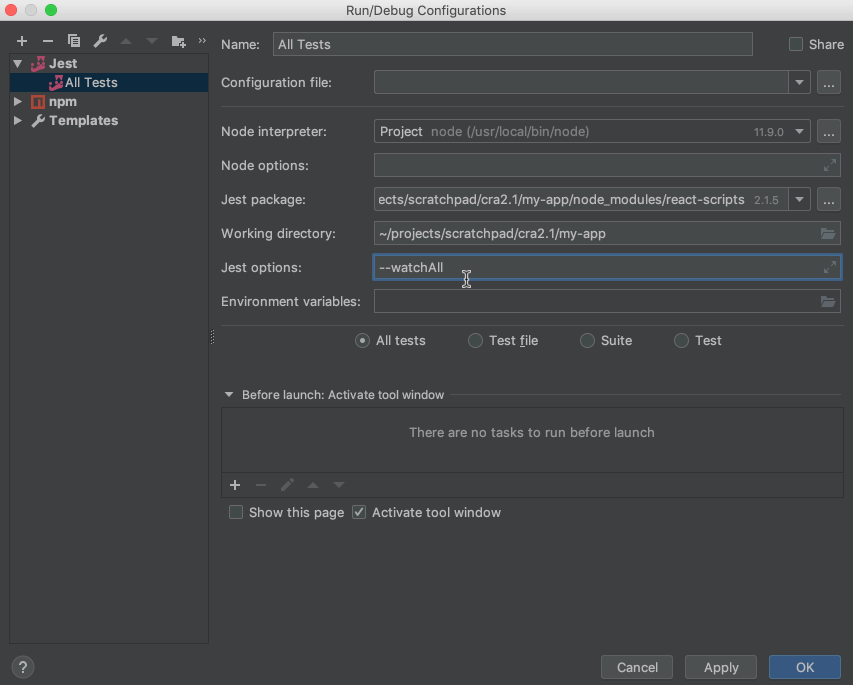
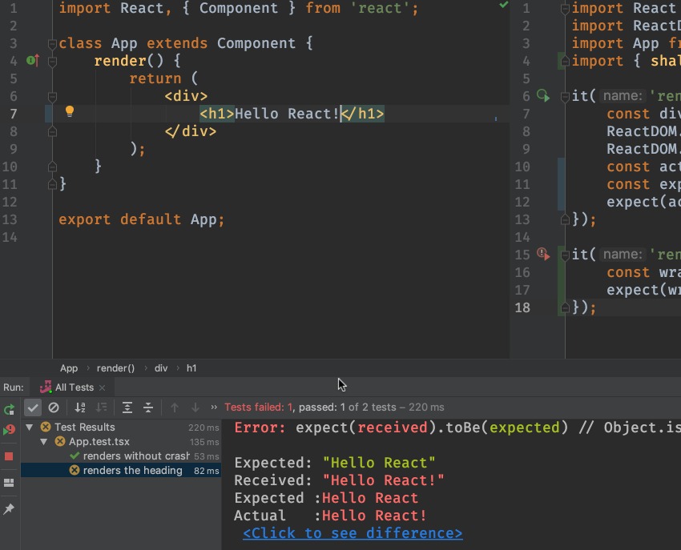
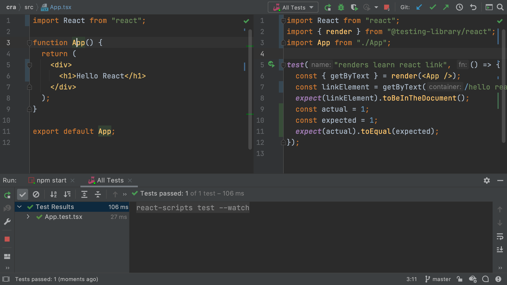

We briefly saw the [Jest](../../../technologies/jest) test runner in 
[Project Setup](../project_setup/). We modified an existing test but didn't 
dive into testing.

In this tutorial step we start the process of test driven development. After
this step, we'll develop first in our Jest tests. Then, only at the end of 
development, we will look at the app in the browser.

## Code

The finished code for this tutorial step is 
[in the repository](https://github.com/JetBrains/pycharm_guide/tree/master/demos/tutorials/react_typescript_tdd/testing).

## Pretty Jest

Previously we ran our Jest tests as a generic npm run script, in the IDE's
npm run tool window. However, PyCharm Professional has a dedicated run
configuration type for Jest. It's a fantastic, visual way to do testing. 
Let's switch to using that.

Select `Run | Edit Configurations`, click `+`, and click on `Jest`.
Supply a `Name:` of something like `unit tests`. The only real field
you need to supply is `Jest options:`. For that, enter
`--watchAll`. This tells Jest to continuously run and re-run tests when a 
file has changed (thus speeding up testing.)



Save that run configuration and run it. Our tests now run in a nice tool
window which will make test-driven development (TDD) much more productive.

## Fail Faster


Let's see a little testing in action. Open `src/App.test.tsx`. We're going to
show the cycle of fail-fix in action. Define two contants, then compare
them with a simple Jest assertion:

```typescript{}
it('renders without crashing', () => {
    const div = document.createElement('div');
    ReactDOM.render(<App/>, div);
    ReactDOM.unmountComponentAtNode(div);
    const actual = 1;
    const expected = 2;
    expect(actual).toBe(expected);
});
```

When you save this, Jest re-runs your tests, and does so quite fast. Our
tests fail, and the IDE's tool window presents the test results in a very
convenient UI. For example, you can jump directly to the line of the
failing test.



If the file isn't open, the IDE will open it and scroll to the line of 
code.

Let's fix the test by changing `expected` to `1` then save. The Jest 
watcher spots the change, re-runs the test very quickly, and shows that 
all tests pass.

## TDD Basics

JavaScript development is usually a bunch of switching between the editor,
the browser, the browser console, and a terminal window, with the build tools
displaying messages. Let's use a better flow. Let's stay in the IDE and focus
on our code, and observe our code through tests instead of a browser reload.

First, let's get our code and our tests side-by-side. Use 
`Find Action` (`Shift-Ctrl-A` Win/Linux, macOS `Shift-Cmd-A`) and 
type in `Split Vertically`. This gives us a left and right side editor without 
needing tabs. On the left, open `App.tsx`. We can now see `class App` alongside 
our tests. If you need more room, close the Project tool window.



## A Real Test

We currently have a test which makes a document, tells React to render our
component-under-test into it, and then...well, nothing really.
[create-react-app](../../../technologies/cra)  generates a test whose only 
purpose is to see if it can render. Let's look inside the rendered result 
and test its correctness.

To do so, we're going to install [Enzyme](../../../technologies/enzyme), a 
utility for React that makes testing feel like jQuery assertions. Open the IDE's
`Terminal` tool and install Enzyme and its TypeScript typings:

```bash
$ npm install -D enzyme enzyme-adapter-react-16 react-addons-test-utils \
  @types/enzyme @types/enzyme-adapter-react-16
```

As [explained in the CRA docs](https://facebook.github.io/create-react-app/docs/running-tests#src-setuptestsjs), 
we need to tell Jest to use a configured Enzyme. Add this file at
`src/setupTests.ts`:

```typescript{}
import { configure } from enzyme;
import Adapter from 'enzyme-adapter-react-16';

configure({adapter: new Adapter()});

export default undefined;
```

*Note: Does that default export look weird? Explanation is in the docs link 
above.*

Restart the Jest run tool window to pickup this setup file. Then, edit
`src/App.test.tsx` to include a second test:

```typescript{}
it('renders the heading', () => {
    const wrapper = shallow(<App/>);
    expect(wrapper.find('h1').text()).toBe('Hello React');
});
```

You'll see `shallow` in red, meaning it is a TypeScript error, because
`shallow` hasn't been imported. Click on `shallow` and press
`Alt-Enter`. The IDE automatically generates the correct import.

You can now test the TDD style of development. Try changing the component's
`<h1>` to contain different text and save. You'll see the test fail. Change
it back and save, and the tests pass.

To see real TDD, you write the test first. Add a third test in
`src/App.test.tsx`:

```typescript{}
it('renders the paragraph', () => {
    const wrapper = shallow(<App/>);
    expect(wrapper.find('p').text()).toBe('Nice TDD');
});
```

Good news, it fails! TDD starts with a failing test. You then implement what
you expect to pass. Change your `App` component in `src/App.tsx` to have
this markup:

```html
<div>
    <h1>Hello React</h1>
    <p>Nice TDD</p>
</div>
```

When you save, the test passes. Not only that...you extended your component
without looking at a browser.

## See Also

- https://www.jetbrains.com/help/webstorm/running-unit-tests-on-jest.html

- https://www.jetbrains.com/help/webstorm/run-debug-configuration-jest.html

- https://blog.jetbrains.com/webstorm/tag/jest/

- https://medium.com/kevin-salters-blog/testing-react-with-enzyme-fbfc30190e70

- https://javascriptplayground.com/introduction-to-react-tests-enzyme/

- https://www.codementor.io/vijayst/unit-testing-react-components-jest-or-enzyme-du1087lh8

- https://github.com/Microsoft/TypeScript-React-Starter#typescript-react-starter

## TODO

- Discuss how to make right-click run test work by changing the 
  run config templates
