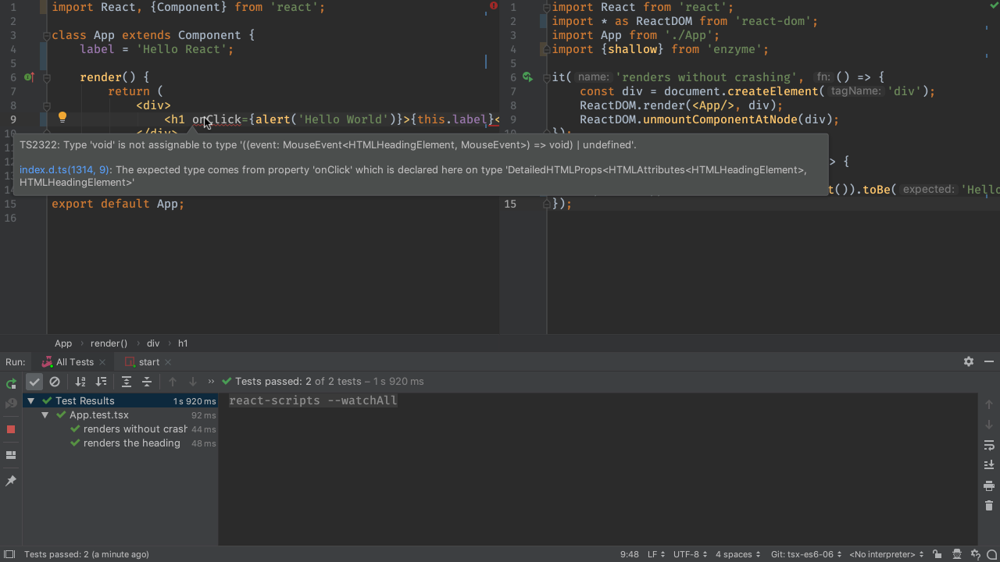
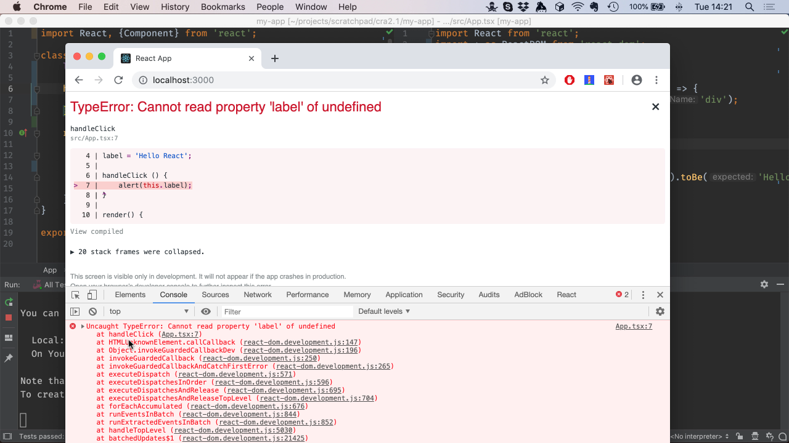
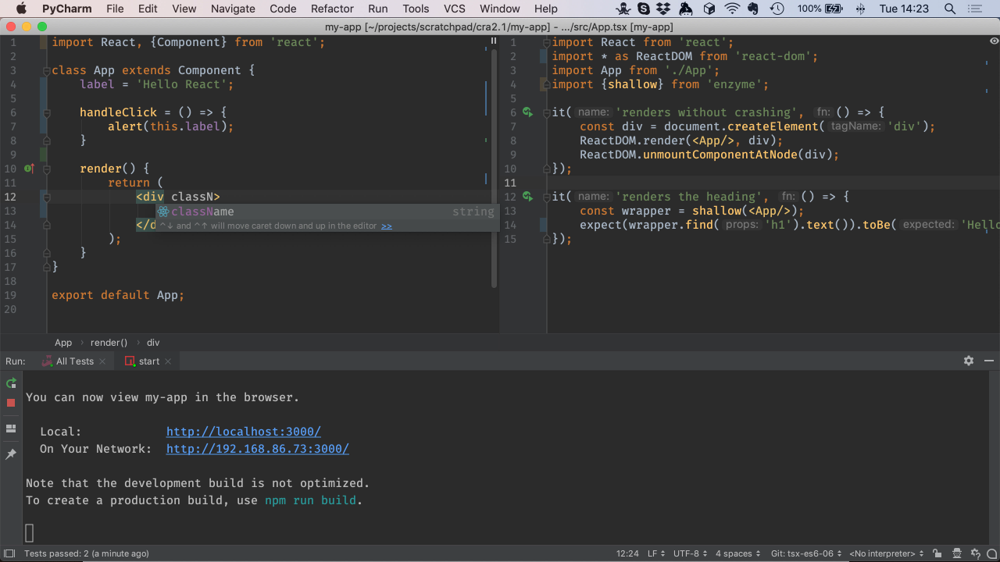

TypeScript is a JavaScript superset with a compiler that enforces the types.
It's also, though, one of those sexy new JavaScript flavors that implement
"ES6"...actually, a family of modern JavaScript standards for more
productive programming. When combined with other tooling, it also supports
JSX, React's sorta-templating system, but with TypeScript semantics.

We glazed over the ES6 and JSX (that is, TSX) in previous steps. Let's take
more of a look.

## Code

The finished code for this tutorial step is 
[in the repository](https://github.com/JetBrains/pycharm_guide/tree/master/demos/tutorials/tsx_es6/).


## Cleanup

The previous steps added some stuff to show their topics. Let's clean up a
little bit.

Let's change `App.test.tsx` back to two simple tests:

```typescript{}
import { shallow } from enzyme;
import React from react;
import * as ReactDOM from 'react-dom';
import App from './App';

it('renders without crashing', () => {
    const div = document.createElement('div');
    ReactDOM.render(<App/>, div);
    ReactDOM.unmountComponentAtNode(div);
});

it('renders the heading', () => {
    const wrapper = shallow(<App/>);
    expect(wrapper.find('h1').text()).toBe('Hello React');
});
```

Also, our component in `App.tsx`:

```typescript{}
import React, { Component } from react;

class App extends Component {
    public render() {
        return (
            <div>
                <h1>Hello React</h1>
            </div>
        );
    }
}

export default App;
```

Make sure the test runner is still running and watching. Let's also 
*keep* the `start` task as we'll use it later in this step.

Our two tests pass. Let's see some ES6 and TSX.

## Classes and Fields

As you can see, this component is using React's support for ES6 classes.
Our `App` component extends `React.Component`. We'll see functional 
components later.

Let's do another approach at extracting the hardwired string from the
`<h1>`. The `render` method can, of course, have scope. Let's define the
label there:

```typescript{}
render() {
    const label = 'Hello React';
    return (
        <div>
            <h1>{label}</h1>
        </div>
    );
}
```

`const` is used because we never intend to re-assign the label. Our
tests pass, so this change worked fine.

We can also move the `label` up to the class label as a field:

```typescript{}
class App extends Component {
    label = 'Hello React';

    render() {
        return (
            <div>
                <h1>{this.label}</h1>
            </div>
        );
    }
}
```

We had to change the `<h1>` to use `this.label`, to get the value off the
instance.

## Arrow Functions

ES6 introduced small, inline anonymous functions called "arrow functions".
The are incredibly useful and have come to dominate frontend frameworks. Let's
see them in action for click handlers. We'll start by showing something that
doesn't work until an arrow function saves the day.

We'll first do an inline click handler that displays a static string. Note
that JSX (and thus, TSX) map certain HTML attributes into first-class names,
such as `onClick` and `className`. They do this in their grammar, thus 
letting us assign an expression (with `{}`) instead of a string:

```jsx
<h1 onClick={alert('Hello World')}>{this.label}</h1>
```

The TypeScript compiler, though, doesn't like this.

```
  Type error: Type 'void' is not assignable to type 
  '((event: MouseEvent<HTMLHeadingElement, MouseEvent>) => void) | undefined'
```



What is causing this? The `console.log` expression is immediately 
evaluated, rather than run when the event is fired. `console.log` doesn't 
return anything, meaning a `void` is assigned to `onClick`. TypeScript 
knows that's the wrong type, and says so.

See, TypeScript is good for something. (wink)

We need a way to assign something that will be executed *later*, when the 
event is fired, instead of getting executed immediately.

Arrow functions to the rescue! Try this instead, also switching back 
to `alert`:

```jsx
<h1 onClick={() => alert('Hello World')}>{this.label}</h1>
```

What does this change do? It stores a function which is created on the fly
and stored "anonymously" in that scope. The `()` means this arrow function
needs no arguments. (It's actually passed an event, which we'll use in later
steps.) The function body is one line, so we don't need curly braces for a
block.

Let's check in the browser for the alert, so restart your `start` script if 
needed. Everything compiles fine and clicking on the `<h1>` in the browser 
produces an alert.

## Move To a Method

Inline handlers aren't so smart, as they aren't easily testable and smart 
folks say there's a slight performance it on re-render. Let's move the 
handler to a component method:

```typescript{}
    class App extends Component {
        label = 'Hello React'

        handleClick () {
            alert('Hello World');
        }

        render() {
            return (
                <div>
                    <h1 onClick={this.handleClick}>{this.label}</h1>
                </div>
            );
        }
    }
```

We referenced `this.handleClick` but we didn't call it. React will call it
later, when we actually click.

Let's have the alert display the label by changing it to
`alert(this.label)`:

```typescript{}
handleClick() {
    alert(this.label);
}
```

Uh-oh. Clicking on the heading produces a mile-long traceback in the 
JavaScript console. 



The traceback mentions `HTMLUnknownElement`. And that's the problem: 
the `this` in the `handleClick` method isn't the *component instance*, 
it is the *event*. This is a chronic problem in React programming, one 
which lead to the `.bind` syntax.

Arrow functions, though, get the correct `this`. We could change the handler
to the following:

```jsx
<h1 onClick={() => this.handleClick}>{this.label}</h1>
```

...but we're back to the frowned-up pattern of arrow functions in event 
handlers. Instead, we can bind the arrow function to the component:

```typescript{}
handleClick = () => {
    alert(this.label);
};
```

Look at that freaky approach! Instead of a method, we are binding a dynamic
function to a class property. One easy way to spot it: the use of a semicolon, 
which is used after fields but not methods. 

With our heading back to:

```jsx
<h1 onClick={this.handleClick}>{this.label}</h1>
```

...our alert works in the browser again.

## JSX/TSX

React brought innovation to the concept of templating languages by extending
JavaScript itself. Your templating is mixed directly into your JavaScript
file and component. TSX is the TypeScript flavor of JSX, with file extensions
ending in `.tsx`.

PyCharm Professional has first-class support for JSX and TSX. What turns
this on? In the project settings, look for
`Languages & Frameworks -> JavaScript` which, for projects generated by
the React App template, automatically sets the
`JavaScript Language version:` to `React JSX`.

The easiest way to see TSX in action? Go to your `<h1>` and try to add
`class=""`. TypeScript itself has JSX/TSX support in the compiler and
gives a compiler error:

```
  Property 'class' does not exist on type
  'DetailedHTMLProps<HTMLAttributes<HTMLHeadingElement>, HTMLHeadingElement>'.
```

Also, the IDE refuses to autocomplete on `class`. It does, though,
autocomplete on `className`, the JSX/TSX equivalent.



Accepting the autocomplete shows that the IDE fills in `{}` for an
attribute value instead of double-quotes. What's the difference? A
double-quote contains a regular string, whereas brackets contain JavaScript
expressions, which we saw above.

In components you frequently navigate around between markup and code. The
IDE makes this easy. For example, click on `this.handleClick` in the
`onClick` expression then type `Cmd-B`. This jumps to the arrow function
on the class that provides that.

You can go in the reverse direction as well. Click on the `label` field
at the start of the class, then hit `Alt-F7`. This shows all the locations
in your project which use that *symbol*, not the string. You can verify this
semantic interpretation by adding `const label = 'Nope';` above your class,
then clicking on that `label` and doing `Alt-F7`. No usages are found:
it is a different symbol.

This is useful when you want the change a name through refactoring. Click on
the `label` field again, then do `Ctrl-T`. Choose `Rename` and type
`heading`. As you type, all the locations change. When you press `Enter`,
if there are changes in other files, a window shows you and asks if you want
to do the refactoring.

The operation is done in a *single* editor transaction. If you want to change 
your mind, `Undo` will find all the changes in all files and restore to the
previous value.

## Note About Arrow Functions

Arrow functions look great on classes but behind the scenes they don't
really do what you think. Purists have pointed out the flaws (mockability,
subclassing, performance.) And yet, they remain a very popular solution to
binding in React and similar systems.

## See Also

- MS TypeScript pages for ES6 and React/JSX

- https://reactarmory.com/answers/when-to-use-arrow-functions

- https://medium.com/@charpeni/arrow-functions-in-class-properties-might-not-be-as-great-as-we-think-3b3551c440b1
