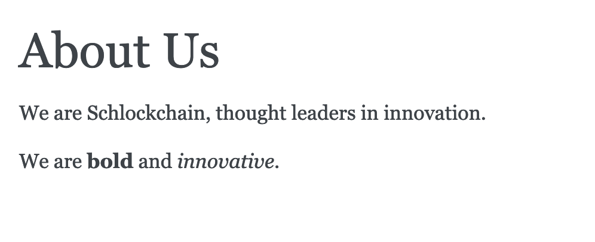
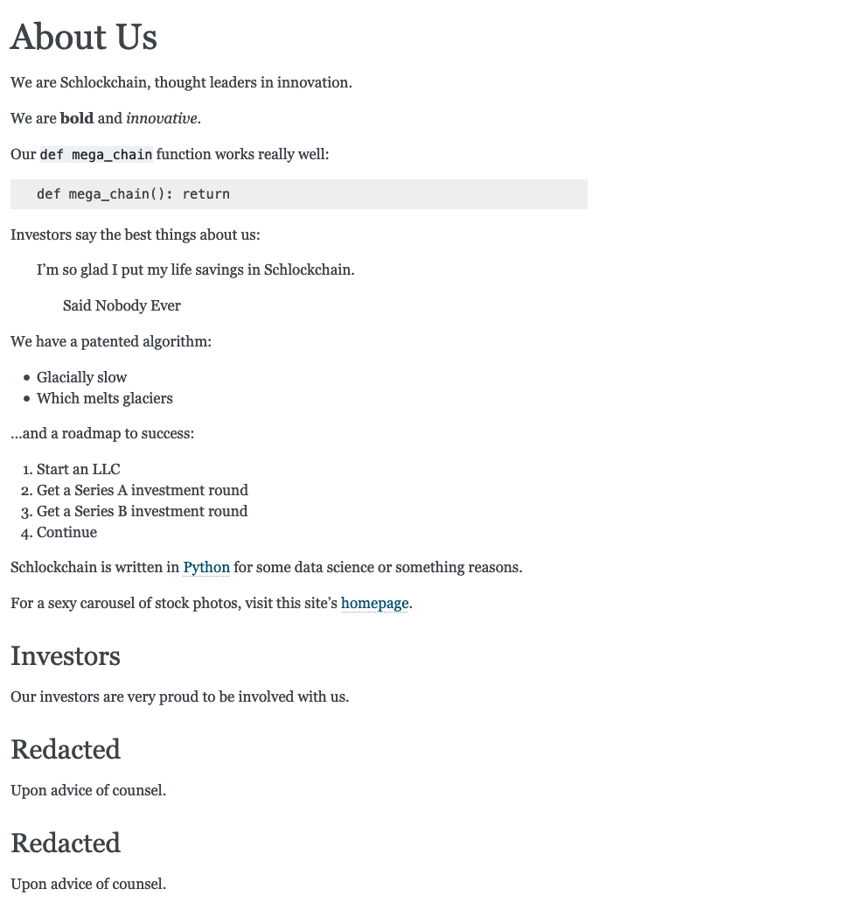
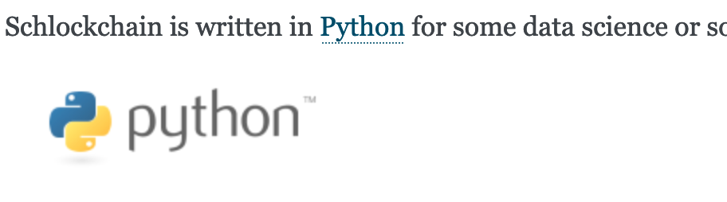
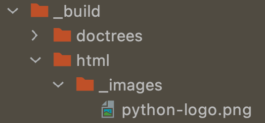

Unlike Python's original [reStructuredText](https://docutils.sourceforge.io/rst.html), Markdown is pretty simple.
But even that simplicity has some cool benefits when used in Sphinx.
Let's look at basic formatting and images in Markdown, and how it connects to Sphinx.

## Background

"Markdown" is a [troubled word](https://arstechnica.com/information-technology/2014/10/markdown-throwdown-what-happens-when-foss-software-gets-corporate-backing/).
It needed a spec, so the [CommonMark](https://commonmark.org) project arose.
Sphinx, via the [MyST parser](https://myst-parser.readthedocs.io/en/latest/), implements the CommmonMark verion of Markdown -- with extensions atop that which we'll discuss in the next section.

## Formatting

Let's visit our `http://127.0.0.1:5500/about_us.html` URL in the browser and edit our `about_us.md` file to make some formatting changes.

As you'd expect, bold and italics works fine. Add the following line:

```markdown
We are **bold** and *innovative*.
``` 

In your browser you should see this new paragraph with `<strong>` and `<em>` formatting:



Preformatted text -- aka inline `<code>` and block `<pre>` -- also work as expected:

~~~
Our `def mega_chain` function works really well:

    def mega_chain(): return
~~~

Indentation with `>` also works as "quoted" text:

```markdown
Investors say the best things about us:

> I'm so glad I put my life savings in Schlockchain.
> > Said Nobody Ever
```

Both bulleted and numbered lists are supported:

```markdown
We have a patented algorithm:
- Glacially slow
- Which melts glaciers

...and a roadmap to success:

1. Start an LLC
2. Get a Series A investment round
3. Get a Series B investment round
4. Continue
```

Want to link to the Python home page?
Links follow the regular Markdown syntax:

```
Schlockchain is written in [Python](https://www.python.org/) for some 
data science or something reasons.
```

You can also link to other pages in your site:

```markdown
For a sexy carousel of stock photos, visit this site's [homepage](./index).
```

Want a sneak-peak at the awesomeness in the next tutorial step?
Give this a try, and if you're a non-Sphinx Markdown person, ask yourself how `Welcome to Sphinx Sites` got into the built page:

```
For a sexy carousel of stock photos, visit [](./index).
```

Answer: Sphinx has some rich interlinking facilities.

One last CommonMark syntax to cover...headings:

```
## Investors

Our investors are very proud to be involved with us.

## Redacted

Upon advice of counsel.

## Redacted

Upon advice of counsel.
```

Let's see a screenshot with all of this Markdown content:



## Images

Let's use the Python logo from `https://www.python.org/static/community_logos/python-logo.png` as an image in our page.
We'll use the standard Markdown image support to point to a URL, adding this after our text about Python support:

```

```

That paragraph now has an image after it, with `Python Logo` as the image's alt text:



While this works well, perhaps we want it served locally.
Download that URL to a file named `python-logo.png`, in the same directory as `about_us.md`:

```bash
$ wget https://www.python.org/static/community_logos/python-logo.png
```

Then change the line you added above to say this instead:

```markdown

```

Hmm, *interesting*!

As part of the standard Markdown syntax, Sphinx copied that image to the build directory at `_build/html/_images`:



Sphinx then inserted a `src` pointing to this build URL.
That URL, in this case, is `http://127.0.0.1:5500/_images/python-logo.png`.

Sphinx -- meaning RST -- has a more-powerful image directive with options beyond just `alt`.
This directive is available in the [Optional MyST Syntax](https://myst-parser.readthedocs.io/en/latest/using/syntax-optional.html), specifically the [expanded image support](https://myst-parser.readthedocs.io/en/latest/using/syntax-optional.html#syntax-images).
We'll see this in [the next section](../more_authoring/).

What, then, are [directives](https://www.sphinx-doc.org/en/master/usage/restructuredtext/directives.html)?
These are reStructuredText "extensions" that take optional parameters and return some content -- HTML for the HTML builder, etc.
They also have semantic meaning in the document.

Directives are *blocks*.
For inline extensions, RST provides [roles](https://www.sphinx-doc.org/en/master/usage/restructuredtext/roles.html) which do some of the same things.

## What's The Meaning Of It All?

Ok, big deal, a static site generator that can use Markdown syntax.
There are hundreds if not thousands of these.

We'll show in the coming sections the rich engine underneath this syntax.
But even for these simple "formatting" cases, there's more going on than you'd think:

- *It's not just HTML*. Saying `I am *italic*.` generates `<em>`, right?
  No, it actually generates an intermediate, semantic node which can, with other builders, do italics in PDF and more.

- *Rich linking*. With Sphinx+MyST, when Markdown links to something, it isn't just generating an `<a href>`.
  At a minimum, you can get warned when you link to a target that doesn't exist.
  Moreover, each end of the link knows about the other, as we saw when Sphinx inserted the destination document's title.

- *Rich headings*. A heading makes something big and bold, right?
  Actually, it indicates *substructure* in a page, which can be put to use in many ways.
  The `toctree`, for example, can show not just child documents, but also headings in those documents, as clickable links.
  And further down, to sub-subheadings and beyond.

There's a big engine underneath Sphinx+MyST, even for italics, links, and headings.
This engine can be used for rich, organized websites.
Let's see more of this in the next tutorial step.
