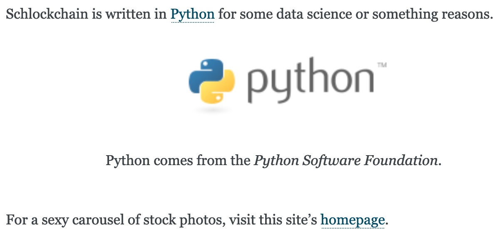
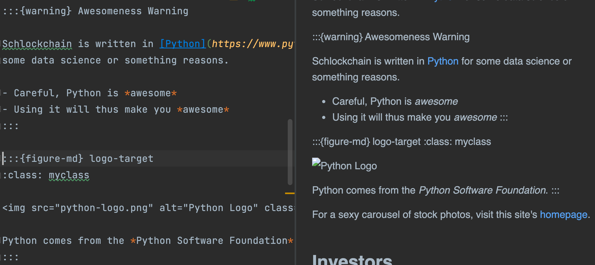

In the previous step we showed simple, normal Markdown formatting text and images.
Even for this simple case, though, Sphinx+MyST had some cool stuff to offer.

So what about the features beyond basic Markdown formatting?

Let's have fun, showing how MyST surfaces some really useful, really powerful features in Sphinx.
As we go along, keep in mind...this all works when generating PDFs, ePub, and other formats.

## Images

In the previous step we showed pointing at a remote image and a local image:

```


```

The second usage [does Sphinx stuff](https://www.sphinx-doc.org/en/master/usage/restructuredtext/basics.html#images) behind the scenes: process the image, copy to the build directory, and insert a relative URL in `src`.

As the Sphinx docs show, though, Sphinx can do more.
How can we tap into those options, *within* the Markdown syntax?
Let's take a look at the first of several ways that Markdown syntax is *optionally* [extended by MyST](https://myst-parser.readthedocs.io/en/latest/using/syntax-optional.html), beginning with images.

With this, you can control the image height, width, alignment, and more.
Let's replace the Markdown that inserts the Python logo, but bigger, centered, and with a CSS class:

~~~
```{image} python-logo.png
:alt: Python Logo
:class: bg-primary
:width: 200px
:align: center
```
~~~

That's a lot more powerful.
It's a "code fence" (to use Markdown terms), but with something in curly braces and something else -- an *argument* -- after it.
The stuff in the curly braces maps to a Sphinx/reST [directive](https://www.sphinx-doc.org/en/master/usage/restructuredtext/directives.html).
Directives can take *options*, which you see in the Sphinx-style colon-colon syntax.
Finally, you can put a blank line and then anything else is considered the directive *body*.

Want a `<figure>`, with an image and rich text for a caption?
This is supported in reStructuredText, so MyST [also provides a way to include figures](https://myst-parser.readthedocs.io/en/latest/using/syntax-optional.html#markdown-figures) in Markdown.
First, add the following line to your `conf.py`:

```python
myst_enable_extensions = [
    "colon_fence",
]
```

Then change the Markdown for the image to the following:

```
:::{figure-md} logo-target
:class: myclass


Python comes from the *Python Software Foundation*.
:::
```

Here's what it looks like on the page:



But here's what it looks like in a Markdown-friendly tool:


This is the reason for the triple-colon syntax: to allow the directive *body* in Markdown to render in smart tooling.

Lots going on here:
- `myst_enable_extensions = ["colon_fence"]` allowed us to use an HTML `` syntax while still parsing into a Sphinx "directive" renderable as PDF etc.
- `myclass` put a CSS class on the figure
- `logo-target` made a "role" for this figure, making it linkable as a Sphinx reference
- The caption, obviously, has rich text

That bullet about `logo-target` looks enticing.
We'll explain fully in the next section, but let's see it in action.
In `index.md`, add the following:

```
The logo is at {ref}`logo-target`.
```

In your browser, click the left sidebar's `Sphinx Sites` link to go to the homepage.
You'll now see a link to the figure, using the plaintext of the caption as the link text:


If you don't want the caption as the link text, you can use the MyST extended syntax:

```
The logo is at {ref}`the Python logo <logo-target>`.
```

## Table of Contents

With Sphinx, it isn't enough to just leave a file in a directory.
You need to include it in a [table of contents](https://www.sphinx-doc.org/en/master/usage/restructuredtext/directives.html#table-of-contents).
Let's look at the `toctree` directive then explain what's going on behind the scenes.

In `index.md` we have a `toctree` directive at the end of the page body:

~~~
```{toctree}
:maxdepth: 2
:caption: "Contents:"
   
about_us
```
~~~

We are passing two options.
`maxdepth` controls how far into each item to look for links.
`caption` provides an optional label for the table of contents.

Directives can also have content and the `toctree` directive takes a list of filenames to include in this table of contents.
You don't have to put the file extension.
The *order* of this listing determines the order of entries in the table of contents.

In this case, we are saying "Make a link to `about_us` using its title as the link text."
Perhaps, though, we want a custom title for the link text in just this usage?

~~~
```{toctree}
:maxdepth: 2
:caption: "Contents:"
   
A Second Page <about_us>
```
~~~

Don't care about ordering and want the convenience of not having to list new pages?
`toctree` takes a `glob` option.
Add that, then use glob patterns in one or more lines of the content.

~~~
```{toctree}
:maxdepth: 1
:caption: "Contents:"
:glob:

*
```
~~~

One last note: perhaps you dislike this option-style syntax and want a YAML, frontmatter-style approach to directives.
MyST [supports YAML for directive parsing](https://myst-parser.readthedocs.io/en/latest/api/directive.html?highlight=yaml#module-myst_parser.parse_directives).

~~~
```{toctree}
---
maxdepth: 1
caption: |
    Contents:
glob: 
---

*
```
~~~

Back to the original question: what does toctree actually *do*?
Sphinx is, more than most static site generators, very much about semantic structure.
It makes an abstract "doctree" representing a document.

But it also has structure beyond single pages.
It knows about connections between documents -- links, for example, but also hierarchy.
And the `toctree` is how you tell Sphinx your structure.
From the top -- the [master_doc](https://www.sphinx-doc.org/en/master/usage/configuration.html?highlight=master_doc#confval-master_doc) in the configuration file -- Sphinx remembers what was connected into what.
In fact, you can have multiple toctrees -- that is, multiple listings -- in different sections of the same document.

It's a powerful concept, put to use in Sphinx in many ways.

## Notes, Warnings, and Other Admonitions

Sometimes you want to make a "callout": a note, a warning, a tip, etc.
reStructuredText has a general purpose [admonition directive](https://docutils.sourceforge.io/docs/ref/rst/directives.html#note) which Sphinx puts to work.

Let's go to `about_us.md` and change our note about Python to be a, well, *note* about Python:

~~~
```{note}
Schlockchain is written in [Python](https://www.python.org/) for 
some data science or something reasons.
```
~~~

When rendered, you'll have a nice callout.
For example, the HTML builder we are currently using, and the current theme, shows the note like this:


We could change that, though, to a *warning*, and provide some richer content.
The admonition already has a link.
Let's add a bulleted list with italics:

~~~
```{warning}
Schlockchain is written in [Python](https://www.python.org/) for 
some data science or something reasons.

- Careful, Python is *awesome*
- Using it will thus make you *awesome*
```
~~~

Since this is such a common usage, MyST has added an [extended syntax](https://myst-parser.readthedocs.io/en/latest/using/syntax-optional.html#syntax-admonitions):

~~~
:::{warning} Awesomeness Warning

Schlockchain is written in [Python](https://www.python.org/) for 
some data science or something reasons.

- Careful, Python is *awesome*
- Using it will thus make you *awesome*
:::
~~~

To use this, you need to turn on `colon_fence` in your `conf.py` file.
As noted previously, this syntax lets Markdown editors render the admonition body:



To reiterate the point, this isn't *presentational*, it is *structural*.
Thus, these admonitions render both in PDF, and the other Sphinx targets.

## Downloads

Sometimes you want a page to give a link to some downloadable file: a PDF, a zip, etc.
Not only do you want the link, though -- you need the file to be *copied* to the output build directory.

Sphinx provides a [`download` role](https://www.sphinx-doc.org/en/master/usage/restructuredtext/roles.html#role-download) that serves this purpose.
Since it is a *role*, it can be used inline.
And since we have MyST, we have an inline syntax that supports this:

```
You can download the Python logo {download}`python-logo.png` for offline use.
```

This can also be used with the syntax to provide link text, instead of the filename:

```
You can {download}`download the Python logo <python-logo.png>` for offline use.
```

## Serverless Search

Sphinx has long provided a bundled solution for serverless search.
People type in search terms, a search index is processed in the browser, and a result page provides rich listings.
Visiting a result then highlights places that the search matched.

How does this work?
At build time, Sphinx writes an "inverted index" to a `searchindex.js` file in the build directory.
This file is loaded and processed in the browser by a Sphinx JavaScript library.

There are limits to this approach: very large sites will generate a very large index.
For these cases, many Sphinx sites use server-side and cloud-based integrations.
If you host your docs with Read the Docs, for example, you'll get access to [ElasticSearch-based indexing](https://docs.readthedocs.io/en/stable/development/search.html).
