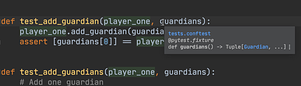
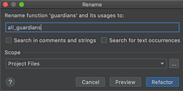

Each test recreates `Player` and `Guardian` instances, which is repetitive and distracts from the test's purpose.
[pytest fixtures](https://docs.pytest.org/en/latest/fixture.html) give a rich infrastructure for your test data. 

In this tutorial step we convert our tests to use fixtures, which we then share between files using ``conftest.py``.

# Make a `Player` Once

We have a `Player` instance that we currently make in four of our tests.
It's the same instance with the same arguments.
It would be nice to avoid repetition and let our tests focus on the logic under test, instead of setting up a baseline of test data.

Let's make a `pytest` fixture named ``player_one`` which constructs and returns a ``Player``:

```python  {1,6-8}
import pytest
from laxleague.guardian import Guardian
from laxleague.player import Player


@pytest.fixture
def player_one() -> Player:
    return Player('Tatiana', 'Jones')
```

This fixture can now be used as an argument to your tests.
``pytest`` will find the "appropriate" (more on this later) fixture with that name, invoke it, and pass in the result:

```python
def test_construction(player_one):
    assert 'Tatiana' == player_one.first_name
    assert 'Jones' == player_one.last_name
    assert [] == player_one.guardians
```

Our tests still pass.
We then make the same change in the other tests, taking the ``player_one`` fixture as an argument instead of constructing a `Player` in the test body.

Let's next make a fixture to hold the `Guardian` list:

```python {1,13-18}
from typing import Tuple

import pytest
from laxleague.guardian import Guardian
from laxleague.player import Player


@pytest.fixture
def player_one() -> Player:
    return Player('Tatiana', 'Jones')


@pytest.fixture
def guardians() -> Tuple[Guardian, ...]:
    g1 = Guardian('Mary', 'Jones')
    g2 = Guardian('Joanie', 'Johnson')
    g3 = Guardian('Jerry', 'Johnson')
    return g1, g2, g3
```

After converting all the tests to use these fixtures, our ``test_player.py`` looks like the following:

`embed:tutorials/visual_pytest/fixtures/test_player01.py`

Our tests are now easier to reason about.

# Sharing Fixtures with `conftest.py`

Next we give `test_guardian.py` the same treatment:

`embed:tutorials/visual_pytest/fixtures/test_guardian01.py`

Hmm, something looks wrong.
We said fixtures helped *avoid* repetition, but this `guardians` fixture is the same as the one in `test_player.py`.
That's repetition.
Is there a way to move fixtures out of tests, then share them between tests?

Yes, in fact, multiple ways.
The simplest is with `pytest`'s `conftest.py` file.
You put this in a test directory (or parent directory, or grandparent etc.) and any fixtures defined there will be available as an argument to a test.

Here's our `tests/conftest.py` file with the fixtures we just added in `test_player.py`:

`embed:tutorials/visual_pytest/fixtures/conftest.py`

Now our `test_guardian.py` is short and focused:

`embed:tutorials/visual_pytest/fixtures/test_guardian.py`

Same for `test_player.py`:

`embed:tutorials/visual_pytest/fixtures/test_player.py`

# Life With Fixtures

PyCharm has a number of useful features that make working with fixtures a breeze.
We saw autocomplete.
This is even more important with all the places that pytest can look for fixtures.

Navigation is a big win, for the same reason.
`Cmd-Click` (macOS) on a fixture name and PyCharm jumps to the fixture definition. 
Same applies for hover which reveals type information.



`F1` on the fixture shows an inline popup with more information about the fixture.
Finally, you can `Refactor | Rename` to change the fixture's name and usages.



This is all driven by PyCharm's type inferencing, which means we can autocomplete and give warnings in the test body, based on the structure of the fixture.
In practice, this is a key part of "fail faster", meaning, find a problem before running (or even writing) a test.
