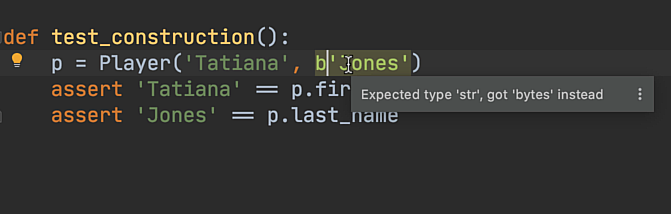
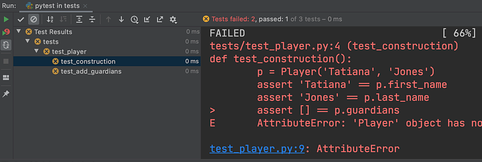
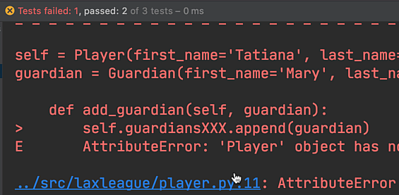
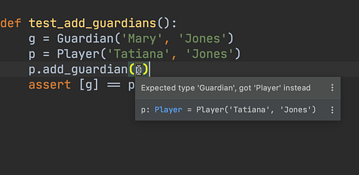

Since we have `Guardian` now, let's hook it up to allow adding a `Guardian` to a `Player`.

In this step we'll implement this while showing how visual testing can speed you up when you make a mistake. 
First: some housekeeping on our code.

# Let's Do A `dataclass`

Python 3.7 shipped with a neat feature called dataclasses, available with a backport package to 3.6. 
Let's start by simplifying our two classes with dataclasses and showing a side benefit in test writing.

First, the `Guardian` we were just working on in `guardian.py`:

`embed:tutorials/visual_pytest/jump_to_error/guardian.py`

When writing this dataclass, note how PyCharm helps:

- Autocomplete and import the `dataclass` decorator

- Autocomplete on str

Our refactoring into a dataclass went well.
How do we know? Because our tests pass.
In fact, we didn't have to remember to run our tests, because we setup PyCharm to autorun the tests.
In double fact, we didn't even have to save the file.
Yummy.

Now we change our `Player` class:

`embed:tutorials/visual_pytest/jump_to_error/player01.py`

Our `test_player` test fails. 
We also need to update the construction test in `test_player.py`:

`embed:tutorials/visual_pytest/jump_to_error/test_player01.py`

Now let's get some extra benefit from dataclasses and type annotations. 
In the test, try passing in `Player('Tatiana', b'Jones')`, with a byte-string by accident. 
The dataclass only allows `str` as values for `last_name` and PyCharm very visually makes this clear, just as you type it.



Verdict: TDD + (IDE + type hinting) == "fail faster."

On to associating a `Guardian` with a `Player`.

# Player with Guardians

We'll follow TDD by writing a failing test first, then doing the implementation. 
This time, though, we'll make a typo, to show a feature of using PyCharm's visual testing.

Let's start with a test in `test_player.py`:

`embed:tutorials/visual_pytest/jump_to_error/test_player.py`

We first need to ensure, in `test_construction`, that we have an empty list for `player.guardians`. 
Then, in the new test `test_add_guardian`, we make both a player *and* a guardian, add the guardian to the player, and test the result. 
This means we also import `Guardian` in this test.

Both tests fail:

- We don't yet have `guardians` as a field on our `Player` dataclass

- We don't have a method `add_guardians`.



Let's fix this by implementing the feature in `player.py`:

`embed:tutorials/visual_pytest/jump_to_error/player02.py`

This dataclass adds a new dataclass field named `guardians`. 
It is a little different: as Python's [mutable default values](https://docs.python.org/3/library/dataclasses.html#mutable-default-values) docs explain, Python class attributes can't default to a list. Python
dataclasses fix this with a dataclass `field` function which can assign a factory to construct the default value.

We used the type `list` in this case. We'll explain more in a moment.

Our new field and the simple `add_guardian` method does the trick: now our tests pass.
Pretend for a moment that we made a typo. Do the following:

- Change the last line of `players.py` to `self.guardiansxxx.append(guardian)`

- Open `guardian.py` in that tab

- Watch the tests fail with a traceback

- Click on the error link for `player.py:12: AttributeError`

- PyCharm re-opens the file, on the line of the error

- Remove the `xxx`



When writing code under testing, you will *constantly* make mistakes and generate exceptions. 
PyCharm's handy exception links let you jump right to the error.

# The Benefit of Type Hints When Writing Tests

Type hints generate a lot of pushback in the world of Python. 
But when paired with an IDE like PyCharm, they help you "fail faster."

What does "fail faster" mean?

- You could do nothing and let your mistake surface in production

- Or, write tests and "fail" when your tests run...if you have tests for
  that code

- Or, write type hints and run a type checker like `mypy` periodically

- Or, have your IDE flag your type-related mistake in real-time, while
  you are watching it

- Or, have your IDE prompt, via autocomplete, what is valid before you
  type it
  
- All of this, in TDD, as you are a consumer of your own code

Let's see it in action. Our `Player` dataclass says that `guardians` is a `list`, but a list of what? 
Currently you could assign anything you want to it.

Instead, in the `Player` dataclass, let's signify that it is a list of `Guardian` instances:

```python
guardians: List[Guardian] = field(default_factory=list)
```

## Note

As you type `List`, use `Ctrl-Space | Ctrl-Space` to complete it, which also generates the import. Same for `Guardian`.

What is `typing.List` and why can't we use `list`? 
It is a "generic", which lets it further specify the types of things it contains.
`list` saves an import but doesn't allow us to say "list of Guardians".

Next, let's indicate that `add_guardian` can only take a `Guardian` instance:

```python
def add_guardian(self, guardian: Guardian):
    self.guardians.append(guardian)
```

To see how this helps us "fail faster", imagine tried to add a Player as a Guardian. 
Our IDE warns us with a perfect message:



In this latter case, the code would have stored the string. 
Type annotations, combined with the immediate feedback in the IDE, helped us "fail faster", as we type.

Here is our final version of `player.py`:

`embed:tutorials/visual_pytest/jump_to_error/player.py`
