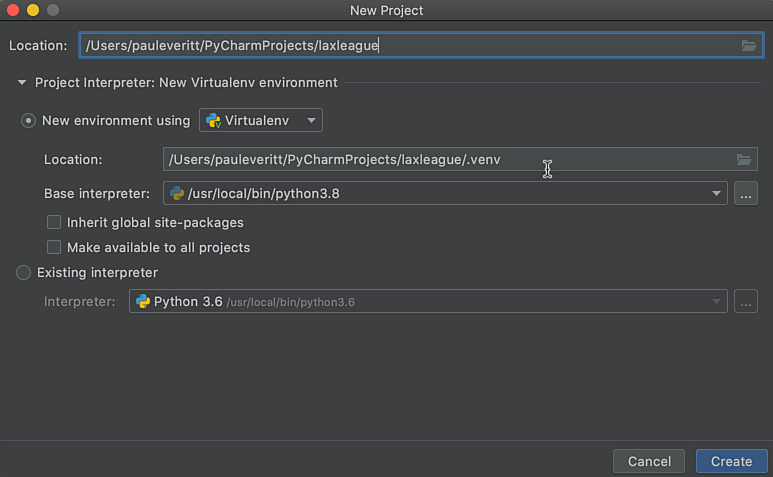
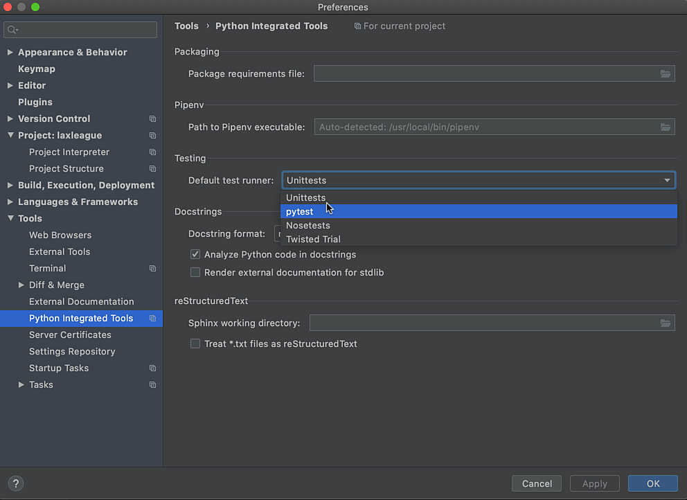
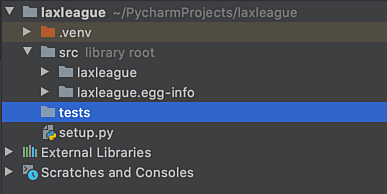

Python has projects and PyCharm does as well.
In this tutorial step, let's make both, with a virtual environment, and set the project up to use `pytest`.

# New Project

We'll let the IDE guide us through the process. 
First, we use `File -> New Project` to make a new project, in a directory:



Make sure `Project Interpreter` is setup to configure a new virtual environment.
Expand the triangle if needed to set this up.

After clicking `Create`, tell PyCharm to open the project in a new window.

# Python Project

[Python packaging](https://packaging.python.org/tutorials/packaging-projects/) is, alas, a thorny topic, and we're going to make you do it for this tutorial.

Why?

Most Python packages put their tests *outside* of their source directories, to avoid accidentally shipping the tests (among other reasons.)
The tests thus need to import the package that you code is in, and that means a Python package.
Fortunately this is [all explained quite well](https://docs.pytest.org/en/latest/goodpractices.html#tests-outside-application-code) in the `pytest` docs.

We first need a `setup.py` file at the top of our new project.
Add the following:

`embed:tutorials/visual_pytest/setup/setup.py`

Our source will now go in a `src/laxleague` directory so make sure to create it.

Why the use of `src`?  It's a [general consensus best practice](https://hynek.me/articles/testing-packaging/) that avoids nasty surprises if you share your code or use it elsewhere.
Our `setup.py` has the `packages` and `packages_dir` keys added in support of putting our code under `src`.

Now go to PyCharm's Terminal tool and type in the following:

```shell script
$ pip install -e .[tests]
```
This has two effects:

- It makes this project an "editable install" by creating a directory named `src/laxleague.egg-info`

- `pytest` is installed into the project's virtual environment

Apologies for this `setup.py` hocus-pocus.
Python has a sordid history on this, though it is getting better.

# Give Me Some Source

But we don't have any source code yet. 
Let's put a file at `src/laxleague/player.py` containing an empty `Player` class:

`embed:tutorials/visual_pytest/setup/player.py`

# Configure Testing

One last step...we need to tell PyCharm to use `pytest` for its built-in Python testing support.
This happens automatically when we first open an existing project with `pytest` in the virtual environment.
We added `pytest` after making the environment, so we need to configure it ourselves.

Go to `Settings -> Tools -> Python Integrated Tools` and change `Default test runner:` to `pytest`:



Mine is set automatically because I set `pytest` as my [default test runner for all projects](https://www.jetbrains.com/help/pycharm/configure-project-settings.html#new-default-settings) using `File | New Projects Settings | Settings/Preferences for New Projects`:

Finally, make a top-level directory called `tests`.
This mimics the [pytest good practices](https://docs.pytest.org/en/latest/goodpractices.html#tests-outside-application-code).

When done, your directory structure should look like this:


