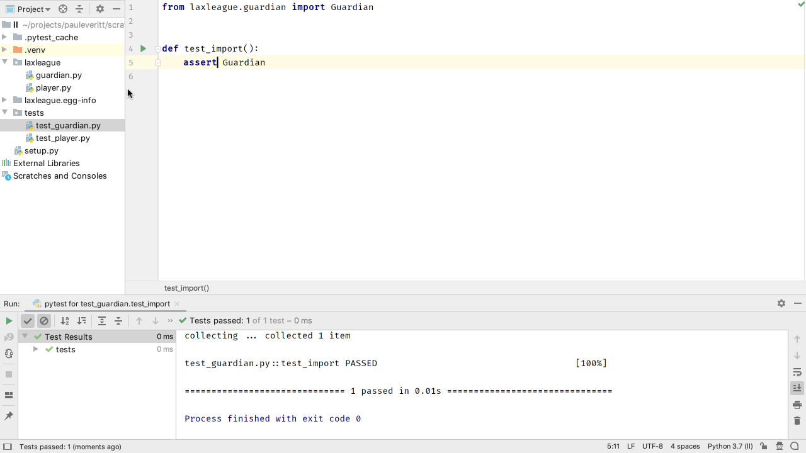
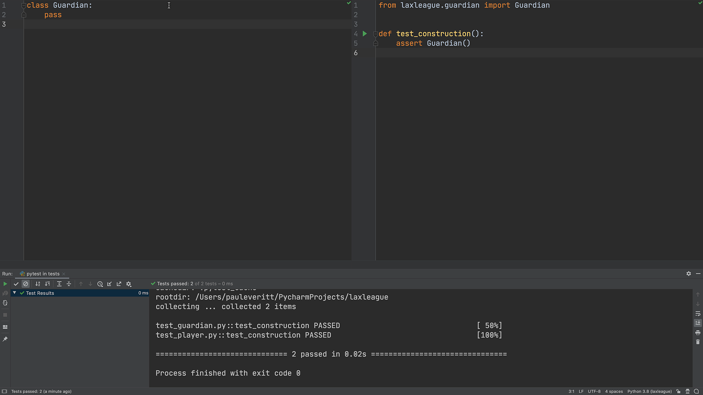
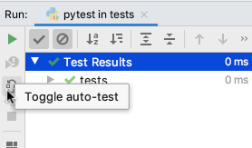
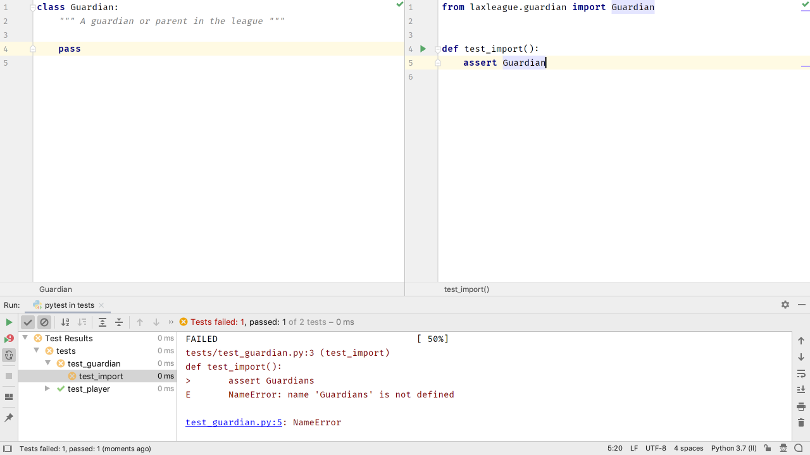

Players have parents, also known as guardians. 
Let's make a module for a `Guardian` class.
This time let's do it with a bit of test-driven development (TDD) and show how to get PyCharm into a good "flow" for TDD.

# Starter Tests

First, create `src/laxleague/guardian.py` with an empty class:

`embed:tutorials/visual_pytest/tdd_flow/guardian01.py`

Why do we make an empty placeholder class? 
To let PyCharm generate the test for us.
Use `Navigate | Go To Test` (`Ctrl-Shift-T` Win/Linux, `Shift-Cmd-T` macOS) as explained in the last step to help generate `tests/test_guardian.py`.
Enter a `test_construction` test to "get me into the flow", letting PyCharm generate the import:

`embed:tutorials/visual_pytest/tdd_flow/test_guardian01.py`

Run the test by right-clicking in the editor *outside any block* and choosing to run it with `pytest` (bigger target area than the tab.)

Yay, the test passes. 
Not a major victory, but allows us to start inching forward:



# TDD Flow

Now let's get ourselves into a TDD flow. 
We'd like to easily look at the code we are writing and the tests we providing against that code. 
I like both visible, with my code on the left and the tests on the right.

Invoke `Find Action` with Cmd-Shift-A and search for `Split Vertically`.
On the left, open `guardian.py` and on the right, make sure `test_guardian.py` is still open. 
While we're at it, collapse the project tool window.
The run tool window is on the bottom (though on wide monitors I put it on the right):



There, that has a nice feel to it. 

Now that our code is setup, let's get our test running "in the flow".
Right-click on the `tests` folder and choose `Run 'pytest in tests'` to get a temporary run configuration for *all tests* in the project. 

One more thing: let's have all our tests run, automatically, as we type. 
PyCharm makes this easy and visually convenient -- it even integrates with your desktop notification system when tests are finished running and PyCharm isn't visible.

In the tool window for the test output, click on the `Toggle auto-test` icon, two icons below the green run arrow. 
With autorun enabled, next click the big green run arrow again.
Now, all your tests run *automatically* two seconds (configurable) after you stop typing.



One final point: you don't have to save changes to your code or tests.
PyCharm has an auto-save virtual filesystem thingy.

To see this autorun in action, change something in one of your `assert` statements, *without* saving.
After two seconds, you'll see the tests re-run, automatically.

That's a nice start to a good TDD flow. 
Let's write a failing test, then fix the implementation.

# The Guardian

Our `Guardian` needs a constructor that takes and stores `first_name` and a `last_name`.
Add a new test to `tests/test_guardian.py`:

`embed:tutorials/visual_pytest/tdd_flow/test_guardian02.py`

Notice that PyCharm warns you when the two arguments are missing, and on hover, gives a nice message:

TODO Screenshot

After two seconds, even without saving, our tests show as broken:



Of course it breaks: `Guardian` has no `__init__.py` constructor. 
Since it is the *code* we are writing tests for, the mistake is conveniently right there in our left tab. 
No need to think. 
Change `laxleague/guardian.py` to implement storing names on instances:

`embed:tutorials/visual_pytest/tdd_flow/guardian.py`

As you are writing this, let PyCharm help you:

- First, use autocomplete to finish `__init__` and put your cursor in the right spot.

- Next, when you type your constructor arguments, use `Alt-Enter` and
  choose `Add field 'first_name' to Guardian`. PyCharm will generate the
  `self.first_name = first_name` boilerplate for you.

- Finally, if the generation is in the wrong order, use
  `Shift-Alt-Up` or down to move the line, instead of cutting and pasting.

Our test now passes but doesn't do an assertion. 
Back in `test_construction`, let's show a bit about how PyCharm can help you be more productive and accurate.

First, hold down `Ctrl` and hover on the `g`. 
PyCharm tells you that `g` is of inferred type `Guardian.` 
Next, add an assertion:

```python
assert g.first_name == 'Mary'
```

As you type `first_name` you can see PyCharm offering you the autocomplete.
This is because PyCharm inferred the type of `Guardian`, thus speeding up your TDD.

Oops, we had poor style on that. 
In my projects, I prefer a testing convention for asserts with expected on the left, meaning `expected == actual`. 
While [Guido declined to designate a winner](https://mail.python.org/pipermail/python-dev/2010-December/106954.html), it seems [Kent Beck did](https://sourceforge.net/p/junit/mailman/message/3338997/), and Brian Okken's examples also use that.

We need to flip that, but good news: PyCharm excels at such janitorial work. 
Click on the double-equal, hit `Alt-Enter`, and choose `Flip '=='`:

TODO Screenshot

In fact, PyCharm will [obey a style](https://youtrack.jetbrains.com/issue/PY-27267) set by a project.
Create a `pytest.ini` file at the root:

`embed:tutorials/visual_pytest/tdd_flow/pytest.ini`

## Note

If you're don't have PyCharm configured to use a font with ligatures such as JetBrains Mono or Fira Code, you're missing out. 
The double-equals symbol in this case is really slick-looking.

Let's write a test for last name, causing `test_guardian.py` to finish like the following -- including the expected/actual ordering:

`embed:tutorials/visual_pytest/tdd_flow/test_guardian.py`

One last point: PyCharm's tool window for testing shows passing tests by default. 
If you don't want to see them, and focus on failing tests instead, click on the `Show Passed` icon to the right of the green play button.

