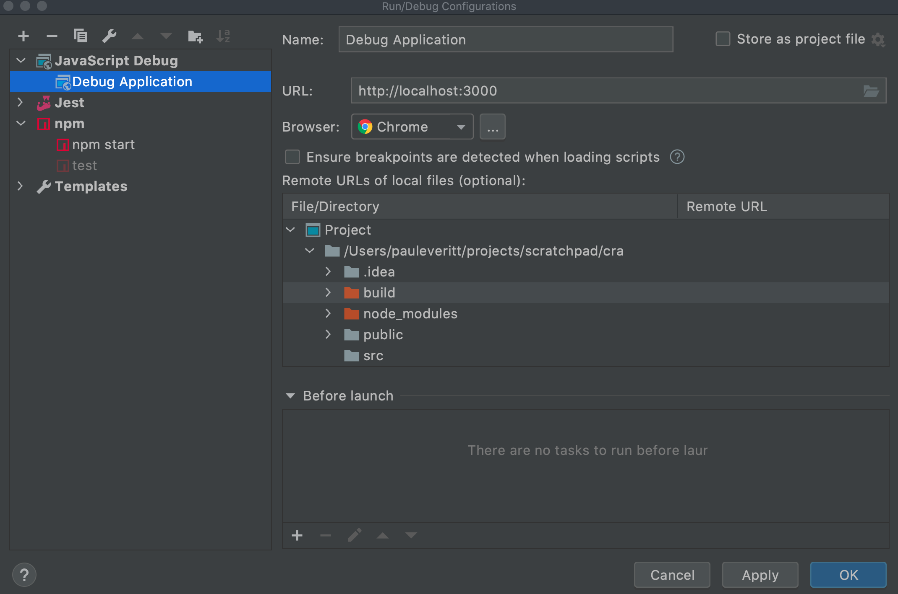
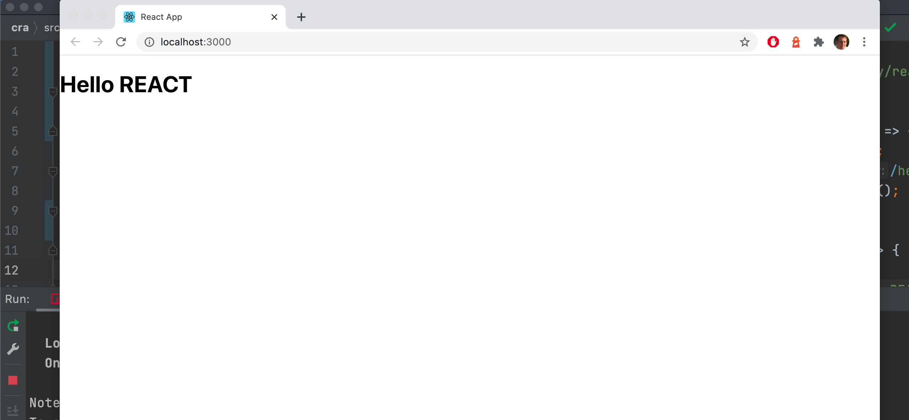
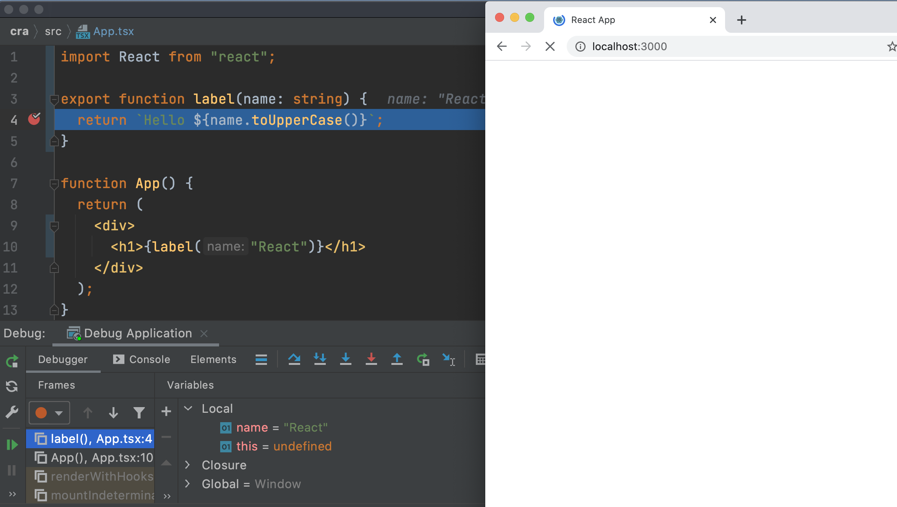

As discussed in [Debugging During Testing With NodeJS](../nodejs_debugging/), testing and debugging under NodeJS is very productive. 
There are times, though, where you need a browser environment.
Fortunately, JetBrains IDEs can remote-control the browser's execution, letting you stay inside the IDE.

Let's see this in a simple case.
We'll set a breakpoint in our `label` function, and stop there under the debugger, but in this case the Chrome debugger.

## `JavaScript Debug` Run Configuration

First, fire up your `npm` script for `start` if it isn't running.

For this we'll need a different kind of run configuration, one tailored for launching the Chrome browser.
It's possible the IDE has already generated a `Debug Application` run config for you.
If not, add a new run configuration of type `JavaScript Debug` and supply a `Name:` such as `Debug Application`.
As we saw in the first section, the webpack development server runs on port 3000, so provide the run configuration a `URL:` of `http://localhost:3000`. Finally, choose Chrome in the `Browser:` field.

Click `Ok` to save this new run configuration, then run it by clicking the green play button in the toolbar.
Presuming that your npm `start` is *still running*, you should see a browser launched.

This is an isolated Chrome instance running in a cleared profile, with no history nor cookies.
Finish up by closing that new browser window.

## Browser Debug

Now it's time to debug in the browser.
Put a breakpoint inside the `label` function.
Then, re-run the `JavaScript Debug` configuration you just made, but this time, click the `Debug` button.

Chrome should pop up.
Reload the URL and focus shifts to the IDE, with execution stopped on the line of the breakpoint.

You can do the same debugging tasks as before:

- Inspect `Variables`

- Highlight a snippet and execute it

- Step through code

In this case, all the execution is happening in the browser's JavaScript engine.
To verify, use `Variables` to look at the `Global | chrome` object.

To clean up, click the red button to stop the debugger, close Chrome, and clear the breakpoint.

As a note, none of the files changed in this step.
