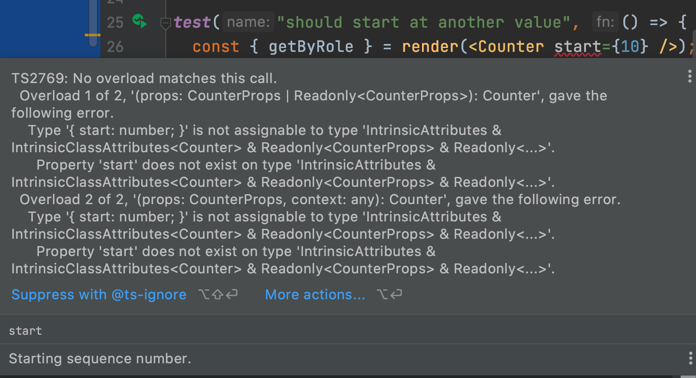

In [Class Components With Props](../class_props/) we made a `Counter` child component using a class, with one property passed in. 
We traditionally use classes for child components when they have state or need to use one of React's lifecycle methods (though that is changing with hooks.)

That's the topic of this step.
We want a reusable counter component that internally keeps a count of clicks.

This step, though, will be just the minimum: no actual clicking to update state, for example.
We will stick to introducing component state and modeling it in TypeScript.

## Code

The finished code for this tutorial step is 
[in the repository](https://github.com/JetBrains/jetbrains_guide/tree/master/sites/webstorm-guide/demos/tutorials/react_typescript_tdd/class_state).

## Always Start With a Test

It's becoming our pattern: 

- We write a *failing* test first

- Then *implement* the presentation component

- Then wire it into the *parent* component

To begin, have `Counter.tsx` in the left-hand tab and `Counter.test.tsx` in the right-hand tab. 
Also, stop the `start` process if it is running and make sure the `All Tests` Jest run config is running.

Here's a `Counter.test.tsx` test to show that the counter starts at zero, which *fails*, because we have a static `<span>1</span>`:

```typescript
test("should start at zero", () => {
  const { getByTitle } = render(<Counter />);
  const counter = getByTitle("Current Count");
  expect(counter).toHaveTextContent("0");
});
```

Over in `Counter.tsx`, let's first write the type definition for our *state*. 
What does the local state look like?
Pretty easy:

```typescript
export type CounterState = { count: number };
```

Now the class definition and constructor [can setup state](https://react-typescript-cheatsheet.netlify.app/docs/basic/getting-started/class_components), which we'll use in the `render` method.
Then last, change the `<span>` to use the value from the state, instead of a hardwired `1`:

```typescript
export class Counter extends Component<CounterProps, CounterState> {
  state: CounterState = {
    count: 0,
  };

  render() {
    const { label = "Count" } = this.props;
    return (
      <div>
        <span title="Count Label">{label}</span>
        <span id="counter" title="Current Count">
          {this.state.count}
        </span>
      </div>
    );
  }
}
```

Our test passes!
Two things changed in this:

- `Component<>` has a second generic, for the state

- We defined the initial class state as a "class variable"

Note that, when tying in the JSX/TSX, we got autocompletion not only on `.state`, but also `.count`. 
That's part of the value of type definitions for state.

## Red-Squigglies For State Assignment

If you've used React components with state, you know: you can't just assign to the state.
You have to go through `setState`.
Still, it's an easy mistake to make, and you won't find out until runtime.

Can the TypeScript compiler help?
Can we get a red-squiggly?
You betcha!
Let's introduce a *wee little bit* more complexity, to formalize type safety on "read only" state objects.

First, we'll move the initial state out of the class, into a module-scope variable, then flag in the type definition that this is read-only.

```typescript
const initialState = { count: 0 };
export type CounterState = Readonly<typeof initialState>;
```
The TypeScript [`readonly` modifier](https://www.typescriptlang.org/docs/handbook/classes.html#readonly-modifier) is like `public`, `private`, and `protected`.
It tells the *compiler* (but not the runtime) to watch for code that tries to assign to the object.

To use this `initialState` in our component, replace the previous class property:

```typescript {2}
export class Counter extends Component<CounterProps, CounterState> {
  readonly state: CounterState = initialState;

  render() {
    const { label = "Count" } = this.props;
    return (
      <div>
        <span title="Count Label">{label}</span>
        <span id="counter" title="Current Count">
          {this.state.count}
        </span>
      </div>
    );
  }
}
```

Our tests pass, so we're in good shape, and we've added type safety to detect a common React component mistake.

## Starting Value

Sometimes we want a counter that starts somewhere besides zero and we'd like the *consumer* of the component -- the parent component -- to be in charge.
Let's change `Counter` to allow passing in an *optional* prop for the starting value.

This change is going to be tricky.
Props aren't available until we get to the instance, and our state is currently setup at the class level.
How can we read from `this.props` and then call `this.setState`?
We'll use the `componentDidMount` lifecycle method.

First, a failing test in `Counter.test.tsx`:

```typescript
test("should start at another value", () => {
  const { getByTitle } = render(<Counter start={10} />);
  const counter = getByTitle("Current Count");
  expect(counter).toHaveTextContent("10");
});
```

As before, our test fails, but before that, our IDE warns us that we have violated the `<Counter />` contract. 
In fact, we probably figured that out as we typed -- no autocompletion on a `start` prop for the component.



We'll fix the type definition in `Counter.tsx` to allow this prop -- a number -- to be passed to the component:

```typescript {3}
export type CounterProps = {
  label?: string;
  start?: number;
};
```

Our test no longer has a red-squiggle for `<Counter start={10} />`, but the test fails, as our component doesn't yet use the prop.
Let's add the lifecycle method to the class:

```typescript
  componentDidMount() {
    if (this.props.start) {
      this.setState({
        count: this.props.start,
      });
    }
  }
```

This lifecycle method is run once, when the component is initialized.
If a prop was passed in, it is assigned as the starting `count` state.
With this change, our tests now pass and this `Counter` component can be passed in a starting point.

## Wire Into UI

We wrap up each step by wiring the standalone component changes into the parent component, first through testing, then by looking in the browser.
Our `App.test.tsx` currently tests the label but not the counter.
Let's open `App.test.tsx` and add a test of the count value:

```typescript {7,8}
test("renders hello react", () => {
  const { getByTitle, getByText } = render(<App />);
  const linkElement = getByText(/hello react/i);
  expect(linkElement).toBeInTheDocument();
  const label = getByTitle("Count Label");
  expect(label).toBeInTheDocument();
  const counter = getByTitle("Current Count");
  expect(counter).toHaveTextContent("0");
});
```

What changes in `App.tsx`?
In this case, nothing. We want to use the default value of zero.

If you'd like, restart the `start` run configuration and view this in the browser, so make sure everything still looks good.
When done, terminate the `start` script.
