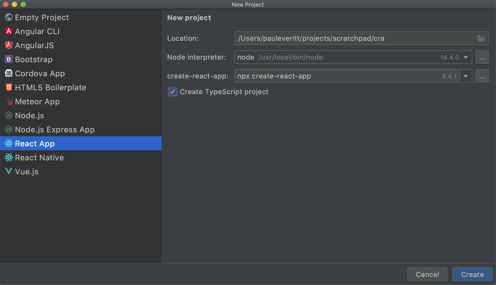
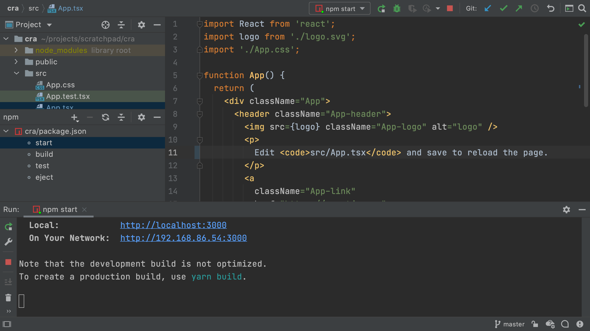
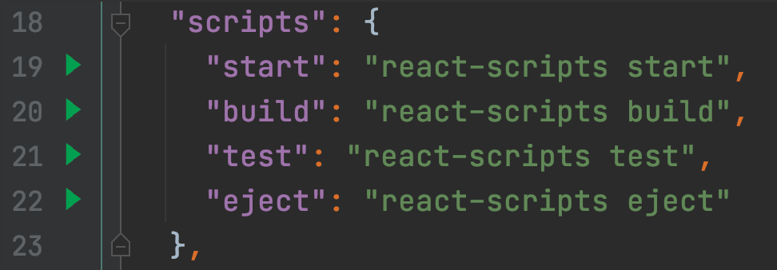
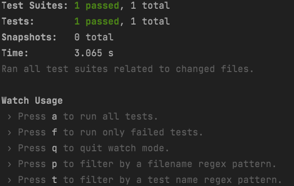

React has become very popular, as has TypeScript. 
But it can be difficult to keep your tools and build configurations up-to-date. 
Many frameworks have CLI (command-line interface) tools that make those decisions for you, using best practices.
They'll generate a project with the right choices, then update those choices as things evolve.

React's [create-react-app](../../../technologies/cra) takes care of this, including for TypeScript projects. 
In this tutorial step, we will generate a React+TypeScript project then open it in the IDE.

## Code

The finished code for this tutorial step is 
[in the repository](https://github.com/JetBrains/jetbrains_guide/tree/master/sites/webstorm-guide/demos/tutorials/react_typescript_tdd/project_setup).

## Project Creation

Before starting, make sure to install [NodeJS](../../../technologies/nodejs) on your system.

As shown [in the create-react-app docs](https://create-react-app.dev/docs/adding-typescript/), use the `npx` command introduced in npm 5.2 to get a package and install a command, without having to globally install a package. 
Thus, to use `create-react-app` to make a TypeScript project:

```shell script
$ npx create-react-app cra --template typescript
```

If you are using a JetBrains IDE that includes [WebStorm](https://www.jetbrains.com/webstorm/), you can use a nice UI for new projects:



You now have a working React+TypeScript project, toolchain, and hello-world style app. 
It's actually quite an achievement.
Assembling all of this, and *keeping* it assembled, is an incredible effort. 
`create-react-app` has shifted that off your shoulders, onto their shoulders. 

## Show Me a Page

Let's see this React+TypeScript app in our browser. 
``npm`` scripts make it easy to discover commands that are common to a project. 
The most common?
Starting the dev server, which compiles the universe, serves a page over HTTP, and helpfully opens your browser:

```shell script
$ npm start
```

This dev server is now watching for changes. 
If you edit a file, it will regenerate the universe and tell the browser to reload the page. 
Open `src/App.tsx` and change `save to reload` to `save to reload the page`, then save. 
Your terminal shows a recompile and your browser updates.

In the terminal, `Ctrl-C` to stop the dev server.
Let's take a look at how the IDE can put a nice friendly face on running `npm` scripts.

We will first use the `npm` tool window. 
Click on the `npm` tool icon (usually on the left) and double click `start` in the listing of run scripts. 
You'll get a run window at the bottom with a UI for showing output and restarting. 



Alternatively, open the top-level `package.json` that was generated by `create-react-app`. 
Here's what the scaffold provided -- note the `scripts` section:

`embed:tutorials/react_typescript_tdd/project_setup/package-example.json`

Let's run the `start` script from here, instead of the `npm` tool window.
First, close the currently-running tool window and dev server, then close the `npm` tool that is listing the available scripts.
Now, in `package.json`, click the green play icon in the gutter by the `start` run script:



As you can see, the generated `package.json` is quite compact. 
The genius of `create-react-app` lies in moving a bunch of "What the hell is this?" configuration files, into *its* packages.
Thus, *they* own those decisions and complexity. 
You can then upgrade those packages and gain new/fixed wiring of all the JavaScript build tools.

## Production Build

That's great for development, but for production, we need files on disk, shrunk as small as possible. 
There's a lot of complexity behind this, but `create-react-app` has hidden it behind an npm script:

```shell script
$ npm run-script build
```

This generates output into a `build` directory.
The output is self-contained, even including an `index.html` file. 
Thus, you can copy the site to a static hosting site, as-is.

Running this in the IDE's UI, instead of the terminal, is easy: just click on `build` in the `npm` tool window, or better still, use the gutter icon in `package.json`.

The IDE should mark the new `build` directory as "excluded" giving it a different color in the folder listing.
If not, right-click on the new ``build`` directory and ``Mark Directory As | Excluded``. 
This prevents the IDE from indexing the contents of that directory.

## This Is Only a Test

Projects generated from `create-react-app` are also wired up for testing: dependencies, configuration files, and sample tests. We'll see more later, but for now, let's run the tests. 
Unsurprisingly, it's similar to the above:

```shell script
$ npm run-script test
```

`create-react-app` uses the [Jest test framework](../../../technologies/jest) along with helpers from [Testing Library](https://testing-library.com).
Jest runs when source or test files change, so make a small edit `src/App.tsx` to change the `the page` to `this page`.
When you save the file, you'll see that the tests re-run and pass:



We can also run this `npm` script in the IDE.
`Ctrl-C` to stop the test runner in the terminal, then back in `package.json`, click the green play icon in the gutter beside `test`.

## Conclusion

In this first step we used existing tools to generate a working React+TypeScript project, with all the tooling configured. 
We also gave a brief tour of driving this in the IDE.

In our next step we'll clean up some of the generated app, fix some of the tooling, and take a look a little more at how TypeScript helps your productivity.
