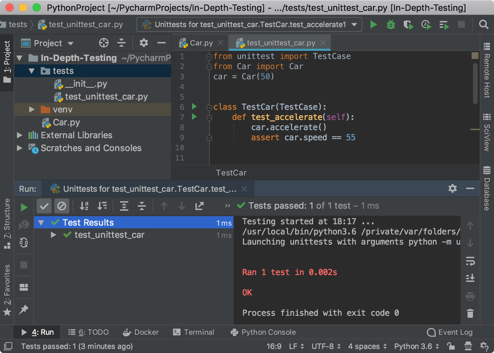

In this step, you can create your first test, run it, and evaluate the test run results.

**Powerful Shortcuts**: 
-  `Shift-Ctrl-T` (Win/Linux) or `Shift-Command-T` (macOS) to navigate to the test and its subject.
-  `Shift-10` (Win/Linux) or `Ctrl-R` (macOS) to execute a test.

# Create a Test

Once the testing framework is selected, PyCharm takes care of test generating so that you can 
create your tests almost automatically:

1. In your application, place the caret on the function you want to test. Then press 
`Shift-Ctrl-T` (Win/Linux) or `Shift-Command-T` (macOS). 

2. In the **Create test** dialog, specify the path to the directory with the tests, alter or leave intact 
the suggested test name and test class name, and select the test method (`test_acceleate` in this example). 
 
Click **OK** to complete the task.

3. Now, inspect the newly created ``test_unittest_car.py`` file.

```python
from unittest import TestCase


class TestCar(TestCase):
    def test_accelerate(self):
        self.fail()
```

4. Replace it with something meaningful:

```python
from unittest import TestCase
from Car import Car
car = Car(50)
 
 
class TestCar(TestCase):
    def test_accelerate(self):
        car.accelerate()
        assert car.speed == 55
```

This test checks if `speed` equals 55 after the `accelerate` function is executed, which according to 
the `Car.py` code should be true.

# Run the test

1. The easiest way to execute the test is to press `Shift-10` (Win/Linux) or `Ctrl-R` (macOS).
The **Run** tool window opens and shows the test execution status:
 

Although the very first test is quite simple, you can obtain the detailed information about the 
test run. The **Test run toolbar** has many helpful features. For time being, look at the two of them:


Export test results to an HTML, XML, or custom format.


Import test results: you can download any previous test run results from the drop-down list or
from the file.

2. Let us modify the `TestCar` class and add the `test_accelerate_fail` function:

```python
from unittest import TestCase
from Car import Car
car = Car(50)
 
 
class TestCar(TestCase):
    def test_accelerate(self):
        car.accelerate()
        assert car.speed == 55

    def test_accelerate_fail(self):
        car.accelerate()
        assert car.speed == 59
``` 

Now press `Shift-Ctrl-T` (Win/Linux) or `Shift-Command-T` (macOS) again and the test will fail
as expected.


To run each test function separately, you can opt to an alternative way for executing tests and
scripts in PyCharm - clicking the corresponding **Run** icon in the left gutter of the **Editor**

 


